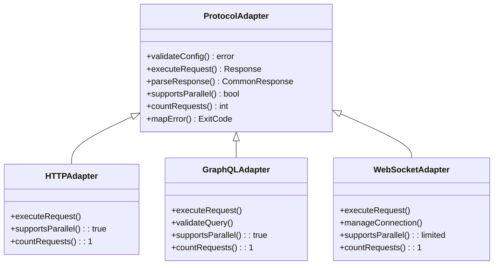
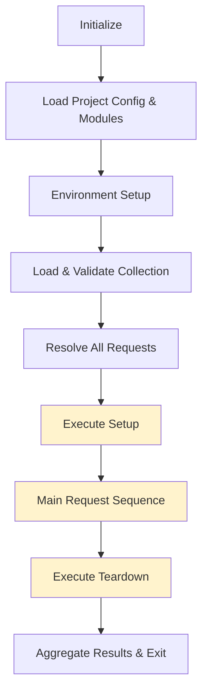
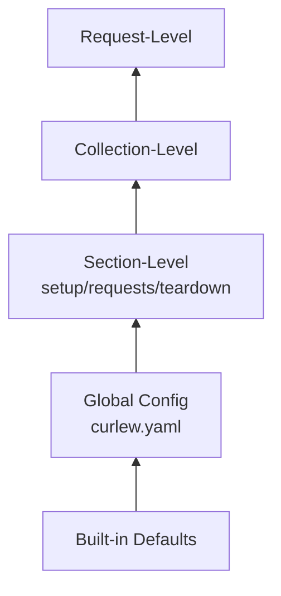
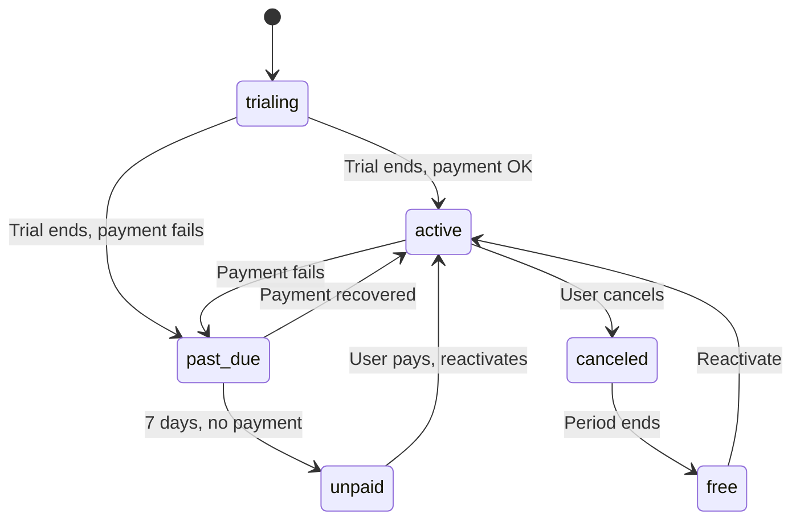
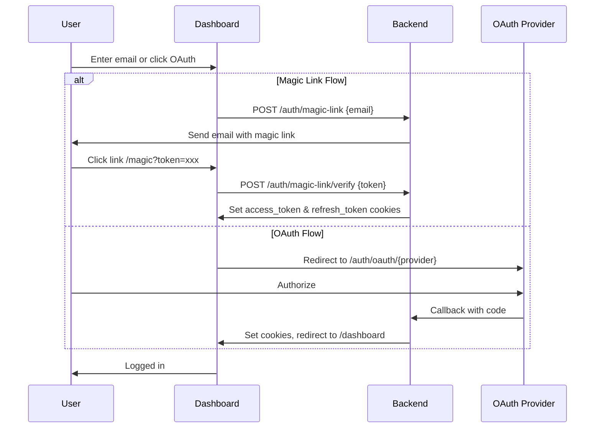
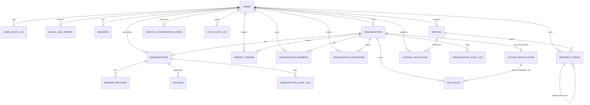

# Curlew Platform Specification
## Backend and Web Dashboard

**Version:** 4.4  
**Date:** May 17, 2026  
**Status:** M18 Pre-Work — Compliance and Launch Readiness Design Pass: Audit-Log Bulk Export (JSONL+CSV streaming, retention + RBAC), GDPR Data Subject Rights (per-user export bundle, deletion state machine, anonymisation), Telemetry Phase 3 Implementation (persistent install-ID model — supersedes prior per-session-UUID), Encryption-at-Rest Extension (closes v3-10 `team_vaults` deferral + spec `:11057` `schedules.env_vars` deferral), Compliance Artifact Inventory (policies, vendor inventory, DFDs, pen-test cadence)  
**Supersedes:** Version 4.3 (May 7, 2026)

> **Scope note (2026-08-04).** This document specifies the **platform** — the
> `src/` .NET backend and the `web/` dashboard, which still implement it. It is
> not the CLI's specification and has not been the CLI's specification since the
> licensing and backend strips.
>
> **For the CLI, read [CLI_SPECIFICATION.md](CLI_SPECIFICATION.md)**, which
> describes the `curlew` binary as shipped: entirely local, no account, no tiers,
> every feature unconditional. [MANUAL.md](MANUAL.md) remains the CLI's
> user-facing reference.
>
> Sections here that describe CLI behaviour — `curlew login`, `curlew worker`,
> distributed execution, report upload, PR-check posting, backend telemetry
> ingest, the team-vault cache, and the five-tier feature gating throughout —
> describe the platform as designed through v4.4, not code that exists. The
> backend's own side of those designs is still live.

### Changelog — v4.4 (2026-05-17)

This edition encodes the fifteen load-bearing decisions resolved in `docs/M18_INVESTIGATION.md` (2026-05-17). The design pass closes the cross-cutting questions blocking `/backlog M18` and discharges the remaining pre-launch milestone per the release-model commitment. Decisions are settled commitments, not proposals — see "Decisions Resolved (v4.4, all M18 themes)" later in this file for the fifteen choices in one place.

- **Audit-log bulk export.** New "Audit Log Export & Retention" top-level section. The existing `?format=csv` handler at `AuditLogEndpoints.cs:76-82` is lifted into a bulk-export shape: `MaxLimit=200` cap removed for `format ∈ {csv, jsonl}`; `Transfer-Encoding: chunked` streaming; JSONL added alongside CSV; Enterprise tier gate via `AuditLogExportTierGate` (using the M16 `ITierGate` foundation); new `audit_log.export` RBAC permission. Async-job export model deferred — sync streaming covers ~1M rows comfortably.
- **Audit-log retention + RBAC.** Per-org `audit_log_retention_days` column (default 365, capped at 365 for non-Enterprise). New `AuditLogCleanupHost : BackgroundService` runs daily, hard-deletes rows past retention. New `audit_log.view` and `audit_log.export` permissions added to RBAC; hardcoded Owner/Admin gate at `AuditLogQueryService.cs:24` lifted to permission check; new "Security Auditor" custom-role template carries `audit_log.view` only (separation-of-duties evidence for SOC 2).
- **GDPR data subject rights (full).** New "GDPR Data Subject Rights (Full)" top-level section. Extends the prior coverage at `:6643–6710` (which addressed telemetry only) to the full per-user data surface. **Export:** `POST /api/v1/users/me/export-requests` queues a build of a JSON bundle limited strictly to data-subject's own attributable rows across 13 user-attributable tables (enumerated); `GET /api/v1/users/me/export-requests/{id}` returns signed-URL pointer (24h expiry) backed by `IObjectStore` (S3/GCS); rate-limited 1/user/24h. **Deletion:** `User.PendingDeletionAt` + `User.AnonymisedAt` columns; 30-day cooldown matching `:6671`; re-authentication required (password re-entry within last 5 minutes); `UserDeletionFinalizerHost : BackgroundService` finalizes past cooldown; email notifications on initiation AND on completion. **Anonymisation function:** `IUserAnonymiser` replaces `ActorId` with NULL and `ActorEmail` with deterministic `deleted-user-{first8(sha256(user_id+org_id))}` across audit-log entries; irreversible; the act of anonymisation emits a `user.anonymised` audit event preserving the audit-of-audit trail. **Last-admin protection** extends the existing `OwnerCannotLeave` check to user-delete trigger sites.
- **Telemetry Phase 3 implementation (supersedes per-session-UUID model).** Prior versions specified a per-execution session UUID at `:6374`. v4.4 reverses this to a **persistent install ID** — anonymous UUID generated on first run, stored at `~/.config/curlew/install_id` (mode 0600), regeneratable via `curlew telemetry reset-id`, deleted when `curlew telemetry delete-request` finalizes. The session UUID is preserved as a per-execution sub-identifier nested inside the install-ID's events; both layers ship. The change is justified by the conversion-funnel analytics utility — the session-only model cannot distinguish "one user ran the CLI 10 times" from "10 users ran it once," which makes the whole telemetry pipeline near-useless for the questions Phase 3 was designed to answer. Lawful basis remains opt-in consent per GDPR Article 6(1)(a). New "Telemetry Phase 3 Implementation Pipeline" top-level section covers: backend ingest endpoint (`POST /api/v1/telemetry/events`, anonymous, idempotency-keyed, 64KB body cap, per-`install_id` rate-limit); `telemetry_events` table + `telemetry_daily_aggregates` rollup (`TelemetryAggregatorHost` daily); 90-day raw-event retention per `:6604`; CLI emitter as new `internal/telemetry/` package with dedicated HTTP client (no Bearer, does not share `internal/backend/client.go`); `curlew telemetry {enable, disable, status, reset-id, export, delete-request}` subcommand. **M18 scope:** Phase 3 only. Phase 1 sends nothing per the spec's existing position (no work); Phase 2 (registration UX) splits to a post-M18 follow-up; the team-side analytics dashboard splits to a post-M18 follow-up.
- **Encryption-at-rest extension (v2).** New "Encryption-at-Rest Extension (v2)" top-level section. Closes both open encryption-at-rest deferrals: `team_vaults.template_jsonb` (v3-10) and `schedules.env_vars` sensitive values (spec `:11057`). Reuses the existing `IKmsClient` envelope pattern at `Licensing/Keys/IKmsClient.cs:8-43`. New `TeamVaultKeyProvider` and `ScheduleEnvKeyProvider` clone `GoogleKmsGitLabKeyProvider`'s per-row DEK + KMS-wrapped KEK pattern. Single migration adds ciphertext + DEK-ciphertext columns to both tables, backfills, drops plaintext columns after verification. The v3-10 manifest-validator stays — encryption is added in addition. Self-hosted-without-KMS path keeps the file-provider fallback. Signing-key plaintext fallback decision: kept as deployment-mode-dependent (self-hosted may opt out via `CURLEW_SIGNING_KEY_MODE=file`); SaaS production builds add a CI lint asserting `SELECT COUNT(*) FROM signing_keys WHERE kms_key_id IS NULL = 0` (build fails otherwise).
- **Compliance artifact inventory.** New "Compliance Artifact Inventory" top-level section. M18 produces evidence inputs to the SOC 2 / ISO 27001 audit; the audit engagement itself is a business-process initiative outside the milestone framework. Inputs produced: `docs/COMPLIANCE.md` umbrella; `docs/security/{info-sec-policy.md,access-review-policy.md,incident-response-runbook.md,data-classification-matrix.md,data-inventory.md,vendor-inventory.md,data-flow-customer.md,data-flow-internal.md}`. Vendor inventory covers Stripe, SendGrid, Google KMS, AWS, GitHub Apps, GitLab with data shared / retention / breach-notification SLA / vendor SOC 2 status. First vendor pen-test orchestrated as part of the milestone; remediation log lands as `docs/security/pentest-YYYY-Q.md`. Pen-test cadence: annual.
- **Carry-along triage.** GHES support (spec `:9076` "M18 or later") — moved to a future Enterprise-features milestone, NOT M18. Faker locale code-vs-spec drift (REVIEW.md §1c) — filed as a separate small follow-up milestone (`faker_locale_completion`, provisional M20); spec at `:949–994` is already complete. Hourly-rollup view (`:10241`) and p99 trends (`:10245`) — out of M18 scope.

### Changelog — v4.3 (2026-05-07)

This edition encodes the eleven load-bearing decisions resolved in `docs/M16_INVESTIGATION.md` (2026-05-07). The design pass closes the cross-cutting questions that REVIEW.md flagged as blockers for `/backlog M16`. Decisions are settled commitments, not proposals — see the "Decisions Resolved (v4.3)" subsection at the end of the M16 design-pass anchor area for the eleven choices in one place.

- **Auth model resolution.** v4.2.1 carried a stale "magic-link" sentence in the Security Implementation section that conflicted with the existing Argon2id password store. v4.3 resolves to **traditional password + email-verification + password-reset-via-token** flow. Magic link is retired as a design direction; the device-code grant from v4.2 remains for CLI auth, web auth uses email/password.
- **Password reset + email verification flow.** New "Password Reset & Email Verification" top-level section. Time-bound, single-use, hash-stored tokens (`password_reset_tokens`, `email_verification_tokens` tables); 30-minute reset-token lifetime, 24-hour verification-token lifetime; per-email and per-IP rate limits via existing `Internal/RateLimit`; identical responses for existence-leak defense; verification gates `POST /api/v1/subscriptions/checkout` only — free use is unblocked. The `password_reset` and `trial_expiring` SendGrid templates (deferred from M14) ship in M16.
- **Trial data model.** New `trials` table; uniqueness scope is **per-(user, feature)** globally — one trial per feature per user, ever. The 14-day full trial at registration sets `trial_state = active` for all features; per-feature 7-day on-demand trials apply only to features the user did NOT consume during the 14-day window. Tier upgrade transitions trials to `trial_state = expired` (the upgrade obviates the trial). `trial_expiring` cron runs daily, queues 3-day-out and 1-day-out reminder emails.
- **Schedule execution model.** **Self-hosted runner** chosen — option (b) from the M16 investigation. The CLI's existing `curlew worker` mode (M11) gains a `--schedule-pull` flag; workers poll `GET /api/v1/schedules/next-run`, execute the collection locally, post results via `POST /api/v1/schedules/{run_id}/results`. Backend-resident execution is deliberately rejected: it would require embedding the Go runner in the .NET backend or running the CLI as a subprocess from the backend container, and would shift the security blast radius from the customer's VPC to ours. `schedules.timezone` column added (IANA TZ identifier; default `UTC`); `scheduled_runs.result_id` FK added.
- **GitLab Commit Status API integration.** New section parallel to "GitHub Checks API Integration." **Project Access Token (PAT) auth** chosen for M16 — the customer creates a PAT with `api` scope on each integrated project and pastes it into our dashboard. OAuth App and GitLab App models are deferred. Self-managed GitLab is supported via per-org `gitlab_base_url`. Webhook ingestion uses HMAC-SHA256 with per-webhook secrets; `gitlab_installations` and `gitlab_webhook_events` tables mirror the GitHub schema. `gitlab.com` and self-managed instances supported; GitLab Dedicated and GitLab Cloud Native are out of scope.
- **Shared vault backend propagation.** "Layer 4" rewritten end-to-end. New `team_vaults` table (org-scoped, JSONB-encoded coordinates; **plaintext-with-coordinate-validation** model — vault provider *coordinates* (e.g., `aws-secrets-manager arn:...`) are stored as JSONB; actual secret values never live in our DB). Backend endpoints `GET/PUT/DELETE /api/v1/organizations/{orgId}/vault-config` with `vault_config.manage`/`vault_config.view` RBAC. CLI fetches via `curlew license --refresh` or implicitly on `curlew run` start, caches at `~/.config/curlew/team_vault.json` with 5-minute TTL. **Enforcement closed at the `CURLEW_TEAM_CONFIG` load site**: the `shared_vault_templates` feature gate is now consulted at runtime (closes the registered-but-not-enforced revenue leak identified in REVIEW.md item 14).
- **Tier-gate generic abstraction.** v4.2.1's `SsoTierGate.EnsureEnterpriseAsync` lifted to a generic `ITierGate.EnsureAsync(orgId, requiredTier, ct)` in `src/ApiTool.Backend/Internal/TierGates/`. `SsoTierGate` and the M16 new gates (`ScheduleExecutorTierGate`, `VaultConfigTierGate`, `DashboardTierGate`) all become call-site adapters over the single canonical implementation. RFC 7807 error mapping is centralized: tier-mismatch returns `402 Payment Required` for authenticated endpoints with the org's tier embedded, `404 Not Found` with `Cache-Control: no-store` for unauthenticated public endpoints (mirrors M15-002's pattern).
- **Dashboard response schemas.** "Test Results Dashboard" section pinned with concrete schemas for `GET /organizations/{orgId}/results/stats` and `/results/failures`. Daily aggregation; 30-day default window with `?window=7d|30d|90d` selector; failure taxonomy is per-`(method, path_template)` over the selected window, sorted by failure count, top 10. Health metrics (p95 latency, error-rate trend) deferred to a future milestone — M16 ships pass-rate trends and frequently-failing endpoints only.
- **Trial JWT claim consumption (CLI side).** [internal/license/jwt.go](internal/license/jwt.go) `Claims` struct gains `trial_state` and `trial_expiry` fields with `omitempty`; new `Claims.IsTrialActiveFor(feature string) bool` accessor consulted at every premium-feature gate in [internal/auth/registry.go](internal/auth/registry.go). One-line struct change but a strict prerequisite for any feature gate that consults trial state.

### Changelog — v4.2.1 (2026-05-03)

Supplement to v4.2 covering the GitHub Checks API integration after Gap 12 (PR-check posting *to* GitHub) was folded into M14 (Decision #11 in `docs/M14_INVESTIGATION.md`). The supplement adds the new "GitHub Checks API Integration" section after "CLI ↔ Backend Integration" and introduces the `github_installations`, `github_webhook_events` tables plus an expansion of the existing `pr_checks` schema. Algorithm-level deviation from v4.2 is intentional and documented: GitHub mandates **RS256** for App authentication JWTs, so the App JWT signing path is the one place RS256 lives in the system. Every other JWT-signing surface (License JWT, Access token) remains ES256.

### Changelog — v4.2 (2026-05-03)

This edition encodes the ten load-bearing decisions resolved in `docs/M14_INVESTIGATION.md` (2026-05-03). The seven settled subsections drafted here are the authoritative reference for the M14 (Revenue Plumbing) milestone backlog. Do not reopen these decisions without an explicit instruction to do so.

- **JWT algorithm migration:** RS256 → **ES256** (ECDSA P-256, RFC 6979 deterministic). Algorithm allowlist per RFC 8725 §3.1; explicit `typ: "license+jwt"` / `typ: "at+jwt"` per RFC 8725 §3.11.
- **Three-token model:** License JWT (30 days valid + 14-day grace, offline-verified), Access token (1 hour, online), Refresh token (90-day sliding / 365-day absolute, opaque). The `LicenseCache` interface is replaced by two distinct claim shapes plus a separate cache file.
- **Signing-key storage:** new `IKeyProvider` interface with `FileKeyProvider` (`deploy/self-hosted/`) and `GoogleKmsKeyProvider` (SaaS, FIPS 140-2 Level 3 HSM tier). 90-day rotation cadence; 60-day verification window for old keys. JWKS endpoint renamed to `/api/v1/.well-known/jwks.json` (RFC 8615). New `signing_keys` table.
- **Refresh-token model:** opaque tokens with rotation-on-every-use, family revocation on reuse detection (RFC 9700 §4.14), CLI single-flight `flock` to prevent concurrent-invocation races, hybrid OS-keychain + encrypted-file storage. The `refresh_tokens` schema is replaced (new `family_id` / `parent_id` / `rotated_at` columns).
- **CLI ↔ backend contract:** new section. Bearer JWT auth scheme, device-code login (RFC 8628) with browser auto-open when interactive, RFC 7807 Problem Details error model, exit-code taxonomy for `curlew license --refresh`. The unified `/auth/refresh` endpoint mints all three tokens in one round-trip; there is no separate `/api/v1/license/issue`.
- **Stripe webhook idempotency:** Postgres-backed `stripe_webhook_events` table (not Redis); 9 events; 5-failure retry budget then quarantine; event-ordering defense (handlers re-fetch from Stripe); multi-secret rotation via `STRIPE__WEBHOOK_SECRETS`.
- **Stripe test strategy:** three layers — unit (`FakeStripeGateway`), integration (`stripe-mock` Docker container in CI), smoke (Stripe test mode pre-release).
- **SendGrid template pipeline:** in-repo MJML + JSON manifest source-of-truth; CI uploads templates to SendGrid on tagged release; 6-template M14 inventory (`email_verification`, `auth_device_code`, `billing_receipt`, `billing_payment_failed`, `billing_subscription_canceled`, `account_security_alert`); template-injection prevention via manifest-allowlisted variables.  

## Table of Contents

- [API Testing Tool Specification](#api-testing-tool-specification)
  - [A File-Based HTTP Testing and Validation Platform](#a-file-based-http-testing-and-validation-platform)
  - [Table of Contents](#table-of-contents)
  - [Executive Summary](#executive-summary)
  - [Product Vision and Goals](#product-vision-and-goals)
    - [Primary Objectives](#primary-objectives)
    - [Success Metrics](#success-metrics)
  - [User Personas and Use Cases](#user-personas-and-use-cases)
  - [Architecture and Design Principles](#architecture-and-design-principles)
    - [Core Architecture](#core-architecture)
    - [Protocol System Architecture](#protocol-system-architecture)
      - [Protocol Adapter Interface](#protocol-adapter-interface)
      - [Built-In Protocols](#built-in-protocols)
      - [Protocol Selection and Configuration](#protocol-selection-and-configuration)
      - [Future Protocol Extensibility](#future-protocol-extensibility)
    - [File System Organization](#file-system-organization)
    - [Data Flow During Test Execution](#data-flow-during-test-execution)
  - [Exit Codes](#exit-codes)
  - [Variable System and Precedence](#variable-system-and-precedence)
    - [Variable Sensitivity and Security](#variable-sensitivity-and-security)
  - [Dynamic Variable Generation](#dynamic-variable-generation)
    - [Variable Precedence Integration](#variable-precedence-integration)
    - [Core Function Categories](#core-function-categories)
    - [Type Preservation](#type-preservation)
    - [Deterministic Evaluation](#deterministic-evaluation)
    - [Sensitivity Integration](#sensitivity-integration)
    - [Reproducibility with Seeding](#reproducibility-with-seeding)
    - [Implementation Phasing](#implementation-phasing)
  - [Faker Functions Reference](#faker-functions-reference)
    - [Personal Data Functions (10 functions)](#personal-data-functions-10-functions)
    - [Location Data Functions (12 functions)](#location-data-functions-12-functions)
    - [Company Data Functions (5 functions)](#company-data-functions-5-functions)
    - [Internet Data Functions (9 functions)](#internet-data-functions-9-functions)
    - [Content Data Functions (5 functions)](#content-data-functions-5-functions)
    - [Financial Data Functions (8 functions)](#financial-data-functions-8-functions)
    - [File Data Functions (4 functions)](#file-data-functions-4-functions)
    - [Sensitive Data Classification](#sensitive-data-classification)
    - [Localization Support](#localization-support)
    - [Seed Interaction and Determinism](#seed-interaction-and-determinism)
    - [Parametric Functions](#parametric-functions)
    - [Usage Examples](#usage-examples)
    - [Implementation Library Recommendation](#implementation-library-recommendation)
    - [Performance Characteristics](#performance-characteristics)
  - [Data-Driven Testing and Retry Logic](#data-driven-testing-and-retry-logic)
  - [Data-Driven Testing](#data-driven-testing)
    - [Core Concept](#core-concept)
    - [Request-Level Configuration](#request-level-configuration)
    - [Data File Formats](#data-file-formats)
    - [Complete Data-Driven Syntax Reference](#complete-data-driven-syntax-reference)
    - [Special Iteration Variables](#special-iteration-variables)
    - [Variable Scoping](#variable-scoping)
    - [Iteration Control and Filtering](#iteration-control-and-filtering)
    - [Error Handling Strategies](#error-handling-strategies)
    - [Result Aggregation and Output](#result-aggregation-and-output)
    - [Integration with Other Features](#integration-with-other-features)
    - [Large Datasets](#large-datasets)
    - [Error Handling and Edge Cases](#error-handling-and-edge-cases)
    - [Real-World Examples](#real-world-examples)
    - [HTML Report Integration (Professional Tier)](#html-report-integration-professional-tier)
    - [Implementation Phasing](#implementation-phasing-1)
  - [Retry Logic (Professional Tier)](#retry-logic-professional-tier)
    - [Configuration Schema](#configuration-schema)
    - [Global Configuration](#global-configuration)
    - [Collection-Level Configuration](#collection-level-configuration)
    - [Request-Level Configuration](#request-level-configuration-1)
    - [Configuration Precedence and Inheritance](#configuration-precedence-and-inheritance)
    - [Default Values and Behavior](#default-values-and-behavior)
  - [Backoff Algorithms](#backoff-algorithms)
    - [Exponential Backoff (Recommended)](#exponential-backoff-recommended)
    - [Linear Backoff](#linear-backoff)
    - [Constant Backoff](#constant-backoff)
    - [Backoff Comparison](#backoff-comparison)
    - [Jitter](#jitter)
    - [Retry-After Header Handling](#retry-after-header-handling)
  - [Retry Trigger Conditions](#retry-trigger-conditions)
    - [Status Code Matching](#status-code-matching)
    - [Network Errors](#network-errors)
    - [Timeouts](#timeouts)
    - [HTTP Method Restrictions](#http-method-restrictions)
    - [Combined Condition Logic](#combined-condition-logic)
  - [File Format Specifications](#file-format-specifications)
    - [Collection Definition Format (Primary)](#collection-definition-format-primary)
      - [Inline Request Definitions](#inline-request-definitions)
      - [Sensitive Data in Collections](#sensitive-data-in-collections)
      - [External Request References](#external-request-references)
      - [Request Definition Structure](#request-definition-structure)
      - [Extracted Request File Format](#extracted-request-file-format)
    - [File Upload Handling](#file-upload-handling)
      - [Request Body Types](#request-body-types)
      - [File Upload Syntax](#file-upload-syntax)
      - [Mixed Multipart Bodies](#mixed-multipart-bodies)
      - [Multiple File Uploads](#multiple-file-uploads)
      - [Raw Binary Uploads](#raw-binary-uploads)
      - [Form-Encoded Bodies](#form-encoded-bodies)
      - [File Path Resolution](#file-path-resolution)
      - [Content-Type Auto-Detection](#content-type-auto-detection)
      - [File Size Limits](#file-size-limits)
      - [Response File Downloads](#response-file-downloads)
      - [File Upload Assertions](#file-upload-assertions)
      - [File Upload Error Handling](#file-upload-error-handling)
      - [File Upload Output Formatting](#file-upload-output-formatting)
      - [Parallel Execution with File Uploads](#parallel-execution-with-file-uploads)
      - [Integration with Other Features](#integration-with-other-features-1)
    - [GraphQL Protocol](#graphql-protocol)
      - [GraphQL Protocol Overview](#graphql-protocol-overview)
      - [Basic GraphQL Requests](#basic-graphql-requests)
      - [GraphQL Mutations](#graphql-mutations)
      - [External Query Files](#external-query-files)
      - [Fragment Support](#fragment-support)
      - [GraphQL Error Handling](#graphql-error-handling)
      - [GraphQL Error Object Structure](#graphql-error-object-structure)
      - [Null Propagation Behavior](#null-propagation-behavior)
      - [Query Complexity and Depth Limits](#query-complexity-and-depth-limits)
      - [Common GraphQL Error Codes](#common-graphql-error-codes)
    - [WebSocket Protocol](#websocket-protocol)
      - [WebSocket Protocol Overview](#websocket-protocol-overview)
      - [Connection Lifecycle](#connection-lifecycle)
      - [Step Actions](#step-actions)
      - [Send Action](#send-action)
      - [Expect Action](#expect-action)
      - [Message Buffering](#message-buffering)
      - [Server Push Patterns](#server-push-patterns)
      - [Connection State Management](#connection-state-management)
      - [Reconnection and Heartbeat (Professional Tier)](#reconnection-and-heartbeat-professional-tier)
      - [Integration with Existing Features](#integration-with-existing-features)
      - [Request Limiting](#request-limiting)
      - [Error Handling](#error-handling)
  - [CLI Interface Design](#cli-interface-design)
    - [Command Structure and Philosophy](#command-structure-and-philosophy)
    - [Dependency Visualization Command](#dependency-visualization-command)
    - [Debugging Failed Dependencies](#debugging-failed-dependencies)
    - [Project Initialization](#project-initialization)
    - [Editor Integration: Schema Publishing](#editor-integration-schema-publishing)
    - [Output Formats and Redaction](#output-formats-and-redaction)
      - [Terminal Output (Interactive Mode)](#terminal-output-interactive-mode)
      - [JSON Output Format](#json-output-format)
      - [TAP Output Format](#tap-output-format)
      - [JUnit XML Output](#junit-xml-output)
      - [HTML Reports (Premium Feature)](#html-reports-premium-feature)
      - [Markdown Output Format](#markdown-output-format)
      - [Stream Discipline](#stream-discipline)
      - [Verbosity Levels](#verbosity-levels)
      - [Redaction Behavior](#redaction-behavior)
  - [Parallel Execution - Dependency Analysis Algorithm](#parallel-execution---dependency-analysis-algorithm)
    - [Algorithm Overview](#algorithm-overview)
    - [Detailed Algorithm Specification](#detailed-algorithm-specification)
    - [Algorithm Complexity Analysis](#algorithm-complexity-analysis)
    - [Helper Functions](#helper-functions)
    - [Data Structure Examples](#data-structure-examples)
    - [Variable Scanning Regex Pattern](#variable-scanning-regex-pattern)
    - [Integration with Setup and Teardown](#integration-with-setup-and-teardown)
    - [Performance Optimization Strategies](#performance-optimization-strategies)
  - [Parallel Execution - Edge Cases and Solutions](#parallel-execution---edge-cases-and-solutions)
    - [Edge Case 1: Conditional Variable Extraction (Failed Request)](#edge-case-1-conditional-variable-extraction-failed-request)
    - [Edge Case 2: Dynamic Variable Names in Extract](#edge-case-2-dynamic-variable-names-in-extract)
    - [Edge Case 3: Nested Variable Resolution](#edge-case-3-nested-variable-resolution)
    - [Edge Case 4: Parallel Variable Collision](#edge-case-4-parallel-variable-collision)
    - [Edge Case 5: Setup/Teardown Interaction with Parallel Requests](#edge-case-5-setupteardown-interaction-with-parallel-requests)
    - [Edge Case 6: Authentication Profile Dependencies](#edge-case-6-authentication-profile-dependencies)
    - [Edge Case 7: Data-Driven Testing Integration](#edge-case-7-data-driven-testing-integration)
    - [Edge Case 8: Retry Logic Interaction](#edge-case-8-retry-logic-interaction)
    - [Edge Case 9: Partial Variable Usage (Fine-Grained Dependencies)](#edge-case-9-partial-variable-usage-fine-grained-dependencies)
    - [Edge Case 10: Variable References in Different Contexts](#edge-case-10-variable-references-in-different-contexts)
    - [Edge Case 11: Circular Dependencies](#edge-case-11-circular-dependencies)
    - [Edge Case 12: Dynamic Variables (Functions) Don't Create Dependencies](#edge-case-12-dynamic-variables-functions-dont-create-dependencies)
    - [Edge Case 13: Array Access and Accumulation](#edge-case-13-array-access-and-accumulation)
    - [Edge Case 14: Failed Extraction with Default Values](#edge-case-14-failed-extraction-with-default-values)
    - [Edge Case 15: Conditional Extraction (Future)](#edge-case-15-conditional-extraction-future)
    - [Edge Case 16: External Request Files with Extractions](#edge-case-16-external-request-files-with-extractions)
    - [Protocol-Specific Parallel Execution Constraints](#protocol-specific-parallel-execution-constraints)
  - [Technical Implementation Considerations](#technical-implementation-considerations)
    - [Language and Runtime](#language-and-runtime)
    - [HTTP Client Requirements](#http-client-requirements)
    - [File Parsing and Validation](#file-parsing-and-validation)
    - [Variable Interpolation Engine](#variable-interpolation-engine)
      - [Circular Reference Detection](#circular-reference-detection)
      - [.env File Loading Specification](#env-file-loading-specification)
    - [Assertion Evaluation](#assertion-evaluation)
      - [Assertion Type Coercion and Comparison Semantics](#assertion-type-coercion-and-comparison-semantics)
      - [JSONPath Multiple-Match Extraction Behavior](#jsonpath-multiple-match-extraction-behavior)
    - [Parallel Execution - Dependency Analysis Algorithm](#parallel-execution---dependency-analysis-algorithm-1)
      - [Algorithm Overview](#algorithm-overview-1)
      - [Detailed Algorithm Specification](#detailed-algorithm-specification-1)
      - [Algorithm Complexity Analysis](#algorithm-complexity-analysis-1)
      - [Helper Functions](#helper-functions-1)
      - [Data Structure Examples](#data-structure-examples-1)
      - [Variable Scanning Regex Pattern](#variable-scanning-regex-pattern-1)
      - [Integration with Setup and Teardown](#integration-with-setup-and-teardown-1)
      - [Performance Optimization Strategies](#performance-optimization-strategies-1)
    - [Parallel Execution - Edge Cases and Solutions](#parallel-execution---edge-cases-and-solutions-1)
      - [Edge Case 1: Conditional Variable Extraction (Failed Request)](#edge-case-1-conditional-variable-extraction-failed-request-1)
      - [Edge Case 2: Dynamic Variable Names in Extract](#edge-case-2-dynamic-variable-names-in-extract-1)
      - [Edge Case 3: Nested Variable Resolution](#edge-case-3-nested-variable-resolution-1)
      - [Edge Case 4: Parallel Variable Collision](#edge-case-4-parallel-variable-collision-1)
      - [Edge Case 5: Setup/Teardown Interaction with Parallel Requests](#edge-case-5-setupteardown-interaction-with-parallel-requests-1)
      - [Edge Case 6: Authentication Profile Dependencies](#edge-case-6-authentication-profile-dependencies-1)
      - [Edge Case 7: Data-Driven Testing Integration](#edge-case-7-data-driven-testing-integration-1)
      - [Edge Case 8: Retry Logic Interaction](#edge-case-8-retry-logic-interaction-1)
      - [Edge Case 9: Partial Variable Usage (Fine-Grained Dependencies)](#edge-case-9-partial-variable-usage-fine-grained-dependencies-1)
      - [Edge Case 10: Variable References in Different Contexts](#edge-case-10-variable-references-in-different-contexts-1)
      - [Edge Case 11: Circular Dependencies](#edge-case-11-circular-dependencies-1)
      - [Edge Case 12: Dynamic Variables (Functions) Don't Create Dependencies](#edge-case-12-dynamic-variables-functions-dont-create-dependencies-1)
      - [Edge Case 13: Array Access and Accumulation](#edge-case-13-array-access-and-accumulation-1)
      - [Edge Case 14: Failed Extraction with Default Values](#edge-case-14-failed-extraction-with-default-values-1)
      - [Edge Case 15: Conditional Extraction Based on Status (Future)](#edge-case-15-conditional-extraction-based-on-status-future)
      - [Edge Case 16: External Request Files with Extractions](#edge-case-16-external-request-files-with-extractions-1)
      - [Protocol-Specific Parallel Execution Constraints](#protocol-specific-parallel-execution-constraints-1)
    - [Result Storage and Reporting](#result-storage-and-reporting)
    - [License Enforcement](#license-enforcement)
    - [Guard Rail Implementation](#guard-rail-implementation)
    - [Feature Gate Implementation](#feature-gate-implementation)
  - [User Experience Considerations](#user-experience-considerations)
    - [Error Messages and Diagnostics](#error-messages-and-diagnostics)
    - [Feature Gate Experience](#feature-gate-experience)
    - [Extraction and Refactoring Workflow](#extraction-and-refactoring-workflow)
    - [Progress and Feedback](#progress-and-feedback)
    - [Documentation and Examples](#documentation-and-examples)
  - [Secret Management Architecture](#secret-management-architecture)
    - [Design Philosophy](#design-philosophy)
    - [Layer 1: Inline Credentials (Free Tier)](#layer-1-inline-credentials-free-tier)
    - [Layer 2: from\_command (Solo Tier, $9/month)](#layer-2-from_command-solo-tier-9month)
    - [Layer 3: Vault Provider Profiles (Solo Tier, $9/month)](#layer-3-vault-provider-profiles-solo-tier-9month)
    - [Layer 4: Shared Vault Configuration Templates (Team Tier, $39/month)](#layer-4-shared-vault-configuration-templates-team-tier-39month)
  - [Registration and Trial Model](#registration-and-trial-model)
    - [User State Progression](#user-state-progression)
    - [Registration Trigger](#registration-trigger)
    - [14-Day Full Trial](#14-day-full-trial)
    - [On-Demand Per-Feature Trials](#on-demand-per-feature-trials)
    - [Trial Persistence and Activation (v4.3)](#trial-persistence-and-activation-v43)
    - [Privacy Considerations](#privacy-considerations)
  - [CI/CD Integration Model](#cicd-integration-model)
    - [Tier-Based CI/CD Capabilities](#tier-based-cicd-capabilities)
  - [Schedule Execution Model](#schedule-execution-model)
    - [Why Self-Hosted (and Not Backend-Resident)](#why-self-hosted-and-not-backend-resident)
    - [Schedule Executor Architecture](#schedule-executor-architecture)
    - [Worker Operating Modes](#worker-operating-modes)
    - [Schedule Executor Endpoint Reference](#schedule-executor-endpoint-reference)
    - [Collection Source-of-Truth](#collection-source-of-truth)
    - [Secrets Propagation to the Worker](#secrets-propagation-to-the-worker)
    - [Cron Time Zone Handling](#cron-time-zone-handling)
    - [Schedule Failure Handling](#schedule-failure-handling)
  - [Business Model and Metrics Strategy](#business-model-and-metrics-strategy)
    - [Strategic Approach to Conversion Tracking](#strategic-approach-to-conversion-tracking)
    - [The Tracking Paradox](#the-tracking-paradox)
    - [Phase 1: Accept Strategic Blindness (Months 1-6)](#phase-1-accept-strategic-blindness-months-1-6)
    - [Phase 2: Minimal Attribution (Months 7-12)](#phase-2-minimal-attribution-months-7-12)
      - [Download Page Email Collection (Optional)](#download-page-email-collection-optional)
      - [First Feature Gate Registration Prompt (Optional)](#first-feature-gate-registration-prompt-optional)
      - [Conversion Survey (Mandatory for Paid Signups)](#conversion-survey-mandatory-for-paid-signups)
    - [Phase 3: Optional Telemetry (Months 13-18, Post-PMF Only)](#phase-3-optional-telemetry-months-13-18-post-pmf-only)
      - [First-Run Experience (New Users Only)](#first-run-experience-new-users-only)
      - [Telemetry Data Points Specification](#telemetry-data-points-specification)
        - [Session-Level Data (Collected Per Execution)](#session-level-data-collected-per-execution)
        - [Collection-Level Data (Collected Per Collection Executed)](#collection-level-data-collected-per-collection-executed)
        - [Feature Usage Data (Aggregated Per Session)](#feature-usage-data-aggregated-per-session)
        - [Error Data (When Errors Occur)](#error-data-when-errors-occur)
        - [What Is Explicitly NOT Collected](#what-is-explicitly-not-collected)
        - [Telemetry Payload Example](#telemetry-payload-example)
        - [Telemetry CLI Commands](#telemetry-cli-commands)
        - [Telemetry Configuration](#telemetry-configuration)
      - [Data Retention Policy](#data-retention-policy)
        - [Retention Periods by Data Category](#retention-periods-by-data-category)
        - [Retention Schedule](#retention-schedule)
        - [Data Anonymization Process](#data-anonymization-process)
        - [User Data Rights (GDPR/CCPA Compliance)](#user-data-rights-gdprccpa-compliance)
        - [Data Deletion Procedures](#data-deletion-procedures)
        - [Data Storage and Security](#data-storage-and-security)
        - [Breach Notification Procedures](#breach-notification-procedures)
        - [Third-Party Data Sharing](#third-party-data-sharing)
        - [Compliance Certifications](#compliance-certifications)
    - [Decision Framework: Should We Add Tracking Method X?](#decision-framework-should-we-add-tracking-method-x)
    - [Privacy-First Commitments (Maintained Across All Phases)](#privacy-first-commitments-maintained-across-all-phases)
    - [Summary: The Tracking Roadmap](#summary-the-tracking-roadmap)
    - [Performance Expectations](#performance-expectations)
  - [Success Metrics and KPIs](#success-metrics-and-kpis)
    - [Adoption Metrics](#adoption-metrics)
    - [Conversion Metrics](#conversion-metrics)
    - [Product Metrics](#product-metrics)
    - [Business Metrics](#business-metrics)
  - [User Model (Phase 1+ Infrastructure)](#user-model-phase-1-infrastructure)
    - [Tier Applicability](#tier-applicability)
    - [Authentication Methods](#authentication-methods)
    - [User Entity Schema](#user-entity-schema)
    - [User Lifecycle State Machine](#user-lifecycle-state-machine)
    - [Stripe Integration](#stripe-integration)
    - [Webhook Events](#webhook-events)
    - [Stripe Test Strategy](#stripe-test-strategy)
    - [Failed Payment Handling](#failed-payment-handling)
    - [Upgrade Flows](#upgrade-flows)
    - [Downgrade Flows](#downgrade-flows)
    - [Reactivation Flow](#reactivation-flow)
    - [Refund Policy](#refund-policy)
    - [Trial Period (Optional Future Feature)](#trial-period-optional-future-feature)
    - [Subscription API Endpoints](#subscription-api-endpoints)
    - [CLI Subscription Commands](#cli-subscription-commands)
    - [Rate Limiting for Billing Endpoints](#rate-limiting-for-billing-endpoints)
    - [Subscription Audit Log](#subscription-audit-log)
    - [Error Handling](#error-handling-1)
  - [Organization \& Team Model (Phase 3+ Infrastructure)](#organization--team-model-phase-3-infrastructure)
    - [Design Decisions](#design-decisions)
    - [Organization Entity](#organization-entity)
    - [Membership Schema and Rules](#membership-schema-and-rules)
    - [Roles and Permissions](#roles-and-permissions)
    - [Seat Management](#seat-management)
    - [Invitation System](#invitation-system)
    - [Member Removal \& Ownership Transfer](#member-removal--ownership-transfer)
    - [Organization Deletion](#organization-deletion)
    - [API Endpoints Summary](#api-endpoints-summary)
    - [Database Schema](#database-schema)
  - [License Validation \& Enforcement (Phase 3+ Infrastructure)](#license-validation--enforcement-phase-3-infrastructure)
    - [Design Decisions](#design-decisions-1)
    - [License Validation Overview](#license-validation-overview)
    - [Token Model](#token-model)
    - [Token Claim Shapes](#token-claim-shapes)
    - [Refresh-Token Rotation and Revocation](#refresh-token-rotation-and-revocation)
    - [Daily Validation Logic](#daily-validation-logic)
    - [Offline JWT Verification](#offline-jwt-verification)
    - [Grace Period State Machine](#grace-period-state-machine)
    - [Signing-Key Storage](#signing-key-storage)
    - [Embedded Public Key Management](#embedded-public-key-management)
    - [Key Rotation Strategy](#key-rotation-strategy)
    - [Device Management](#device-management)
    - [License Status CLI Commands](#license-status-cli-commands)
    - [Database Schema](#database-schema-1)
    - [Device Management API Endpoints](#device-management-api-endpoints)
    - [License Validation Error Codes](#license-validation-error-codes)
  - [Password Reset & Email Verification Flow](#password-reset--email-verification-flow)
    - [Auth Model — Why Argon2id + Reset, Not Magic Link](#auth-model--why-argon2id--reset-not-magic-link)
    - [Password-Reset Threat Model](#password-reset-threat-model)
    - [Token Tables](#token-tables)
    - [Password-Reset and Email-Verification Endpoints](#password-reset-and-email-verification-endpoints)
    - [Verification Gating Policy](#verification-gating-policy)
    - [M16 SendGrid Template Additions](#m16-sendgrid-template-additions)
    - [Auth-Flow CLI Surface](#auth-flow-cli-surface)
  - [CLI ↔ Backend Integration](#cli--backend-integration)
    - [Auth Scheme](#auth-scheme)
    - [Login Flow — Device-Code Grant (RFC 8628)](#login-flow--device-code-grant-rfc-8628)
    - [Endpoint Reference](#endpoint-reference)
    - [Error Model — RFC 7807 Problem Details](#error-model--rfc-7807-problem-details)
    - [CLI Exit-Code Taxonomy — `curlew license --refresh`](#cli-exit-code-taxonomy--curlew-license---refresh)
  - [GitHub Checks API Integration](#github-checks-api-integration)
    - [Threat Model](#threat-model)
    - [Architecture Overview](#architecture-overview)
    - [GitHub App Credentials and Custody](#github-app-credentials-and-custody)
    - [Permission Scope (Least Privilege)](#permission-scope-least-privilege)
    - [Installation Lifecycle](#installation-lifecycle)
    - [Two-Stage Auth Flow](#two-stage-auth-flow)
    - [Outbound Checks API — Mapping, Limits, Rate Handling](#outbound-checks-api--mapping-limits-rate-handling)
    - [Inbound Webhook Handler](#inbound-webhook-handler)
    - [Sensitive Data Handling](#sensitive-data-handling)
    - [Failure Modes](#failure-modes)
    - [GitHub Enterprise Server (Out of Scope)](#github-enterprise-server-out-of-scope)
    - [Endpoint Reference (additions)](#endpoint-reference-additions)
    - [Decisions Resolved (v4.2.1)](#decisions-resolved-v421)
  - [GitLab Commit Status API Integration](#gitlab-commit-status-api-integration)
    - [Why Project Access Tokens, Not OAuth App or GitLab App](#why-project-access-tokens-not-oauth-app-or-gitlab-app)
    - [GitLab Threat Model](#gitlab-threat-model)
    - [GitLab Architecture Overview](#gitlab-architecture-overview)
    - [Per-Org GitLab Configuration](#per-org-gitlab-configuration)
    - [Encryption — IGitLabKeyProvider](#encryption--igitlabkeyprovider)
    - [GitLab Permission Scope](#gitlab-permission-scope)
    - [Outbound Commit Status API](#outbound-commit-status-api)
    - [GitLab Inbound Webhook Handler](#gitlab-inbound-webhook-handler)
    - [GitLab Sensitive Data Handling](#gitlab-sensitive-data-handling)
    - [GitLab Self-Managed Support](#gitlab-self-managed-support)
    - [GitLab Failure Modes](#gitlab-failure-modes)
    - [GitLab Endpoint Reference](#gitlab-endpoint-reference)
    - [Decisions Resolved (v4.3 — GitLab)](#decisions-resolved-v43--gitlab)
    - [Decisions Resolved (v4.3, all M16 themes)](#decisions-resolved-v43-all-m16-themes)
  - [Backend Architecture Decisions (Phase 3+ Infrastructure)](#backend-architecture-decisions-phase-3-infrastructure)
    - [Design Decisions](#design-decisions-2)
    - [Technology Stack](#technology-stack)
    - [Project Structure (Clean Architecture)](#project-structure-clean-architecture)
    - [Database Access Layer (Dapper)](#database-access-layer-dapper)
    - [Email Service Integration](#email-service-integration)
    - [Caching and Rate Limiting (Redis)](#caching-and-rate-limiting-redis)
    - [API Design Patterns / Minimal API](#api-design-patterns--minimal-api)
    - [Tier-Gate Generic Abstraction (v4.3)](#tier-gate-generic-abstraction-v43)
    - [Error Handling Patterns](#error-handling-patterns)
    - [Logging and Observability](#logging-and-observability)
    - [Security Implementation](#security-implementation)
    - [Containerization](#containerization)
    - [Migration Strategy](#migration-strategy)
    - [Performance Targets](#performance-targets)
  - [Web Dashboard Specification (Phase 3+ Infrastructure)](#web-dashboard-specification-phase-3-infrastructure)
    - [Scope \& Design Decisions](#scope--design-decisions)
    - [Technology Stack \& Project Structure](#technology-stack--project-structure)
    - [Routing Architecture](#routing-architecture)
    - [Authentication \& Session Management](#authentication--session-management)
      - [Authentication Flow](#authentication-flow)
      - [Token Storage](#token-storage)
      - [Token Refresh](#token-refresh)
      - [Logout Flow](#logout-flow)
    - [Public Pages](#public-pages)
    - [Dashboard Layout \& Navigation](#dashboard-layout--navigation)
    - [User Account Pages](#user-account-pages)
    - [Organization Pages](#organization-pages)
    - [Team Features (Team Tier+)](#team-features-team-tier)
    - [Error Handling \& Notifications](#error-handling--notifications)
    - [State Management (Svelte Stores)](#state-management-svelte-stores)
    - [API Integration Patterns](#api-integration-patterns)
    - [Accessibility \& Responsiveness](#accessibility--responsiveness)
    - [Build \& Deployment](#build--deployment)
  - [Database Schema Reference (Appendix)](#database-schema-reference-appendix)
    - [PostgreSQL Requirements](#postgresql-requirements)
    - [Table Creation Order](#table-creation-order)
    - [Entity Relationship Diagram](#entity-relationship-diagram)
    - [Complete Schema DDL](#complete-schema-ddl)
    - [Index \& Constraint Summary](#index--constraint-summary)
    - [Partitioning (High-Volume Deployments)](#partitioning-high-volume-deployments)
    - [Migration Strategy](#migration-strategy-1)
  - [Development Roadmap](#development-roadmap)
    - [Phase 1: Core Foundation + AI Infrastructure (Months 1-3)](#phase-1-core-foundation--ai-infrastructure-months-1-3)
    - [Phase 2: Solo Tier Features (Months 4-6)](#phase-2-solo-tier-features-months-4-6)
    - [Phase 3: Professional Tier Features (Months 7-9)](#phase-3-professional-tier-features-months-7-9)
    - [Phase 4: Team Tier Features (Months 10-12)](#phase-4-team-tier-features-months-10-12)
    - [Phase 5: Enterprise Features (Months 13-18)](#phase-5-enterprise-features-months-13-18)
  - [Conclusion](#conclusion)

## Executive Summary

A file-based API testing tool replacing GUI solutions like Postman, optimized for testing, version control, CI/CD integration, and AI-assisted development. Built on four principles: tests as code (version-controlled files), testing-first (systematic validation), progressive sophistication (simple tests easy, complex scenarios supported), and AI-native design (structured for machine and human consumption).

Monetization uses feature-based gating with a five-tier model (Free, Solo, Professional, Team, Enterprise). Free tier is genuinely unlimited for basic use; premium features (vault integration, parallel execution, advanced reporting) create natural upgrade moments. AI agents serve as the primary conversion channel.

## Product Vision and Goals

### Primary Objectives

The tool makes API testing a natural extension of development. Developers download, start testing immediately—no signup friction. Single files enable rapid testing; progressive organization supports comprehensive suites. Tests are versioned alongside code, reviewed in PRs, automated in CI/CD, and executable offline without telemetry.

Progressive sophistication: beginners use simple inline collections; patterns naturally lead to extracted reusable requests in separate files. Collections execute consistently whether inline or by reference.

Focus on validation over exploration: comprehensive test suites with reliable results and clear reporting.

### Success Metrics

**Adoption**: Active users, test executions per day, organic growth through word-of-mouth and AI recommendations.

**Commercial**: Paid subscriber growth, trial-to-paid conversion, customer lifetime value. Solo ($9/mo) for dynamic secrets; Professional ($19/mo) for parallel execution and advanced reporting; Team ($39/mo flat) for collaboration; AI agents as primary conversion channel.

**Quality**: Accurate results, non-flaky tests, clear/actionable output, graceful edge case handling.

## User Personas and Use Cases

| Persona | Role | Primary Need | Workflow | Recommended Tier | Key Features |
|---------|------|--------------|----------|------------------|--------------|
| **Sarah (Developer)** | Backend developer testing REST APIs | Speed & simplicity; quick endpoint verification throughout development | Inline collections in single file; runs frequently via `curlew run` | Free | CLI integration, rapid test feedback |
| **Marcus (QA Tester)** | QA engineer with hundreds of regression tests | Organization & reporting; detailed bug reports for non-technical stakeholders | Extracted reusable requests; organized collections by scenario | Professional | Parallel execution, HTML reports |
| **Priya (DevOps)** | CI/CD pipeline integration | Reliability & integration; headless execution, proper exit codes, machine-readable output | Isolated environments, modular collections, standard output formats | Professional | Exit codes, JSON/XML output, parallel execution, no-interaction mode |

## Architecture and Design Principles

### Core Architecture

Modular monolith distributed as single binary with independent, license-tier-gated modules. Four layers: CLI (argument parsing, output coordination), core engine (HTTP execution, variable interpolation, auth), test framework (collection parsing, request resolution, dependency analysis), output (terminal/JSON/XML/HTML formatting).

Collections are fundamental execution units. Inline requests available immediately; external references resolved at load time and treated uniformly. Execution engine distinguishes neither inline nor external—just processes request sequences.

Variable scoping: collection-level variables available to all requests. External file references layer variables on top of collection variables for that request. Extracted variables from completed requests available to subsequent requests.

Module loading at startup based on license. Core modules always available (HTTP client, YAML parser, variable system, basic assertions). Premium modules conditional on tier (parallel execution, schema validation, advanced reporting, mocking, cloud integrations).

### Protocol System Architecture

#### Protocol Adapter Interface

Each protocol implements a common interface, keeping core engine protocol-agnostic:



All protocols integrate with core features: variable interpolation (all text fields), authentication profiles (token/API key/basic auth), assertions (JSONPath), variable extraction, data-driven testing, parallel execution (via dependency analysis), request limiting, setup/teardown.

#### Built-In Protocols

| Protocol | Free Tier | Professional+ | Primary Use Cases | Stateless | Parallel Support |
|----------|-----------|---------------|-------------------|-----------|------------------|
| **HTTP/REST** | ✅ Full | ✅ Full | REST APIs, webhooks, traditional web services | Yes | Yes (full) |
| **GraphQL** | ❌ | ✅ Full | Modern APIs (GitHub, Shopify, Hasura, Contentful) | Yes | Yes (queries/mutations) |
| **WebSocket** | ❌ | ✅ Full | Real-time (chat, notifications, live updates, gaming) | No | Limited (independent connections) |
| **gRPC*** | ❌ | ✅ Planned (Phase 6+) | Microservices, high-performance RPC, internal APIs | Yes | Yes (full) |
| **SSE*** | ❌ | ✅ Planned (Phase 6+) | Server push, live feeds, event streams | No | No (connection-based) |

*Future protocols planned for Phase 6 and beyond

**Tier Rationale:** HTTP/REST free (majority of public APIs). GraphQL, WebSocket Professional+ (complex implementation). Future protocols Professional+ or higher.

#### Protocol Selection and Configuration

**Explicit Selection:**
```yaml
request:
  protocol: http|graphql|websocket
```

**Auto-Detection:** `ws://`, `wss://` schemes auto-detect WebSocket. All others default to HTTP.

**Protocol-Specific Config:**
- HTTP: top-level fields (method, url, headers, body)
- GraphQL: `graphql:` namespace (query, variables, fragments)
- WebSocket: `websocket:` namespace (steps with send/expect actions)

#### Future Protocol Extensibility

New protocols implement the adapter interface with: protocol-specific namespace, reuse of common patterns (auth, variables, assertions), clear tier assignment, capability declaration (parallel support, request counting), examples (5+), integration documentation, graceful error handling mapped to exit codes.

### File System Organization

**Simple project:**
```
curlew.yaml
quick_test.yaml
environments/
  dev.yaml
  prod.yaml
.env
```

**Mature project:**
```
curlew.yaml
environments/
  dev.yaml
  staging.yaml
  prod.yaml
requests/
  auth/
    login.yaml
    logout.yaml
  users/
    create.yaml
    get.yaml
    update.yaml
graphql/
  queries/
  mutations/
  fragments/
collections/
  smoke_tests.yaml
  user_management_flow.yaml
  full_regression.yaml
schemas/
  user_schema.json
.env
.curlewignore
```

`curlew.yaml` is required and defines project-level settings. Collections (YAML files) define workflows, starting inline and naturally extracting to `requests/` directory. `environments/` holds environment-specific variables. `schemas/` stores JSON Schemas for response validation (premium). `.curlewignore` works like `.gitignore`. `.env` stores local secrets.

### Data Flow During Test Execution



**Key Details:**
- Setup marked required → abort on failure; variables available to main sequence
- Main sequence: sequential (inline) or parallel (external with dependency ordering)
- Each request: variable interpolation → pre-hooks → execute → post-hooks → assertions → extract
- Teardown: executes even if main failed (unless configured otherwise); counts toward free-tier limit
- Results: aggregation, formatting (terminal/JSON/TAP), exit code determination

## Exit Codes

| Exit Code | Status | Description | CI Recommendation |
|-----------|--------|-------------|-------------------|
| 0 | Success | All requests executed, all assertions passed | Pass |
| 1 | Test Failure | One or more assertions failed | Fail |
| 2 | Guard Rail | Exceeded 1,000-request abuse prevention limit | Fail (split collections) |
| 3 | Collection Error | Collection file syntax or validation error | Fail |
| 4 | Network Error | DNS/connectivity failure | Fail |
| 5 | Configuration Error | Invalid environment, missing variables, auth issues | Fail |
| 6 | Feature Gate | Requested feature requires higher tier | Fail (upgrade recommended) |

**Exit 2 Handling:** Abuse prevention limit, not a conversion mechanism. Legitimate suites approaching 1,000 requests should split.

**Exit 6 Example:**
```bash
curlew run suite.yaml --non-interactive --format json
EXIT_CODE=$?
if [ $EXIT_CODE -eq 6 ]; then
  # Parse JSON for feature gate details
fi
```

## Variable System and Precedence

Precedence (lowest to highest):
1. Dynamic functions (`{{$timestamp}}`, `{{$uuid}}`)
2. Global variables (curlew.yaml)
3. Environment variables (environments/dev.yaml)
4. Local secrets (.env)
5. from_command values (Solo tier)
6. Vault provider values (Solo tier)
7. Collection-level variables
8. Request-level variables
9. CLI --env-var values
10. CLI --var values (highest)

**--env-var Usage:**
```bash
curlew run tests.yaml --env-var API_KEY --env-var DB_HOST
curlew run tests.yaml --env-var API_KEY=$CI_API_KEY
```

### Variable Sensitivity and Security

**Marking Sensitive:**
```yaml
variables:
  # Simple (non-sensitive)
  base_url: "https://api.example.com"

  # Object form
  admin_password:
    value: "Secret123!"
    sensitive: true

  # YAML tag shorthand
  api_key: !sensitive "sk_live_abc123def456"
```

**Automatic Detection:** Keywords (`password`, `token`, `secret`, `key`, `api_key`, `credential`, etc., case-insensitive) auto-mark sensitive.

**Sensitivity Propagation:** Sensitive variables in interpolations make results sensitive. Once marked sensitive, remains sensitive at higher precedence levels (one-way ratchet). Explicitly setting `sensitive: false` on inherited sensitive variable is error.

**Extraction with Sensitivity:**
```yaml
extract:
  user_id: "$.user.id"           # Not sensitive
  api_key:
    path: "$.key"
    sensitive: true              # Explicit
  access_token: "$.token"         # Auto-detected (pattern match)
```

**Unredacted Output:** `--allow-sensitive` flag (requires interactive confirmation, auto-disabled in CI) for debugging only.

**Security Guarantees:** Auth profile variables auto-sensitive (no opt-out). Sensitive data redacted before storage. Tool offline, no telemetry. Encrypted storage in Team/Enterprise tiers.


## Dynamic Variable Generation

Functions use `$` prefix within interpolation:

```yaml
{{$timestamp}}              # Unix timestamp
{{$uuid}}                   # UUID v4
{{$randomInt(1, 100)}}      # Random 1-100
{{$isoTimestamp}}           # ISO format
{{$faker.firstName}}        # Realistic personal data
```

### Variable Precedence Integration

Dynamic functions are LOWEST precedence:
```yaml
variables:
  user_id: "{{$uuid}}"      # Would generate UUID

# But environment override wins:
# environments/dev.yaml:
variables:
  user_id: "fixed-test-id"  # This value used instead
```

### Core Function Categories

**Timestamps & Dates:**
```yaml
unix_seconds: "{{$timestamp}}"        # 1730217600
iso_format: "{{$isoTimestamp}}"       # 2024-10-29T15:30:00Z
tomorrow: "{{$dateAdd(1, 'days')}}"   # Future date arithmetic
```

**UUIDs:**
```yaml
user_id: "{{$uuid}}"                  # UUID v4
correlation_id: "{{$guid}}"           # Postman compatibility
```

**Random Numbers:**
```yaml
quantity: "{{$randomInt(1, 100)}}"    # Integer
price: "{{$randomFloat(10, 1000, 2)}}" # Float with 2 decimals
enabled: "{{$randomBoolean}}"         # Boolean
```

**Random Strings:**
```yaml
session_id: "{{$randomString(32)}}"   # 32-char alphanumeric
api_key: "{{$randomHex(64)}}"         # 64-char hex
```

**Encoding & Hashing:**
```yaml
Authorization: "Basic {{$base64('{{user}}:{{pass}}')}}"
X-Signature: "{{$hmacSha256('data', '{{secret}}')}}"
url: "{{base_url}}/search?q={{$urlEncode('hello world')}}"
```

Functions: `$base64`, `$base64Decode`, `$urlEncode`, `$md5`, `$sha256`, `$hmacSha256`, etc.

### Type Preservation

Functions return properly typed values:
```yaml
body:
  count: "{{$randomInt(1, 100)}}"      # count: 42 (number, not string)
  active: "{{$randomBoolean}}"         # active: true (boolean)
  price: "{{$randomFloat(10, 100, 2)}}" # price: 57.23 (number)
```

### Deterministic Evaluation

Each function evaluates once per request. Multiple references return same value:
```yaml
body:
  id: "{{$uuid}}"              # abc-123
  request_id: "{{$uuid}}"      # SAME: abc-123
  timestamp: "{{$timestamp}}"  # 1730217600
  created_at: "{{$timestamp}}" # SAME: 1730217600
```

### Sensitivity Integration

Functions auto-sensitive if name matches patterns:
```yaml
password: "{{$randomPassword}}"      # Auto-sensitive
api_key: "{{$randomHex(32)}}"        # Auto-detected
password_hash: "{{$sha256('{{password}}')}}" # Sensitive via propagation
```

Redacted in output as `[REDACTED]`.

### Reproducibility with Seeding

```bash
curlew run tests.yaml --seed 12345      # Same seed = identical values
curlew run tests.yaml --seed 12345      # Same results
curlew run tests.yaml                   # No seed = truly random
```

Seeding affects: `$randomInt`, `$randomFloat`, `$randomString`, `$uuid`, `$faker.*`. Timestamp functions use real time unless `--fixed-time` specified.

### Implementation Phasing

**Phase 1 (MVP):** 15 core functions (timestamps, UUIDs, random numbers/strings/booleans)
**Phase 2:** Date arithmetic, encoding (`$base64`, `$urlEncode`, `$jsonEncode`)
**Phase 3:** Hashing (`$sha256`, `$md5`, `$hmacSha256`) + advanced strings (`$randomPassword`, `$randomBase64`)
**Phase 4:** Faker integration (53 functions for realistic data)


## Faker Functions Reference

Faker functions generate realistic test data. All:
- Return consistent values within single request execution
- Support seeding via `--seed` for reproducibility
- Support localization via `--locale` for region-specific data
- Return properly typed values

### Personal Data Functions (10 functions)

| Function | Return Type | Example | Notes |
|----------|-------------|---------|-------|
| `$faker.firstName` | string | `"Sarah"` | Random first name |
| `$faker.lastName` | string | `"Johnson"` | Random last name |
| `$faker.fullName` | string | `"Sarah Johnson"` | First + last |
| `$faker.username` | string | `"sarah.johnson92"` | Lowercase alphanumeric + dots/underscores |
| `$faker.email` | string | `"sarah.johnson@example.com"` | Valid format, example.com domain |
| `$faker.phone` | string | `"(555) 123-4567"` | US format by default |
| `$faker.phoneInternational` | string | `"+1-555-123-4567"` | E.164 format |
| `$faker.ssn` | string | `"123-45-6789"` | **Auto-sensitive** - US SSN format |
| `$faker.namePrefix` | string | `"Mr."` | Mr., Mrs., Ms., Dr., etc. |
| `$faker.nameSuffix` | string | `"Jr."` | Jr., Sr., III, PhD, etc. |

### Location Data Functions (12 functions)

| Function | Return Type | Example | Notes |
|----------|-------------|---------|-------|
| `$faker.address` | string | `"123 Main St, Springfield, IL 62701"` | Full formatted address |
| `$faker.street` | string | `"123 Main St"` | Street number + name |
| `$faker.streetName` | string | `"Main St"` | Street name only |
| `$faker.city` | string | `"Springfield"` | City name |
| `$faker.state` | string | `"Illinois"` | Full state name |
| `$faker.stateAbbr` | string | `"IL"` | 2-letter state code |
| `$faker.zipCode` | string | `"62701"` | 5-digit ZIP |
| `$faker.country` | string | `"United States"` | Full country name |
| `$faker.countryCode` | string | `"US"` | ISO 3166-1 alpha-2 code |
| `$faker.latitude` | number | `40.7128` | -90 to 90, 4 decimals |
| `$faker.longitude` | number | `-74.0060` | -180 to 180, 4 decimals |
| `$faker.timezone` | string | `"America/New_York"` | IANA timezone identifier |

### Company Data Functions (5 functions)

| Function | Return Type | Example | Notes |
|----------|-------------|---------|-------|
| `$faker.company` | string | `"Acme Corporation"` | Company name |
| `$faker.companySuffix` | string | `"Inc."` | Inc., LLC, Corp., Ltd., etc. |
| `$faker.jobTitle` | string | `"Senior Developer"` | Job title/position |
| `$faker.department` | string | `"Engineering"` | Department name |
| `$faker.catchPhrase` | string | `"Synergized optimal leverage"` | Business buzzword phrase |

### Internet Data Functions (9 functions)

| Function | Return Type | Example | Notes |
|----------|-------------|---------|-------|
| `$faker.url` | string | `"https://example.com/path"` | Full URL with path |
| `$faker.domain` | string | `"example.com"` | Domain name only |
| `$faker.domainSuffix` | string | `"com"` | TLD only |
| `$faker.ip` | string | `"192.168.1.100"` | IPv4 address |
| `$faker.ipv6` | string | `"2001:0db8:85a3::8a2e:0370:7334"` | IPv6 address |
| `$faker.mac` | string | `"00:1B:63:84:45:E6"` | MAC address |
| `$faker.userAgent` | string | `"Mozilla/5.0 (Windows NT..."` | Browser user agent |
| `$faker.color` | string | `"blue"` | CSS color names |
| `$faker.hexColor` | string | `"#3498db"` | Hex color code |

### Content Data Functions (5 functions)

| Function | Signature | Return Type | Example | Notes |
|----------|-----------|-------------|---------|-------|
| `$faker.word` | `$faker.word` | string | `"lorem"` | Single word |
| `$faker.words` | `$faker.words` or `$faker.words(count)` | string | `"lorem ipsum dolor"` | Multiple words (default: 3) |
| `$faker.sentence` | `$faker.sentence` or `$faker.sentence(wordCount)` | string | `"Lorem ipsum dolor sit amet."` | Complete sentence (default: 6-10 words) |
| `$faker.paragraph` | `$faker.paragraph` or `$faker.paragraph(sentenceCount)` | string | `"Lorem ipsum dolor sit amet..."` | Paragraph (default: 3-5 sentences) |
| `$faker.text` | `$faker.text` or `$faker.text(charCount)` | string | `"Lorem ipsum..."` | Arbitrary length text (default: 200 chars) |

### Financial Data Functions (8 functions)

| Function | Signature | Return Type | Example | Notes |
|----------|-----------|-------------|---------|-------|
| `$faker.price` | `$faker.price` or `$faker.price(min, max)` | number | `99.99` | Price with 2 decimals (default: 1-1000) |
| `$faker.currencyCode` | `$faker.currencyCode` | string | `"USD"` | ISO 4217 code |
| `$faker.currencyName` | `$faker.currencyName` | string | `"US Dollar"` | Full currency name |
| `$faker.currencySymbol` | `$faker.currencySymbol` | string | `"$"` | Currency symbol |
| `$faker.creditCard` | `$faker.creditCard` | string | `"4111111111111111"` | **Auto-sensitive** - Valid Luhn |
| `$faker.creditCardCVV` | `$faker.creditCardCVV` | string | `"123"` | **Auto-sensitive** - 3-4 digit CVV |
| `$faker.iban` | `$faker.iban` | string | `"DE89370400440532013000"` | **Auto-sensitive** - Valid IBAN |
| `$faker.bic` | `$faker.bic` | string | `"COBADEFFXXX"` | BIC/SWIFT code |

### File Data Functions (4 functions)

| Function | Return Type | Example | Notes |
|----------|-------------|---------|-------|
| `$faker.fileName` | string | `"document.pdf"` | Filename with extension |
| `$faker.fileExtension` | string | `"pdf"` | File extension without dot |
| `$faker.mimeType` | string | `"application/pdf"` | MIME type |
| `$faker.imageUrl` or `$faker.imageUrl(width, height)` | string | `"https://picsum.photos/640/480"` | Placeholder image URL (default: 640x480) |

**Total: 53 faker functions**

### Sensitive Data Classification

Functions automatically sensitive:
- `$faker.ssn` (Social Security Number - PII)
- `$faker.creditCard` (Payment card - PCI DSS)
- `$faker.creditCardCVV` (Card verification - PCI DSS)
- `$faker.iban` (Bank account - financial PII)

Redacted in outputs as `[REDACTED]`.

### Localization Support

```bash
curlew run tests.yaml --locale de-DE  # German
curlew run tests.yaml --locale fr-FR  # French
curlew run tests.yaml --locale ja-JP  # Japanese
```

**Supported Locales:**

| Locale | Language/Region | Name Format | Phone Format |
|--------|-----------------|-------------|--------------|
| `en-US` | US English (default) | "John Smith" | "(555) 123-4567" |
| `en-GB` | British English | "John Smith" | "+44 20 7946 0958" |
| `de-DE` | German | "Johann Schmidt" | "+49 30 12345678" |
| `fr-FR` | French | "Jean Dupont" | "+33 1 23 45 67 89" |
| `es-ES` | Spanish | "Juan García" | "+34 91 123 45 67" |
| `it-IT` | Italian | "Giovanni Rossi" | "+39 06 1234 5678" |
| `pt-BR` | Brazilian Portuguese | "João Silva" | "+55 11 91234-5678" |
| `ja-JP` | Japanese | "山田 太郎" | "+81 3-1234-5678" |
| `zh-CN` | Simplified Chinese | "张伟" | "+86 10 1234 5678" |
| `ko-KR` | Korean | "김민준" | "+82 2-1234-5678" |
| `nl-NL` | Dutch | "Jan de Vries" | "+31 20 123 4567" |
| `pl-PL` | Polish | "Jan Kowalski" | "+48 22 123 45 67" |
| `ru-RU` | Russian | "Иван Иванов" | "+7 495 123-45-67" |
| `sv-SE` | Swedish | "Erik Svensson" | "+46 8 123 45 67" |
| `tr-TR` | Turkish | "Ahmet Yılmaz" | "+90 212 123 45 67" |

**Locale Fallback:** `en-GB` → `en` → `en-US` (default). Warnings logged in verbose mode.

**Locale in Config:**
```yaml
# curlew.yaml (project-wide)
config:
  locale: "de-DE"

# environments/de-staging.yaml (environment-specific)
config:
  locale: "de-DE"

# collections/german-users.yaml (collection-specific)
config:
  locale: "de-DE"
```

**Precedence:** Default (en-US) < Project < Environment < Collection < CLI flag (--locale).

### Seed Interaction and Determinism

Same seed = identical output across runs, platforms, and tool versions:

```bash
curlew run tests.yaml --seed 12345  # Run 1: "Sarah Johnson"
curlew run tests.yaml --seed 12345  # Run 2: "Sarah Johnson" (identical)
```

**Guarantees:**
- Cross-platform: Windows, macOS, Linux identical
- Cross-version: Same output across tool versions (major version)
- Per-request isolation: Each request has seeded generator state
- Function isolation: Each function draws from separate sequences

**Seed + Locale:** Independent—seed controls selection within locale pool.
```bash
curlew run tests.yaml --seed 12345 --locale en-US   # "Sarah"
curlew run tests.yaml --seed 12345 --locale de-DE   # "Sophie" (same position)
```

### Parametric Functions

```yaml
description: "{{$faker.words(5)}}"         # Exactly 5 words
bio: "{{$faker.sentence(12)}}"             # ~12 words
about: "{{$faker.paragraph(4)}}"           # 4 sentences
content: "{{$faker.text(500)}}"            # ~500 characters
price: "{{$faker.price(10, 100)}}"         # $10-$100
avatar: "{{$faker.imageUrl(200, 200)}}"    # 200x200 pixels
```

### Usage Examples

**User Creation:**
```yaml
body:
  first_name: "{{$faker.firstName}}"
  last_name: "{{$faker.lastName}}"
  email: "{{$faker.email}}"
  phone: "{{$faker.phone}}"
  username: "{{$faker.username}}"
```

**Address:**
```yaml
body:
  street: "{{$faker.street}}"
  city: "{{$faker.city}}"
  state: "{{$faker.stateAbbr}}"
  zip_code: "{{$faker.zipCode}}"
  country: "{{$faker.countryCode}}"
  latitude: "{{$faker.latitude}}"
  longitude: "{{$faker.longitude}}"
```

**Product:**
```yaml
body:
  name: "{{$faker.words(3)}}"
  description: "{{$faker.paragraph}}"
  price: "{{$faker.price(10, 500)}}"
  currency: "{{$faker.currencyCode}}"
  image_url: "{{$faker.imageUrl(800, 600)}}"
  category: "{{$faker.department}}"
```

**Business Contact:**
```yaml
body:
  name: "{{$faker.fullName}}"
  title: "{{$faker.jobTitle}}"
  department: "{{$faker.department}}"
  company: "{{$faker.company}}"
  email: "{{$faker.email}}"
  phone: "{{$faker.phoneInternational}}"
  website: "{{$faker.url}}"
```

**Network Configuration:**
```yaml
body:
  hostname: "{{$faker.domain}}"
  ipv4: "{{$faker.ip}}"
  ipv6: "{{$faker.ipv6}}"
  mac_address: "{{$faker.mac}}"
  timezone: "{{$faker.timezone}}"
```

### Implementation Library Recommendation

For Go implementation, use [gofakeit](https://github.com/brianvoe/gofakeit) (200+ functions, seed support, excellent performance).

### Performance Characteristics

| Function Category | Typical Latency | Notes |
|-------------------|-----------------|-------|
| Simple strings (name, city) | < 1µs | Pre-generated pools, simple selection |
| Formatted strings (email, phone) | 1-10µs | Template composition |
| Complex formats (address, userAgent) | 10-50µs | Multiple component assembly |
| Validation formats (creditCard, iban) | 50-100µs | Luhn/checksum calculation |

Results cached per-request for determinism, not across requests. Locale data pools loaded lazily (~100KB memory per locale).
## Data-Driven Testing and Retry Logic

## Data-Driven Testing

Data-driven testing separates test logic from test data. One request definition executes multiple times with different data values from an external file, enabling systematic testing of edge cases, comprehensive negative testing, and realistic bulk operations with minimal duplication.

### Core Concept

**Benefits**:
- Boundary Value Testing: Test comprehensive validation with one request definition
- Bulk Operations Testing: Create 100+ test entities to stress test the API
- Negative Testing Matrix: Systematically test all invalid combinations
- Parameterized Scenarios: Test pagination with different parameters
- Multi-Environment Validation: Verify behavior across dev, staging, production

Data-driven testing is a **Professional tier** feature.

### Request-Level Configuration

```yaml
requests:
  - name: Test User Registration
    data_driven:
      source: ./test-data/email-validation.csv
      format: csv
    request:
      method: POST
      url: "{{base_url}}/users/register"
      body:
        email: "{{email}}"
        password: "TestPass123!"
    assertions:
      status: "{{expected_status}}"
```

### Data File Formats

The tool supports CSV, JSON, and YAML. All formats are equally capable; choice depends on preference and existing workflows.

**Unified Data Example** (same data in all three formats):

```csv
# CSV: test-data/users.csv
username,email,age,role,expected_status
john_doe,john@example.com,32,admin,201
jane_smith,jane@example.com,28,user,201
invalid_user,not-an-email,25,user,400
```

```json
// JSON: test-data/users.json
[
  {
    "username": "john_doe",
    "email": "john@example.com",
    "age": 32,
    "role": "admin",
    "expected_status": 201
  },
  {
    "username": "jane_smith",
    "email": "jane@example.com",
    "age": 28,
    "role": "user",
    "expected_status": 201
  },
  {
    "username": "invalid_user",
    "email": "not-an-email",
    "age": 25,
    "role": "user",
    "expected_status": 400
  }
]
```

```yaml
# YAML: test-data/users.yaml
- username: john_doe
  email: john@example.com
  age: 32
  role: admin
  expected_status: 201

- username: jane_smith
  email: jane@example.com
  age: 28
  role: user
  expected_status: 201

- username: invalid_user
  email: not-an-email
  age: 25
  role: user
  expected_status: 400
```

**Format Comparison**:

| Format | Best For | Type Handling | Limitations |
|--------|----------|---------------|-------------|
| CSV | Tabular data, spreadsheet exports | Strings (use `\|int`, `\|float`, `\|bool` filters for type conversion) | Non-nested values only |
| JSON | Nested structures, arrays, type preservation | Automatic type preservation | Verbose for simple data |
| YAML | Human-edited configs, complex scenarios | Type-aware with comments | File size larger than CSV |

**Auto-Detection**: File extension determines parser (`.csv`, `.json`, `.yaml`/`.yml`). Override with explicit `format` field.

### Complete Data-Driven Syntax Reference

```yaml
requests:
  - name: "Data-Driven Request"
    data_driven:
      # Data source
      source: "./test-data/filename.csv"
      format: csv | json | yaml

      # CSV-specific
      skip_rows: 0
      delimiter: ","

      # Execution control
      limit: null                     # Max iterations
      start_row: 0                    # Start at this row (0-based)
      end_row: null                   # End at this row (inclusive)

      # Conditional filtering
      filter: ""                      # Boolean expression: "{{age}} >= 18"

      # Error handling
      fail_fast: false                # Stop on first failure
      required: true                  # Fail if file missing

      # Professional tier only
      parallel: false                 # Run concurrently
      rate_limit_rps: null            # Max requests/second
      store_results: all              # all | summary | failed_only

    request:
      method: POST
      url: "{{base_url}}/endpoint"
      body:
        field1: "{{column_name}}"     # From data file
        field2: "{{_iteration}}"      # Special variable

    assertions:
      status: "{{expected_status}}"

    extract:
      result_id: "$.id"               # Accumulates as array
```

### Special Iteration Variables

| Variable | Type | Description |
|----------|------|-------------|
| `{{_index}}` | number | Zero-based iteration index (0, 1, 2...) |
| `{{_iteration}}` | number | One-based iteration number (1, 2, 3...) |
| `{{_total}}` | number | Total number of iterations |
| `{{_row_number}}` | number | Row number in source file |

**Usage**:
```yaml
body:
  id: "test_user_{{_iteration}}"      # test_user_1, test_user_2, ...
extract:
  user_id_{{_index}}: "$.id"          # Creates: user_id_0, user_id_1, ...
```

### Variable Scoping

Variable resolution precedence (lowest to highest):
1. Dynamic functions (`{{$timestamp}}`, `{{$uuid}}`)
2. Global variables (`curlew.yaml`)
3. Environment variables
4. Local secrets (`.env`)
5. Collection variables
6. Extracted variables (from previous requests)
7. **Iteration data** (highest) - Data file columns override all

Data file values always win, allowing test data to override collection defaults.

**Array Accumulation**: Variables extracted from data-driven requests accumulate as arrays. Extract `user_id` from 100 iterations → `user_id = [1001, 1002, ..., 1100]`. Access with `{{user_id[0]}}` or use length with `{{user_id.length}}`.

### Iteration Control and Filtering

**Limit iterations** (for development testing):
```yaml
data_driven:
  source: test-data/users.csv  # 10,000 rows
  limit: 10                     # Run only first 10
```

**Row ranges** (for parallel CI jobs):
```yaml
data_driven:
  source: test-data/users.csv
  start_row: 0
  end_row: 999                  # Rows 0-999 inclusive
```

**Conditional filtering**:
```yaml
data_driven:
  source: test-data/users.csv
  filter: "{{age}} >= 18 AND {{country}} == 'US'"
```

Supported operators: `==`, `!=`, `<`, `>`, `<=`, `>=`, `AND`, `OR`, `NOT`, `contains`, `starts_with`, `ends_with`.

### Error Handling Strategies

**Comparison Table**:

| Strategy | Config | Behavior | Use Case |
|----------|--------|----------|----------|
| Fail-Fast | `fail_fast: true` | Stop at first failure; subsequent iterations skipped; exit code 1 | Smoke tests, quick feedback |
| Continue-on-Error | `fail_fast: false` (default) | Execute all iterations; failures logged; complete visibility | Comprehensive testing |

**Configuration**:
```yaml
data_driven:
  fail_fast: true   # Stop at first failure
  # OR
  fail_fast: false  # Continue all iterations (default)
```

Network errors trigger retry logic if configured; after retries exhausted, iteration marked as failed and execution continues (unless `fail_fast: true`).

### Result Aggregation and Output

**Terminal Output - Compact** (10+ iterations):
```
Data-Driven: Create Users (100 iterations)
  [=============================>           ] 70% (70/100)
  68 passed, 2 failed, 30 remaining
  Current: Iteration 70: user_70@example.com (142ms)
  Failed iterations: 15, 48
```

**Terminal Output - Verbose** (<10 iterations or `--verbose`):
```
Data-Driven: Test Email Validation (5 iterations)
  ✓ Iteration 1: valid@example.com (145ms)
  ✗ Iteration 3: invalid-email (98ms)
    └─ Expected status 400, got 200
  ✓ Iteration 4: user@subdomain.example.com (128ms)

  Summary: 4 passed, 1 failed (5 total)
  Average duration: 128ms
```

**Failed Iteration Details** (always shown):
- Full request/response
- Data values, assertion failures
- Reproduction command

**Output Formats Comparison**:

| Format | Best For | Storage |
|--------|----------|---------|
| Terminal (Compact/Verbose) | Human review | Real-time |
| JSON | CI integration, machine parsing | Full or compact structure |
| TAP (Test Anything Protocol) | Pipeline compatibility | Tap format |

**JSON Output**:
```json
{
  "type": "data_driven",
  "name": "Create Users",
  "total_iterations": 100,
  "passed_iterations": 97,
  "failed_iterations": 3,
  "total_duration_ms": 13500,
  "average_duration_ms": 135
}
```

Use `--json-compact` to exclude individual iteration details.

### Integration with Other Features

**Guard Rail**: Each iteration counts toward 1,000-request limit (abuse prevention, not conversion tool).

**Setup/Teardown**: Run once per collection, not per iteration. Setup failures block tests; teardown is best-effort.

**Auth Profiles**: Execute once before iterations; do not count toward free tier request limit.

**External References**: Data-driven can reference external request files; parameters pass through via variables.

**Parallel Execution** (Professional tier only):
```yaml
data_driven:
  source: test-data/users.csv
  parallel: true                # Run iterations concurrently (up to 20 workers)
  rate_limit_rps: 100           # Max 100 requests/second
```

Two parallelism systems exist: collection-level (requests in parallel) and iteration-level (data-driven iterations). Data-driven request is atomic in collection dependency graph—all iterations must complete before dependent requests start.

**Performance**: Sequential 1000 iterations × 150ms = 150s. Parallel (20 workers) = ~7.5s (20x speedup).

### Large Datasets

**Streaming**: Files >10,000 rows processed in 1,000-row chunks to avoid memory overload.

**Memory estimates**:
- Request data: ~100 bytes/row
- Response bodies: 1-10 KB/iteration (variable)
- Full result storage for 10,000 iterations: ~100 MB to 1 GB

**Large Dataset Warning**: >10,000 rows trigger confirmation prompt with performance estimates and storage recommendations.

**Result Storage Options**:
```yaml
data_driven:
  store_results: all | summary | failed_only
```

- `all` (default): Full request/response for all iterations (~500 MB for 10,000 iterations)
- `summary`: Only pass/fail/timing per iteration (~5 MB)
- `failed_only`: Full details only for failed iterations (~5 MB for 1% failure rate)

### Error Handling and Edge Cases

**Data File Not Found**: Clear error listing checked paths and suggestions.

**Malformed Data** (CSV parse error, missing columns, type conversion failure): Specific line number and fix guidance.

**Inconsistent Column Count** (CSV): Error on first mismatched row with expected vs. actual columns.

**Empty Data File**: Skipped with warning (exit code 0, not an error).

**Type Conversion**: Use `|int`, `|float`, `|bool` filters. CSV values are strings; JSON/YAML preserve types.

### Real-World Examples

**Example 1: Boundary Value Testing** - Email validation with 9 edge cases (valid/invalid formats):

```yaml
data_driven:
  source: test-data/email-validation.csv
request:
  method: POST
  url: "{{base_url}}/users/register"
  body:
    email: "{{email}}"
assertions:
  status: "{{expected_status|int}}"
```

**Example 2: Bulk Operations** - Create 100 users with parallel execution and admin auth:

```yaml
auth: admin_token
data_driven:
  source: test-data/bulk-users.json
  parallel: true
request:
  method: POST
  url: "{{base_url}}/users"
  body:
    first_name: "{{first_name}}"
    email: "{{email}}"
extract:
  user_id: "$.id"

- name: Verify User Count
  assertions:
    body:
      $.total:
        equals: "{{user_id.length}}"  # Should be 100
```

**Example 3: Pagination Testing** - Different page sizes and offsets:

```yaml
data_driven:
  source: test-data/pagination-params.yaml
request:
  method: GET
  url: "{{base_url}}/users?page={{page}}&page_size={{page_size}}"
assertions:
  body:
    $.items:
      length: "{{expected_count}}"
    $.pagination.has_next:
      equals: "{{expected_has_next}}"
```

**Example 4: Negative Testing Matrix** - All invalid auth combinations:

```yaml
data_driven:
  source: test-data/invalid-auth.csv
request:
  method: POST
  url: "{{base_url}}/auth/login"
  body:
    username: "{{username}}"
    password: "{{password}}"
assertions:
  status: "{{expected_status|int}}"
  body:
    $.error:
      contains: "{{expected_error}}"
```

**Example 5: Multi-Step Workflow** - Create users, update roles, then delete (using indexed extraction):

```yaml
- name: Create Users
  data_driven:
    source: test-data/user-lifecycle.csv
  extract:
    user_id_{{_index}}: "$.id"    # user_id_0, user_id_1, ...

- name: Update User Roles
  data_driven:
    source: test-data/user-lifecycle.csv
    filter: "{{expected_update_status}} != 'null'"
  request:
    url: "{{base_url}}/users/{{user_id_{{_index}}}}"
```

### HTML Report Integration (Professional Tier)

Reports provide rich visualizations:
- **Summary Card**: Total iterations, pass rate, average duration, throughput
- **Timeline Chart**: Iteration duration timeline (green=passed, red=failed)
- **Data Table**: Filterable, sortable iterations with status and duration
- **Filters**: By status, duration range, data values
- **Export**: Failed iterations as CSV, full results as JSON, summary as PDF

### Implementation Phasing

**Phase 1 (MVP)** - Basic functionality:
- CSV, JSON support
- Sequential execution
- Variable scoping, special variables
- Result aggregation (terminal output, compact/verbose)
- Basic error handling

**Phase 2** - Advanced features:
- YAML support, conditional filtering
- Row limiting/ranges, fail-fast vs. continue modes
- Indexed extraction, JSON/TAP output
- HTML report basic integration

**Phase 3** (Professional Tier) - Premium features:
- Parallel execution, rate limiting
- Result storage options, streaming for large datasets
- HTML report advanced features (charts, filtering, export)


## Retry Logic (Professional Tier)

Retry logic makes tests resilient to transient failures. Without it, tests fail 10% of the time due to network jitter, DNS hiccups, 503 Service Unavailable, or rate limiting—hiding real bugs. With intelligent backoff, tests survive temporary issues while still catching actual problems.

**Tier Availability**:

| Feature | Free | Solo | Professional | Team | Enterprise |
|---------|------|------|--------------|------|------------|
| Retry logic | No | Basic | Advanced | Advanced | Advanced |
| Max attempts | N/A | Config (3 default) | Config (3 default) | Config | Config |
| Custom backoff | No | No | Yes | Yes | Yes |
| Retry-After header | No | Yes | Yes | Yes | Yes |

### Configuration Schema

```yaml
retry:
  enabled: true|false                    # Enable/disable (default: false)
  max_attempts: N                        # Total attempts (default: 3)
  backoff_strategy: exponential|linear|constant  # (default: exponential)
  initial_delay_ms: N                    # First delay in ms (default: 1000)
  max_delay_ms: N                        # Maximum delay cap (default: 30000)
  jitter: true|false                     # Randomness (default: true)
  jitter_factor: 0.0-1.0                 # Randomness % (default: 0.1)
  respect_retry_after: true|false        # Honor server hint (default: true)

  retry_on:
    status_codes: [429, 502, 503, 504]
    status_ranges: ["500-599"]
    network_errors: true|false           # Connection/DNS failures
    timeouts: true|false                 # Request/response timeouts
    methods: [GET, HEAD, OPTIONS, TRACE] # Idempotent methods only

  do_not_retry_on:
    status_codes: [400, 401, 403, 404, 422]  # Client errors (default exclusions)
    status_ranges: []
    methods: []
```

### Global Configuration

Place in `curlew.yaml` `defaults` section. Conservative defaults: disabled by default, idempotent methods only.

### Collection-Level Configuration

**Collection-wide** (applies to all sections):
```yaml
name: Flaky Service Tests
retry:
  enabled: true
  max_attempts: 5
```

**Section-specific** (setup/requests/teardown have different policies):
```yaml
setup:
  retry:
    enabled: true
    max_attempts: 5    # Auth critical, more aggressive
requests:
  retry:
    enabled: true
    max_attempts: 3    # Standard retry
teardown:
  retry:
    enabled: false     # Best-effort cleanup
```

### Request-Level Configuration

Individual requests override collection/global settings:
```yaml
requests:
  - name: Flaky Endpoint
    retry:
      enabled: true
      max_attempts: 10
      backoff_strategy: linear
    request:
      method: GET
      url: "{{base_url}}/flaky"
```

### Configuration Precedence and Inheritance

From lowest (defaults) to highest (overrides):



**Merging Rules**:
- **Scalar fields** (booleans, numbers): Higher precedence completely replaces lower
- **Array fields** (status_codes, methods): Higher precedence completely replaces entire array
- **Object fields** (retry_on, do_not_retry_on): Deep merge with higher precedence overriding sub-fields
- **Null values**: Explicit null or omitted fields inherit from lower precedence

**Example: Field-Level Deep Merge**

```yaml
# Global
defaults:
  retry:
    enabled: false
    retry_on:
      status_codes: [429, 503]
      network_errors: true

# Collection override
retry:
  enabled: true
  retry_on:
    status_codes: [500, 502]  # Replaces status_codes
    # network_errors not specified, inherits: true

# Effective
retry:
  enabled: true              # Collection
  retry_on:
    status_codes: [500, 502] # Collection (replaced)
    network_errors: true     # Global (inherited)
```

### Default Values and Behavior

**Built-in Defaults** (when no configuration provided):

```yaml
retry:
  enabled: false
  max_attempts: 3
  backoff_strategy: exponential
  initial_delay_ms: 1000
  max_delay_ms: 30000
  jitter: true
  jitter_factor: 0.1
  respect_retry_after: true
  retry_on:
    status_codes: [429, 502, 503, 504]
    network_errors: true
    timeouts: true
    methods: [GET, HEAD, OPTIONS, TRACE]
  do_not_retry_on:
    status_codes: [400, 401, 403, 404, 422]
```

**Key Behaviors**:
1. **Disabled by default** - Opt-in for safety
2. **Idempotent methods only** - GET, HEAD, OPTIONS, TRACE safe by default
3. **Conservative triggers** - Only obviously retriable errors
4. **Exponential backoff with jitter** - Prevents overwhelming recovering services


## Backoff Algorithms

### Exponential Backoff (Recommended)

Delay increases exponentially: starts short for quick transient failures, backs off aggressively for sustained failures.

**Formula**: `delay = min(initial_delay_ms * (2 ^ (attempt_number - 1)), max_delay_ms)`

**Timeline Example** (initial: 1000ms, max: 30000ms):
```
Attempt 1:     Immediate            → Failed
               ↓
Wait 1000ms    (1000 * 2^0 = 1000ms)
Attempt 2:     After 1s              → Failed
               ↓
Wait 2000ms    (1000 * 2^1 = 2000ms)
Attempt 3:     After 2s              → Failed
               ↓
Wait 4000ms    (1000 * 2^2 = 4000ms)
Attempt 4:     After 4s              → Success ✓

Total time: ~7s
```

**When to Use**: Service recovery, rate limiting, network congestion, cascading failures. Recommended default for most scenarios.

### Linear Backoff

Delay increases linearly: 1x, 2x, 3x, 4x, 5x...

**Formula**: `delay = min(initial_delay_ms * attempt_number, max_delay_ms)`

**When to Use**: Predictable recovery patterns, steady-state rate limits (not bursty).

### Constant Backoff

Same delay for all retries. Simple but can overwhelm recovering services.

**Formula**: `delay = initial_delay_ms`

**When to Use**: Testing, polling with fixed intervals, known recovery time windows.

### Backoff Comparison

| Strategy | 5 Attempts | Total Wait | Best For |
|----------|-----------|-----------|----------|
| Exponential | 1s, 2s, 4s, 8s, 16s | 31s | Service recovery, rate limiting |
| Linear | 1s, 2s, 3s, 4s, 5s | 15s | Predictable recovery patterns |
| Constant | 2s, 2s, 2s, 2s, 2s | 10s | Testing, fixed polling |

### Jitter

Adds randomness to prevent thundering herd: when many clients retry simultaneously, synchronized attempts overwhelm recovering services.

**Formula**: `actual_delay = calculated_delay * (1 + random(-jitter_factor, +jitter_factor))`

With 10% jitter on 1000ms: actual delay ranges 900-1100ms (average 1000ms).

**Default**: `jitter: true`, `jitter_factor: 0.1` (±10%). Always use in production.

**Guidelines**:
- `0.1` (±10%): Default, most scenarios
- `0.2` (±20%): High concurrency
- `0.5` (±50%): Very high randomness (rarely needed)

### Retry-After Header Handling

HTTP 429 responses include `Retry-After` header (seconds or HTTP date). When `respect_retry_after: true` (default), server timing overrides backoff calculation.

**Example**:
```
Attempt 1:         Execute → 429 Too Many Requests (Retry-After: 5)
Wait 5s            (Server says 5 seconds)
Attempt 2:         Execute → 200 OK ✓
```

**Safety**: `max_delay_ms` always enforced as cap (prevents misbehaving servers from excessive waits).

**Invalid/Missing Header**: Fall back to calculated backoff delay.


## Retry Trigger Conditions

### Status Code Matching

**Exact codes**:
```yaml
retry_on:
  status_codes: [429, 502, 503, 504]
```

**Ranges**:
```yaml
retry_on:
  status_ranges: ["500-599"]   # explicit min-max
  # or the class shorthand, case-insensitive:
  # status_ranges: ["5xx"]     # equivalent to "500-599"
```

Ranges that fail to parse are rejected by `curlew validate` as errors — they are never silently ignored.

**Default retriable codes**: 429 (rate limit), 502 (gateway error), 503 (unavailable), 504 (gateway timeout).

**Default non-retriable codes**: 400 (bad request), 401 (unauthorized), 403 (forbidden), 404 (not found), 422 (unprocessable).

**Exclusions** (do_not_retry_on has higher precedence):
```yaml
retry_on:
  status_ranges: ["500-599"]
do_not_retry_on:
  status_codes: [501]  # Except Not Implemented
```

### Network Errors

When `retry_on.network_errors: true` (default):
- **Connection Refused**: Service not running
- **DNS Failure**: Cannot resolve hostname (recovers quickly)
- **Connection Timeout**: TCP handshake timeout
- **Connection Reset**: Server closes during handshake
- **TLS Failure**: SSL negotiation issues
- **Host Unreachable**: Network routing problem

### Timeouts

When `retry_on.timeouts: true` (default):
- **Request Timeout**: Sending request data takes too long
- **Response Timeout**: Waiting for response takes too long

Each retry attempt gets full timeout duration independently (no cumulative limit in MVP).

### HTTP Method Restrictions

**Safe & Idempotent** (retry by default):
- GET, HEAD, OPTIONS, TRACE

**Idempotent but not safe** (NOT retried by default, can enable):
- PUT, DELETE

**Non-Idempotent** (NOT retried by default, require explicit opt-in):
- POST, PATCH

**Enable POST/PATCH retries** (use idempotency keys):
```yaml
retry:
  enabled: true
  retry_on:
    methods: [GET, HEAD, OPTIONS, TRACE, POST]

requests:
  - name: Create User
    request:
      method: POST
      headers:
        Idempotency-Key: "{{uuid()}}"  # Prevents duplicates
```

**Warnings**: Tool warns when retrying non-idempotent methods.

### Combined Condition Logic

Retry if:
```
(status_code IN retry_on.status_codes OR status_code IN retry_on.status_ranges
 OR network_error AND retry_on.network_errors
 OR timeout AND retry_on.timeouts)
AND HTTP_method IN retry_on.methods
AND NOT (status_code IN do_not_retry_on.status_codes OR status_code IN do_not_retry_on.status_ranges
         OR HTTP_method IN do_not_retry_on.methods)
```

**Priority**: `do_not_retry_on` (highest) → `retry_on.methods` → `retry_on` conditions.

**Example Truth Table**:

| Scenario | Status | Error | Method | Retry? | Reason |
|----------|--------|-------|--------|--------|--------|
| Rate limit GET | 429 | None | GET | YES | Status matches, method allowed |
| Bad request GET | 400 | None | GET | NO | Status not in retry_on |
| Server error GET | 503 | None | GET | YES | Status in 500-599, method allowed |
| Not implemented GET | 501 | None | GET | NO | Explicitly excluded |
| DNS fail GET | N/A | Network | GET | YES | Network error, method allowed |
| Timeout GET | N/A | Timeout | GET | YES | Timeout, method allowed |
| Rate limit POST | 429 | None | POST | NO | Status matches but method not allowed |
| Server error PUT | 502 | None | PUT | YES | Status in range, method allowed |
## File Format Specifications

### Collection Definition Format (Primary)

Collections are the primary test definition mechanism. They support inline requests, external request file references, or both. Collections contain: metadata (name, description), variables (collection-level), setup (prerequisite requests), requests (main tests), teardown (cleanup), and options (execution behavior).

#### Inline Request Definitions

Complete example:
```yaml
name: User API Quick Test
description: Simple test of user creation and retrieval

variables:
  test_email: "test@example.com"
  test_username: "testuser"

setup:
  - name: Get Admin Token
    request:
      method: POST
      url: "{{base_url}}/auth/login"
      body:
        username: "{{admin_username}}"
        password: "{{admin_password}}"
    assertions:
      status: 200
      body:
        $.token:
          exists: true
    extract:
      admin_token: "$.token"

requests:
  - name: Create New User
    request:
      method: POST
      url: "{{base_url}}/api/users"
      headers:
        Authorization: "Bearer {{admin_token}}"
        Content-Type: application/json
      body:
        email: "{{test_email}}"
        username: "{{test_username}}"
        role: "standard"
    assertions:
      status: 201
      headers:
        Location:
          exists: true
      body:
        $.id:
          type: number
        $.email:
          equals: "{{test_email}}"
        $.username:
          equals: "{{test_username}}"
      timing:
        max_duration_ms: 500
    extract:
      user_id: "$.id"

  - name: Retrieve Created User
    request:
      method: GET
      url: "{{base_url}}/api/users/{{user_id}}"
      headers:
        Authorization: "Bearer {{admin_token}}"
    assertions:
      status: 200
      body:
        $.id:
          equals: "{{user_id}}"
        $.email:
          equals: "{{test_email}}"

teardown:
  - name: Delete Test User
    request:
      method: DELETE
      url: "{{base_url}}/api/users/{{user_id}}"
      headers:
        Authorization: "Bearer {{admin_token}}"
    assertions:
      status: 204

options:
  stop_on_failure: false
  retry_count: 0
```

Variables marked with patterns like `password` or `token` are automatically marked sensitive and redacted in output.

#### Sensitive Data in Collections

Mark sensitive data with `!sensitive` tag or use the `sensitive: true` extraction flag:

```yaml
name: Authentication Flow Test
description: Test login and token usage with proper credential protection

variables:
  test_username: "testuser@example.com"
  test_password: !sensitive "TestPass123!"

setup:
  - name: Admin Login
    request:
      method: POST
      url: "{{base_url}}/auth/admin/login"
      body:
        username: "{{admin_username}}"
        password: "{{admin_password}}"
    assertions:
      status: 200
    extract:
      admin_token:
        path: "$.token"
        sensitive: true

requests:
  - name: User Login
    request:
      method: POST
      url: "{{base_url}}/auth/login"
      body:
        username: "{{test_username}}"
        password: "{{test_password}}"
    assertions:
      status: 200
      body:
        $.token:
          exists: true
    extract:
      user_token:
        path: "$.token"
        sensitive: true

  - name: Access Protected Resource
    request:
      method: GET
      url: "{{base_url}}/api/user/profile"
      headers:
        Authorization: "Bearer {{user_token}}"
    assertions:
      status: 200

teardown:
  - name: Logout
    request:
      method: POST
      url: "{{base_url}}/auth/logout"
      headers:
        Authorization: "Bearer {{user_token}}"
    assertions:
      status: 200
```

Output redacts sensitive variables by default.

#### External Request References

Mix inline and external requests:
```yaml
name: User Management Workflow
description: Comprehensive test of user CRUD operations

variables:
  test_email: "workflow@example.com"

setup:
  - path: requests/auth/admin_login.yaml
    required: true

requests:
  - path: requests/users/create_user.yaml
    variables:
      email: "{{test_email}}"
      username: "workflow_user"

  - name: Verify User in List
    request:
      method: GET
      url: "{{base_url}}/api/users"
      headers:
        Authorization: "Bearer {{admin_token}}"
    assertions:
      status: 200
      body:
        $.users[?(@.email=='{{test_email}}')]:
          exists: true

  - path: requests/users/update_user.yaml
    variables:
      user_id: "{{user_id}}"
      new_email: "updated@example.com"

  - path: requests/users/delete_user.yaml
    variables:
      user_id: "{{user_id}}"

options:
  stop_on_failure: true
```

External references use the `path` field. Variables can be overridden per execution.

#### Request Definition Structure

Requests contain: name, optional description, optional auth profile, optional data_driven section. The request section specifies protocol (http/graphql/websocket, defaults to http), method, URL, headers, query params, and body (JSON, multipart, form-encoded, or raw binary). Assertions validate responses (status, headers, body via JSONPath, schema, timing). Extract section uses JSONPath to pull values for subsequent requests. Optional save_to specifies file path for response bodies. Pre and post hooks enable custom logic.

#### Extracted Request File Format

```yaml
# File: requests/users/create_user.yaml
name: Create User
description: Creates a new user with standard role

request:
  protocol: http
  method: POST
  url: "{{base_url}}/api/users"
  headers:
    Authorization: "Bearer {{admin_token}}"
    Content-Type: application/json
  body:
    email: "{{email}}"
    username: "{{username}}"
    role: "{{role|default:standard}}"

assertions:
  status: 201
  headers:
    Location:
      exists: true
      matches: "^/api/users/[0-9]+$"
  body:
    $.id:
      type: number
    $.email:
      equals: "{{email}}"
    $.username:
      equals: "{{username}}"
  timing:
    max_duration_ms: 500

extract:
  user_id: "$.id"
```

Files are run standalone or referenced from collections. Variables must be provided by environment or collection.

### File Upload Handling

#### Request Body Types

Four supported body types, auto-detected:

1. **JSON Bodies**: Default for objects without file references
2. **Multipart Form Data**: For file uploads with optional form fields
3. **Form-Encoded Bodies**: For `Content-Type: application/x-www-form-urlencoded`
4. **Raw Binary Bodies**: Using `raw_file` directive for raw file data

#### File Upload Syntax

Simple file reference:
```yaml
requests:
  - name: Upload Avatar
    request:
      method: POST
      url: "{{base_url}}/users/{{user_id}}/avatar"
      body:
        avatar:
          file: ./test-data/avatar.png
```

Auto-detects multipart/form-data, generates boundary, and auto-detects Content-Type from extension.

Explicit content-type:
```yaml
body:
  avatar:
    file: ./test-data/avatar.png
    content_type: image/png
```

#### Mixed Multipart Bodies

Combine files and form fields:
```yaml
requests:
  - name: Upload Document
    request:
      method: POST
      url: "{{base_url}}/documents"
      body:
        file:
          file: ./test-data/contract.pdf
          content_type: application/pdf
        title: "Employment Contract"
        category: "legal"
        tags: ["hr", "contracts"]
        expires_at: "2025-12-31"
```

File fields use binary encoding; regular fields use text.

#### Multiple File Uploads

Array syntax for multiple files:
```yaml
requests:
  - name: Upload Photo Gallery
    request:
      method: POST
      url: "{{base_url}}/galleries/{{gallery_id}}/photos"
      body:
        photos:
          - file: ./images/photo1.jpg
          - file: ./images/photo2.jpg
          - file: ./images/photo3.jpg
        album_name: "Vacation 2025"
        is_public: false
```

Each file becomes a separate multipart section with the same field name.

#### Raw Binary Uploads

For APIs expecting raw file data:
```yaml
requests:
  - name: Upload PDF Document
    request:
      method: PUT
      url: "{{base_url}}/documents/{{doc_id}}/content"
      headers:
        Content-Type: application/pdf
      body:
        raw_file: ./test-data/document.pdf
```

Content-Type must be set manually in headers.

#### Form-Encoded Bodies

Traditional form submissions:
```yaml
requests:
  - name: Login Form
    request:
      method: POST
      url: "{{base_url}}/login"
      headers:
        Content-Type: application/x-www-form-urlencoded
      body:
        username: "testuser"
        password: "secret123"
        remember_me: true
```

Fields are URL-encoded as key=value pairs. Arrays and objects not supported.

#### File Path Resolution

Paths resolve relative to project root (directory containing curlew.yaml). Absolute paths generate warnings if outside project directory. Path traversal (e.g., `../../../../etc/passwd`) is blocked. Dynamic paths support variable interpolation.

#### Content-Type Auto-Detection

| Extension | Content-Type |
|-----------|--------------|
| `.jpg`, `.jpeg` | `image/jpeg` |
| `.png` | `image/png` |
| `.gif` | `image/gif` |
| `.svg` | `image/svg+xml` |
| `.webp` | `image/webp` |
| `.pdf` | `application/pdf` |
| `.json` | `application/json` |
| `.xml` | `application/xml` |
| `.csv` | `text/csv` |
| `.txt` | `text/plain` |
| `.html` | `text/html` |
| `.zip` | `application/zip` |
| `.mp4` | `video/mp4` |
| `.mp3` | `audio/mpeg` |
| `.doc`, `.docx` | `application/msword` |
| `.xls`, `.xlsx` | `application/vnd.ms-excel` |

Fallback: `application/octet-stream`. Override with explicit `content_type`.

#### File Size Limits

Warning threshold: 100MB. Hard limit: 500MB. These limits apply across all tiers to ensure reliable execution.

Response body in-memory limit: 50MB per response (truncated beyond this). Warning at 10MB. `save_to` directive bypasses in-memory limit by streaming to disk. Data-driven accumulation capped at 100MB.

Configurable in curlew.yaml:
```yaml
limits:
  max_response_body_mb: 50
  max_accumulated_data_mb: 100
```

#### Response File Downloads

Save responses with `save_to`:
```yaml
requests:
  - name: Download Report
    request:
      method: GET
      url: "{{base_url}}/reports/{{report_id}}/download"
    assertions:
      status: 200
      headers:
        Content-Type:
          equals: "application/pdf"
    save_to: ./output/report_{{report_id}}.pdf
```

Automatically creates directories, overwrites without prompting, streams large files.

#### File Upload Assertions

Validate file uploads with request and response assertions:
```yaml
assertions:
  status: 201
  request:
    body_size_bytes:
      greater_than: 10000
      less_than: 1000000
  body:
    $.processed_url:
      exists: true
    $.width:
      equals: 800
    $.height:
      equals: 600
```

For downloads, verify file size:
```yaml
assertions:
  status: 200
  response:
    body_size_bytes:
      greater_than: 1024
      less_than: 10485760
  save_to: ./output/report.pdf
```

#### File Upload Error Handling

Clear error messages for: file not found, permission denied, path traversal blocked, file outside project, unsupported content type, file modified during upload. Sensitive file patterns (.env, *.pem, *.key, *secret*, *credential*, *password*) trigger warnings.

#### File Upload Output Formatting

Terminal output shows file metadata without contents. JSON output includes multipart structure with filenames, content-types, and sizes. File contents never logged to prevent binary data, large log files, credential exposure, and unreadable output.

#### Parallel Execution with File Uploads

File uploads are safe in parallel mode. File reads performed once per request (read-only). Temporary files have unique names: `curlew-temp-{request-id}-{timestamp}.dat`. No race conditions.

#### Integration with Other Features

File uploads work with: setup/teardown (upload test data, cleanup), external request files (variable file paths), authentication profiles (certificate auth for uploads).

### GraphQL Protocol

GraphQL is a query language providing efficient API communication. Clients specify exact fields needed; servers return only requested data. GraphQL testing requires specialized handling for query syntax, variables, fragments, and unique error semantics (errors array alongside data).

**Tier Availability**: Professional, Team, Enterprise (not Free tier)

#### GraphQL Protocol Overview

Key differences from REST:

- **Single Endpoint**: Typically `/graphql` for all queries, mutations, subscriptions
- **Query Language**: Clients specify exact fields needed; server returns only those
- **Strong Typing**: Schema defines all types, fields, queries, mutations
- **Error Handling**: HTTP 200 responses can contain errors in `errors` array
- **Fragments**: Reusable field sets for DRY principles
- **Variables**: Typed variables passed separately from query string

#### Basic GraphQL Requests

```yaml
- name: Get User Profile
  request:
    protocol: graphql
    url: "{{base_url}}/graphql"
    headers:
      Authorization: "Bearer {{token}}"
    graphql:
      query: |
        query GetUser($id: ID!) {
          user(id: $id) {
            id
            name
            email
            createdAt
          }
        }
      variables:
        id: "{{user_id}}"
  assertions:
    body:
      $.data.user.id:
        exists: true
      $.data.user.email:
        matches: ".*@.*"
      $.errors:
        not_exists: true
  extract:
    user_name: "$.data.user.name"
    user_email: "$.data.user.email"
```

Key elements: `protocol: graphql`, `url` (GraphQL endpoint), `headers` (auth, custom), `graphql.query` (multi-line YAML), `graphql.variables` (interpolated), assertions on `$.data` and `$.errors`, extract via JSONPath.

#### GraphQL Mutations

Mutations modify data and return updated state:
```yaml
- name: Create User
  request:
    protocol: graphql
    url: "{{base_url}}/graphql"
    graphql:
      query: |
        mutation CreateUser($input: UserInput!) {
          createUser(input: $input) {
            user {
              id
              email
              name
            }
            errors {
              field
              message
            }
          }
        }
      variables:
        input:
          email: "{{email}}"
          name: "{{name}}"
          role: "user"
  assertions:
    body:
      $.data.createUser.user.id:
        exists: true
        type: string
      $.data.createUser.errors:
        not_exists: true
      $.errors:
        not_exists: true
  extract:
    created_user_id: "$.data.createUser.user.id"
```

Mutations return created/updated objects and potential application-level errors. Assert both application-level and GraphQL-level errors.

#### External Query Files

For complex queries, extract to `.graphql` files:
```yaml
- name: Get User with Posts
  request:
    protocol: graphql
    url: "{{base_url}}/graphql"
    graphql:
      query_file: graphql/queries/get_user_with_posts.graphql
      variables:
        id: "{{user_id}}"
        postsLimit: 10
```

Benefits: syntax highlighting, reusability, version control, schema validation, organization.

#### Fragment Support

Fragments enable reusable field sets:
```yaml
# File: graphql/fragments/user_fields.graphql
fragment UserFields on User {
  id
  name
  email
  createdAt
  updatedAt
}

# File: graphql/fragments/post_fields.graphql
fragment PostFields on Post {
  id
  title
  body
  createdAt
  author {
    ...UserFields
  }
}

# In collection:
- name: Get User with Posts
  request:
    protocol: graphql
    url: "{{base_url}}/graphql"
    graphql:
      query_file: graphql/queries/get_user_with_posts.graphql
      fragments:
        - graphql/fragments/user_fields.graphql
        - graphql/fragments/post_fields.graphql
      variables:
        id: "{{user_id}}"
```

Fragments loaded before query. Dependencies resolved automatically. Circular dependencies detected and rejected.

#### GraphQL Error Handling

GraphQL's unique error model: HTTP 200 responses can contain errors. Three scenarios:

**Scenario 1: Full Success (data only)**
- HTTP Status: 200
- `errors` field: Absent or empty
- Tool behavior: **Success** (exit code 0)

**Scenario 2: Full Failure (errors only)**
- HTTP Status: 200
- `data` field: `null`
- `errors` field: Non-empty
- Tool behavior: **Test Failure** (exit code 1)

**Scenario 3: Partial Success (data AND errors)**
- HTTP Status: 200
- `data` field: Partially populated
- `errors` field: Non-empty
- Default behavior: Test Failure (exit code 1)
- Configurable: Can be changed per-request or globally

Partial success configuration:
```yaml
# Global in curlew.yaml
graphql:
  error_handling:
    partial_success: fail      # Default: fail on any errors
    # partial_success: warn    # Log warning but continue (exit 0)
    # partial_success: ignore  # Completely ignore GraphQL errors

# Per-request override
- name: Get User With Optional Posts
  request:
    protocol: graphql
    graphql:
      query: |
        query { user(id: "123") { id name posts { title } } }
      error_handling: warn
  assertions:
    body:
      $.data.user:
        exists: true
```

Error handling modes:

| Mode | Behavior | Exit Code | Use Case |
|------|----------|-----------|----------|
| `fail` | Any error = test failure | 1 | Strict testing, CI/CD |
| `warn` | Log errors but continue | 0 | Resilient testing |
| `ignore` | Silently ignore all errors | 0 | Edge cases only |

#### GraphQL Error Object Structure

Per GraphQL Specification:
```json
{
  "errors": [
    {
      "message": "Required field",
      "locations": [{"line": 2, "column": 3}],
      "path": ["user", "posts", 0, "title"],
      "extensions": {
        "code": "VALIDATION_ERROR",
        "timestamp": "2025-01-15T10:30:00Z",
        "details": { ... }
      }
    }
  ]
}
```

Field descriptions:
- `message`: Human-readable error (required)
- `locations`: Source locations in query (optional)
- `path`: Response path to error (optional, array)
- `extensions`: Server-specific metadata (optional, object)

Extract error details:
```yaml
assertions:
  body:
    $.errors[0].message:
      contains: "not found"
    $.errors[0].extensions.code:
      equals: "NOT_FOUND"
    $.errors[0].path:
      equals: ["user"]
    $.errors[0].locations[0].line:
      equals: 3

extract:
  error_code: "$.errors[0].extensions.code"
  error_message: "$.errors[0].message"
```

#### Null Propagation Behavior

GraphQL uses null propagation for non-nullable fields. When error occurs: errored field becomes `null`, null propagates up to parent if field is non-nullable, continues until nullable field reached.

#### Query Complexity and Depth Limits

Servers enforce query complexity to prevent DoS:
```yaml
# Complex query may exceed server limits
- name: Test Complexity Limit Rejection
  request:
    protocol: graphql
    graphql:
      query: |
        query TooComplex {
          users(first: 100) {
            posts(first: 100) {
              comments(first: 100) { id }
            }
          }
        }
  assertions:
    body:
      $.errors[0].extensions.code:
        equals: "QUERY_TOO_COMPLEX"
      $.errors[0].extensions.complexity:
        greater_than: 10000

# Simple query within limits
- name: Test Within Complexity Limit
  request:
    protocol: graphql
    graphql:
      query: |
        query Acceptable {
          users(first: 10) {
            posts(first: 5) { title }
          }
        }
  assertions:
    body:
      $.errors:
        not_exists: true
      $.data.users:
        is_array: true
```

Some servers also enforce depth limits (nesting levels). Test with similar pattern.

#### Common GraphQL Error Codes

| Code | Description | Test Strategy |
|------|-------------|---------------|
| `GRAPHQL_PARSE_FAILED` | Query syntax error | Fix query syntax |
| `GRAPHQL_VALIDATION_FAILED` | Query doesn't match schema | Fix query against schema |
| `UNAUTHENTICATED` | Missing/invalid auth | Check auth header/token |
| `FORBIDDEN` | Insufficient permissions | Check user permissions |
| `BAD_USER_INPUT` | Invalid argument values | Fix input variables |
| `NOT_FOUND` | Resource doesn't exist | Check ID/reference |
| `INTERNAL_SERVER_ERROR` | Server crashed | Check server logs |
| `PERSISTED_QUERY_NOT_FOUND` | APQ hash unknown | Register query first |
| `RATE_LIMITED` | Too many requests | Add delays/backoff |

Test specific error codes:
```yaml
- name: Test Authentication Error
  request:
    protocol: graphql
    headers:
      Authorization: ""
    graphql:
      query: "query { me { id } }"
  assertions:
    body:
      $.errors[0].extensions.code:
        equals: "UNAUTHENTICATED"
      $.errors[0].message:
        contains: "authentication"
```

### WebSocket Protocol

WebSocket provides full-duplex communication over single TCP connection. Bidirectional messaging supports real-time applications (chat, notifications, gaming, collaborative editing, dashboards).

**Tier Availability**: Professional, Team, Enterprise (not Free tier)

#### WebSocket Protocol Overview

Key differences from HTTP:

- **Persistent Connection**: Long-lived connection via HTTP upgrade
- **Bidirectional Communication**: Server can push messages anytime
- **Message-Based**: Discrete text or binary messages
- **Stateful**: Connection maintains state across exchanges
- **Event-Driven**: Tests wait for messages with timeouts

#### Connection Lifecycle

1. **Connect**: Establish WebSocket (HTTP upgrade)
2. **Send/Receive**: Exchange bidirectionally
3. **Wait**: Handle async server pushes
4. **Close**: Clean shutdown

Basic example:
```yaml
- name: Chat Flow Test
  request:
    protocol: websocket
    url: "ws://{{base_url}}/chat"
    headers:
      Authorization: "Bearer {{token}}"
    websocket:
      steps:
        - action: send
          message:
            type: "join"
            room: "general"

        - action: expect
          timeout_ms: 5000
          message:
            $.type: { equals: "joined" }
            $.room: { equals: "general" }

        - action: send
          message:
            type: "chat"
            text: "Hello world"

        - action: expect
          timeout_ms: 3000
          message:
            $.type: { equals: "chat_echo" }

        - action: close
          code: 1000
          reason: "Test complete"
```

Key elements: `protocol: websocket`, `ws://` or `wss://` scheme, `headers` in upgrade, `websocket.steps` with send/expect/wait/close actions.

#### Step Actions

**Send**: Send message to server
```yaml
- action: send
  message:
    type: "subscribe"
    channel: "updates"
    user_id: "{{user_id}}"
```

**Expect**: Wait for matching message
```yaml
- action: expect
  timeout_ms: 5000
  message:
    $.type: { equals: "subscribed" }
    $.channel: { equals: "updates" }
  extract:
    subscription_id: "$.subscriptionId"
```

**Wait**: Pause for duration
```yaml
- action: wait
  duration_ms: 2000
```

**Close**: Close connection cleanly
```yaml
- action: close
  code: 1000
  reason: "Test complete"
```

#### Send Action

JSON message (most common):
```yaml
- action: send
  message:
    type: "chat"
    text: "{{message_text}}"
    user: "{{username}}"
    timestamp: "{{$timestamp}}"
```

Raw string message:
```yaml
- action: send
  message_raw: "PING"
```

Message template (external file):
```yaml
- action: send
  message_template: templates/subscribe_message.json
  variables:
    channel: "{{channel_name}}"
```

All fields support `{{variable}}` syntax with dynamic functions. Binary messages not supported in MVP.

#### Expect Action

Single message:
```yaml
- action: expect
  timeout_ms: 5000
  message:
    $.type: { equals: "response" }
    $.status: { equals: "success" }
```

With extraction:
```yaml
- action: expect
  timeout_ms: 5000
  message:
    $.type: { equals: "auth" }
    $.token: { exists: true }
  extract:
    ws_auth_token: "$.token"
    session_id: "$.sessionId"
```

Expect any of multiple messages:
```yaml
- action: expect
  timeout_ms: 10000
  any_of:
    - message: { $.type: { equals: "success" } }
    - message: { $.type: { equals: "error" } }
```

Expect count (multiple messages):
```yaml
- action: expect
  count: 5
  timeout_ms: 30000
  message:
    $.type: { equals: "notification" }
  extract:
    notifications: "$.data"
```

Message assertions: JSONPath expressions (equals, exists, type, matches, greater_than, etc.). Timeout behavior: matching message within timeout succeeds; timeout failure exits with code 1; buffered messages checked first (instant match).

#### Message Buffering

WebSocket servers send messages anytime, including before expect. Tool buffers all received messages.

Buffering behavior:
1. All messages buffered on receipt
2. Expect checks buffer first before waiting
3. Buffer persists until matched or connection closes
4. FIFO matching (first match consumed)
5. Warning if buffer exceeds 100 messages

Benefits: handles race conditions, flexible step ordering, no lost messages.

#### Server Push Patterns

Single push:
```yaml
- action: expect
  timeout_ms: 30000
  message:
    $.type: { equals: "notification" }
    $.priority: { equals: "high" }
```

Multiple pushes (collect N messages):
```yaml
- action: expect
  count: 5
  timeout_ms: 60000
  message:
    $.type: { equals: "update" }
  extract:
    updates: "$.data"
```

Async push during other operations handled via buffer.

#### Connection State Management

Variables extracted in early steps available in later steps. Stateful flow example: authenticate → extract token → use token in later steps.

State scope: variables extracted in any step available to subsequent steps, connection ID persistent, buffer persists, state cleared on close.

#### Reconnection and Heartbeat (Professional Tier)

Automatic reconnection:
```yaml
request:
  protocol: websocket
  url: "ws://{{base_url}}/chat"
  websocket:
    reconnect:
      enabled: true
      max_attempts: 3
      initial_delay_ms: 1000
      backoff: exponential  # 1s, 2s, 4s
    steps:
      # Auto-reconnect and retry if connection drops
```

Heartbeat/ping-pong:
```yaml
websocket:
  heartbeat:
    enabled: true
    interval_ms: 30000
    message: { type: "ping" }
    expect:
      $.type: { equals: "pong" }
  steps:
    # Auto-ping every 30s, test fails if pong not received
```

#### Integration with Existing Features

Variable interpolation: All message fields support `{{variable}}` syntax with dynamic functions. Authentication profiles work via connection headers (HTTP upgrade). Assertions use JSONPath identically to HTTP. Extract works identically. Setup/teardown via HTTP or GraphQL. Data-driven testing not supported (stateful connections). Parallel execution: cannot parallelize steps within single connection (sequential), can run multiple independent WebSocket tests in parallel.

#### Request Limiting

Free tier: WebSocket not available. Professional tier: each WebSocket request (all steps) counts as 1 request (unlimited).

#### Error Handling

Connection errors: Failed to establish connection (server down, incorrect URL, firewall blocking, network timeout). Step errors: expect timeout, assertion failure, connection lost during step. Detailed error messages with causes and debugging suggestions.

---

## CLI Interface Design

### Command Structure and Philosophy

Commands follow intuitive structure: `curlew <command> <target> [flags]`. Core commands: `run` (execute tests), `validate` (check collections), `list` (show available items), `watch` (auto-rerun on changes).

### Dependency Visualization Command

Visualize test dependencies with DOT format:
```bash
curlew run --show-dependencies --export-graph deps.dot user_tests.yaml
```

Generates dependency graph showing request relationships. Abbreviated DOT format example:
```
digraph {
  "Get Admin Token" -> "Create User" [label="admin_token"];
  "Get Admin Token" -> "Verify User" [label="admin_token"];
  "Create User" -> "Verify User" [label="user_id"];
  // ... (rest of graph)
}
```

Used in CI/CD with Graphviz to generate PNG visualizations.

### Request Selection (--only)

`curlew run` accepts a repeatable `--only "<name>"` flag to run exactly the
named main requests. Setup and teardown phases always run in full regardless of
`--only`. The flag can be repeated to form a union:

```bash
# Run only the "Get user" request (setup + teardown still run)
curlew run tests.yaml --only "Get user"

# Run "Get user" and "Update user" (union selection)
curlew run tests.yaml --only "Get user" --only "Update user"
```

Values are exact, case-sensitive matches against main request names. Whitespace
surrounding the value is trimmed. A setup or teardown name passed to `--only`
does not match any main request and triggers the no-match error.

**No-match behaviour:** When `--only` names do not match any main request, the
run exits with code 3 before any HTTP requests are sent. Stderr names the
unrecognised value and lists the available main request names:

```
Error: no request named "Nope"; available: "Get user", "Update user"
```

**Variable-cliff diagnostic:** When the selected request references a variable
that would normally be extracted by a filtered-out request, the error message
names the filtered producer and suggests remediation:

```
Error: variable {{user_id}} is not defined; normally extracted from "Get user"
       which was not included by --only
Hint:  Add the producer to --only (e.g. --only "Get user" --only "Update user")
       or pass the variable explicitly via --var user_id=<value>
```

**Duplicate name rejection:** Duplicate main request names in a collection are
rejected at parse time (exit 3) with a line-numbered error. This invariant is
enforced by `curlew run`, `curlew watch`, and `curlew validate` automatically.

**Data-driven requests:** When a data-driven request is selected, all its
declared iterations run. Per-iteration filtering is V2 scope.

**Events stream:** When `--events` is enabled, the `run.start` event's optional
`selection` field (v1.1 schema) carries the `--only` values for the run.

**Minimal setup:** When `--only` is set, the setup phase is pruned to the
transitive closure of `{{variable}}` references starting from the selected main
requests. Only the setup items whose extracted variables are (directly or
transitively) needed by the selection are executed. Setup items that have **no
`extract:` block** (pure side-effect seeders) are always included — the
dependency analyser cannot prove them unneeded. Teardown is never pruned.

Example: if a setup phase has `Login` (extracts `token`), `Seed users` (extracts
`user_id`), `Seed posts` (uses `{{user_id}}`, extracts `post_id`), and
`Warm cache` (no extract), and the selected request is `Get user` (uses
`{{token}}`), then only `Login` and `Warm cache` run during setup.

If the minimal-setup analyser cannot build a valid dependency graph for the
combined setup + main items (e.g. two setup items extract the same variable in
parallel), the runner falls back to the full setup and emits a one-line
diagnostic on stderr:

```
curlew: --only minimal-setup analysis failed (<reason>); running full setup
```

### Debugging Failed Dependencies

When request skipped due to failed dependencies, clear information provided:

```
✗ Request A: Create User (404 Not Found, 98ms)
   Assertion failed: Expected status 200, got 404

⊘ Request B: Get User (skipped)
   Reason: Depends on variable 'user_id' from 'Request A'
   Request A failed, so user_id was not extracted

⊘ Request C: Update User (skipped)
   Reason: Depends on variable 'user_id' from 'Request A'

Impact Analysis:
  1 request failed
  2 requests skipped due to dependency on 'Request A'

To debug:
  1. Fix the issue causing 'Request A' to fail
  2. Re-run the collection
  3. Or run dependent requests with: --var user_id=<test_value>
```

Parallel execution dry run simulates without HTTP:
```bash
curlew run user_tests.yaml --parallel --dry-run --show-dependencies

Collection: user_tests.yaml (dry run mode - no HTTP requests)

Execution plan:
  Wave 1: [Get Admin Token, Load Test Data] → 2 concurrent
  Wave 2: [Create User, Create Role] → 2 concurrent
  Wave 3: [Assign Role, Verify User] → 2 concurrent
  Wave 4: [Cleanup] → 1 sequential

Total waves: 4
Maximum parallelism: 2 requests per wave
Expected speedup: 1.5x

No HTTP requests were made (dry run mode)
Exit code: 0
```

### Project Initialization

`curlew init [dir]` scaffolds a new Curlew project. The default scaffold
creates `curlew.yaml`, `.gitignore`, `.env.example`, `environments/dev.yaml`,
and `collections/sample.yaml`. Two flags extend the scaffold for declarative
output and agent-driven workflows.

#### `--output <format>` flag

Selects the `output:` block written to `curlew.yaml`. Accepts the same enum
as `curlew run --format`: `terminal` (default), `json`, `tap`, `junit`,
`html`, `markdown`. Each format's scaffolded block carries a default
`report:` path appropriate to the format (e.g. `report.html` for `html`,
`responses/` for `markdown`). Unknown values exit 3 with an error naming the
supported enum.

The flag is independent of `curlew run --format`: `--output` is the
*scaffolded* default; `--format` at run time always wins per the
CLI > collection > project > built-in precedence (see §Output Block).

#### `--skill <name>` flag

Scaffolds an agent-driven workflow alongside the standard project files.
curlew ships one Agent Skill, accepted under the canonical name `agent` or
the compatibility alias `claude`; both scaffold the identical payload. The
skill targets the `.claude/skills/` project skill directory, which is read
by Claude Code and by GitHub Copilot. The flag is opt-in; bare `curlew init`
is byte-identical to its pre-M10 behaviour.

When `--skill` is passed, three additional things happen:

1. `.claude/skills/curlew/SKILL.md` is written with the embedded skill
   template. The template carries trigger phrases, the canonical
   invocation form, the artifact tree, narration discipline, and a
   per-exit-code failure playbook. The `{{curlew_version}}` token is
   substituted at scaffold time.
2. The `output:` block written to `curlew.yaml` defaults to
   `format: markdown` (when `--output` is not also passed) and gains an
   `events: .curlew/run.ndjson` line. This makes the skill's claims
   about default artifact paths self-true at scaffold time — the agent
   does not need to know about `--format markdown --report responses/
   --events .curlew/run.ndjson` because the YAML declares them.
3. `.gitignore` gains a `.curlew/` entry alongside `.env`.

If a `.claude/skills/curlew/SKILL.md` already exists, it is left
untouched (matches the `curlew.yaml` no-overwrite rule). The skill is
checked in to the user's repo so they can edit it freely; subsequent
`curlew init --skill agent` runs are no-ops on the skill file.

The agent-driven workflow is walked through with a worked example in
MANUAL.md §4.9. The original design rationale is preserved in
`docs/history/IMPROVEMENT.md` §3.2 (archived).

### Editor Integration: Schema Publishing

Two collection JSON Schemas are published in-repo at stable paths so
editors with YAML schema support (e.g. `redhat.vscode-yaml`) can drive
autocomplete, hover documentation, and inline validation without any
extension specific to Curlew.

**Published paths.**

- `schemas/collection-v1.json` — collection grammar (`collections/*.yaml`).
  Covers the full parser surface including `requestItem.auth`, `retry:` at
  collection / phase / request scope, `requestItem.data_driven`, both array
  and object forms of the `setup`/`teardown`/`requests` phases, the
  variable-entry object form (`{from_command | value, sensitive, cache}`),
  and the `assertions.status` `oneOf[integer, array[integer]]` with values
  in 100–599.
- `schemas/project-v1.json` — `curlew.yaml` project file grammar.

The files are byte copies of the embedded `internal/schema/*.json` schemas
used at runtime by `curlew validate`; `go:embed` keeps the in-repo and
embedded copies in lockstep.

**VS Code wiring.**

```json
{
  "yaml.schemas": {
    "./schemas/collection-v1.json": "collections/*.yaml",
    "./schemas/project-v1.json":    "curlew.yaml"
  }
}
```

A worked example with the remote (raw.githubusercontent) form is in
MANUAL.md §1.5.

**schemastore.org publishing** is deferred until a tagged release. The
in-repo path delivers the bulk of the value; a schemastore PR becomes a
short follow-up once the project ships a versioned release tag.

Shipped via M8-001 (publishing pipeline) and M8-002 (schema-completeness
audit closure).

### Output Formats and Redaction

The tool supports multiple output formats for different audiences.

#### Terminal Output (Interactive Mode)

Default, provides immediate feedback with color-coded results. Normal mode shows test names and pass/fail status. Verbose mode includes detailed request/response information.

#### JSON Output Format

Structured output for automation:
```json
{
  "name": "User API Quick Test",
  "status": "passed",
  "duration_ms": 1234,
  "summary": {
    "total": 1,
    "passed": 1,
    "failed": 0,
    "skipped": 0
  },
  "requests": [
    {
      "name": "Create New User",
      "status": "passed",
      "duration_ms": 234,
      "request": {
        "method": "POST",
        "url": "https://api.example.com/api/users"
      },
      "response": {
        "status": 201,
        "headers": { "Content-Type": "application/json" },
        "body": { "id": 123, "email": "test@example.com" }
      }
    }
  ]
}
```

**Root summary block.** `summary` is always present (never null). Fields:
`total`, `passed`, `failed`, `skipped` (all integers). Populated from the
runner summary so consumers can use `jq '.summary.passed > 0'` without
traversing `requests[]`. (M11-002)

**Data-driven JSON.** When a collection includes data-driven requests, the
output gains a `data_driven[]` array of aggregate entries. Each entry now
also includes a per-iteration `iterations[]` array (populated whenever
iterations ran):

```json
{
  "data_driven": [
    {
      "type": "data_driven",
      "name": "Create User",
      "total_iterations": 3,
      "passed_iterations": 3,
      "failed_iterations": 0,
      "total_duration_ms": 600,
      "average_duration_ms": 200,
      "iterations": [
        {
          "name": "Create User [1/3]",
          "status": "passed",
          "duration_ms": 100,
          "data_columns": { "name": "alice" }
        },
        {
          "name": "Create User [2/3]",
          "status": "passed",
          "duration_ms": 200,
          "data_columns": { "name": "bob" }
        },
        {
          "name": "Create User [3/3]",
          "status": "passed",
          "duration_ms": 300,
          "data_columns": { "name": "charlie" }
        }
      ]
    }
  ]
}
```

`iterations[].name` matches the events-stream convention `BaseName [i/N]`.
`iterations[].status` is `"passed"`, `"failed"`, or `"skipped"`.
`iterations[].data_columns` is omitted when the row has no column data.
Invariant: `len(iterations) == total_iterations`. (M11-002)

#### TAP Output Format

Test Anything Protocol for CI/CD compatibility:
```
1..4
ok 1 - Create User (98ms)
ok 2 - Get User (67ms)
not ok 3 - Update User (assertion error)
ok 4 - Delete User (54ms)

# Summary: 3 passed, 1 failed
```

**Data-driven runs** emit one test-point line per iteration with the
`[i/N]` suffix; the existing `# Data-Driven: <name> (<M> iterations)`
group marker comment stays as a section header. The plan count
`1..N` reflects the total per-iteration test-point count, not the
number of data-driven request declarations:

```
1..3
# Data-Driven: Create User (3 iterations)
ok 1 - Create User [1/3] (50ms)
ok 2 - Create User [2/3] (60ms)
ok 3 - Create User [3/3] (55ms)
# Summary: 3 passed, 0 failed
```

**Parallel runs** with `wave_count > 1` append a YAML diagnostic block
between the last test point and the trailing summary comment, carrying
`speedup_factor` (sum of wave durations / actual duration, one
decimal), `wave_count`, and `max_parallelism`. Single-wave parallel
runs and sequential runs do not emit the block. The block sits below
the existing `# Wave M` group markers:

```
1..3
# Wave 1
ok 1 - First (40ms)
ok 2 - Second (35ms)
# Wave 2
ok 3 - Third (60ms)
# Parallel execution:
  ---
  speedup_factor: 1.5
  wave_count: 2
  max_parallelism: 2
  ...
# Summary: 3 passed, 0 failed
```

`speedup_factor` is byte-equal to the JSON formatter's
`parallel_execution.speedup_factor` for the same run. (M11-003)

#### JUnit XML Output

Available on all tiers (free and above) since M11-001. For Java/CI systems:
```xml
<?xml version="1.0" encoding="UTF-8"?>
<testsuites>
  <testsuite name="User API Tests" tests="4" failures="1">
    <testcase name="Create User" time="0.098"/>
    <testcase name="Update User" time="0.045">
      <failure message="Expected status 200, got 500"/>
    </testcase>
  </testsuite>
</testsuites>
```

#### HTML Reports (Premium Feature)

Interactive dashboard with: test summary, pass/fail breakdown, timing information, dependency graph visualization, detailed request/response bodies.

#### Markdown Output Format

`--format markdown --report <dir>` writes one `<slug>.md` per main-phase
request to `<dir>/`, plus a `run.md` index. The format is designed for
VS Code split-pane workflows and AI-agent narration: large response bodies
render well, the file is round-trippable (re-runs splice only the
CLI-owned region), and three correlation IDs (`run_id`, `request_id`,
`request_slug`) are present in every artifact.

**Sentinel format.** Each per-request file is partitioned into an agent-
or human-owned region and a CLI-owned region delimited by HTML comment
sentinels:

```markdown
<!-- BEGIN curlew:response id=req-3 slug=get-user run=abc123def456... -->
... CLI-owned 10-section block ...
<!-- END curlew:response id=req-3 slug=get-user run=abc123def456... -->
```

The opening and closing sentinels carry all three IDs. Re-running the
collection rewrites only the bytes between the sentinels; agent or human
notes above and below survive byte-for-byte. Existing files lacking the
expected sentinel pair receive a `.md.new` sibling and a stderr warning;
the original is never overwritten.

**Section order (fixed).** Each CLI-owned block contains exactly ten
sections in this order: Title, Request, Request body, Response, Response
metadata, Response body, Timing, Assertions, Errors, Trailer. No
conditional sections; each section is always present even if empty.

**Splice rules.** Six cases handled:

1. New file (no existing markdown): write full content.
2. Existing file with matching sentinel pair: replace bytes between sentinels.
3. Existing file with mismatched IDs: write to `.md.new`, warn.
4. Existing file with malformed (unbalanced) sentinels: write to `.md.new`, warn.
5. Existing file with no sentinels (user-owned): write to `.md.new`, warn.
6. Atomic write: `O_EXCL` temp-file + rename, no partial writes.

**Per-iteration layout.** Data-driven requests produce a
`<report>/<slug>/` subdirectory containing one `iter-<n>.md` per
iteration plus an `index.md` manifest with summary counts and an
iteration table. Iterations carry stable correlation IDs of the form
`req-N-iter-M`. If the data source exceeds the runner row cap,
`index.md` adds a truncation marker and `iter` files beyond the cap are
not written. Parallel collections group `run.md` entries under
`## Wave <N>` headers in ascending wave order.

**Content-type matrix.** JSON is pretty-printed in a `json` fenced
block; YAML in `yaml`; XML in `xml`; HTML in `html` (preserved as
fenced text — never executed); plain text in `text`; HEAD responses
emit `(no body)`; binary content (`Content-Type: application/octet-stream`,
`image/*`, etc.) emits a `hex.Dump`-style preview plus byte count.
Empty bodies emit `(empty)`.

**1 MiB body cap.** Response bodies larger than 1,048,576 bytes are
truncated post-redaction; the truncation marker line documents the
original size. The cap applies after redaction so secrets cannot leak
through size-based corner cases.

**Determinism tiers.** Three tiers:

- **Deterministic** — method, URL, request headers (post-redaction),
  request body (post-redaction), response status, response body
  (post-redaction, canonically formatted), assertion list. Byte-identical
  across runs against the same inputs.
- **Response metadata** — response headers sorted alphabetically with
  known-volatile headers (Date, X-Request-Id, Set-Cookie, Etag, Server,
  Age) quarantined in a separate subsection so they do not pollute the
  signal in diffs.
- **Timing** — `duration_ms`, `wave_index`, `started_at`. Each on its
  own line with a fixed prefix so diffs are trivial to mask.

**Redaction invariant.** `--allow-sensitive` cannot leak secrets into
markdown output. That flag affects only `-vv` terminal dumps; markdown
output is always redacted regardless of CLI flag state.

#### Stream Discipline

stdout and stderr carry disjoint payloads so `--format json|tap|junit|markdown`
output can be piped into downstream tools without contamination, while
diagnostics, progress, and warnings remain visible to the operator.

**stdout** carries only the declared `--format` payload — exactly the bytes a
consumer pipes into `jq`, a TAP harness, a JUnit aggregator, or a markdown
renderer. For the default `terminal` format, stdout carries the human
result tree.

**stderr** carries diagnostics, progress indicators, warnings, the help
synopsis, the usage line printed on flag-parse errors, and one-line
notices such as the `--only` minimal-setup fallback diagnostic. Nothing
that belongs on stderr ever appears on stdout, regardless of TTY state.

**Color control.** `--color={auto|always|never}` governs ANSI sequences.
`auto` (the default) honours the `NO_COLOR` environment variable and
disables colour when stderr is not a TTY. Colour is never emitted on
stdout when `--format` is non-terminal (json/tap/junit/markdown/html),
regardless of TTY state — a piped consumer never sees escape codes in
its payload. Colour on stderr follows the TTY/`NO_COLOR` rules
independently of stdout's format.

**Test discipline.** Stream segregation is enforced by a stream-discipline
matrix test (`cmd/curlew/main_test.go`) that captures stdout and stderr
separately for every command path and asserts each stream carries only
its declared content. Shipped via M7-001 through M7-005.

#### Verbosity Levels

`-v` or `--verbose`: Detailed request/response info, timing breakdowns, variable values. `-vv`: Full HTTP headers and body dumps. `-q` or `--quiet`: Minimal output (pass/fail only).

#### Redaction Behavior

Automatic redaction of sensitive variables (marked with `!sensitive` or pattern-matched like `password`, `token`, `secret`, `credential`, `api_key`, `auth_token`). Redaction happens across all output formats. Shows redaction summary when sensitive data encountered.


## Parallel Execution - Dependency Analysis Algorithm

### Algorithm Overview

The dependency analysis algorithm determines which requests can run in parallel based on variable extraction and usage. Five phases: parse and load, extract variables, build dependencies, validate (cycle detection), and validate collisions.

### Detailed Algorithm Specification

**PHASE 1: PARSE AND LOAD**

Parse collection file. Load all referenced external request files. Validate YAML syntax. Return collection with all requests (inline + external) in single list.

**PHASE 2: VARIABLE ANALYSIS**

For each RequestNode:

a. Extract Produced Variables:
   produced_vars = empty set
   For each extraction in node.extract:
     extraction_key = extraction.path_or_key
     If extraction_key contains "{{":
       Add error: "Dynamic variable names not supported"
       Continue
     Add extraction_key to produced_vars

b. Extract Referenced Variables:
   referenced_vars = empty set
   fields_to_scan = [url, headers, body, query_params, assertions, extract paths]

   Pattern: `\{\{([a-zA-Z_][a-zA-Z0-9_\.]*(?:\|[^}]+)?)\}\}`

   For each match:
     var_name = match before pipe (default syntax)
     If var_name starts with "$": Continue (dynamic functions)
     If var_name in pre_execution_vars: Continue (collection vars, env vars, CLI args)
     Add var_name to referenced_vars

   Resolve nested references up to depth 10. If depth exceeds 10, add warning.

**PHASE 3: BUILD DEPENDENCIES**

For each RequestNode node_i and node_j (j < i):
  common_vars = node_j.produced_vars ∩ node_i.referenced_vars
  If common_vars not empty:
    Create edge from j to i with variables
    Add j to node_i.dependencies

**PHASE 4: VALIDATE GRAPH (CYCLE DETECTION)**

Run topological sort (Kahn's algorithm):
1. Compute in-degree for each node
2. Initialize queue with nodes having in-degree 0
3. Process queue, removing edges
4. Check for cycles (if any nodes never reach in-degree 0, cycle exists)
5. Store topological order

If cycle detected, produce error with cycle description.

**PHASE 5: VALIDATE VARIABLE COLLISIONS**

Check for variable name collisions in parallel requests:
1. Build map of variable → requests that produce it
2. For each variable with multiple producers:
   - If producers can run in parallel (no dependency):
     - This is a collision (race condition)
     - Produce error with both request names

### Algorithm Complexity Analysis

Time: O(N^2 + E) where N = number of requests, E = number of edges (dependencies). Space: O(N + E) for graph storage.

### Helper Functions

Variable extraction regex, graph traversal, cycle detection, collision detection. All implementations provided separately.

### Data Structure Examples

RequestNode: index, name, produced_vars, referenced_vars, dependencies.

DependencyGraph: nodes (list of RequestNode), edges (list of Edge), waves (execution plan), is_valid (bool), errors/warnings (lists).

Example DependencyGraph:
```
nodes: [
  RequestNode { index: 0, name: "Get Admin Token", produced_vars: {"admin_token"} },
  RequestNode { index: 1, name: "Create User", produced_vars: {"user_id"}, referenced_vars: {"admin_token"} },
  RequestNode { index: 2, name: "Verify User", referenced_vars: {"admin_token", "user_id"} }
]
edges: [
  Edge { from: 0, to: 1, variables: ["admin_token"] },
  Edge { from: 0, to: 2, variables: ["admin_token"] },
  Edge { from: 1, to: 2, variables: ["user_id"] }
]
waves: [
  [0],      // Wave 0: Get Admin Token (no dependencies)
  [1],      // Wave 1: Create User (depends on wave 0)
  [2]       // Wave 2: Verify User (depends on waves 0 and 1)
]
```

### Variable Scanning Regex Pattern

`\{\{([a-zA-Z_][a-zA-Z0-9_\.]*(?:\|[^}]+)?)\}\}`

Pattern breakdown:
- `\{\{` - Opening braces (escaped)
- `([a-zA-Z_][a-zA-Z0-9_\.]*)` - Capture group 1: Variable name
- `(?:\|[^}]+)?` - Optional non-capturing group for default value
- `\}\}` - Closing braces (escaped)

Examples:
- `{{user_id}}` → `user_id`
- `{{user.id}}` → `user.id` (nested)
- `{{user_id|default:123}}` → `user_id` (default syntax)

Non-matches: `{user_id}` (single braces), `{{ user_id }}` (spaces)

### Integration with Setup and Teardown

Setup/teardown create implicit barriers via synthetic nodes:

- Synthetic Node: "__setup_complete__" produced vars: all setup extractions, referenced vars: empty, all main requests depend on this
- Synthetic Node: "__teardown_start__" produced vars: empty, referenced vars: all teardown variable uses, depends on all main requests

Execution flow: setup (sequential), setup_complete barrier, main requests (parallel), teardown_start barrier, teardown (sequential).

### Performance Optimization Strategies

Early termination in variable scanning once all known variables found. Graph caching for repeated analysis. Parallel cycle detection using DFS from remaining nodes.


## Parallel Execution - Edge Cases and Solutions

### Edge Case 1: Conditional Variable Extraction (Failed Request)

When dependent request uses variable extracted from failed request (non-2xx status), dependent request is skipped.

Example output:
```
✗ Request A: Create User (404, 98ms)
   Assertion failed: Expected status 200, got 404

⊘ Request B: Get User (skipped)
   Reason: Depends on 'user_id' from 'Request A', which failed
```

### Edge Case 2: Dynamic Variable Names in Extract

Dynamic variable names in extract blocks (e.g., `"{{prefix}}_{{suffix}}": "$.id"`) are NOT SUPPORTED for parallel execution. Parser detects `{{` in extract keys and produces validation ERROR before execution.

Error message:
```
Error: Dynamic variable names not supported in extract blocks
In collection 'user_tests.yaml', line 67:
  extract:
    "{{prefix}}_{{suffix}}": "$.id"
Exit code: 3
```

Fix: Use static variable names.

### Edge Case 3: Nested Variable Resolution

Dependency analysis resolves nested variable references up to depth 10. If depth exceeds 10, adds warning.

Example:
```yaml
variables:
  var1: "{{var2}}"
  var2: "{{var3}}"
  var3: "actual_value"

requests:
  - name: Use Nested Variable
    url: "{{base_url}}/data/{{var1}}"  # Resolves to "actual_value"
```

### Edge Case 4: Parallel Variable Collision

When two parallel requests extract same variable name, creates race condition (non-deterministic value). Produces validation ERROR.

Error message:
```
Error: Variable collision detected
Both "Get User A" and "Get User B" extract variable 'user':
  - Line 34: extract: { user: "$.data" }
  - Line 52: extract: { user: "$.data" }
These requests can run in parallel, creating a race condition.
Fix: Rename one variable (user_a, user_b, etc.)
Exit code: 3
```

### Edge Case 5: Setup/Teardown Interaction with Parallel Requests

Setup always sequential. Teardown always sequential. Main requests parallel respecting dependencies. Synthetic barrier nodes ensure setup completes before main requests, teardown starts after main requests.

### Edge Case 6: Authentication Profile Dependencies

Authentication profiles (dynamic execution) complete before dependent requests. Treated as implicit dependency.

### Edge Case 7: Data-Driven Testing Integration

Data-driven requests iterate internally. Each iteration produces multiple extracted variables (accumulated as array). Dependent requests see array of all extracted values across iterations.

### Edge Case 8: Retry Logic Interaction

Retries happen within request execution (before extracting variables). If request fails after retries, it fails once. Dependent requests see failure (not intermediate retry outcomes).

### Edge Case 9: Partial Variable Usage (Fine-Grained Dependencies)

Request might use subset of produced variables from dependency. Dependency graph captures only variables actually referenced.

### Edge Case 10: Variable References in Different Contexts

Variables in URL path, headers, body, assertions all tracked. HTTPPath `{{user_id}}` and body `"user": "{{user_id}}"` both tracked.

### Edge Case 11: Circular Dependencies

Circular dependencies detected during topological sort and produce validation ERROR:

```
Error: Circular dependency detected
Request 'Get User' (depends on 'user_id') →
Request 'Create User' (depends on 'auth_token') →
Request 'Login' (depends on 'user_id') [cycle]
Exit code: 3
```

### Edge Case 12: Dynamic Variables (Functions) Don't Create Dependencies

Variables like `{{$timestamp}}`, `{{$random}}`, `{{$uuid}}` are dynamic functions (start with $). These don't create dependencies—they're generated at execution time.

### Edge Case 13: Array Access and Accumulation

Data-driven requests accumulating into same variable (e.g., multiple "Create User" requests extracting `user_ids`) all append to array. Order non-deterministic in parallel execution (depends on completion order).

### Edge Case 14: Failed Extraction with Default Values

If extraction fails (JSONPath doesn't match) but variable has default (`{{var|default:value}}`), uses default. Dependency NOT failed.

| Request A Status | Variable Extracted | B Has Default | B Executes? |
|---|---|---|---|
| Success (200) | Yes | N/A | Yes (uses value) |
| Success (200) | No | Yes | Yes (uses default) |
| Success (200) | No | No | Skipped |
| Failed (4xx/5xx) | N/A | Yes | Skipped (A failed) |
| Failed (4xx/5xx) | N/A | No | Skipped (A failed) |

### Edge Case 15: Conditional Extraction (Future)

Conditional extraction (extraction based on response status) NOT SUPPORTED in Phase 3. Extraction unconditional. Future enhancement.

### Edge Case 16: External Request Files with Extractions

Phase 1 loads all external files. Phase 2 analyzes them identically to inline requests. Parsed files cached.

### Protocol-Specific Parallel Execution Constraints

**HTTP Protocol**: Fully parallelizable. Stateless. No special constraints.

**GraphQL Protocol**: Parallelizable identically to HTTP. Same characteristics as REST.

**WebSocket Protocol**:
- Connection establishment parallel
- Steps within single connection sequential (ordered)
- Multiple independent WebSocket tests parallel
- Cannot parallelize steps within one connection (stateful)

**Mixed Protocol Execution**: HTTP/GraphQL start in parallel. WebSocket connections established in parallel, steps sequential. All continue executing concurrently per protocol constraints.


END OF SECTION (Line 10378)
## Technical Implementation Considerations

### Language and Runtime

The choice of implementation language significantly impacts user experience, development velocity, and maintenance burden. Several options merit serious consideration.

Python would enable fastest initial development and has the richest ecosystem for HTTP testing with libraries like requests, httpx, and pytest. However, distribution is more complex because users need Python installed, and performance is lower than compiled languages. PyInstaller can create executables but they are larger and slower to start than native binaries.

Go provides best balance of performance, development velocity, and distribution simplicity.

### HTTP Client Requirements

The HTTP client is the core of the tool and needs careful selection. Required capabilities include full HTTP/1.1 and HTTP/2 support, automatic redirect following with configurable behavior, cookie jar that maintains cookies across requests in a session, connection pooling for performance, timeout configuration at request and connection level, proxy support including HTTP and SOCKS proxies, custom TLS configuration for certificate validation, request and response interceptors for logging and modification, streaming request and response bodies for large payloads, and detailed error reporting with network-level diagnostics.

### File Parsing and Validation


### Variable Interpolation Engine

Variable values should be typed, not just strings. A variable might be a string, number, boolean, or object. When interpolating into JSON bodies, the interpolation should produce valid JSON rather than string substitution that breaks structure.

#### Circular Reference Detection

Circular variable references must be detected and rejected before any HTTP execution occurs. The detection algorithm works as follows:

The interpolation engine maintains a resolution stack — an ordered set of variable names currently being resolved. When resolving variable `A`, the engine pushes `A` onto the stack. If resolving `A` requires resolving `B`, the engine pushes `B`. If the engine encounters a variable name already on the stack, a cycle exists and resolution must halt immediately.

Error messages for circular references must include the full cycle path:

```
Error in user_tests.yaml - Circular variable reference detected

Variable resolution cycle: base_url → api_root → service_host → base_url

Variables cannot reference each other in a loop.

Fix: Break the cycle by defining at least one variable with a literal value.
```

Error messages for depth limit violations:

```
Error in user_tests.yaml - Variable interpolation depth limit exceeded

Resolving {{deeply_nested}} exceeded the maximum depth of 10 levels.
Resolution path: deeply_nested → level_1 → level_2 → ... → level_10

Fix: Simplify your variable chain or define intermediate values directly.
```

#### .env File Loading Specification

The `.env` file provides local secrets that overlay on top of environment variables. The loading mechanics are:

**Discovery:** The engine searches for `.env` in the project root (the directory containing `curlew.yaml`). Only this single location is checked — there is no upward directory traversal. If no `.env` file exists, loading silently succeeds with no variables added.

**Parse rules:** The `.env` file uses standard dotenv format: one `KEY=VALUE` pair per line. Lines starting with `#` are comments. Empty lines are ignored. Values may be optionally quoted with single or double quotes; quotes are stripped from the value. Inline comments after values are NOT supported (the `#` is treated as part of the value). Multi-line values are not supported. The file must be UTF-8 encoded.

**Precedence interaction:** `.env` variables sit at precedence level 3, above environment file variables (level 2) and below collection variables (level 4). When both an environment file and `.env` define the same key, the `.env` value wins. When both `.env` and a collection variable define the same key, the collection variable wins. Environment variables from the OS shell (e.g., `export FOO=bar`) are NOT automatically loaded — only the `.env` file and explicitly defined variable sources participate in the precedence chain.

**Validation on init:** When `curlew init` creates a new project, it must create a `.gitignore` file (or append to an existing one) containing `.env`. It must also create a `.env.example` file with placeholder values and a comment explaining that `.env` should never be committed.

### Assertion Evaluation

Assertions are evaluated after responses are received and need to provide clear feedback about what passed and what failed. The assertion engine evaluates each assertion independently so multiple failures in one test all get reported, not just the first failure.

#### Assertion Type Coercion and Comparison Semantics

Assertion engine comparison rules (cross-type handling):

**Numeric comparison:** Integer and floating-point values are equal if they represent the same mathematical value. `42` equals `42.0`. `1` equals `1.0`. Floating-point comparison uses exact equality for values that can be represented precisely (all integers up to 2^53, and simple decimals like 0.5, 0.25). For values that cannot be represented exactly in IEEE 754, the assertion engine does NOT apply epsilon-based approximate matching by default — the values must match exactly as parsed. Users who need approximate matching should use the `approximately` assertion operator with an explicit tolerance.

**Boolean comparison:** `true` and `false` are only equal to their exact boolean counterparts. The string `"true"` does NOT equal boolean `true`. The number `1` does NOT equal `true`.

**Object comparison:** Objects are compared by deep equality. Key order does not matter — `{"a": 1, "b": 2}` equals `{"b": 2, "a": 1}`. Extra keys in the actual response cause the assertion to fail when using the `equals` operator. To check only a subset of keys, use the `contains` operator.

**Array comparison:** Arrays are compared by deep equality with order preserved. `[1, 2, 3]` does NOT equal `[3, 2, 1]`. To compare arrays regardless of order, use the `contains_all` operator.

#### JSONPath Multiple-Match Extraction Behavior

When a JSONPath expression matches multiple values in a single response, the extracted variable becomes an array containing all matched values. This is consistent with data-driven accumulation behavior and with the JSONPath specification which defines `$..` and `[*]` expressions as returning result sets.

For example, given a response body `{"users": [{"id": 1}, {"id": 2}, {"id": 3}]}`:

- `$.users[*].id` extracts to `[1, 2, 3]` (array of all matched values)
- `$.users[0].id` extracts to `1` (single value, not wrapped in array)
- `$.users[?(@.id > 1)].id` extracts to `[2, 3]` (filtered array)

When an expression with wildcard/filter semantics matches zero values, the result is an empty array `[]`, not an error. When an expression with single-value semantics (concrete path) matches nothing, this is a variable resolution error and should produce a clear error message:

```
Error in user_tests.yaml:25 - JSONPath extraction failed

Expression: $.nonexistent.field
Available top-level keys: users, meta, pagination

Fix: Verify the API response structure matches your JSONPath expression.
```

### Parallel Execution - Dependency Analysis Algorithm

#### Algorithm Overview

The dependency analysis proceeds through six distinct phases:

**Phase 1: Parse and Load** - Load all request definitions, resolving external references and merging variable overrides. Each request becomes a node in the dependency graph with a unique index.

**Phase 3: Build Dependencies** - Compare produced and referenced variables across all request pairs to create dependency edges. Request B depends on Request A if B references any variable that A produces.

**Phase 4: Validate Graph** - Run topological sort with cycle detection to ensure the dependency graph is acyclic (no circular dependencies). Cycles indicate impossible execution orders and must produce validation errors.

**Phase 5: Validate Variable Collisions** - Check that no two requests in the same execution wave extract the same variable name, which would create race conditions in parallel execution.

**Phase 6: Compute Execution Waves** - Group requests by dependency level into execution waves. Requests in the same wave have no dependencies on each other and can execute in parallel.

#### Detailed Algorithm Specification

```
Algorithm: BuildDependencyGraph(collection)

Input:
  - collection: Parsed collection with N requests (inline or external)
  - pre_execution_vars: Variables from environment, collection, CLI args

Output:
  - DependencyGraph with nodes, edges, execution waves, and validation status

Data Structures:
  - RequestNode: {
      index: int,
      name: string,
      request: RequestDefinition,
      produced_vars: Set<string>,
      referenced_vars: Set<string>,
      dependencies: Set<int>  // indices of requests this depends on
    }
  - Edge: {
      from_index: int,
      to_index: int,
      variables: List<string>  // which variables create this dependency
    }
  - DependencyGraph: {
      nodes: List<RequestNode>,
      edges: List<Edge>,
      waves: List<List<int>>,  // execution waves grouping
      is_valid: bool,
      errors: List<string>,
      warnings: List<string>
    }

PHASE 1: PARSE AND LOAD
-----------------------
1. Initialize empty node list
2. For each request R in collection (0 to N-1):
   a. If R is external reference:
      - Load YAML file from R.path
      - Parse request definition
      - Merge collection variables with R.variables overrides
      - Handle load errors (file not found, parse failure)
   b. If R is inline:
      - Use request definition directly from collection
   c. Create RequestNode:
      - node.index = current position (0-based)
      - node.name = R.name
      - node.request = resolved request definition
      - node.produced_vars = empty set (populated in Phase 2)
      - node.referenced_vars = empty set (populated in Phase 2)
      - node.dependencies = empty set (populated in Phase 3)
   d. Add node to graph.nodes

PHASE 2: VARIABLE ANALYSIS
---------------------------
3. For each RequestNode node in graph.nodes:

   a. Extract Produced Variables:
      produced_vars = empty set

      For each extraction in node.request.extract:
        extraction_key = key from extract block

        // Reject dynamic variable names (contain {{)
        If extraction_key contains "{{":
          Add error: "Dynamic variable names in extract blocks are not supported"
          Example: extract: { "{{prefix}}_id": "$.id" } is INVALID
          Continue to next extraction

        // Valid static variable name
        Add extraction_key to produced_vars

      Store produced_vars in node.produced_vars

   b. Extract Referenced Variables:
      referenced_vars = empty set

      // Recursively scan all string fields in request definition
      fields_to_scan = [
        node.request.url,
        node.request.headers (scan both keys and values),
        node.request.body (deeply nested, all string values),
        node.request.query_params,
        node.request.assertions.* (all assertion expressions),
        node.request.extract.* (JSONPath expressions may contain variables)
      ]

      For each string_value in fields_to_scan:
        // Use regex to find all {{var}} patterns
        pattern = \{\{([a-zA-Z_][a-zA-Z0-9_\.]*(?:\|[^}]+)?)\}\}
        matches = regex.find_all(pattern, string_value)

        For each match in matches:
          var_name = match.group(1)

          // Extract variable name before pipe (default value syntax)
          If var_name contains "|":
            var_name = var_name.split("|")[0].strip()

          // Ignore dynamic functions (start with $)
          If var_name starts with "$":
            Continue  // Functions like $timestamp don't create dependencies

          // Ignore pre-execution variables (already available)
          If var_name in pre_execution_vars:
            Continue  // Collection vars, env vars, CLI args don't create dependencies

          // Valid variable reference
          Add var_name to referenced_vars

      // Resolve nested variable references (up to depth 10)
      depth = 0
      while depth < 10 and referenced_vars changed:
        For each var in referenced_vars:
          If var is defined in pre_execution_vars:
            value = pre_execution_vars[var]
            If value is string and contains "{{":
              // Variable references another variable
              nested_refs = extract variables from value (same regex)
              Add nested_refs to referenced_vars
        depth += 1

      If depth == 10:
        Add warning: "Deep variable nesting (10+ levels) detected in request '{node.name}'"

      Store referenced_vars in node.referenced_vars

PHASE 3: BUILD DEPENDENCIES
----------------------------
4. For each RequestNode node_i in graph.nodes:
   For each RequestNode node_j in graph.nodes where j < i:
     // Check if node_i depends on node_j
     common_vars = node_j.produced_vars ∩ node_i.referenced_vars

     If common_vars is not empty:
       // Create dependency edge
       edge = Edge {
         from_index: j,
         to_index: i,
         variables: list(common_vars)
       }
       Add edge to graph.edges
       Add j to node_i.dependencies

PHASE 4: VALIDATE GRAPH (CYCLE DETECTION)
------------------------------------------
5. Run Topological Sort with Cycle Detection (Kahn's Algorithm):

   a. Compute in-degree for each node:
      in_degree = array of size N, initialized to 0
      For each edge (from, to) in graph.edges:
        in_degree[to] += 1

   b. Initialize queue with nodes that have in-degree 0:
      queue = [i for i in 0..N-1 if in_degree[i] == 0]
      sorted_order = empty list

   c. Process queue:
      While queue is not empty:
        node_idx = dequeue from queue
        Add node_idx to sorted_order

        // Remove this node's edges
        For each edge (node_idx, to_idx, vars) in graph.edges:
          in_degree[to_idx] -= 1
          If in_degree[to_idx] == 0:
            enqueue to_idx to queue

   d. Check for cycles:
      If length(sorted_order) < N:
        // Cycle detected (some nodes never reached in-degree 0)
        remaining_nodes = [i for i in 0..N-1 if i not in sorted_order]

        // Find a cycle by traversing from any remaining node
        cycle = find_cycle_path(graph, remaining_nodes[0])

        // Format error message
        cycle_description = " → ".join([
          f"Request '{graph.nodes[idx].name}' (depends on '{vars}')"
          for idx, vars in cycle
        ])

        Add error: "Circular dependency detected: {cycle_description}"
        graph.is_valid = false
        Return graph  // Stop here, cannot proceed with cycles

   e. Store topological order:
      graph.topological_order = sorted_order

PHASE 5: VALIDATE VARIABLE COLLISIONS
--------------------------------------
6. Check for variable name collisions in parallel requests:

   // Build mapping of variable → requests that produce it
   var_to_producers = empty map

   For each node in graph.nodes:
     For each var in node.produced_vars:
       If var not in var_to_producers:
         var_to_producers[var] = empty list
       Append node.index to var_to_producers[var]

   // Check for collisions (same variable produced by multiple requests)
   For each (var, producers) in var_to_producers:
     If length(producers) > 1:
       // Check if these producers can run in parallel (no dependency between them)
       can_run_parallel = true
       For each pair (p1, p2) in producers:
         If p1 in graph.nodes[p2].dependencies or p2 in graph.nodes[p1].dependencies:
           can_run_parallel = false

       If can_run_parallel:
         // This is a collision - parallel requests extracting same variable
         producer_names = [graph.nodes[idx].name for idx in producers]

         Add error: "Variable collision: '{var}' extracted by multiple parallel requests: {producer_names}. Rename variables to avoid race condition."
         graph.is_valid = false

PHASE 6: COMPUTE EXECUTION WAVES
---------------------------------
7. Group requests by dependency level (wave):

   waves = empty list
   processed = empty set

   While processed.size < N:
     // Find all nodes whose dependencies are all processed
     current_wave = [
       node.index for node in graph.nodes
       if node.index not in processed
       and all(dep in processed for dep in node.dependencies)
     ]

     If current_wave is empty and processed.size < N:
       // Should not happen if graph is valid (no cycles)
       Add error: "Internal error: Cannot compute execution waves"
       graph.is_valid = false
       Return graph

     Append current_wave to waves
     Add all indices in current_wave to processed

   graph.waves = waves

8. Return graph
```

#### Algorithm Complexity Analysis

**Time Complexity**:
- **Phase 1 (Parse)**: O(N) where N = number of requests
- **Phase 2 (Variable Analysis)**: O(N × V × D) where V = avg variables per request, D = avg nesting depth (typically 10)
- **Phase 3 (Build Dependencies)**: O(N² × V) checking all pairs of requests
- **Phase 4 (Topological Sort)**: O(N + E) where E = number of edges (dependencies)
- **Phase 5 (Collision Check)**: O(N × V)
- **Phase 6 (Compute Waves)**: O(N × E)

**Overall**: O(N² × V) dominated by Phase 3's pairwise comparison

**Space Complexity**: O(N × V) to store all variables for all requests

**Performance Targets**:
- N = 10 requests: < 10ms
- N = 50 requests: < 30ms
- N = 200 requests: < 100ms
- N = 1000 requests: < 500ms (with warning to user)

**Acceptable Range**: Algorithm performs well for N ≤ 1000 requests, which covers realistic collection sizes. For larger collections, consider warning users to split into multiple collections.

#### Helper Functions

**find_cycle_path(graph, start_node)**:
```
Uses depth-first search (DFS) to find and return a cycle path starting from start_node.

Algorithm:
1. Initialize: visited = empty set, path_stack = empty list
2. DFS from start_node:
   - If node is in path_stack: cycle found, return path
   - Add node to visited and path_stack
   - For each dependent of node:
     - Recursively DFS
   - Remove node from path_stack
3. Return found cycle path as list of (node_index, variable_name) tuples

Output: [(idx1, "var_a"), (idx2, "var_b"), (idx1, "var_a")]
For strings:
  Apply regex pattern to find all {{var}} matches

For objects:
  Recursively scan all values
  Recursively scan all keys (variables can appear in dynamic keys, though not in extract)

For arrays:
  Recursively scan all elements

Return: Set of variable names found
```

#### Data Structure Examples

**Example RequestNode**:
```yaml
RequestNode {
  index: 2,
  name: "Create User",
  request: {
    method: POST,
    url: "{{base_url}}/users",
    headers: {
      "Authorization": "Bearer {{admin_token}}"
    },
    body: {
      "username": "{{test_username}}",
      "created_at": "{{$timestamp}}"
    }
  },
  produced_vars: {"user_id"},
  referenced_vars: {"admin_token", "test_username"},  // base_url is pre-execution var (ignored), $timestamp is function (ignored)
  dependencies: {0, 1}  // depends on requests 0 and 1
}
```

**Example DependencyGraph**:
```yaml
DependencyGraph {
  nodes: [
    RequestNode { index: 0, name: "Get Admin Token", produced_vars: {"admin_token"}, referenced_vars: {} },
    RequestNode { index: 1, name: "Load Test Data", produced_vars: {"test_username"}, referenced_vars: {} },
    RequestNode { index: 2, name: "Create User", produced_vars: {"user_id"}, referenced_vars: {"admin_token", "test_username"} },
    RequestNode { index: 3, name: "Verify User", produced_vars: {}, referenced_vars: {"admin_token", "user_id"} }
  ],
  edges: [
    Edge { from: 0, to: 2, variables: ["admin_token"] },
    Edge { from: 1, to: 2, variables: ["test_username"] },
    Edge { from: 0, to: 3, variables: ["admin_token"] },
    Edge { from: 2, to: 3, variables: ["user_id"] }
  ],
  waves: [
    [0, 1],      // Wave 0: "Get Admin Token" and "Load Test Data" (parallel)
    [2],         // Wave 1: "Create User" (depends on wave 0)
    [3]          // Wave 2: "Verify User" (depends on waves 0 and 1)
  ],
  is_valid: true,
  errors: [],
  warnings: []
}
```

#### Variable Scanning Regex Pattern

The variable detection pattern must match all valid variable interpolations:

**Regex**: `\{\{([a-zA-Z_][a-zA-Z0-9_\.]*(?:\|[^}]+)?)\}\}`

**Pattern Breakdown**:
- `\{\{` - Opening double braces (escaped)
- `([a-zA-Z_][a-zA-Z0-9_\.]*)` - Capture group 1: Variable name
  - `[a-zA-Z_]` - Must start with letter or underscore
  - `[a-zA-Z0-9_\.]*` - Followed by letters, numbers, underscores, or dots (for nested access)
- `(?:\|[^}]+)?` - Optional non-capturing group for default value
  - `\|` - Pipe character for default value syntax
  - `[^}]+` - Any characters except closing brace
  - `?` - This group is optional
- `\}\}` - Closing double braces (escaped)

**Match Examples**:
- `{{user_id}}` → Captures: `user_id`
- `{{admin_token}}` → Captures: `admin_token`
- `{{user.id}}` → Captures: `user.id` (nested object access)
- `{{user_id|default:123}}` → Captures: `user_id` (with default value)
- `{{$timestamp}}` → Captures: `$timestamp` (dynamic function - filter out separately)
- `{{base_url}}` → Captures: `base_url` (pre-execution var - filter out separately)

**Non-Match Examples**:
- `{user_id}` - Single braces (not a variable)
- `{{ user_id }}` - Spaces inside braces (invalid syntax, parser should error)
- `{{123_invalid}}` - Starts with number (invalid)

#### Integration with Setup and Teardown

Setup and teardown sections create implicit barriers in the dependency graph using synthetic nodes:

```
Synthetic Node: "setup_complete"
  - Produced vars: All variables extracted during setup
  - Referenced vars: Empty
  - All main request nodes depend on "setup_complete"

Synthetic Node: "teardown_start"
  - Produced vars: Empty
  - Referenced vars: All variables used in teardown
  - Depends on all main request nodes

Execution Flow:
  1. Execute setup requests (sequential, always)
  2. Create "setup_complete" barrier
  3. Execute main requests (parallel, respecting dependency graph)
  4. Create "teardown_start" barrier
  5. Execute teardown requests (sequential, always)
```

#### Performance Optimization Strategies

**1. Early Termination in Variable Scanning**:
Once all known variables from previous requests are found in a request's references, stop scanning remaining fields.

**2. Incremental Analysis (Watch Mode)**:
When a collection file changes, only re-analyze requests that changed or transitively depend on changed requests. Cache dependency information for unchanged requests.

**3. Parallel Variable Scanning**:
Phase 2 (variable analysis) can scan multiple requests concurrently since they're independent operations. Use goroutines (Go) or threads (Rust) to parallelize across CPU cores.

**4. External File Caching**:
Cache parsed external request files in memory. When multiple collections reference the same external file, parse once and reuse. Cache invalidation based on file modification time.

**5. Lazy Evaluation for Large Collections**:
For collections > 500 requests, consider streaming analysis: build dependency graph incrementally rather than loading all requests into memory at once.

### Parallel Execution - Edge Cases and Solutions

#### Edge Case 1: Conditional Variable Extraction (Failed Request)

**Scenario**:
```yaml
- name: Request A
  request:
    method: POST
    url: "{{base_url}}/users"
  extract:
    user_id: "$.id"  # Only exists if status is 200
  assertions:
    status: 200  # But this might fail

- name: Request B
  request:
    method: GET
    url: "{{base_url}}/users/{{user_id}}"  # Depends on user_id
```

**Problem**: If Request A fails (returns 404 or any non-200 status), the assertion fails and `user_id` is not extracted. Request B depends on `user_id` which doesn't exist. What should happen?

**Solution**:
- All requests that depend on variables from failed requests are automatically **SKIPPED** (not marked as failed)
- Skipped requests display status: "Skipped: dependency 'user_id' from 'Request A' failed"
- Exit code remains based on the original failure (exit code 1 for test failure)
- Skipped requests do NOT count toward the 1,000-request guard rail

**Implementation Notes**:
- Track extraction success/failure per request
- Before executing a request, check if all required variables were successfully extracted
- If any required variable is missing due to failed extraction, mark request as skipped
- Continue with remaining independent requests in the same wave

**Example Output**:
```
✓ Setup: Get Admin Token (145ms)
✗ Request A: Create User (404, 98ms)
   Assertion failed: Expected status 200, got 404

⊘ Request B: Get User (skipped)
   Reason: Depends on 'user_id' from 'Request A', which failed

✓ Request C: Independent Operation (200, 67ms)

Test Results: 2 passed, 1 failed, 1 skipped
Exit code: 1 (test failure)
```

#### Edge Case 2: Dynamic Variable Names in Extract

**Scenario**:
```yaml
variables:
  prefix: "user"
  suffix: "id"

requests:
  - name: Create User
    extract:
      "{{prefix}}_{{suffix}}": "$.id"  # Creates variable named "user_id"
```

**Solution**:
- Dynamic variable names in extract blocks are **NOT SUPPORTED** for parallel execution
- Parser detects `{{` pattern in extract keys during validation phase (before execution)
- Produces validation ERROR (not warning): "Dynamic variable names in extract blocks are not supported for parallel execution"
- Collection fails validation with exit code 3 (Collection Error)

**Error Message**:
```
Error: Dynamic variable names not supported in extract blocks

In collection 'user_tests.yaml', line 67:
  extract:
    "{{prefix}}_{{suffix}}": "$.id"

Fix: Use static variable names
  extract:
    user_id: "$.id"

If you need different variable names in different contexts, use explicit names:
  extract:
    user_id_created: "$.id"  # For create operation
    user_id_fetched: "$.id"  # For fetch operation

Exit code: 3
```

**Implementation**: Scan extract block keys with regex `\{\{` during Phase 2 of dependency analysis.

#### Edge Case 3: Nested Variable Resolution

**Scenario**:
```yaml
variables:
  var1: "{{var2}}"
  var2: "{{var3}}"
  var3: "actual_value"

requests:
  - name: Use Nested Variable
    url: "{{base_url}}/data/{{var1}}"  # Resolves to "actual_value"
```

**Problem**: Variable `var1` references `var2`, which references `var3`. Does dependency analysis need to traverse this chain? How deep does it go? What about circular references?

**Solution**:
- Dependency analysis resolves nested variable references up to **depth 10**
- If depth exceeds 10, add WARNING (not error): "Deep variable nesting (10+ levels) detected"
- Circular references in pre-execution variables are detected during variable resolution (before requests execute)
- For dependency tracking: Fully resolve the chain to find ultimate variable dependencies

**Implementation**:
```
While depth < 10 and referenced_vars changed:
  For each var in referenced_vars:
    If var is defined in pre_execution_vars:
      value = pre_execution_vars[var]
      If value contains "{{":
        nested_refs = extract variables from value
        Add nested_refs to referenced_vars
  depth += 1

If depth == 10:
  Add warning: "Deep variable nesting detected in '{request_name}'"
```

**Warning Message** (if depth exceeds 10):
```
⚠️  Warning: Deep variable nesting detected

Request "Use Nested Variable" has variable references nested 10+ levels deep.
Recommendation: Flatten variable definitions for better readability and performance.
```

#### Edge Case 4: Parallel Variable Collision

**Scenario**:
```yaml
requests:
  - name: Get User A
    request:
      url: "{{base_url}}/users/userA"
    extract:
      user: "$.data"  # Extracts user from response A

  - name: Get User B
    request:
      url: "{{base_url}}/users/userB"
    extract:
      user: "$.data"  # Extracts user from response B (SAME VARIABLE NAME!)
```

**Problem**: Both requests can run in parallel (no dependency between them), but they both extract to the same variable name `user`. This creates a race condition—which value wins depends on which request completes first. Non-deterministic behavior.

**Solution**:
- Validation ERROR (before execution): Two parallel requests cannot extract the same variable name
- Phase 5 of dependency analysis detects this condition
- User must rename one of the variables to resolve the collision

**Error Message**:
```
Error: Variable collision detected in collection 'parallel_test.yaml'

Both "Get User A" and "Get User B" extract variable 'user':
  - Line 34: extract: { user: "$.data" }
  - Line 52: extract: { user: "$.data" }

These requests have no dependency on each other and can run in parallel,
Fix: Rename one variable
  Option 1: Use descriptive names
    - user_a and user_b
    - created_user and fetched_user

  Option 2: Use indexed naming (if order matters)
    - user_0 and user_1

  Option 3: Make one depend on the other (if sequential execution intended)
    - Have "Get User B" reference a variable from "Get User A"

Exit code: 3
```

**Implementation**: Phase 5 builds a map of `variable_name → list of request indices that produce it`. If any variable has multiple producers that can run in parallel (not in each other's dependency chain), produce error.

#### Edge Case 5: Setup/Teardown Interaction with Parallel Requests

**Scenario**:
```yaml
setup:
  - name: Create Test DB
    extract:
      db_id: "$.database_id"

requests:
  - name: Test A (parallel)
    url: "{{base_url}}/db/{{db_id}}/test"

  - name: Test B (parallel)
    url: "{{base_url}}/db/{{db_id}}/test2"

teardown:
  - name: Drop Test DB
    url: "{{base_url}}/db/{{db_id}}/delete"
```

**Problem**: Setup runs sequentially (always). Teardown runs sequentially (always). Main requests can be parallel. How is the dependency from setup → requests → teardown represented in the graph?

**Solution**: Create **synthetic barrier nodes** in the dependency graph:

```
Synthetic Node: "__setup_complete__"
  - Produced vars: All variables extracted during setup
  - Referenced vars: Empty
  - All main request nodes implicitly depend on this barrier

Synthetic Node: "__teardown_start__"
  - Produced vars: Empty
  - Referenced vars: All variables used in teardown
  - Depends on all main request nodes
  - All teardown requests implicitly depend on this barrier

Execution Flow:
  Wave 0: Setup requests (sequential)
  Wave 1: __setup_complete__ barrier
  Wave 2+: Main requests (parallel, respecting dependencies)
  Wave N-1: __teardown_start__ barrier
  Wave N: Teardown requests (sequential)
```

#### Edge Case 6: Authentication Profile Dependencies

**Scenario**:
```yaml
# In curlew.yaml
auth_profiles:
  admin_token:
    type: dynamic
    collection: auth/get_admin_token.yaml
    extract: admin_token

# In collection
requests:
  - name: Create User (parallel candidate)
    request:
      headers:
        Authorization: "Bearer {{admin_token}}"  # References auth profile variable
```

**Problem**: Auth profile executes before main requests. Does referencing `admin_token` create a dependency? Can multiple parallel requests reference the same auth profile?

**Solution**:
- Auth profiles execute **BEFORE** dependency analysis of main requests
- Auth profile variables are added to the pre-execution variable scope
- Auth profile variables do NOT create dependencies between main requests
- Multiple parallel requests can safely reference the same auth profile variable
- Auth profile requests don't count toward the 1,000-request guard rail

**Execution Flow**:
```
1. Execute auth profile collection (sequential)
2. Extract variables from auth profile (e.g., admin_token)
3. Add auth profile variables to pre_execution_vars
4. Build dependency graph for main requests (admin_token is pre-execution var, no dependency)
5. Execute main requests (parallel, many can use admin_token)
```

**Edge Case**: What if auth profile execution fails?
- Answer: Entire collection aborts with exit code 5 (Configuration Error) per existing specification
- No main requests execute if auth fails

#### Edge Case 7: Data-Driven Testing Integration

**Scenario**:
```yaml
requests:
  - name: Create Users (data-driven)
    data_driven:
      source: users.csv  # 100 rows
      parallel: true  # Parallel ITERATIONS (internal)
    request:
      method: POST
      url: "{{base_url}}/users"
      body:
        username: "{{username}}"
    extract:
      user_id: "$.id"  # Accumulates to array: [id1, id2, ..., id100]

  - name: Verify All Users (depends on accumulated IDs)
    url: "{{base_url}}/users/batch?ids={{user_id}}"  # Needs ALL 100 IDs
```

**Problem**:
- Data-driven request has INTERNAL parallelism (iterations running concurrently)
- Next request depends on accumulated results from ALL iterations
- How does dependency analysis handle this atomic unit?

**Solution**:
- Data-driven requests are treated as **atomic units** in the dependency graph
- One node represents the entire data-driven request (all iterations)
- Variable extraction accumulates ALL iteration results before making variables available to dependent requests
- Dependent requests wait for complete data-driven request completion (all iterations finished)
- Internal iteration parallelism is transparent to the dependency graph

**Dependency Graph Representation**:
```
Node: "Create Users (data-driven)"
  - Type: data_driven
  - Iterations: 100
  - Produced vars: {"user_id"} (as array after all iterations)
  - Referenced vars: {"username"} (from data file)

Node: "Verify All Users"
  - Produced vars: {}
  - Referenced vars: {"user_id"} (array)
  - Dependencies: {0}  // Depends on data-driven request completing
```

**Documentation Note**: "Data-driven requests block dependent requests until ALL iterations complete. If you need finer-grained parallelism, split your data file or use separate requests."

#### Edge Case 8: Retry Logic Interaction

**Scenario**:
```yaml
requests:
  - name: Request A (with retries)
    retry:
      max_attempts: 3
      backoff: exponential
    request:
      method: POST
      url: "{{base_url}}/unstable-endpoint"
    extract:
      token: "$.token"

  - name: Request B (depends on token)
    url: "{{base_url}}/data?token={{token}}"
```

**Problem**:
- Request A might fail attempts 1 and 2, succeed on attempt 3
- Does Request B wait for all retries? What if A exhausts retries and fails permanently?

**Solution**:
- Dependency analysis operates at the **request level**, not the attempt level
- Request B waits for Request A's **final outcome** (after all retries exhausted)
- If Request A succeeds on any attempt → variable extracted → Request B executes
- If Request A fails after all retries → Request B is skipped (per Edge Case 1)
- Retry attempts are transparent to the dependency graph

**Execution Timeline**:
```
[00:00.000] Request A - Attempt 1: Fail (503 Service Unavailable)
[00:01.000] Request A - Attempt 2: Fail (503 Service Unavailable)
[00:03.000] Request A - Attempt 3: Success (200 OK)
            Extract: token = "abc123"
[00:03.100] Request B starts (waited for A's final outcome)
            Uses: token = "abc123"
[00:03.250] Request B: Success (200 OK)
```

**Alternative Timeline** (exhausted retries):
```
[00:00.000] Request A - Attempt 1: Fail (503)
[00:01.000] Request A - Attempt 2: Fail (503)
[00:03.000] Request A - Attempt 3: Fail (503)
            Final status: FAILED (no extraction)

⊘ Request B: Skipped
   Reason: Depends on 'token' from 'Request A', which failed after 3 attempts
```

#### Edge Case 9: Partial Variable Usage (Fine-Grained Dependencies)

**Scenario**:
```yaml
- name: Request A
  extract:
    user_id: "$.user.id"
    user_email: "$.user.email"
    user_name: "$.user.name"

- name: Request B
  url: "{{base_url}}/users/{{user_id}}"  # Only uses user_id

- name: Request C
  body:
    email: "{{user_email}}"
    name: "{{user_name}}"  # Uses email and name, NOT user_id
```

**Problem**: Both B and C depend on A, but they use DIFFERENT extracted variables. Can B and C run in parallel after A completes?

**Solution**:
- **YES** - B and C can run in parallel
- Dependency tracking is fine-grained: tracks which SPECIFIC variables create dependencies
- Dependency: A → B (via user_id), A → C (via user_email, user_name)
- No dependency between B and C (they don't extract variables the other needs)
- Execution waves: Wave 1 [A], Wave 2 [B, C in parallel]

**Dependency Graph**:
```
Node A: produces {user_id, user_email, user_name}
Node B: references {user_id} → depends on A
Node C: references {user_email, user_name} → depends on A

Edges:
  A → B (via user_id)
  A → C (via user_email, user_name)

No edge between B and C (independent)

Waves:
  [A]
  [B, C]  ← Parallel execution
```

**Implementation**: Phase 3 (Build Dependencies) creates edges only when there's variable overlap. The absence of overlap means no dependency.

#### Edge Case 10: Variable References in Different Contexts

**Scenario**:
```yaml
- name: Request A
  extract:
    api_key: "$.key"

- name: Request B
  url: "{{base_url}}/data"
  headers:
    X-API-Key: "{{api_key}}"  # In header
  body:
    metadata:
      key: "{{api_key}}"  # In nested JSON body
  assertions:
    body:
      $.result:
        equals: "{{api_key}}"  # In assertion
```

**Solution**:
- Phase 2 (Variable Analysis) recursively scans ALL request fields
- Use a visitor pattern or recursive scanner that traverses:
  - Request URL string
  - Request headers (both keys and values)
  - Request body (deeply nested objects and arrays, all string values)
  - Request query parameters
  - Assertion expressions (all comparisons, paths, expected values)
  - Extract JSONPath expressions (can contain variables in path filters)

**Recursive Scanning Algorithm**:
```
function ScanForVariables(value):
  if value is string:
    matches = regex.find_all(variable_pattern, value)
    return {extract_var_name(m) for m in matches}

  elif value is object/dict:
    vars = {}
    for key, val in value.items():
      vars.union(ScanForVariables(key))    # Scan keys
      vars.union(ScanForVariables(val))    # Scan values
    return vars

  elif value is array/list:
    vars = {}
    for item in value:
      vars.union(ScanForVariables(item))
    return vars

  else:  // number, boolean, null
    return {}
```

**Fields to Scan** (comprehensive list):
```
fields_to_scan = [
  request.url,
  request.method,  // Rarely contains vars, but possible
  request.headers,  // Scan all keys and all values
  request.body,  // Deep recursive scan
  request.query_params,  // Key-value pairs
  request.timeout_ms,  // Could be variable: "{{custom_timeout}}"
  assertions.status,  // e.g., "{{expected_status}}"
  assertions.headers.*,  // All header assertions
  assertions.body.*,  // All body assertions (deep)
  extract.*,  // JSONPath expressions: "$.users[?(@.role == '{{admin_role}}')].id"
]
```

#### Edge Case 11: Circular Dependencies

**Scenario**:
```yaml
- name: Request A
  request:
    body:
      dependency: "{{var_b}}"  # Depends on B's output
  extract:
    var_a: "$.a"

- name: Request B
  request:
    body:
      dependency: "{{var_a}}"  # Depends on A's output
  extract:
    var_b: "$.b"
```

**Problem**: A depends on B, B depends on A → circular dependency. Impossible to execute in any order.

**Solution**:
- Phase 4 (Topological Sort) detects cycles using Kahn's algorithm
- When cycle detected: Use DFS to find the actual cycle path
- Produce validation ERROR (not warning): "Circular dependency detected"
- Display the cycle clearly with variable names
- Exit code: 3 (Collection Error)

**Error Message**:
```
Error: Circular dependency detected in collection 'circular_test.yaml'

Dependency cycle:
  Request "Request A" (line 45)
    depends on variable 'var_b'
  → Request "Request B" (line 23)
    depends on variable 'var_a'
  → Request "Request A" (line 45)

This creates an infinite loop. Requests cannot execute in any order.

Requests in a circular dependency cannot determine execution order.

Fix options:
  1. Remove one of the variable references
  2. Use a pre-defined variable instead of extracting from response
  3. Split into separate collections if these represent different workflows

Exit code: 3
```

**Implementation**: Kahn's algorithm naturally detects cycles when some nodes never reach in-degree 0. Use DFS from any remaining node to find and display the cycle path.

#### Edge Case 12: Dynamic Variables (Functions) Don't Create Dependencies

**Scenario**:
```yaml
- name: Request A
  request:
    url: "{{base_url}}/data"
    body:
      timestamp: "{{$timestamp}}"  # Dynamic function
  extract:
    data_timestamp: "{{$timestamp}}"  # Save current time for later

- name: Request B
  url: "{{base_url}}/verify?ts={{data_timestamp}}"  # References "timestamp"
```

**Problem**: Request B references `data_timestamp`, which Request A extracts. But the extraction source is a dynamic function `$timestamp`, not from A's response. Is this a real dependency?

**Solution**:
- Variables extracted from dynamic functions (like `$timestamp`, `$uuid`) **DO** create dependencies if explicitly extracted
- In the example above, Request A extracts `data_timestamp` (which gets its value from `$timestamp` function), then Request B references it
- This IS a dependency: B depends on A
- Dynamic functions in variable references (e.g., `{{$timestamp}}` used directly) DON'T create dependencies

**Clarification**:
```yaml
# Case 1: Direct function use (NO dependency)
- name: Request A
  body:
    timestamp: "{{$timestamp}}"  # Evaluates at A's execution time

- name: Request B
  body:
    timestamp: "{{$timestamp}}"  # Evaluates at B's execution time (different value!)

# A and B are independent, can run in parallel

# Case 2: Extracted function (YES, dependency)
- name: Request A
  extract:
    shared_timestamp: "{{$timestamp}}"  # Evaluates once, stored

- name: Request B
  body:
    timestamp: "{{shared_timestamp}}"  # Uses A's stored value

# B depends on A (must run after A)
```

**Implementation**:
- When scanning for referenced variables (Phase 2), detect `$` prefix
- Direct function references (starting with `$`) are filtered out from referenced_vars
- Extracted variables (in extract block) are added to produced_vars regardless of their source
- This naturally creates the correct dependency: B depends on A because A produces `shared_timestamp`

#### Edge Case 13: Array Access and Accumulation

**Scenario**:
```yaml
- name: Create User 1
  extract:
    user_ids: "$.id"  # First extraction creates array: [id1]

- name: Create User 2
  extract:
    user_ids: "$.id"  # Appends to array: [id1, id2]

- name: Batch Delete
  url: "{{base_url}}/users/batch"
  body:
    ids: "{{user_ids}}"  # Needs BOTH IDs
```

**Problem**:
- Batch Delete depends on BOTH Create User 1 AND Create User 2
- Array accumulation means both must complete before Batch Delete starts
- Can Create User 1 and Create User 2 run in parallel?

**Solution**:
- **YES**, Create User 1 and Create User 2 can run in parallel (no dependency between them)
- Dependency graph: [Create User 1] → [Batch Delete], [Create User 2] → [Batch Delete]
- Execution waves: Wave 1 [Create User 1, Create User 2 in parallel], Wave 2 [Batch Delete]
- Array accumulation order is **non-deterministic** in parallel execution
- user_ids might be [id1, id2] or [id2, id1] depending on completion order

**Important Warning**: If deterministic array order is required, users must ensure sequential execution:

```yaml
# To guarantee order: create dependency between array-building requests
- name: Create User 1
  extract:
    user_ids: "$.id"
    temp_marker: "$.id"  # Dummy extraction

- name: Create User 2
  request:
    headers:
      X-After: "{{temp_marker}}"  # Creates dependency on User 1
  extract:
    user_ids: "$.id"  # Now guaranteed to append after id1
```

**Documentation Note**: "When multiple requests extract to the same variable name (array accumulation), their execution order determines array order. If order matters, create explicit dependencies between requests or use sequential execution."

#### Edge Case 14: Failed Extraction with Default Values

**Scenario**:
```yaml
- name: Request A
  extract:
    optional_value: "$.optional_field"  # Might not exist in response

- name: Request B
  url: "{{base_url}}/data"
  body:
    value: "{{optional_value|default:null}}"  # Has default
```

**Problem**: Request A succeeds (200 OK) but the JSONPath `$.optional_field` doesn't exist in the response. Extraction "fails" (no value extracted). Request B uses a default value. Is this a failed dependency?

**Solution**:
- **NO** - Extraction failure with default value is NOT a dependency failure
- Request B proceeds with the default value (`null` in this example)
- Dependency is satisfied because the variable reference has a fallback
- Only mark dependency as failed if:
  1. Request A fails (non-2xx status), OR
  2. Request B references variable WITHOUT default and it's missing

**Implementation**:
- Track which variables have defaults (variables referenced as `{{var|default:value}}`)
- During dependency checking before request execution:
  - If variable exists: use its value
  - If variable missing AND has default: use default value
  - If variable missing AND no default: mark request as skipped

**Behavior Matrix**:
| Request A Status | Variable Extracted | B Has Default | B Executes? |
|------------------|-------------------|---------------|-------------|
| Success (200)    | Yes               | N/A           | Yes (uses value) |
| Success (200)    | No                | Yes           | Yes (uses default) |
| Success (200)    | No                | No            | Skipped |
| Failed (4xx/5xx) | N/A               | Yes           | Skipped (A failed) |
| Failed (4xx/5xx) | N/A               | No            | Skipped (A failed) |

#### Edge Case 15: Conditional Extraction Based on Status (Future)

**Scenario**:
```yaml
- name: Create or Update User
  extract:
    user_id:
      - path: "$.created.id"
        when: "status == 201"  # Created new user
      - path: "$.existing.id"
        when: "status == 200"  # Updated existing user

- name: Fetch User
  url: "{{base_url}}/users/{{user_id}}"
```

**Problem**: Variable extraction is conditional based on response status. Both paths provide `user_id`, so the dependency should be satisfied regardless of which branch executes.

**Solution for Phase 3**:
- Conditional extraction is **NOT SUPPORTED** in Phase 3 (Professional tier parallel execution)
- Extraction is unconditional: extract first match from JSONPath
- Use assertions to validate status, but extraction attempts regardless
- Document this limitation: "Use assertions for validation, but extraction is unconditional"

**Future Enhancement (Phase 4 or later)**:
- Add `when` clause support for conditional extraction
- Dependency analysis treats conditional extractions as "will produce variable if any condition matches"
- If no condition matches and dependent request references variable: treat as failed extraction (skip dependent)

**Current Workaround**:
```yaml
# Instead of conditional extraction, use two separate requests
- name: Create User (if not exists)
  extract:
    user_id: "$.created.id"
  # This might fail if user exists, which is okay

- name: Update User (if exists)
  extract:
    user_id_updated: "$.existing.id"  # Different variable name

- name: Fetch User
  url: "{{base_url}}/users/{{user_id|default:{{user_id_updated}}}}"
  # Use whichever was successfully extracted
```

#### Edge Case 16: External Request Files with Extractions

**Scenario**:
```yaml
# In collection.yaml
requests:
  - path: requests/create_user.yaml
    variables:
      email: "test@example.com"

  - path: requests/get_user.yaml
    variables:
      user_id: "{{user_id}}"  # Depends on create_user.yaml extraction

# In requests/create_user.yaml
name: Create User
request:
  method: POST
  url: "{{base_url}}/users"
extract:
  user_id: "$.id"
```

**Solution**:
- Phase 1 (Parse and Load) loads and parses ALL referenced external files
- External file parsing happens during validation phase (before execution)
- Dependency analysis treats external files identically to inline requests
- Cache parsed external files to avoid re-parsing for multiple collections

**Implementation Flow**:
```
1. Parse collection.yaml
2. Encounter external reference: path: requests/create_user.yaml
3. Load and parse requests/create_user.yaml
4. Merge collection variables with reference overrides
5. Create RequestNode with resolved definition
6. Continue with Phase 2 (Variable Analysis) as normal
```

**Error Handling**:
```
If external file not found:
  Error: "External request file not found: requests/create_user.yaml"
  Exit code: 3 (Collection Error)

If external file malformed:
  Error: "Cannot parse external request file: requests/create_user.yaml
          YAML syntax error at line 15..."
  Exit code: 3 (Collection Error)
```

**Caching Strategy**:
- Key: Absolute file path + modification time
- Value: Parsed RequestDefinition object
- Cache shared across all collections in same execution
- Invalidate cache entry if file modification time changes

#### Protocol-Specific Parallel Execution Constraints

Different protocols have different characteristics that affect how they can be executed in parallel. The tool's parallel execution engine must understand these protocol-specific constraints to execute tests correctly and efficiently.

**HTTP Protocol Constraints**:

HTTP requests are fully parallelizable with no special constraints:
- Stateless by design - each request is independent
- Connection pooling handled automatically by HTTP client
- No ordering dependencies unless explicitly declared via variables
- Can execute hundreds of HTTP requests concurrently (limited by --parallel flag)
- Connection reuse across requests to same host improves performance

**GraphQL Protocol Constraints**:

GraphQL queries and mutations are parallelizable with the same characteristics as HTTP:
- Each query/mutation is an independent HTTP POST request
- Connection pooling works identically to REST endpoints
- Can execute multiple GraphQL operations concurrently
- Fragment dependencies resolved during parse phase before execution
- Schema validation (if enabled) happens once per endpoint, cached for parallel requests

GraphQL subscriptions (Professional tier, Phase 4) require additional constraints:
- Subscription establishes persistent connection (typically WebSocket under the hood)
- Cannot parallelize steps within a single subscription lifecycle
- Multiple subscriptions to same endpoint can run in parallel
- Each subscription connection managed independently

**WebSocket Protocol Constraints** (Professional tier only):

WebSocket requests have significant parallelization constraints due to their stateful, connection-oriented nature:

1. **Connection-Level Parallelism**: Multiple WebSocket connections can be established in parallel
   - Each connection to a different endpoint is fully independent
   - Multiple connections to same endpoint are independent (different sessions)
   - Connection establishment (handshake) can happen concurrently

2. **Step-Level Sequencing**: Steps within a single WebSocket request MUST execute sequentially
   - `send` → `expect` → `send` → `expect` ordering is mandatory
   - Cannot parallelize steps because they depend on connection state
   - Message buffering is managed per-connection
   - Assertions against received messages require sequential processing

3. **Mixed Request Parallelism**: When collection contains both WebSocket and HTTP/GraphQL:
   - WebSocket connections establish in parallel with HTTP/GraphQL requests
   - Once WebSocket connection established, its steps execute sequentially
   - Other protocols continue executing in parallel while WebSocket steps run

**Example - Mixed Protocol Parallel Execution**:

```yaml
# Collection: api_and_websocket_test.yaml
name: Mixed Protocol Test
requests:
  # All these requests start in parallel:

  - name: HTTP Health Check
    request:
      protocol: http
      method: GET
      url: "{{base_url}}/health"

  - name: GraphQL User Query
    request:
      protocol: graphql
      url: "{{base_url}}/graphql"
      graphql:
        query: "query { user(id: \"123\") { name } }"

  - name: WebSocket Notification Stream
    request:
      protocol: websocket
      url: "ws://{{base_url}}/notifications"
      websocket:
        steps:
          # These steps execute sequentially:
          - action: send
            message: { type: "subscribe", channel: "alerts" }
          - action: expect
            timeout_ms: 3000
            message:
              $.type: { equals: "subscribed" }
          - action: wait
            duration_ms: 2000
          - action: close

  - name: HTTP Create Order
    request:
      protocol: http
      method: POST
      url: "{{base_url}}/api/orders"
      body:
        product_id: "{{product_id}}"
```

Execution timeline with `--parallel 4`:
```
t=0ms:    All 4 requests start in parallel
t=50ms:   HTTP Health Check completes (fast)
t=100ms:  GraphQL User Query completes
t=120ms:  WebSocket connection established, starts step 1 (send)
t=130ms:  WebSocket step 2 (expect) starts, waits for server message
t=500ms:  HTTP Create Order completes (slower due to database write)
t=800ms:  WebSocket step 2 receives message, starts step 3 (wait)
t=2800ms: WebSocket step 3 completes, starts step 4 (close)
t=2850ms: WebSocket connection closed, request completes

Total execution time: ~2850ms (dominated by WebSocket sequential steps)
Without parallel: ~3600ms (sum of all requests)
```

**Protocol-Specific Execution Rules**:

1. **HTTP/GraphQL**: Fully parallel within `--parallel` limit
2. **WebSocket**: Connection establishment parallel, steps sequential
3. **Variable Dependencies**: Cross-request variable extraction forces sequencing regardless of protocol
4. **Auth Profiles**: Profile execution (any protocol) completes before dependent requests start

**Performance Implications**:

- **Best parallelization**: Collections with primarily HTTP/GraphQL requests see 5-10x speedup
- **Limited parallelization**: Collections with many WebSocket requests see smaller speedup (2-3x)
- **Mixed workloads**: Speedup depends on ratio of stateless (HTTP/GraphQL) to stateful (WebSocket) requests
- **Recommendation**: Design test suites to group WebSocket tests separately when possible

**Debugging Parallel Protocol Execution**:

When using `--parallel` with mixed protocols, verbose output shows protocol-specific execution:

```bash
curlew run mixed_test.yaml --parallel 4 --verbose
```

Output includes protocol indicators:
```
[PARALLEL] Starting 4 requests in parallel...
[HTTP] [1/4] "HTTP Health Check" - starting
[GRAPHQL] [2/4] "GraphQL User Query" - starting
[WEBSOCKET] [3/4] "WebSocket Notification Stream" - starting connection
[HTTP] [4/4] "HTTP Create Order" - starting
[HTTP] [1/4] "HTTP Health Check" - completed (52ms)
[GRAPHQL] [2/4] "GraphQL User Query" - completed (103ms)
[WEBSOCKET] [3/4] Connection established, executing 4 steps sequentially...
[WEBSOCKET] [3/4] Step 1/4: send - completed
[WEBSOCKET] [3/4] Step 2/4: expect - waiting for message...
[HTTP] [4/4] "HTTP Create Order" - completed (487ms)
[WEBSOCKET] [3/4] Step 2/4: expect - message received
[WEBSOCKET] [3/4] Step 3/4: wait - pausing 2000ms
[WEBSOCKET] [3/4] Step 3/4: wait - completed
[WEBSOCKET] [3/4] Step 4/4: close - completed
[WEBSOCKET] [3/4] "WebSocket Notification Stream" - completed (2743ms)

All requests completed in 2.85s (parallel execution)
Sequential execution would have taken ~3.6s (21% faster)
```

### Result Storage and Reporting

The schema stores test runs with overall suite information, individual test results with request/response details, assertion outcomes showing which assertions passed and failed, timing information broken down by phase, and error messages with full context when things fail.

HTML report generation reads from the result database and generates static HTML files with embedded CSS and JavaScript. The reports should not require a web server, just opening the HTML file in a browser should work. Use charting libraries like Chart.js for visualizations. The reports need to be self-contained so they can be attached to emails or uploaded to file sharing.

### License Enforcement

License enforcement uses **feature gating** rather than request counting. The tool checks the user's tier at startup and at feature access points. Features outside the current tier produce structured error responses (exit code 6) that both humans and AI agents can act on.

**Authentication methods:**

For non-interactive use (CI/CD, AI agents), the `CURLEW_API_KEY` environment variable provides authentication without browser-based login. This is available from Phase 1:

```bash
# CI/CD pipeline authentication
export CURLEW_API_KEY=at_live_abc123def456
curlew run tests.yaml --non-interactive --format json
```

**Token structure:**

The license token is a JWT containing the user's tier level, subscription status, features enabled, trial state, and user/team identification. The tool validates the token signature using a public key embedded in the binary.

**Offline behavior:**

Online validation happens periodically (asynchronously, non-blocking). If the tool cannot reach the license server, it continues working for a 30-day grace period using the cached token. After the grace period expires, the tool falls back to free tier functionality — it continues working with free tier features only until online validation succeeds. Users are notified but never completely blocked.

**Feature gate error format:**

When a gated feature is accessed, the tool produces a structured JSON error designed for both human and AI agent consumption:

```json
{
  "status": "feature_gated",
  "exit_code": 6,
  "feature": "from_command",
  "required_tier": "solo",
  "current_tier": "free",
  "message": "from_command requires Solo tier ($9/month)",
  "upgrade_url": "https://apitesttool.com/upgrade",
  "trial_available": true,
  "register_for_trial": "https://apitesttool.com/register",
  "workaround": "Use inline credentials or --env-var for basic secret injection"
}
```

For registered users whose trial has expired, the gate error includes on-demand trial options:

```json
{
  "status": "feature_gated",
  "exit_code": 6,
  "feature": "vault_provider_profiles",
  "required_tier": "solo",
  "current_tier": "registered_free",
  "message": "Vault provider profiles require Solo tier ($9/month)",
  "upgrade_url": "https://apitesttool.com/upgrade",
  "trial_available": true,
  "activate_trial_url": "https://apitesttool.com/trial/vault_provider_profiles",
  "trial_duration_days": 7,
  "workaround": "Use from_command with raw CLI syntax (also requires Solo)"
}
```

**Team tier authentication:**

The authentication token includes team identification and role information. When a user authenticates, they select which team context to use if they belong to multiple teams. The tool uses team context to determine which shared vault configurations to access, where to upload results, and what permissions the user has based on their role.

**Enterprise SSO:**

Enterprise tier can use SSO integration with SAML 2.0, OAuth, or OpenID Connect. After SSO authentication, the tool receives a JWT token issued by the enterprise identity provider.

### Guard Rail Implementation

The guard rail is implemented as a simple counter: the execution engine counts each HTTP request across setup, main collection, and teardown. When the count reaches 1,000, execution stops with exit code 2. The counter includes all HTTP requests regardless of outcome. Dynamic authentication profile requests do not count toward the guard rail.

The 1,000-request value should be configurable via a build-time constant. Any legitimate test suite approaching this limit should be restructured — the guard rail is not a conversion mechanism and should never be the reason a user upgrades. If users report hitting it legitimately, the value should be increased.

### Feature Gate Implementation

Feature gates are the primary enforcement mechanism. When a user attempts to use a feature outside their tier, the gate produces a structured response with:

1. The feature name and required tier
2. Current tier and upgrade URL
3. Whether a trial is available (and registration or activation URL)
4. A suggested workaround using available features (where applicable)

Feature gates are checked at two points: during collection parsing (for declarative features like `from_command` or `include`) and during execution (for runtime features like `--parallel` or `--deterministic`). Parsing-time gates provide earlier feedback and avoid partial execution.


## User Experience Considerations

### Error Messages and Diagnostics

Error messages are critical to user experience because testing often involves trial and error as users develop their test suites. Good error messages turn frustration into quick fixes, while poor messages lead to abandonment.

When a request fails, the tool should distinguish between network errors like DNS resolution failure, connection refused, or timeout, HTTP errors like 4xx or 5xx status codes which might be expected behavior being tested, and assertion failures where the request succeeded but the response did not match expectations. Each category needs different guidance in the error message.

For syntax errors in collection or request files, show the file path and line number where the error occurred, the actual content of that line for context, a clear explanation of what is wrong, and a suggestion for how to fix it. For example, "Error in user_tests.yaml:15 - Missing required field 'method' in request definition. Requests must specify an HTTP method like GET or POST."

For variable resolution errors, show which variable failed to resolve, where it was referenced, and what variables are currently defined. For example, "Undefined variable 'base_url' referenced in user_tests.yaml:8. Available variables: test_username, api_version. Check your environment file or use --var to set this variable."

For assertion failures, clearly show the expected value, the actual value received, and why they do not match. Format JSON values with syntax highlighting for readability. For example, "Assertion failed in 'Create User' request: Expected status code 200, got 404. Response body: {\"error\": \"User not found\"}."

When external references cannot be resolved, show the path that was referenced, the current working directory, and suggest checking whether the file exists. For example, "Cannot find referenced request file 'requests/auth/login.yaml' in collection 'user_tests.yaml'. Current directory: /home/user/project. Check that the file exists and the path is correct."

**Protocol-Specific Error Messages:**

Different protocols require protocol-specific error handling and messaging:

**GraphQL Errors** (Professional tier):

GraphQL has unique error semantics where HTTP 200 responses can contain errors. The tool must distinguish between HTTP-level failures, GraphQL execution errors, and assertion failures:

```
Error in graphql_test.yaml:42 - GraphQL execution error

Request "Get User Profile" succeeded at HTTP level (200 OK)
but GraphQL returned errors:

  {
    "errors": [
      {
        "message": "User not found",
        "locations": [{"line": 2, "column": 3}],
        "path": ["user"]
      }
    ],
    "data": null
  }

This may indicate:
  - Invalid query logic (user ID doesn't exist)
  - Incorrect variables passed to query
  - Schema changes on the server

To test for GraphQL errors, use assertions:
  assertions:
    body:
      $.errors: { not_exists: true }  # Expect no errors
```

For GraphQL schema validation errors (Professional tier):

```
Error in graphql_test.yaml:28 - Schema validation failed

Request "Create Product" does not match GraphQL schema:

  Field "price" expects type "Float!" but query provides type "String"

Query fragment:
  mutation CreateProduct($price: String) {  # ← Wrong type
    createProduct(price: $price) { id }
  }

Schema definition:
  type Mutation {
    createProduct(price: Float!): Product  # ← Expects Float!
  }

Fix: Change variable type to Float
  mutation CreateProduct($price: Float!) { ... }

Tip: Use 'curlew validate' to check schema compatibility before running tests
```

For fragment dependency errors:

```
Error in graphql_test.yaml:15 - Missing GraphQL fragment

Query references undefined fragment "UserFields"

Query:
  query GetUser {
    user(id: "123") {
      ...UserFields  # ← Fragment not defined
    }
  }

Available fragments: ProfileFields, AddressFields

Fix: Either define the fragment or reference an existing one
```

**WebSocket Errors** (Professional tier):

WebSocket requests involve connection lifecycle, message exchange, and timing constraints:

```
Error in websocket_test.yaml:23 - WebSocket connection failed

Request "Chat Notifications" could not establish WebSocket connection

  URL: ws://localhost:8080/chat
  Error: Connection refused

This may indicate:
  - Server is not running
  - WebSocket endpoint URL is incorrect
  - Server does not support WebSocket protocol (requires ws:// or wss://)
  - Firewall blocking WebSocket connections

Troubleshooting:
  1. Verify server is running: curl http://localhost:8080/health
  2. Check WebSocket endpoint in server docs
  3. Try browser DevTools to test WebSocket connection manually
```

For message expectation timeouts:

```
Error in websocket_test.yaml:31 - WebSocket message timeout

Request "Chat Flow" - Step 2: expect

Expected message matching:
  $.type: { equals: "joined" }

Did not receive matching message within 5000ms timeout.

Messages received during wait:
  1. {"type": "welcome", "version": "1.0"}
  2. {"type": "heartbeat", "timestamp": 1234567890}

Possible causes:
  - Server sends different message format than expected
  - Timeout too short for server processing time
  - Previous step did not trigger expected server response

Fix options:
  - Increase timeout_ms in step configuration
  - Check server logs for actual message format
  - Verify previous steps executed correctly
```

For unexpected disconnections:

```
Error in websocket_test.yaml:45 - WebSocket connection closed unexpectedly

Request "Long-Running Stream" - Step 3: expect

Connection closed by server before step completed
  Close code: 1006 (Abnormal Closure)
  Close reason: (none provided)

Steps completed: 2/5
  ✓ Step 1: send - completed
  ✓ Step 2: expect - completed
  ✗ Step 3: expect - connection closed

This indicates server-side issue:
  - Server timeout (connection idle too long)
  - Server error/crash
  - Network interruption

Troubleshooting:
  - Enable heartbeat to keep connection alive
  - Check server logs for errors
  - Reduce time between messages
```

### Feature Gate Experience

When a user attempts to use a gated feature, the experience differs based on context:

**Terminal (interactive) output:**

```
✗ Feature requires upgrade

  from_command requires Solo tier ($9/month)

  Your current tier: Free (unregistered)

  Register for a free 14-day trial of all features:
  https://apitesttool.com/register

  Or upgrade directly:
  https://apitesttool.com/upgrade

  Workaround: Use inline credentials or --env-var for basic secret injection

Exit code: 6 (feature gate)
```

**JSON output (for AI agents and CI):**

**Design principles for feature gate messaging:**
- Always provide a workaround where one exists (using available features)
- Always include trial availability for unregistered users
- Always include on-demand trial availability for registered users past trial expiry
- Never be pushy or shame users — present facts and options
- Keep messages concise in terminal, detailed in JSON
- Feature gates only appear when a gated feature is actually used — users who stay within their tier never see upgrade messaging

### Extraction and Refactoring Workflow

A key design principle is that test organization emerges naturally from usage patterns rather than being imposed upfront. The tool should make it easy to start simple and refactor toward better organization as needs grow.

Users typically start by creating a collection file with inline request definitions. Everything is in one place, easy to understand, and quick to iterate on. As they build more collections, they notice duplication—the same login request appears in multiple collections, or similar user creation requests differ only in test data.

The `extract` command facilitates refactoring by automating the mechanical work of moving inline requests to external files. When a user runs `curlew extract user_tests.yaml --request "Admin Login" --output requests/auth/admin_login.yaml`, the tool creates the external file with the request definition, updates the collection to reference it, and ensures variable dependencies are preserved.

Interactive extraction could prompt users when duplication is detected. After running collections, if the tool notices that the same or very similar request definitions appear in multiple files, it could suggest extraction. For example, "Notice: The 'Admin Login' request appears in 3 collections. Consider extracting it with: curlew extract user_tests.yaml --request 'Admin Login' --output requests/auth/admin_login.yaml"

The reverse operation should also be possible. If a user has extracted a request but only uses it in one place, they might want to inline it for simplicity. The `inline` command would take an external reference and replace it with the full inline definition, essentially undoing an extraction.

Documentation and tutorials should emphasize this progressive workflow. Beginners see examples with inline requests and understand they can start simple. As they advance, they learn about extraction and see examples of well-organized test suites using external references. The tool's design naturally guides users toward better practices without forcing them upfront.

### Progress and Feedback

When running test suites, users need feedback about progress so they know the tool is working and can estimate completion time. For terminal output, show a progress indicator like "Running tests: 15/50 (30%)" that updates as tests complete. When a test finishes, immediately show its pass/fail status so users see results accumulate.

For long-running requests, show a spinner or progress indicator so users know the tool has not hung. If a request exceeds expected duration, show a warning like "Request is taking longer than usual (15s)..." to set expectations.

### Documentation and Examples

Comprehensive documentation should exist separately covering getting started tutorials, file format references, CLI command references, common patterns and recipes, troubleshooting guides, and API integration examples.

Example test projects for common APIs help users get started quickly. Providing example suites for public APIs like GitHub, Stripe, or generic REST patterns gives users templates to copy and modify.


## Secret Management Architecture

This section defines the complete secret management strategy for curlew. The fundamental design principle is **integration-only**: curlew never stores, transmits, or manages secrets. It integrates with the developer's existing secret infrastructure, eliminating the security liability of hosting a secrets vault and removing compliance burden.

### Design Philosophy

### Layer 1: Inline Credentials (Free Tier)

The simplest form of secret management uses credentials directly in YAML files, `.env` files, or CLI arguments:

```yaml
# In collection YAML — suitable for non-sensitive or test environments
auth:
  type: bearer
  token: "{{BEARER_TOKEN}}"

# In .env file — keeps secrets out of version control
BEARER_TOKEN=eyJhbGciOi...
API_KEY=sk_test_abc123

# Via CLI — injects from CI environment
curlew run tests.yaml --env-var API_KEY --env-var DB_PASSWORD
```

### Layer 2: from_command (Solo Tier, $9/month)

Dynamic secret resolution via shell commands enables integration with any secret manager that has a CLI:

```yaml
variables:
  api_key:
    from_command: "az keyvault secret show --name my-api-key --vault-name my-vault --query value -o tsv"
    sensitive: true
    cache: 300  # Cache for 5 minutes

  db_password:
    from_command: "aws secretsmanager get-secret-value --secret-id prod/db --query SecretString --output text | jq -r .password"
    sensitive: true

  gcp_token:
    from_command: "gcloud auth print-access-token"
    sensitive: true
    cache: 3600  # Cache for 1 hour
```

The `from_command` source works with any tool that can output a value to stdout. This provides maximum flexibility for custom or niche secret managers. See the Variable System section for full behavioral specification.

### Layer 3: Vault Provider Profiles (Solo Tier, $9/month)

Vault provider profiles provide declarative, structured integration with major secret management platforms. Instead of writing raw CLI commands, users declare their vault provider and the tool handles authentication, retrieval, caching, and credential refresh:

```yaml
# In curlew.yaml or environment file
secrets:
  provider: aws-secrets-manager
  region: eu-west-1
  keys:
    api_key: prod/api-key
    db_password: prod/db-credentials#password
  cache_ttl: 300
  refresh_on_failure: true
```

**Supported providers (built-in):**

| Provider | Config Key | Authentication |
|----------|-----------|---------------|
| AWS Secrets Manager | `aws-secrets-manager` | AWS CLI credentials / IAM role |
| Azure Key Vault | `azure-key-vault` | Azure CLI / managed identity |
| HashiCorp Vault | `hashicorp-vault` | Token / AppRole / Kubernetes |
| Google Cloud Secret Manager | `gcp-secret-manager` | gcloud CLI / service account |
| 1Password CLI | `1password` | 1Password CLI session |

**Provider profile features:**
- **Structured extraction**: Use `#field` syntax to extract specific fields from JSON secrets (e.g., `prod/db-credentials#password`)
- **Automatic caching**: Configurable TTL prevents excessive vault API calls
- **Credential refresh**: Automatically re-fetch when cached credentials expire or fail
- **Provider-specific errors**: Clear error messages that reference the vault provider's documentation
- **Bulk retrieval**: Fetch multiple secrets in a single vault API call where the provider supports it

**Example: Azure Key Vault with structured extraction:**

```yaml
secrets:
  provider: azure-key-vault
  vault_name: my-team-vault
  keys:
    api_key: api-keys/production
    db_host: database/prod-config#host
    db_password: database/prod-config#password
    stripe_key: payment/stripe#secret_key
  cache_ttl: 600
  refresh_on_failure: true
```

**Example: HashiCorp Vault with AppRole:**

```yaml
secrets:
  provider: hashicorp-vault
  address: https://vault.internal.company.com:8200
  auth:
    method: approle
    role_id: "{{VAULT_ROLE_ID}}"
    secret_id: "{{VAULT_SECRET_ID}}"
  keys:
    api_key: secret/data/api-testing/api-key#value
    db_password: secret/data/api-testing/db#password
  cache_ttl: 300
```

All vault provider profile variables are automatically marked as `sensitive: true`.

### Layer 4: Shared Vault Configuration Templates (Team Tier, $39/month)

For teams, vault provider configurations need to be shared across team members without each person configuring their own profiles. The Team tier provides shared vault configuration templates that describe how to connect to the team's vault infrastructure. v4.3 specifies the full backend storage and propagation model — through M14, only local-file delivery (`CURLEW_TEAM_CONFIG`) was supported.

**Storage model — plaintext-with-coordinate-validation.** The `team_vaults` table stores vault provider *coordinates* (e.g., `aws-secrets-manager` ARN paths, Azure Key Vault names, 1Password vault IDs), not the secrets themselves. The actual secret values remain in the customer's vault provider; Curlew's CLI fetches them at runtime via the configured provider profile, identical to the Solo-tier path. Because the stored content is *coordinates* and not *secrets*, encryption-at-rest is not strictly required. v4.3 ships plaintext JSONB storage with a mandatory manifest validator that rejects any submitted template containing fields named `password`, `secret`, `token`, `key` *with non-coordinate values* (heuristic: a value matching `^[A-Za-z0-9+/=._-]{16,}$` that is not a recognized provider coordinate pattern is rejected as a likely literal secret). Server-side AES-256-GCM under a KMS-wrapped DEK is deferred to M18 if customer regulatory requirements emerge.

**Template format** (the YAML structure shipped to and from the backend; identical to v4.2.1's local-file format):

```yaml
team_secrets:
  vault_configs:
    production:
      provider: aws-secrets-manager
      region: eu-west-1
      keys:
        api_key: prod/api-key
        db_password: prod/db-credentials#password
    staging:
      provider: azure-key-vault
      vault_name: staging-vault
      keys:
        api_key: staging-api-key
        db_password: staging-db-password
```

**Per-environment overrides.** A team member running `curlew run --env staging-local` may override individual `keys` entries via local-file fallback (CLI checks `CURLEW_TEAM_CONFIG` *after* the backend fetch and merges with backend-config-as-base, local-file-as-overlay). The override is intentional: it lets a developer point staging tests at their own personal secret without disturbing the team config. The backend config itself remains read-only from the CLI's perspective.

**Backend endpoints** (Team tier, gated by `vault_config.{view,manage}` RBAC permissions):

| Method | Path | Permission | Behaviour |
|---|---|---|---|
| `GET`    | `/api/v1/organizations/{orgId}/vault-config` | `vault_config.view`   | Returns the current `team_secrets:` template. ETag header. 304 on `If-None-Match`. |
| `PUT`    | `/api/v1/organizations/{orgId}/vault-config` | `vault_config.manage` | Replaces the entire template. Validates against the manifest rules above. Increments `version`. Audit-logged. |
| `DELETE` | `/api/v1/organizations/{orgId}/vault-config` | `vault_config.manage` | Removes the template. Audit-logged. |

There is intentionally no `PATCH` endpoint — partial updates are error-prone for a YAML structure with arbitrary nesting. Clients fetch, edit, and PUT.

**Tier gate enforcement (closes the registered-but-not-enforced revenue leak per REVIEW.md item 14).** The backend endpoints route through `VaultConfigTierGate` (an adapter over the generic `ITierGate.EnsureAsync` per "Tier-Gate Generic Abstraction"); orgs below Team tier receive `402 Payment Required` with the org's current tier embedded in the RFC 7807 problem detail. The CLI side enforces the same gate at the `CURLEW_TEAM_CONFIG` load site in `internal/vault/teamtemplate/`: when the env var is set on a JWT with `tier ∉ {team, enterprise}` and `IsTrialActiveFor("shared_vault_templates")` is false, the CLI emits the standard feature-gated error per "Feature Gate Implementation" and exits with code 5 (feature gate). This closes the same class of leak as M15-001 (plugin loading) and M15-002 (SSO).

**CLI propagation pattern.** The backend-stored template is delivered to the CLI via the same auth surface as the License JWT, on a separate cache file:

- **Cache location:** `~/.config/curlew/team_vault.json` (JSON envelope: `{ "fetched_at": <unix>, "version": <int>, "template": <object> }`).
- **Refresh cadence:** **5-minute TTL** by default. `curlew license --refresh` forces a refetch. `curlew run` performs a stale-while-revalidate fetch: returns cached value immediately if within TTL; if stale and the backend is reachable, fetches in foreground (blocks the run by ≤2s — empirically negligible vs the cost of a real test run); if stale and the backend is unreachable, returns the cached value with a stderr warning. If no cache exists at all, blocks until fetched (failures here surface the same exit-code taxonomy as `--refresh` per CLI ↔ Backend Integration).
- **Concurrent-invocation safety:** the same `flock` on `~/.config/curlew/refresh.lock` as the License JWT cache prevents thrash when many CI workers boot in parallel.

**Override precedence within Layer 4 itself** (the existing 10-level variable precedence is unchanged at the outer level; this is internal to Layer 4):

1. Backend-fetched template (base).
2. Local file at `CURLEW_TEAM_CONFIG` if set (overlay; per-key merge — local file's keys replace backend's at the same path).
3. CLI flags `--team-vault-key key=value` (rare; for ad-hoc CI overrides).

When the CLI is offline and no cache exists, Layer 4 silently disables (the precedence chain proceeds to Layer 3 vault provider profiles). A clear stderr line tells the user the team vault is unavailable; the run does not fail.

**Endpoint reference** (also indexed under "CLI ↔ Backend Integration → Endpoint Reference"):

| CLI command | Endpoint | Notes |
|---|---|---|
| `curlew license --refresh` | implicit `GET /api/v1/organizations/{orgId}/vault-config` after `/auth/refresh` | Single round-trip refresh of all org-scoped state. |
| (implicit during `curlew run`) | `GET /api/v1/organizations/{orgId}/vault-config` | Stale-while-revalidate per cache TTL above. |

The `team_vaults` schema is defined in the Database Schema appendix.


## Registration and Trial Model

### User State Progression

Users progress through the following states:

| State | Registration | Features Available | Duration |
|-------|-------------|-------------------|----------|
| **Anonymous** | None | Free tier only | Indefinite |
| **Registered (Trial)** | Completed | All features (all tiers) | 14 days |
| **Registered (Free)** | Completed, trial expired | Free tier + on-demand trials | Indefinite |
| **Paid (Solo/Pro/Team/Enterprise)** | Completed | Tier-specific features | While subscribed |

### Registration Trigger

Registration is prompted when a user encounters a feature gate. The gate error includes a registration URL:

**Terminal experience:**
```
✗ Feature requires upgrade

  from_command requires Solo tier ($9/month)

  Not registered? Register for a FREE 14-day trial of all features:
  https://apitesttool.com/register

  Already registered? Log in:
  curlew auth login
```

**JSON experience (for AI agents):**
```json
{
  "status": "feature_gated",
  "feature": "from_command",
  "required_tier": "solo",
  "current_tier": "free",
  "trial_available": true,
  "register_for_trial": "https://apitesttool.com/register"
}
```

### 14-Day Full Trial

When a user registers (via OAuth or magic link), they receive a 14-day trial of all features across all tiers. This means:

- Full access to Solo, Professional, Team, and Enterprise features
- No credit card required
- The trial period starts at registration, not at first use of a gated feature
- The trial JWT token includes `trial_expires_at` and all feature flags set to true

This generous trial ensures users can evaluate the complete product before committing. AI agents working on behalf of registered trial users have full access and can demonstrate the tool's complete capabilities.

### On-Demand Per-Feature Trials

After the 14-day trial expires, users revert to free tier but can request 7-day on-demand trials for specific features:

**Terminal experience:**
```
  Options:
  1. Activate a 7-day trial for vault_provider_profiles:
     https://apitesttool.com/trial/vault_provider_profiles
  2. Upgrade to Solo tier ($9/month):
     https://apitesttool.com/upgrade
```

**JSON experience:**
```json
{
  "status": "feature_gated",
  "feature": "vault_provider_profiles",
  "required_tier": "solo",
  "current_tier": "registered_free",
  "trial_available": true,
  "activate_trial_url": "https://apitesttool.com/trial/vault_provider_profiles",
  "trial_duration_days": 7
}
```

On-demand trials are per-feature and can be activated one at a time. This allows users to re-evaluate specific features they need without committing to a subscription. Each feature can only have one on-demand trial (no infinite re-trials).

### Trial Persistence and Activation (v4.3)

The 14-day full trial and per-feature on-demand trials both persist as rows in a `trials` table. v4.3 pins the data model and activation flow that v4.2.1 left as narrative.

**Uniqueness scope: per-(user, feature), globally.** Each row is `(user_id, feature, ...)`; the table has a `UNIQUE (user_id, feature)` constraint. A user gets exactly one trial per feature, ever. The 14-day full trial at registration is implemented as one row per feature (all features at once), with `granted_at = registration_at`, `expires_at = registration_at + 14 days`, `kind = "full_initial"`. Per-feature 7-day on-demand trials apply only to features the user did NOT consume during the 14-day window — i.e., the activation endpoint refuses to grant `kind = "ondemand"` for a feature where a `kind = "full_initial"` row already exists. This means a user who registers, immediately upgrades to Solo, and then expires has consumed their 14-day full trial of every feature; on-demand trials are unavailable. This is the correct outcome: the 14-day full trial *is* the per-feature trial for those features.

**Cooldown after expiry: none for distinct features; no re-issuance for the same feature.** The cooldown question in the M16 investigation reduces to "does on-demand trial Y for feature F have a cooldown after the 14-day trial of F expires?" Answer: there is no `(kind = "ondemand")` row for F because the `kind = "full_initial"` row already exists per the rule above. No second trial is ever granted for the same `(user, feature)`. This is operationally equivalent to "infinite cooldown" but cleaner to implement as a `UNIQUE` constraint than as a time-based cooldown.

**Trial state in the License JWT.** The two reserved JWT claims (`trial_state`, `trial_expiry`) are populated per the following rules:

| User state | `trial_state` | `trial_expiry` | Notes |
|---|---|---|---|
| Anonymous | `none` | `null` | No trial possible. |
| Registered, within 14-day full trial | `active` | `<expires_at>` | All features available. |
| Registered, full trial expired, no active on-demand trial | `expired` | `null` | Reverts to free tier. |
| Registered, has at least one active on-demand trial | `active` | `<earliest expires_at across active on-demand rows>` | The CLI consults `IsTrialActiveFor(feature)` for per-feature decisions; `trial_expiry` reflects the soonest-to-expire so the CLI can emit a "your trial expires in N days" warning. |
| Active subscription (Solo+) | `none` | `null` | Tier handles authorization; trial state is irrelevant. The 14-day full trial transitions from `active` → `expired` immediately on Stripe checkout success, preventing the user from being marked as both "trialing" and "subscribed." |
| Subscription cancelled, period ended | `expired` | `null` | Reverts to free tier; on-demand trials are exhausted per the uniqueness rule. |

The CLI's `Claims` struct (`internal/license/jwt.go`) gains `TrialState string \`json:"trial_state,omitempty"\`` and `TrialExpiry int64 \`json:"trial_expiry,omitempty"\`` fields. The new `Claims.IsTrialActiveFor(feature string) bool` accessor returns `true` when `trial_state == "active"` AND the backend has issued the trial for the named feature; the per-feature granularity comes from the `features` claim already in the JWT (the issuer adds trialing features to `features[]` for the trial duration). This means the CLI does not need a separate "active trials" claim — `features[]` already carries the union of tier features and active trials.

**Activation endpoint.**

```
POST /api/v1/trials/{feature}
Authorization: Bearer <access_token>

Response 200:
{
  "feature": "vault_provider_profiles",
  "kind": "ondemand",
  "granted_at": "2026-05-15T12:34:56Z",
  "expires_at": "2026-05-22T12:34:56Z",
  "tokens": {
    "license_jwt": "<re-minted, includes the new feature in features[]>",
    "access_token": "<re-minted>",
    "refresh_token": "<unchanged — same family>"
  }
}

Response 409 Conflict (RFC 7807 problem detail):
{
  "type": "https://api.apitool.dev/errors/trial-already-consumed",
  "title": "Trial already consumed",
  "status": 409,
  "detail": "User has previously used a trial of feature 'vault_provider_profiles' (granted 2026-04-10, expired 2026-04-24). On-demand trials are one per feature.",
  "feature": "vault_provider_profiles",
  "previous_grant": { "granted_at": "...", "expires_at": "...", "kind": "full_initial" }
}
```

The endpoint re-mints all three tokens so the user's CLI sees the new feature on next invocation without waiting for the 5-min team-vault TTL or the License JWT's 30-day refresh. This is the same pattern as `/auth/refresh`.

**Tier-upgrade transition.** When a user's Stripe checkout succeeds (`customer.subscription.created` webhook), all of the user's active trial rows transition to `kind = "preempted_by_subscription"` with `expires_at = now()`. The next License JWT issuance reflects `trial_state = expired`. This prevents the user from being marked as "trialing" while having an active subscription — Stripe and our trial table would otherwise tell different stories about the same user.

**Subscription downgrade / cancellation.** A user who cancels and lets their period end is downgraded to free tier. Their trial table is unchanged — already-expired trials remain expired; already-preempted trials remain preempted. No re-trials are issued automatically. This is intentional: re-issuing trials on cancellation would create an obvious churn-loop incentive.

**Expiry notification (M16 cron).** A daily background job (`TrialExpiryNotifier`) runs at 09:00 UTC. For every active trial expiring within the next 3 days (and not yet notified at 3-day mark), it queues a `trial_expiring` SendGrid email. Same job re-runs for the 1-day mark. The `trials` table tracks two `notified_*_at` columns to prevent duplicate emails. This template is one of the two SendGrid templates explicitly deferred from M14 (per Email Service Integration § "M14 Inventory").

**CLI activation surface.** New subcommand `curlew license trial start <feature>` calls `POST /api/v1/trials/{feature}`, persists the new tokens, and prints a one-line confirmation. Help text under `curlew license --help`:

```
  trial start <feature>   Activate a 7-day on-demand trial of <feature>.
                          Use 'curlew info --tier' to see which features are
                          available for trial. Trials are one-per-feature; once
                          consumed, the feature requires a paid subscription.
```

The `trials` schema is defined in the Database Schema appendix.

### Privacy Considerations

Registration is entirely optional. The free tier works fully without registration, and registration requires only an email address. No payment information is collected until a user chooses to subscribe. The tool never blocks functionality for registered users whose trial has expired — they simply revert to free tier (with on-demand trials available for any feature they did not exercise during the 14-day full trial).


## CI/CD Integration Model

### Tier-Based CI/CD Capabilities

**Free Tier: Basic Pipeline Compatibility**

The free tier provides everything needed for basic CI/CD integration:
- Proper exit codes (0 for success, 1 for failure, 3-5 for errors) that CI systems understand natively
- `--format json` for machine-parseable output
- `--non-interactive` mode (auto-enabled when stdin is not a TTY)
- `--env-var` for injecting secrets from CI environment variables
- `--dry-run` for validation steps in pipelines

```yaml
# GitHub Actions — Free Tier
- name: Run API Tests
  run: |
    curlew run tests.yaml \
      --env staging \
      --env-var API_KEY \
      --format json \
      --non-interactive
```

**Solo Tier: Robust Quality Gates ($9/month)**

The Solo tier adds features that strengthen CI/CD quality gates:
- `--deterministic` for reproducible builds (same seed + fixed time = identical output)
- `--log` for structured execution logs that can be archived as build artifacts
- Basic retry logic for handling transient failures in CI environments
- `from_command` for pulling secrets from CI-integrated vault providers
- `--dry-run` combined with vault profiles for pre-flight validation

```yaml
# GitHub Actions — Solo Tier
- name: Run API Tests
  env:
    CURLEW_API_KEY: ${{ secrets.CURLEW_API_KEY }}
  run: |
    curlew run tests.yaml \
      --env staging \
      --deterministic \
      --log test-results.jsonl \
      --format json \
      --non-interactive
- name: Upload Test Log
  uses: actions/upload-artifact@v3
  with:
    name: test-log
    path: test-results.jsonl
```

**Professional Tier: Production CI/CD ($19/month)**

The Professional tier enables production-grade CI/CD integration:
- **Parallel execution** for faster pipeline runs (`--parallel 4` runs independent requests concurrently)
- **Collection composition** via `include` for organizing large test suites that CI runs as a single unit
- **Test discovery** via pattern matching (`curlew test "**/*_test.yaml"`)
- **Advanced retry** with exponential backoff for flaky environments
- **OpenAPI import** for generating test collections from API specifications in CI

```yaml
# GitHub Actions — Professional Tier
- name: Run Full API Test Suite
  env:
    CURLEW_API_KEY: ${{ secrets.CURLEW_API_KEY }}
  run: |
    curlew test collections/ \
      --env staging \
      --parallel 4 \
      --format junit \
      --report results.xml \
      --non-interactive
- name: Publish Test Results
  uses: dorny/test-reporter@v1
  with:
    name: API Tests
    path: results.xml
    reporter: java-junit
```

**Team Tier: Managed CI/CD Operations ($39/month)**

The Team tier adds managed operational capabilities:
- **Scheduled test runs** — configure smoke tests hourly, regression nightly, performance weekly without CI cron. Execution model is the self-hosted runner described in "Schedule Execution Model" below.
- **PR status checks** — post test results directly to GitHub pull requests (per "GitHub Checks API Integration") and GitLab merge requests (per "GitLab Commit Status API Integration").
- **Slack/email notifications** — alert on failures or flaky tests.
- **Shared vault config templates** — all pipeline configurations use the same vault references; backend-stored and propagated to the CLI per "Layer 4: Shared Vault Configuration Templates."
- **Centralized results** — CI runs upload results to the team dashboard for visibility.


## Schedule Execution Model

Scheduled test runs (Team tier) require a worker to execute the customer's collection on the customer's chosen cadence. v4.3 specifies the **self-hosted runner** model — option (b) in the M16 investigation. Through M14, only the cron storage and `SchedulerHost` polling existed; nothing executed the runs.

### Why Self-Hosted (and Not Backend-Resident)

A backend-resident executor — where our backend runs `curlew run` against the customer's collection — was rejected for three reasons:

1. **Security blast radius.** A scheduled run hits whatever URLs the customer's collection points at. Running those calls from our IPs makes our infrastructure the source of every customer's outbound traffic; SOC 2 and compliance reviews would balloon.
2. **Source-of-truth question.** The customer's `curlew.yaml` lives in their git repo. A backend-resident executor needs that YAML pushed to a `team_projects` table we maintain, which doubles the storage surface (results AND projects) for what's currently a single-purpose service.
3. **Implementation cost.** The runner is Go, the backend is .NET. Embedding the runner means cross-compiling a Go library or running the CLI as a subprocess from the backend container. Both are weeks of plumbing for a feature that's stronger architected differently.

The self-hosted runner reuses the existing distributed-worker infra from M11 (`curlew worker` mode for distributed perf testing). Scheduled runs are one more job type on the same pull-based queue.

### Schedule Executor Architecture

```
┌─────────────────────────┐                  ┌──────────────────────────┐
│   Backend (.NET)         │                  │ Customer-hosted Worker   │
│   ─────────────          │                  │ (Go CLI, --schedule-pull)│
│                          │                  │                          │
│   SchedulerHost          │                  │   poll loop              │
│   ──────────────         │                  │   ──────────             │
│   tick every 30s         │                  │   GET /schedules/        │
│   ↓                      │                  │       next-run           │
│   for each due Schedule: │                  │   ↓                      │
│     INSERT scheduled_run │                  │   if claim succeeds:     │
│       status='queued'    │◄─────────claim───┤     fetch collection     │
│                          │                  │     YAML from customer's │
│                          │                  │     git/disk             │
│                          │                  │   ↓                      │
│                          │                  │   curlew run --collection
│                          │                  │     against customer URLs│
│                          │                  │   ↓                      │
│                          │                  │   POST /schedules/{id}/  │
│                          │                  │     results              │
│                          ├──result_id link──►│                          │
│                          │                  │                          │
└─────────────────────────┘                  └──────────────────────────┘
```

The backend never sees the collection YAML and never makes outbound HTTP calls toward the customer's APIs. The worker holds the customer's existing local credentials, vault provider profiles, and Layer 4 shared vault config (per "Layer 4: Shared Vault Configuration Templates"). The backend's role is exactly: store the cron, decide when something is due, hand a claim ticket to a worker, ingest the result.

### Worker Operating Modes

`curlew worker` already exists from M11 (distributed perf shards). v4.3 adds a `--schedule-pull` flag and the corresponding poll path. A single worker process can serve both modes; the same heartbeat / reaper / health-check infrastructure from M11 applies.

| Flag | Polls | Job claim endpoint | Result endpoint |
|---|---|---|---|
| `--perf-pull` (existing) | Perf shard queue | `GET /api/v1/coordinator/jobs/next-shard` | `POST /api/v1/coordinator/jobs/{id}/shards/{shard_id}/result` |
| `--schedule-pull` (v4.3, new in M16) | Schedule run queue | `GET /api/v1/schedules/next-run` | `POST /api/v1/schedules/runs/{run_id}/result` |
| `--all-modes` | Both queues | both | both |

**Worker authentication.** The worker authenticates with the same `curlew login` access token as any CLI invocation. The org's owner runs `curlew login` on the worker host once; the refresh-token machinery from v4.2 handles long-running session lifetime. Workers are bound to one org; cross-org workers are not supported.

**Multi-worker coordination.** The same `claim_token` mechanism that prevents two perf workers from running the same shard prevents two schedule workers from running the same `scheduled_run`. The first worker to call `GET /schedules/next-run` for a given `scheduled_run.id` gets a 200 with the run details and the row transitions to `status = 'running'`; subsequent workers calling for the same run get a 409. Heartbeats every 30s; if a worker fails to heartbeat for 5 minutes, the `ShardReaper` (extended to also reap stale schedule runs) transitions the row back to `queued` and a different worker can claim.

### Schedule Executor Endpoint Reference

| Method | Path | Purpose |
|---|---|---|
| `GET` | `/api/v1/schedules/next-run` | Worker claims the next due schedule run for the org. Returns `{ run_id, schedule_id, collection_ref, env_vars, claim_token, deadline }` or 204 if nothing due. |
| `POST` | `/api/v1/schedules/runs/{run_id}/heartbeat` | Worker confirms it's still alive. Body: `{ claim_token }`. 200 on success, 409 if the claim has been reaped. |
| `POST` | `/api/v1/schedules/runs/{run_id}/result` | Worker posts the run result. Body: same `Result` payload as `/api/v1/results` (the existing M4 results-ingest API), plus `claim_token`. Backend persists into `results` table, sets `scheduled_runs.result_id` FK, transitions `status` to `completed` or `failed`. |
| `GET` | `/api/v1/schedules` (existing) | Dashboard / API list-create-update-delete on schedules. |
| `POST` | `/api/v1/schedules/{id}/run-now` (existing) | Manually trigger a run; enqueues a `scheduled_run` row that the next worker poll will pick up. |

### Collection Source-of-Truth

`schedules.collection_ref` is a string the worker resolves locally:

- `file:tests/api.yaml` — relative to the worker's working directory. Default. The customer is responsible for ensuring the YAML is on the worker's filesystem (typically via `git pull` in the worker's startup script).
- `git:https://git.example.com/repo.git@main:tests/api.yaml` — the worker clones / pulls the repo at the specified ref and reads the file. Worker-side git auth (SSH key, token) is the customer's responsibility.

Backend-stored collections (the `team_projects` model) are explicitly NOT in M16. If a customer wants centrally-managed collections in a future milestone, that's a separable feature.

### Secrets Propagation to the Worker

A scheduled run needs the org's variables and secrets. The worker uses the same Layer 4 shared vault config it would use for an interactive `curlew run`:

1. On startup, the worker fetches `/api/v1/organizations/{orgId}/vault-config` and caches the template per the standard 5-minute TTL.
2. On every claim, the worker uses the cached template (refreshing if stale) to resolve `{{secrets.*}}` references at runtime.
3. The actual secret values are pulled from the customer's vault provider (AWS Secrets Manager, Azure Key Vault, etc.) by the worker, via the customer's IAM identity. **The backend never sees a secret value.**

This is the same model as interactive CLI runs — the only thing different about a scheduled run is that a worker is on the other end of `--schedule-pull` instead of a developer typing `curlew run`.

### Cron Time Zone Handling

`schedules.timezone` (IANA TZ identifier; default `UTC`) determines how the cron expression is evaluated. A user who schedules `0 9 * * *` (9 AM daily) with `timezone = "Europe/Stockholm"` gets fired at 09:00 CET (08:00 UTC in winter, 07:00 UTC in summer). DST transitions are handled by the `Cronos` library's TZ-aware mode.

### Schedule Failure Handling

| Failure | Behaviour |
|---|---|
| Worker process dies mid-run | `ShardReaper` reaps after 5-minute heartbeat timeout; row returns to `queued`; next claim runs the schedule fresh. No automatic retry of failures-from-test-perspective (a 500-response from the customer's API is a *successful* schedule run with `pass_count=0, fail_count=N`). |
| Backend unreachable when worker tries to post result | Worker retries with exponential backoff for up to 1 hour. If still unreachable, writes to `~/.config/curlew/pending-uploads/` (existing pattern from CLI ↔ Backend Integration). |
| Schedule fires while previous run is still `running` | Backend skips creation of the new row. `schedules.last_run_at` is updated to track the firing; the dashboard displays "skipped — previous run still in progress." Stack-up is prevented by design. |
| No worker available for an org | `scheduled_runs` rows accumulate in `queued` state. `Dashboard alerts` (M16 `team_email_notifications` per existing M4-008 pattern) include a warning when more than 5 runs are queued for >15 minutes. |

The `schedules` and `scheduled_runs` schemas are defined in the Database Schema appendix.


## Business Model and Metrics Strategy

### Strategic Approach to Conversion Tracking

This specification takes an intentional, phased approach to user tracking and business metrics that balances the product's privacy-first philosophy with the business need for actionable intelligence. The approach recognizes that aggressive tracking would compromise competitive positioning while complete blindness would prevent necessary product optimization.

### The Tracking Paradox

The product faces a fundamental tension between its value proposition and business intelligence needs:

**Value Proposition:**
- No authentication required
- Complete offline functionality
- Privacy-first approach
- Zero "phone home" behavior
- Competitive advantage vs. tools requiring accounts

**Business Intelligence Needs:**
- Conversion rate measurement (free → registered → paid)
- Engagement metrics (active users, retention)
- Feature validation (which features drive upgrades?)
- Trial-to-paid conversion rates
- Marketing attribution (which channels work?)
- Feature gate hit frequency (which gates drive registration?)

### Phase 1: Accept Strategic Blindness (Months 1-6)

**Metrics Available:**
- **CDN downloads:** Track binary download counts (directional growth, not unique users)
- **GitHub stars:** Community interest indicator
- **Community mentions:** Reddit, HackerNews, blog posts, Twitter discussions
- **Support volume:** GitHub issues, forum posts (engagement indicator)
- **Paid signups:** Count of Solo/Professional/Team/Enterprise subscriptions
- **Trial registrations:** Users who register for the 14-day trial
- **Trial-to-paid conversion:** Percentage of trial users who subscribe

**Metrics NOT Available (for anonymous free tier):**
- Free tier user count (unique users unknown)
- Engagement patterns (how often users run tests)
- Feature gate hit frequency (anonymous users don't report gates)
- Collection complexity distribution (test suite sizes)

**Note:** The registration/trial model provides significantly more conversion intelligence than the old anonymous-only model. Registered trial users can be tracked through the funnel, and feature gate encounters by registered users provide data on which features drive conversions.

**Acceptance Criteria:**

This phase succeeds if:
- Strong download growth (week-over-week increase)
- Organic word-of-mouth (community discussions growing)
- Paying customer acquisition (even without knowing conversion rate)
- Positive qualitative feedback (users report satisfaction)
- Clear product-market fit indicators (users describe specific value)

This phase fails if:
- Stagnant downloads (no growth)
- No paying customers after 3-4 months
- Negative community sentiment (users complain publicly)
- No clarity on whether product solves real problems

**Mitigation Strategies:**

To compensate for missing quantitative data:

1. **User Interviews:** Conduct 2-3 interviews per week with users who contact support or engage in community discussions. Ask about use cases, pain points, feature needs, and upgrade considerations.

2. **Paying Customer Surveys:** Every new paying customer receives detailed onboarding survey (see Conversion Survey section below). Response rate typically 60-80% when integrated into signup flow.

4. **Competitor Analysis:** Monitor Newman, Postman, Insomnia adoption patterns and positioning to understand market dynamics and competitive threats.

5. **Support Ticket Analysis:** GitHub issues reveal common pain points, confusion areas, bugs, and feature requests. Categorize and track frequency to prioritize improvements.

**Expected Limitations Accepted:**

- Cannot validate feature gate conversion rates without data (must use judgment)
- Cannot A/B test pricing or features reliably (variants cannot be tracked to outcomes)
- Cannot measure conversion rate accurately (numerator known, denominator unknown)
- Cannot optimize conversion funnel (don't know where users drop off)
- Cannot identify high-value user segments (all free users are anonymous)
- Cannot do targeted remarketing (no user identifiers or email list)

**Why Accept These Limitations:**

4. **Faster Launch:** No tracking infrastructure means faster time to market. Can launch in weeks instead of months.

5. **Product-Market Fit First:** Need to validate that the product solves real problems before optimizing conversion. Tracking without PMF optimizes the wrong thing.

### Phase 2: Minimal Attribution (Months 7-12)

**Trigger for Phase Transition:**
- 1,000+ weekly downloads OR
- 100+ paying customers OR
- Clear product-market fit demonstrated

**Additions in Phase 2:**

#### Download Page Email Collection (Optional)

Add simple optional email field to download page:

```html
<form action="/download" method="post">
  <h2>Download API Testing Tool</h2>

  <!-- Optional email for updates -->
  <label>Email (optional, for new feature announcements):</label>
  <input type="email" name="email" placeholder="developer@example.com">

  <label>How did you hear about us? (helps us improve)</label>
  <select name="attribution_source">
    <option value="">Select one...</option>
    <option value="search">Search Engine (Google, etc.)</option>
    <option value="hackernews">Hacker News</option>
    <option value="reddit">Reddit</option>
    <option value="blog">Blog Post/Article</option>
    <option value="github">GitHub Discovery</option>
    <option value="colleague">Friend/Colleague</option>
    <option value="other">Other</option>
  </select>

  <button type="submit">Download</button>

  <!-- Important: Always provide skip option -->
  <a href="/download-direct" class="skip-link">
    Skip survey, download directly →
  </a>
</form>
```

**Expected opt-in rate:** 20-30% for email, 40-60% for attribution question

**Privacy considerations:**
- Email collection is completely optional
- Clear messaging: "for new feature announcements" (not marketing spam)
- Easy unsubscribe in every email
- Skip link always visible
- No dark patterns (pre-checked boxes, hidden skip link)

**Value obtained:**
- Marketing attribution (self-reported, directional)
- Email list for product updates (~3,000-6,000 emails by month 12 with 25% opt-in from 30,000 downloads)
- Can announce new features, version releases
- Can do email campaigns for upgrades (respectfully)

#### First Feature Gate Registration Prompt (Optional)

When a user first encounters a feature gate (e.g., attempting to use `from_command`, parallel execution, or data-driven testing), the gate error includes an optional registration prompt:

```
━━━━━━━━━━━━━━━━━━━━━━━━━━━━━━━━━━━━━━━━━━━━
ℹ️  Feature Requires Registration
━━━━━━━━━━━━━━━━━━━━━━━━━━━━━━━━━━━━━━━━━━━━

Register for a free 14-day trial of all features:
  curlew register

Or learn more: https://apitesttool.com/pricing
━━━━━━━━━━━━━━━━━━━━━━━━━━━━━━━━━━━━━━━━━━━━
```

**Expected registration rate:** 15-25% of users who encounter a feature gate

**Why this works:**
- User has a real need for the feature (high intent moment)
- Clear value proposition (14-day trial of all features, not just the gated one)
- Not pushy (tool continues working with free-tier features)
- Timing is natural (right when the feature becomes relevant)

#### Conversion Survey (Mandatory for Paid Signups)

When user creates paid account, show short survey integrated into signup flow:

```
━━━━━━━━━━━━━━━━━━━━━━━━━━━━━━━━━━━━━━━━━━━━
Welcome to your new tier!
━━━━━━━━━━━━━━━━━━━━━━━━━━━━━━━━━━━━━━━━━━━━

Quick questions to help us improve (3 questions, ~30 seconds):

1. How long have you used the free tier?
   ( ) Less than 1 week
   ( ) 1-4 weeks
   (*) 1-3 months
   ( ) 3-6 months
   ( ) 6+ months

2. What triggered your upgrade? (select all that apply)
   [x] Needed dynamic secrets (from_command / vault profiles)
   [ ] Needed parallel execution for faster tests
   [ ] Needed HTML reports for stakeholders
   [x] Trial expired and wanted to keep features
   [ ] Needed CI/CD integration (--deterministic, parallel runs)
   [ ] Team collaboration features
   [ ] Other: ___________________________

3. How did you first discover the feature you needed?
   ( ) Feature gate message in terminal
   ( ) AI coding agent suggested it
   ( ) Documentation / website
   ( ) Colleague recommendation
   ( ) Other

4. What's your typical test suite size?
   ( ) Less than 25 requests
   (*) 25-100 requests
   ( ) 100-500 requests
   ( ) 500+ requests

5. (Optional) Any feedback or feature requests?
   [_______________________________________]
   [_______________________________________]

[Continue to Payment] [Skip Survey →]
━━━━━━━━━━━━━━━━━━━━━━━━━━━━━━━━━━━━━━━━━━━━
```

**Expected response rate:** 60-80% (in signup flow, high motivation)

**Data obtained:**
- **Time to conversion:** How long from first use to upgrade (self-reported)
- **Conversion trigger:** Which feature or capability drove the upgrade decision
- **Discovery channel:** How users encounter feature gates (terminal, AI agent, docs)
- **Feature drivers:** Which premium features matter most across tiers
- **Suite size distribution:** Understanding of typical usage patterns

**Critical insights enabled:**

If survey shows:
- "70% triggered by from_command/vault need" → Secret management is primary conversion driver
- "40% discovered via AI agent" → AI workflow integration is driving adoption
- "Average time to conversion: 4 weeks" → Feature gates are converting faster than old limit model
- "60% upgrading from trial expiry" → Trial model is working as designed

**Why this is acceptable tracking:**

- User has already decided to pay (opted into commercial relationship)
- Survey is optional (can skip)
- Data improves product for everyone
- No sensitive information collected
- Transparent about purpose ("help us improve")

**Privacy guarantee:** Survey responses never linked to free tier behavior (no tracking before payment). Only know what paying customers self-report.

### Phase 3: Optional Telemetry (Months 13-18, Post-PMF Only)

**Trigger for Phase Transition:**
- Clear product-market fit achieved
- 1,000+ paying customers
- Strong brand trust established
- Community support for telemetry (gauged through discussions)

**DO NOT enter Phase 3 if:**
#### First-Run Experience (New Users Only)

```
╔════════════════════════════════════════════════════════════╗
║  Welcome to API Testing Tool v2.0!                         ║
║                                                            ║
║  This tool is free, open, and respects your privacy.       ║
║  Everything works offline—your test data stays local.      ║
╚════════════════════════════════════════════════════════════╝

╔════════════════════════════════════════════════════════════╗
║  💡 Help us improve (optional)                             ║
║                                                            ║
║  Share anonymous usage analytics?                          ║
║                                                            ║
║  What's collected:                                         ║
║    ✓ Request counts and timing                             ║
║    ✓ Features used (assertions, auth types)                ║
║    ✓ Error types encountered                               ║
║    ✓ Platform and version info                             ║
║                                                            ║
║  What's NOT collected:                                     ║
║    ✗ No URLs or API endpoints                              ║
║    ✗ No request/response data                              ║
║    ✗ No credentials or secrets                             ║
║    ✗ No personally identifiable information                ║
║                                                            ║
║  Privacy policy: https://apitesttool.com/privacy           ║
║  Opt out anytime: curlew telemetry disable                ║
╚════════════════════════════════════════════════════════════╝

  [Y] Yes, help improve    [N] No thanks    [L] Learn more

Your choice: _
```

**Default for existing users:** Opt-out (respect prior expectation of no tracking)

**Default for new users:** Opt-in prompt (ask explicitly)

**Expected opt-in rate:** 10-20% (based on industry benchmarks for CLI tool telemetry)

**Privacy guarantees:**
- Data sent over HTTPS only
- No data sent if offline (fails silently)
- No blocking on telemetry send (background, non-blocking)
- Data retention: 2 years maximum
- Data deletion on request (email support)
- GDPR compliant (anonymous UUID not considered PII in this context)
- No third-party analytics (first-party only)

#### Telemetry Data Points Specification

##### Identity & Session Data (v4-8 Persistent Install ID Model)

> **v4-8 supersession.** The per-execution session UUID at `:6374` is superseded by a
> persistent `install_id` stored at `~/.config/curlew/install_id` (mode 0600).
> The session UUID is preserved as `session_id` nested inside each event's payload.
> See §&nbsp;Telemetry Phase 3 Implementation Pipeline (`:11382`) for the wire contract.
>
> CLI commands: `curlew telemetry {enable, disable, status, reset-id, export, delete-request}`

##### Session-Level Data (Collected Per Execution)

| Data Point | Type | Example Value | Purpose |
|------------|------|---------------|---------|
| `session_id` | UUID | `a1b2c3d4-...` | Unique per execution, nested in payload alongside `install_id` |
| `timestamp` | ISO8601 | `2025-01-15T10:30:00Z` | When the execution occurred |
| `tool_version` | String | `1.2.3` | Version for compatibility analysis |
| `platform` | String | `darwin-arm64` | OS and architecture |
| `go_version` | String | `go1.22.0` | Runtime version for debugging |
| `execution_mode` | Enum | `run`, `test`, `validate` | Which command was used |
| `tier` | Enum | `free`, `professional`, `team` | License tier (from local token, not server) |
| `locale` | String | `en-US` | System locale for i18n prioritization |

##### Collection-Level Data (Collected Per Collection Executed)

| Data Point | Type | Example Value | Purpose |
|------------|------|---------------|---------|
| `request_count` | Integer | `47` | Number of requests in collection |
| `setup_count` | Integer | `3` | Requests in setup section |
| `teardown_count` | Integer | `2` | Requests in teardown section |
| `protocol_http` | Integer | `45` | HTTP requests count |
| `protocol_graphql` | Integer | `2` | GraphQL requests count |
| `protocol_websocket` | Integer | `0` | WebSocket connections count |
| `execution_time_ms` | Integer | `12453` | Total execution time |
| `success_count` | Integer | `45` | Successful requests |
| `failure_count` | Integer | `2` | Failed requests |
| `skip_count` | Integer | `0` | Skipped requests |
| `limit_hit` | Boolean | `false` | Whether free tier limit was reached |
| `parallel_enabled` | Boolean | `true` | Parallel execution used |
| `parallel_workers` | Integer | `5` | Parallel worker count |
| `data_driven_used` | Boolean | `false` | Data-driven testing used |
| `external_refs_used` | Boolean | `true` | External request references used |
| `env_file_used` | Boolean | `true` | Environment file loaded |
| `auth_profile_used` | Boolean | `true` | Auth profiles used |

##### Feature Usage Data (Aggregated Per Session)

| Data Point | Type | Example Value | Purpose |
|------------|------|---------------|---------|
| `assertions_status` | Integer | `42` | Status code assertions used |
| `assertions_body` | Integer | `38` | Body assertions used |
| `assertions_header` | Integer | `12` | Header assertions used |
| `assertions_schema` | Integer | `5` | JSON Schema validations |
| `assertions_duration` | Integer | `3` | Timing assertions used |
| `extract_jsonpath` | Integer | `15` | JSONPath extractions |
| `extract_header` | Integer | `3` | Header extractions |
| `extract_regex` | Integer | `2` | Regex extractions |
| `variables_static` | Integer | `20` | Static variables defined |
| `variables_dynamic` | Integer | `8` | Dynamic function variables |
| `faker_functions` | Integer | `12` | Faker functions used |
| `retry_enabled` | Boolean | `true` | Retry logic configured |
| `sensitive_redaction` | Boolean | `true` | Sensitive data redaction active |
| `file_upload_used` | Boolean | `false` | File uploads in requests |
| `output_format` | String | `terminal` | Output format (terminal/json/tap) |
| `report_html` | Boolean | `false` | HTML report generated |

##### Error Data (When Errors Occur)

| Data Point | Type | Example Value | Purpose |
|------------|------|---------------|---------|
| `error_category` | Enum | `validation`, `network`, `assertion` | Error type for prioritization |
| `error_code` | String | `ERR_VARIABLE_NOT_FOUND` | Error code (not message, no user data) |
| `error_location` | String | `request:5` | Approximate location (not file names) |
| `error_context` | Enum | `setup`, `request`, `teardown` | Execution phase |

##### What Is Explicitly NOT Collected

The following data is **never** collected under any circumstances:

| Data Category | Examples | Reason |
|---------------|----------|--------|
| **URLs/Endpoints** | `https://api.example.com/users` | Contains business logic, potentially sensitive |
| **Request Bodies** | `{"username": "admin"}` | Contains user data |
| **Response Bodies** | `{"token": "abc123"}` | Contains API responses |
| **Headers** | `Authorization: Bearer ...` | Contains credentials |
| **Environment Variables** | `API_KEY=secret` | Contains secrets |
| **File Paths** | `/home/user/project/tests.yaml` | Reveals directory structure |
| **File Names** | `user_registration_tests.yaml` | Reveals business logic |
| **Variable Names** | `admin_password` | May hint at sensitive data |
| **Variable Values** | Any interpolated values | User data |
| **IP Addresses** | User's IP | PII |
| **Machine Identifiers** | Hostname, MAC address | Device fingerprinting |
| **Error Messages** | Full error text | May contain user data |

##### Telemetry Payload Example

```json
{
  "schema_version": "1.0",
  "session_id": "a1b2c3d4-e5f6-7890-abcd-ef1234567890",
  "timestamp": "2025-01-15T10:30:00Z",
  "tool_version": "1.2.3",
  "platform": "darwin-arm64",
  "tier": "professional",
  "execution": {
    "mode": "run",
    "duration_ms": 12453,
    "collections": 1
  },
  "requests": {
    "total": 47,
    "http": 45,
    "graphql": 2,
    "websocket": 0,
    "success": 45,
    "failure": 2,
    "skipped": 0
  },
  "features": {
    "parallel": true,
    "parallel_workers": 5,
    "data_driven": false,
    "external_refs": true,
    "auth_profiles": true,
    "retry": true,
    "html_report": false
  },
  "assertions": {
    "status": 42,
    "body": 38,
    "header": 12,
    "schema": 5,
    "duration": 3
  },
  "extractions": {
    "jsonpath": 15,
    "header": 3,
    "regex": 2
  },
  "variables": {
    "static": 20,
    "dynamic": 8,
    "faker": 12
  },
  "errors": [
    {
      "category": "assertion",
      "code": "ERR_ASSERTION_BODY_MISMATCH",
      "location": "request:23",
      "context": "request"
    }
  ]
}
```

##### Telemetry CLI Commands

```bash
# View current telemetry status
curlew telemetry status

# Output:
# Telemetry: enabled
# Session ID: a1b2c3d4-... (regenerated each execution)
# Data sent: 47 sessions since 2025-01-01
# Last sent: 2025-01-15T10:30:00Z

# Disable telemetry
curlew telemetry disable

# Output:
# Telemetry disabled.
# No data will be collected or sent.
# To re-enable: curlew telemetry enable

# Enable telemetry
curlew telemetry enable

# Output:
# Telemetry enabled.
# See what's collected: curlew telemetry show-data
# Privacy policy: https://apitesttool.com/privacy

# View last telemetry payload (transparency)
curlew telemetry show-data

# Output: (shows the exact JSON that would be/was sent)

# View telemetry history
curlew telemetry history

# Output:
# Last 10 telemetry sessions:
# 2025-01-15 10:30:00  47 requests  2 failures  sent
# 2025-01-14 15:22:00  23 requests  0 failures  sent
# 2025-01-14 09:15:00  12 requests  1 failure   sent (offline, queued)
# ...

# Export all telemetry data (for GDPR requests)
curlew telemetry export > my-telemetry-data.json

# Request data deletion
curlew telemetry delete-request

# Output:
# Data deletion request submitted.
# Your session IDs have been queued for deletion.
# Deletion will complete within 30 days per GDPR requirements.
# Confirmation email sent to: (requires linked email)
```

##### Telemetry Configuration

```yaml
# In curlew.yaml (project-level, overrides global)
telemetry:
  enabled: false  # Disable for this project

# In ~/.curlew/config.yaml (user-level)
telemetry:
  enabled: true
  # Optional: reduce data collection
  minimal: true  # Only session + request counts, no feature breakdown
```

#### Data Retention Policy

##### Retention Periods by Data Category

| Data Category | Retention Period | Justification | Deletion Method |
|---------------|------------------|---------------|-----------------|
| **Telemetry data** | 2 years | Trend analysis requires historical comparison | Automatic purge |
| **Download emails** | Until unsubscribe + 30 days | Email list maintenance | User-initiated |
| **Conversion surveys** | 3 years | Long-term product strategy | Anonymized after 1 year |
| **Limit notification emails** | Until unsubscribe + 30 days | Email list maintenance | User-initiated |
| **Payment records** | 7 years | Legal/tax requirements (varies by jurisdiction) | Legal hold |
| **Audit logs** | 2 years | Security incident investigation | Automatic purge |
| **Support tickets** | 3 years | Product improvement, legal | Manual review |

##### Retention Schedule

| Event | Action |
|-------|--------|
| **Daily** | Purge expired session tokens (24 hours) |
| **Weekly** | Archive telemetry data older than 90 days to cold storage |
| **Monthly** | Generate retention compliance report |
| **Quarterly** | Review and purge data per retention schedule |
| **Annually** | Full audit of data retention compliance |

##### Data Anonymization Process

Conversion survey data older than 1 year is anonymized:

**Before anonymization:**
```json
{
  "user_id": "usr_abc123",
  "email": "developer@example.com",
  "survey_date": "2024-01-15",
  "responses": {
    "time_to_conversion": "1-3 months",
    "limit_hits": "3-10 times",
    "upgrade_reasons": ["limit", "parallel"],
    "suite_size": "100-500"
  }
}
```

**After anonymization (1 year):**
```json
{
  "user_id": null,
  "email": null,
  "survey_date": "2024-01",  // Month granularity only
  "responses": {
    "time_to_conversion": "1-3 months",
    "limit_hits": "3-10 times",
    "upgrade_reasons": ["limit", "parallel"],
    "suite_size": "100-500"
  }
}
```

##### User Data Rights (GDPR/CCPA Compliance)

| Right | How to Exercise | Response Time |
|-------|-----------------|---------------|
| **Right to Access** | `curlew telemetry export` or email support | 30 days |
| **Right to Deletion** | `curlew telemetry delete-request` or email support | 30 days |
| **Right to Portability** | `curlew telemetry export` (machine-readable JSON) | Immediate |
| **Right to Rectification** | Email support with corrections | 30 days |
| **Right to Object** | `curlew telemetry disable` | Immediate |
| **Right to Restrict** | Set `telemetry.minimal: true` in config | Immediate |

##### Data Deletion Procedures

**For Telemetry Data:**
1. User runs `curlew telemetry delete-request`
2. CLI submits deletion request with list of session IDs
3. Server queues session IDs for deletion
4. Deletion job runs within 30 days
5. Confirmation sent (if email linked)

**For Email Subscriptions:**
1. User clicks unsubscribe link in any email
2. Email marked as unsubscribed immediately
3. Email address purged after 30-day grace period
4. Grace period allows re-subscription if accidental

**For Account Deletion (Paying Customers):**
1. User initiates deletion in dashboard
2. 30-day soft delete (account recoverable)
3. After 30 days: hard delete
4. Retained (anonymized): payment records for legal compliance
5. Retained (anonymized): conversion survey responses
6. Deleted: all PII, email, linked sessions

##### Data Storage and Security

| Data Type | Storage Location | Encryption | Access Control |
|-----------|------------------|------------|----------------|
| Telemetry | PostgreSQL (AWS RDS) | AES-256 at rest, TLS in transit | Service accounts only |
| Emails | PostgreSQL + SendGrid | AES-256 at rest, TLS in transit | Marketing team + Engineering |
| Surveys | PostgreSQL | AES-256 at rest | Product team + Engineering |
| Backups | AWS S3 | AES-256, versioned | Infrastructure team only |

##### Breach Notification Procedures

In the event of a data breach:

1. **Detection (T+0):** Security team alerted via monitoring
2. **Assessment (T+4h):** Determine scope and affected data
3. **Containment (T+8h):** Stop breach, preserve evidence
4. **Notification (T+72h max):**
   - Notify affected users via email
   - Notify regulators (GDPR: within 72 hours)
   - Public disclosure on status page
5. **Remediation:** Fix vulnerability, restore services
6. **Post-mortem:** Document lessons learned, improve processes

##### Third-Party Data Sharing

| Third Party | Data Shared | Purpose | Data Processing Agreement |
|-------------|-------------|---------|---------------------------|
| **Stripe** | Email, payment info | Payment processing | Yes (PCI DSS compliant) |
| **SendGrid** | Email addresses | Transactional email | Yes (DPA signed) |
| **AWS** | All data (hosting) | Infrastructure | Yes (DPA, BAA available) |
| **None** | Telemetry data | — | First-party only |

**Telemetry data is NEVER shared with third parties.** Analytics are processed entirely on first-party infrastructure.

##### Compliance Certifications

| Framework | Status | Notes |
|-----------|--------|-------|
| **GDPR** | Compliant | EU data subjects protected |
| **CCPA** | Compliant | California consumers protected |
| **SOC 2 Type II** | Planned (Phase 4) | For Enterprise tier |
| **ISO 27001** | Planned (Phase 5) | For Enterprise tier |
| **HIPAA** | Not applicable | Tool does not process PHI |
| **PCI DSS** | Stripe handles | Payment data never touches our servers |

### Decision Framework: Should We Add Tracking Method X?

Before adding any new tracking mechanism, evaluate using this framework:

**1. Integrity Test**
- **Question:** If users discovered this tracking, would they feel betrayed?
- **Green light:** Clearly disclosed, matches promises
- **Red light:** Hidden, contradicts marketing claims

**2. Friction Test**
- **Question:** Does this slow adoption or create abandonment?
- **Green light:** No friction or minimal (<5% abandonment)
- **Red light:** Significant friction (>20% abandonment)

**3. Value Test**
- **Question:** What business decisions does this enable?
- **Green light:** Enables important product/pricing decisions
- **Red light:** Nice-to-have data, no clear decisions enabled

**4. Privacy Test**
- **Question:** Does this respect user privacy?
- **Green light:** Anonymous, optional, or consensual
- **Red light:** Invasive, mandatory, tracks sensitive data

**5. Cost Test**
- **Question:** What's the implementation and maintenance cost?
- **Green light:** Low cost relative to value
- **Red light:** High cost, complex infrastructure

**6. Timing Test**
- **Question:** Have we earned the right to ask for this data?
- **Green light:** Trust established, PMF proven
- **Red light:** Too early, users don't trust us yet

**7. Alternative Test**
- **Question:** Can we get similar insights another way?
- **Green light:** This is the only/best way
- **Red light:** Can use surveys, interviews, or existing data

**Example Evaluation: Anonymous Install ID (Considered for Phase 2)**

1. **Integrity:** ❌ FAIL - Marketing says "no tracking", but install_id is tracking
2. **Friction:** ✅ PASS - No friction, auto-generated
3. **Value:** ✅ PASS - Enables conversion tracking, retention analysis
4. **Privacy:** ⚠️ PARTIAL - Anonymous UUID, but still tracking
5. **Cost:** ✅ PASS - Low implementation cost
6. **Timing:** ❌ FAIL - Too early, trust not established
7. **Alternative:** ⚠️ PARTIAL - Can use conversion surveys instead

**Verdict:** DO NOT implement in Phase 2. Violates integrity and timing tests. Wait until Phase 3 (post-PMF) and make it explicitly opt-in.

### Privacy-First Commitments (Maintained Across All Phases)

These commitments apply in all phases and can never be violated:

**1. Test Data Stays Local**
- Request/response bodies never leave user's machine
- API endpoints never transmitted
- Credentials never sent to servers
- Test results stored locally only (unless user explicitly uploads to Team tier)

**2. Offline Functionality**
- Tool works completely offline
- No "phone home" required for free tier functionality
- Network requests fail gracefully (don't block execution)
- Can run in air-gapped environments

**3. Opt-In Philosophy**
- Telemetry is opt-in, not opt-out (for new feature in Phase 3)
- Email collection is always optional
- Easy to disable any data sharing
- No dark patterns (hidden checkboxes, confusing language)

**4. Transparency**
- Clear about what data is collected
- Privacy policy in plain language
- Telemetry data viewable by user
- Open about tracking philosophy

**5. Minimal Collection**
- Collect only what's needed for product decisions
- Don't collect "just in case"
- Delete data when no longer useful
- Respect data minimization principle

**6. User Control**
- Users can disable telemetry anytime
- Users can request data deletion
- Users can export their data
- Users can see what's been sent

### Summary: The Tracking Roadmap

**Phase 1 (Months 1-6): Zero Tracking**
- ✅ Maintains privacy promise completely
- ✅ Zero friction, maximum adoption potential
- ✅ Competitive advantage vs. tools requiring accounts
- ❌ No conversion rate visibility
- ❌ Cannot optimize pricing/features scientifically
- ❌ No email list for marketing

**Phase 2 (Months 7-12): Minimal Attribution**
- ✅ Still no tracking during tool usage
- ✅ Builds email list organically (~15,000 emails)
- ✅ Gets marketing attribution (directional)
- ✅ Conversion survey provides critical insights
- ⚠️ First "phone home" behavior (optional email submission)
- ❌ Still cannot measure conversion rate

**Phase 3 (Months 13-18): Optional Telemetry**
- ✅ Enables feature usage insights
- ✅ Enables limited conversion tracking (linked accounts)
- ✅ Remains privacy-first (opt-in only)
- ⚠️ Sampling bias (only 10-20% participate)
- ⚠️ Cannot track comprehensive metrics
- ❌ Conversion rate still estimated, not exact

**The Trade-Off Accepted:**

This product will NEVER have perfect conversion tracking or complete user visibility. This is an intentional trade-off to maintain privacy-first positioning and competitive advantage. Success depends on building a product so good that organic growth compensates for inability to optimize perfectly.


### Performance Expectations

The tool should feel fast even when doing complex operations. Starting up and executing a single simple test should take under a second. Parsing and validating test definitions should be nearly instantaneous for typical projects.

Sequential test suites with dozens of tests should complete in seconds to a few minutes depending on API response times. Parallel execution should show clear performance improvements, with independent tests running concurrently providing near-linear speedup.

Large test suites with hundreds of tests should complete in reasonable time, under ten minutes for sequential execution and under two minutes with aggressive parallelization. If suites become slower than this, the tool should provide profiling information showing which tests take longest so users can optimize.


## Success Metrics and KPIs

### Adoption Metrics

Track the number of active paying users where active means running at least one test in the past thirty days. Monitor weekly active users and monthly active users separately to understand engagement patterns among paid subscribers. Track new paid subscriptions per week to measure growth rate.

For free tier users, direct measurement is not possible since no authentication is required. Instead, measure adoption through indirect signals such as downloads of the CLI binary, GitHub stars and activity on the open source repository if applicable, community engagement in forums or support channels, and organic mentions in blog posts or social media.

Measure retention by tracking what percentage of paying users who subscribe are still active after thirty days, ninety days, and one year. High retention indicates the tool provides lasting value. For conversion metrics, track what percentage of Professional tier trials or first-time subscribers continue past the first billing cycle.

Count total test executions per day across authenticated users to understand overall usage among paying customers. Measure tests executed per active paying user to understand usage intensity. Heavy users running hundreds of tests daily indicate strong product-market fit and justify the pricing.

### Conversion Metrics

Since free tier users are not tracked, traditional conversion rate metrics (free to paid percentage) cannot be directly measured. Instead, focus on conversion indicators and paid tier performance.

Track the number of new Professional tier subscriptions per week or month as the primary growth metric. Monitor where paying users come from through attribution when they sign up—whether from organic search, documentation, blog posts, or referrals.

Measure the upgrade rate from Professional to Team tier among existing paying customers. Users who grow their usage to need team features represent successful product adoption.

Monitor churn rate for paid tiers to understand customer satisfaction. High churn suggests pricing issues, insufficient value, or product problems. Low churn indicates sustainable business model. Track churn separately by tier (Professional vs Team vs Enterprise) as they have different expectations and price sensitivities.

Calculate customer lifetime value by tracking how long customers stay subscribed and what they pay over time. For Professional tier, measure average subscription length. For Team tier, track both seat expansion within accounts and overall retention.

Analyze feature usage among paying customers to understand what drives conversions. If users who adopt parallel execution have higher retention, that validates the feature-based pricing model. If HTML reports correlate with Team tier upgrades, that informs sales positioning.

### Product Metrics

Track which features are most used to guide development priorities. If parallel execution is rarely used even by professional users, it may not be as valuable as expected. If certain assertion types are heavily used, expanding those capabilities makes sense.

Monitor test suite sizes to understand how customers use the tool. Average number of tests per project, average collection sizes, and growth of test suites over time indicate deepening usage.

Measure test success rates to understand typical API quality. If most tests pass most of the time, APIs are healthy and teams have confidence. If many tests fail frequently, either tests are poorly written or APIs have quality problems.

Track performance metrics like average test execution time, time saved by parallel execution, and report generation time. These operational metrics guide performance optimization efforts.

### Business Metrics

Calculate monthly recurring revenue across all tiers. Track revenue growth rate month over month. Monitor average revenue per user to understand pricing effectiveness.

Measure gross margin by tier accounting for infrastructure costs, support costs, and development costs. Professional tier should have very high margins since it is mostly the same software with limits removed. Team and enterprise tiers have infrastructure costs that reduce margins but command higher prices.

Track support ticket volume and resolution time to understand support burden. High ticket volume might indicate product confusion or bugs. Long resolution times hurt customer satisfaction.


## User Model (Phase 1+ Infrastructure)

### Tier Applicability

| Tier | User Account Required | Notes |
|------|----------------------|-------|
| Free | No | Anonymous, offline, no authentication |
| Free (Registered) | Optional | Registered for trial, reverted to free |
| Solo | Yes | Individual user account required |
| Professional | Yes | Individual user account required |
| Team | Yes | User account + organization membership |
| Enterprise | Yes | User account + SSO integration |

### Authentication Methods

The tool supports multiple authentication methods:

1. **API Key** (Primary for CI/CD and AI agents)
   - `CURLEW_API_KEY` environment variable
   - Non-interactive, works in CI pipelines and AI agent workflows
   - Available from Phase 1

2. **OAuth 2.0** (Primary for interactive use)
   - GitHub — Essential for developer audience
   - Google — Broad coverage for corporate and personal accounts

3. **Magic Links** (Secondary for interactive use)
   - Email-based one-time login links
   - Fallback for users who prefer not to use OAuth
   - No password management required

### User Entity Schema

```typescript
interface User {
  id: UUID;                           // Primary key, immutable
  email: string;                      // Display email (case-preserved)
  email_normalized: string;           // Lowercase for uniqueness checks
  name: string | null;                // Optional display name
  avatar_url: string | null;          // Profile picture URL from OAuth
  auth_providers: AuthProvider[];     // Linked authentication providers
  email_verified: boolean;            // Email verification status
  status: UserStatus;                 // Account lifecycle state
  created_at: DateTime;               // Account creation timestamp
  updated_at: DateTime;               // Last modification timestamp
  last_login_at: DateTime | null;     // Most recent login
  deletion_requested_at: DateTime | null;  // GDPR deletion request timestamp
}

interface AuthProvider {
  provider: 'github' | 'google';      // OAuth provider identifier
  provider_user_id: string;           // User ID from the provider
  email: string;                      // Email from provider
  linked_at: DateTime;                // When this provider was linked
}

type UserStatus =
  | 'pending'           // Awaiting email verification
  | 'trial'             // In 14-day trial period (all features)
  | 'active'            // Paid subscription active
  | 'registered_free'   // Trial expired, using free tier features
  | 'suspended'         // Temporarily disabled
  | 'pending_deletion'  // User requested deletion, in grace period
  | 'deleted';          // Soft-deleted, awaiting hard delete
```

### User Lifecycle State Machine



**State Definitions:**

| State | Description | Feature Access | Billing |
|-------|-------------|----------------|---------|
| `trialing` | In trial period (if offered) | Full tier features | No charge yet |
| `active` | Paid and current | Full tier features | Charges normally |
| `past_due` | Payment failed, in grace period | Full tier features | Retrying payment |
| `canceled` | User canceled, active until period end | Full tier features | No future charges |
| `unpaid` | Grace period expired, payment failed | Downgraded to Free | Collection attempts |
| `paused` | Temporarily paused (admin action) | Downgraded to Free | No charges |
| `free` | No paid subscription | Free tier only | N/A |

**Transition Rules:**

| From | To | Trigger | Automatic? |
|------|----|---------|------------|
| free | trialing | User starts trial | No (user action) |
| free | active | User subscribes (payment success) | No (user action) |
| trialing | active | Trial ends + payment succeeds | Yes |
| trialing | unpaid | Trial ends + payment fails | Yes |
| active | past_due | Renewal payment fails | Yes |
| active | canceled | User cancels subscription | No (user action) |
| past_due | active | Payment succeeds (retry or update) | Yes |
| past_due | unpaid | 7 days elapsed, all retries failed | Yes |
| canceled | free | Period ends | Yes |
| canceled | active | User reactivates before period end | No (user action) |
| unpaid | active | User pays outstanding balance | No (user action) |
| unpaid | free | User doesn't pay (after dunning) | Yes (after 30 days) |
| * | paused | Admin action | No (admin action) |
| paused | active | Admin unpauses | No (admin action) |

### Stripe Integration

**Stripe Resources Used:**

| Stripe Resource | Purpose |
|-----------------|---------|
| Customer | Represents a user or organization |
| Subscription | Recurring billing relationship |
| PaymentMethod | Stored card/payment details |
| Invoice | Billing document |
| PaymentIntent | Individual payment attempt |
| Price | Pricing configuration for each tier |
| Product | Product catalog entry |
| Webhook | Event notifications |
| Customer Portal | Self-service billing management |

**Stripe Price IDs:**

```yaml
# Production prices (configure in Stripe Dashboard)
stripe_prices:
  solo_monthly: price_solo_monthly_9
  solo_yearly: price_solo_yearly_90
  professional_monthly: price_professional_monthly_19
  professional_yearly: price_professional_yearly_190
  team_monthly: price_team_monthly_39_flat
  team_yearly: price_team_yearly_390_flat
  enterprise: price_enterprise_custom  # Negotiated per customer

# Test mode prices (for development)
stripe_prices_test:
  solo_monthly: price_test_solo_monthly
  solo_yearly: price_test_solo_yearly
  professional_monthly: price_test_pro_monthly
  professional_yearly: price_test_pro_yearly
  team_monthly: price_test_team_monthly
  team_yearly: price_test_team_yearly
```

### Webhook Events

The backend handles **9** Stripe webhook events to keep subscription state synchronized.

**Events handled:**

| Event | Action |
|-------|--------|
| `customer.subscription.created` | Create/update subscription record, set status to active/trialing |
| `customer.subscription.updated` | Update tier, status, period dates, seat count |
| `customer.subscription.deleted` | Set status to canceled, clear Stripe IDs |
| `invoice.payment_succeeded` | Update subscription to active, record invoice; queue `billing_receipt` email |
| `invoice.payment_failed` | Set status to past_due, start grace period timer; queue `billing_payment_failed` email |
| `invoice.finalized` | Store invoice URL for user access |
| `customer.updated` | Sync email/metadata changes |
| `payment_method.attached` | Add to payment_methods table |
| `payment_method.detached` | Remove from payment_methods table |

**Webhook Handler Implementation:**

```
POST /webhooks/stripe
Headers:
  Stripe-Signature: t=1234567890,v1=signature...

Request Body: (raw JSON from Stripe)

Processing:
1. Verify signature using `Stripe.Net.EventUtility.ConstructEvent(json, signatureHeader, secret)`
   — handles HMAC-SHA256, default 5-minute timestamp tolerance, constant-time comparison.
   Iterate the configured `STRIPE__WEBHOOK_SECRETS` list; success on any secret passes.
2. Idempotency insert: `INSERT INTO stripe_webhook_events ... ON CONFLICT (event_id) DO NOTHING RETURNING received_at`
   — first time: row returned, proceed to handler. Duplicate: no row, return 200 immediately.
3. Re-fetch the underlying object from Stripe API (Subscription, Invoice, etc.) before applying state.
   Trust Stripe's current state, not the event payload's snapshot. Defends against out-of-order delivery.
4. Route to appropriate handler.
5. On success: update `stripe_webhook_events.processed_at = NOW(), status = 'processed'`. Return 200.
6. On handler exception: increment `attempt_count`, store `last_error`, return 500. Stripe retries.

Response: 200 OK (within 30 seconds), or 500 to trigger Stripe retry.
```

**Idempotency store — Postgres, not Redis.**

| Concern | Why Postgres |
|---|---|
| Audit trail | "Did event `evt_X` arrive on May 3?" is answerable in Postgres; in Redis it disappears after TTL |
| No new infrastructure | Postgres is in the stack; Redis is optional/cache-only |
| Transactional safety | Idempotency check AND business-logic write live in one DB transaction. With Redis the cache update and DB write are non-atomic; Stripe-retry races could double-process |
| Cost | Stripe retries up to 3 days; even a busy SaaS sees thousands of events/day, not millions. 90-day retention is hundreds of MB |

The `stripe_webhook_events` table schema lives in the Database Schema appendix.

**Retry budget (poison-pill defense).** Each handler failure increments `attempt_count` and records `last_error`/`last_error_at`. After **5 internal failures** for the same event, the row is updated to `status = 'quarantined'` and the handler returns 200 to Stripe — breaking the retry storm. Quarantined events are pushed to a high-priority alerting queue for manual investigation. Quarantine prevents poison-pill events from blocking newer ones.

**Event-ordering defense.** Stripe explicitly does NOT guarantee event delivery order. `subscription.updated` can arrive before `subscription.created` for the same record. Two design rules make handlers order-independent:

1. **Re-fetch, never apply deltas.** Subscription / Invoice / PaymentMethod handlers re-fetch the object from Stripe's API on receipt. They write "DB state matches Stripe's current state for this object" — never "apply this delta to the existing row."
2. **All handlers are idempotent.** A second arrival of the same event (after the idempotency window expires) produces the same outcome as the first.

**Webhook secret rotation.** Stripe's webhook signing secret rotation is a documented 24-hour grace window during which both old and new secrets are valid. The configuration accepts a comma-separated list via `STRIPE__WEBHOOK_SECRETS` (plural); each verification attempt iterates the list and succeeds on any match. Rotation is a config redeploy with both secrets, then a redeploy dropping the old one — no signature failures during the window.

**Retention.** 90 days for `processed` events; daily cleanup job runs `DELETE FROM stripe_webhook_events WHERE received_at < now() - 90 days AND status = 'processed'`. Quarantined events are retained indefinitely for forensic investigation.

**Never set tolerance to 0.** Setting the timestamp tolerance on `EventUtility.ConstructEvent` to 0 disables timestamp verification entirely (Stripe's library treats 0 as "no check") — this is a footgun and is explicitly forbidden. Default 5-minute tolerance balances replay protection against legitimate clock drift.

### Stripe Test Strategy

The backend tests Stripe integration in three layers, each with a different cost/coverage trade-off:

**Layer 1 — Unit tests.** Mock `IStripeGateway` directly. The existing `FakeStripeGateway` (with full proration math, deterministic session URLs) is reused for handler-logic unit tests. No network, milliseconds per test. Covers business logic — does the webhook handler set the right subscription status, queue the right email, write the right audit-log entry?

**Layer 2 — Integration tests against `stripe-mock`.** A Stripe-maintained Docker container (`stripe/stripe-mock`) regenerated from Stripe's OpenAPI spec, exposing the same surface as the real API. CI runs these tests against `localhost:12111`. Covers `StripeGateway.cs` correctness — does the production code invoke Stripe's SDK with the right arguments, parse responses correctly, surface errors usefully?

**Layer 3 — Smoke tests against Stripe test mode.** Manually run before each release tag against a real Stripe test account. `stripe listen` forwards real webhooks to a local backend; tests exercise checkout → subscription → invoice → webhook end-to-end. Covers what stripe-mock cannot — real proration math, real event payload shapes for new event types, real retry behaviour.

| Layer | Where | When | Catches |
|---|---|---|---|
| Unit | `dotnet test` (no network) | Every `dotnet build` | Handler logic bugs |
| Integration | `stripe-mock` in `docker-compose.test.yml` | Every CI run touching backend code | Wire-protocol bugs, request/response shape changes |
| Smoke | Stripe test mode, `stripe listen` | Pre-release tag | Proration drift, real-API behaviour shifts |

**Why NOT cassettes / VCR-style fixtures.** Stripe's API surface is wide and changes often; cassettes go stale silently and require manual refresh. `stripe-mock` is Stripe-maintained and OpenAPI-driven — kept current automatically with Stripe's API.

**CI integration.** `docker-compose.test.yml` gains a `stripe-mock` service on port `12111`. Backend integration tests use `[Trait("Category", "stripe-integration")]` to gate which tests connect to the mock. The existing `./scripts/ci-local.sh` already auto-detects backend changes — its backend gate spins up the stripe-mock service alongside Postgres. Container startup adds ~30 seconds and runs once per CI job (not per test).

**Known limitation.** `stripe-mock` is stateless. Integration tests cannot exercise real proration math — they verify request-shape and response-parse correctness only. Real proration drift (e.g., a Stripe pricing-engine change) is caught by the test-mode smoke pass before release.

### Failed Payment Handling

When a payment fails, the system implements a 7-day grace period with automatic retry attempts.

**Dunning Schedule:**

| Day | Action | User Notification |
|-----|--------|-------------------|
| 0 | Payment fails, status → past_due | Email: "Payment failed, please update" |
| 1 | First retry (Stripe Smart Retries) | - |
| 3 | Second retry | Email: "Second attempt failed" |
| 5 | Third retry | Email: "Final warning, 2 days left" |
| 7 | Final retry | - |
| 7 | If still failed: status → unpaid | Email: "Subscription suspended" |

**Grace Period Behavior:**

During the 7-day grace period (past_due status):
- Full feature access continues (no degradation)
- CLI shows warning: "Payment issue detected. Please update payment method."
- Dashboard shows prominent banner with update payment link
- User can update payment method at any time to resolve

After grace period expires (unpaid status):
- Features downgrade to Free tier immediately
- CLI shows: "Subscription suspended. Upgrade to restore features."
- Access token tier claim updated on next refresh
- All sessions remain valid (tier info updated)

**CLI Grace Period Warning:**

```
⚠ Payment issue detected for your Professional subscription.
  Please update your payment method to avoid service interruption.

  Update at: https://apitesttool.com/billing

  Grace period ends: January 8, 2025 (5 days remaining)
```

### Upgrade Flows

**Free → Professional:**

```
1. User runs: curlew upgrade
   OR visits: https://apitesttool.com/pricing

2. If not logged in:
   - Redirect to login/signup
   - After auth, continue to checkout

3. Show plan selection:
   - Professional Monthly: $19/month
   - Professional Yearly: $190/year (save 17%)

4. Stripe Checkout session created:
   POST /api/v1/subscriptions/checkout
   {
     "tier": "professional",
     "interval": "month" | "year"
   }

   Response:
   {
     "checkout_url": "https://checkout.stripe.com/..."
   }

5. User completes Stripe Checkout:
   - Enters payment details
   - Stripe creates Customer + Subscription
   - Webhook: customer.subscription.created

6. Redirect to success page:
   https://apitesttool.com/billing?success=true

7. User's next token refresh includes new tier
   OR user runs: curlew login (force refresh)
```

**Professional → Team:**

```
1. User visits: https://apitesttool.com/billing

2. Click "Upgrade to Team"

3. Configure team:
   - Organization name (required)
   - Initial seat count (minimum 3)
   - Billing interval (keep current or switch)

4. Show price calculation:
   - Current: $19/month (Professional)
   - New: $39/month flat (up to 10 seats)
   - Prorated credit: -$X.XX
   - Due today: $Y.YY

5. Confirm upgrade:
   POST /api/v1/subscriptions/upgrade
   {
     "tier": "team",
     "seat_count": 3,
     "org_name": "Acme Corp"
   }

6. Backend processing:
   - Create organization with user as owner
   - Update Stripe subscription (proration)
   - Update subscription record
   - Webhook: customer.subscription.updated

7. User is now org owner with Team tier
```

**Adding Team Seats:**

```
1. Team admin visits: https://apitesttool.com/team/billing

2. Click "Add seats"

3. Enter additional seat count

4. Show price calculation:
   - Current: $39/month flat (3 seats)
   - Additional seats: No increase (up to 10 seats included)
   - Prorated for current period: $X.XX
   - New monthly total: $39/month flat

5. Confirm:
   POST /api/v1/subscriptions/seats
   {
     "seat_count": 5  // new total
   }

6. Stripe updates subscription quantity
   Webhook: customer.subscription.updated
```

### Downgrade Flows

**Team → Professional:**

```
1. Org owner visits: https://apitesttool.com/team/billing

2. Click "Downgrade to Professional"

3. Warning displayed:
   ⚠ Downgrading will:
   - Remove all team members (they'll get Free tier)
   - Delete the organization
   - Remove access to team features
   - Take effect at period end: February 1, 2025

4. Require confirmation:
   - Type organization name to confirm
   - Acknowledge data implications

5. POST /api/v1/subscriptions/downgrade
   {
     "tier": "professional",
     "confirm": "Acme Corp"
   }

6. Backend:
   - Set subscription.cancel_at_period_end = true
   - Schedule org deletion for period end
   - Notify all team members

7. At period end:
   - Remove all org members
   - Delete organization
   - Create new Professional subscription for owner
   - Webhook: customer.subscription.updated
```

**Professional/Team → Free (Cancellation):**

```
1. User visits: https://apitesttool.com/billing

2. Click "Cancel subscription"

3. Show retention offer (optional):
   "Before you go..."
   - Offer discount: 20% off next 3 months
   - Offer pause: Pause for up to 3 months
   - Offer downgrade: Switch to lower tier

4. If user proceeds with cancellation:
   - Ask for cancellation reason (optional survey)
   - Show what they'll lose and when

5. POST /api/v1/subscriptions/cancel
   {
     "reason": "too_expensive",  // optional
     "feedback": "..."           // optional
   }

6. Backend:
   - Set cancel_at_period_end = true
   - Store cancellation reason
   - Stripe: subscription.update({cancel_at_period_end: true})

7. User retains access until period end
   - Clear messaging: "Active until February 1, 2025"
   - Option to reactivate before period end

8. At period end:
   - Webhook: customer.subscription.deleted
   - Status → canceled → free
   - Token tier updated on next refresh
```

### Reactivation Flow

**Reactivate Before Period End:**

```
1. User with canceled subscription visits billing

2. Click "Reactivate subscription"

3. Confirm reactivation:
   - Your $19/month subscription will continue
   - Next billing date: February 1, 2025

4. POST /api/v1/subscriptions/reactivate

5. Backend:
   - Set cancel_at_period_end = false
   - Stripe: subscription.update({cancel_at_period_end: false})
   - Status remains active
```

**Resubscribe After Expiration:**

```
1. Former subscriber (now free) visits pricing

2. Click "Subscribe" on desired tier

3. Standard checkout flow (same as new subscriber)

4. Previous Stripe Customer ID reused if exists
```

### Refund Policy

**Standard Refund Terms:**

| Scenario | Refund Policy |
|----------|---------------|
| Cancel within 48 hours of signup | Full refund, no questions |
| Cancel after 48 hours | No refund, access until period end |
| Downgrade mid-period | Prorated credit applied to new tier |
| Upgrade mid-period | Prorated charge for remainder |
| Annual plan cancellation | No refund, access until period end |
| Failed payment recovery | No refund for past_due period |
| Service outage (>24 hours) | Prorated credit for outage duration |

**Refund Request Process:**

```
1. User contacts support OR submits form

2. Support reviews request:
   - Check signup date (48-hour window)
   - Check usage patterns
   - Check previous refund history

3. If approved:
   - Stripe refund issued
   - Subscription canceled immediately
   - Access revoked (no grace period)

4. Email confirmation sent
```

### Trial Period (Optional Future Feature)

If trials are implemented:

```yaml
trial_configuration:
  enabled: false  # Not in initial launch
  duration: 14 days

  # When enabled:
  tiers_with_trial:
    - professional
    - team

  trial_behavior:
    requires_payment_method: true  # Card required upfront
    auto_convert: true             # Convert to paid at trial end

  trial_limits:
    one_per_user: true             # Can't trial twice
    one_per_email: true            # Email-based dedup
```

### Subscription API Endpoints

**Create Checkout Session:**

```
POST /api/v1/subscriptions/checkout
Authorization: Bearer <access_token>

Request:
{
  "tier": "professional",
  "interval": "month",
  "success_url": "https://apitesttool.com/billing?success=true",
  "cancel_url": "https://apitesttool.com/billing?canceled=true"
}

Response (200 OK):
{
  "checkout_url": "https://checkout.stripe.com/c/pay/cs_live_...",
  "session_id": "cs_live_..."
}
```

**Get Current Subscription:**

```
GET /api/v1/subscriptions
Authorization: Bearer <access_token>

Response (200 OK):
{
  "subscription": {
    "id": "sub_01HGXK5P8QWERTY12345678",
    "tier": "professional",
    "status": "active",
    "interval": "month",
    "current_period_start": "2025-01-01T00:00:00Z",
    "current_period_end": "2025-02-01T00:00:00Z",
    "cancel_at_period_end": false,
    "seat_count": 1,
    "seat_limit": 1
  },
  "payment_method": {
    "brand": "visa",
    "last_four": "4242",
    "exp_month": 12,
    "exp_year": 2026
  },
  "invoices": [
    {
      "id": "inv_01HGXK6P8...",
      "amount": 1900,
      "currency": "usd",
      "status": "paid",
      "created_at": "2025-01-01T00:00:00Z",
      "pdf_url": "https://..."
    }
  ]
}

Response (200 OK, no subscription):
{
  "subscription": null,
  "tier": "free"
}
```

**Update Subscription (Upgrade/Downgrade):**

```
PATCH /api/v1/subscriptions/{id}
Authorization: Bearer <access_token>

Request (upgrade tier):
{
  "tier": "team",
  "seat_count": 3
}

Request (change interval):
{
  "interval": "year"
}

Request (change seats):
{
  "seat_count": 5
}

Response (200 OK):
{
  "subscription": { ... },
  "proration": {
    "credit": -950,      // cents
    "charge": 4900,      // cents
    "net": 3950          // cents due now
  }
}
```

**Cancel Subscription:**

```
DELETE /api/v1/subscriptions/{id}
Authorization: Bearer <access_token>

Request:
{
  "reason": "too_expensive",
  "feedback": "Optional user feedback"
}

Response (200 OK):
{
  "subscription": {
    "status": "canceled",
    "cancel_at_period_end": true,
    "current_period_end": "2025-02-01T00:00:00Z"
  },
  "message": "Subscription will remain active until February 1, 2025"
}
```

**Reactivate Subscription:**

```
POST /api/v1/subscriptions/{id}/reactivate
Authorization: Bearer <access_token>

Response (200 OK):
{
  "subscription": {
    "status": "active",
    "cancel_at_period_end": false
  },
  "message": "Subscription reactivated. Next billing: February 1, 2025"
}
```

**Get Billing Portal URL:**

```
POST /api/v1/subscriptions/portal
Authorization: Bearer <access_token>

Request:
{
  "return_url": "https://apitesttool.com/billing"
}

Response (200 OK):
{
  "portal_url": "https://billing.stripe.com/p/session/..."
}
```

The Stripe Customer Portal allows users to:
- Update payment method
- View invoice history
- Download invoices
- Update billing email
- Cancel subscription (if enabled)

### CLI Subscription Commands

```bash
# View current subscription status
$ curlew subscription
Subscription: Professional
Status: Active
Billing: $19/month (next: February 1, 2025)
Features: parallel, retry, data_driven, graphql, websocket, html_reports

# Initiate upgrade (opens browser)
$ curlew upgrade
Opening browser to upgrade your subscription...
→ https://apitesttool.com/pricing

# View billing portal (opens browser)
$ curlew billing
Opening Stripe billing portal...
→ https://billing.stripe.com/p/session/...
```

### Rate Limiting for Billing Endpoints

| Endpoint | Limit | Window | Scope |
|----------|-------|--------|-------|
| `POST /subscriptions/checkout` | 5 | 1 minute | Per user |
| `GET /subscriptions` | 60 | 1 minute | Per user |
| `PATCH /subscriptions/{id}` | 5 | 1 minute | Per user |
| `DELETE /subscriptions/{id}` | 3 | 1 minute | Per user |
| `POST /subscriptions/portal` | 10 | 1 minute | Per user |
| `POST /webhooks/stripe` | 1000 | 1 minute | Per IP (Stripe IPs) |

### Subscription Audit Log

All subscription changes are logged for compliance and debugging. See **Database Schema Reference (Appendix)** → **Subscription & Billing Tables** → `subscription_audit_log` for DDL.

**Event Types:**

| Event Type | Description |
|------------|-------------|
| `subscription.created` | New subscription created |
| `subscription.upgraded` | Tier or seats increased |
| `subscription.downgraded` | Tier or seats decreased |
| `subscription.canceled` | User initiated cancellation |
| `subscription.reactivated` | Cancellation reversed |
| `subscription.expired` | Period ended, not renewed |
| `payment.succeeded` | Payment processed successfully |
| `payment.failed` | Payment attempt failed |
| `payment.refunded` | Refund issued |
| `status.changed` | Status transition (any) |

### Error Handling

**Subscription Error Responses:**

```json
// 400 Bad Request - Invalid tier
{
  "error": "invalid_tier",
  "message": "Invalid tier specified. Valid tiers: professional, team, enterprise",
  "code": "SUBSCRIPTION_INVALID_TIER"
}

// 402 Payment Required - Payment failed
{
  "error": "payment_failed",
  "message": "Payment could not be processed. Please update your payment method.",
  "code": "SUBSCRIPTION_PAYMENT_FAILED",
  "details": {
    "decline_code": "insufficient_funds"
  }
}

// 403 Forbidden - Cannot downgrade with active members
{
  "error": "downgrade_blocked",
  "message": "Cannot downgrade to Professional with active team members. Remove members first.",
  "code": "SUBSCRIPTION_DOWNGRADE_BLOCKED"
}

// 409 Conflict - Already subscribed
{
  "error": "already_subscribed",
  "message": "You already have an active subscription. Use upgrade to change tiers.",
  "code": "SUBSCRIPTION_EXISTS"
}
```

**CLI Error Messages:**

```
Error: Payment Failed

Your payment method was declined (insufficient funds).
Please update your payment method at:
  https://apitesttool.com/billing

Current subscription remains active during grace period.
```


## Organization & Team Model (Phase 3+ Infrastructure)

Organizations are the fundamental unit for team collaboration, providing shared resources, centralized billing, and role-based access control.

### Design Decisions

| Decision | Choice | Rationale |
|----------|--------|-----------|
| Member invites | Owner + Admin only | More controlled, prevents invite sprawl |
| Data on removal | Results stay with org | Organization retains historical data |
| Owner leaves | Require transfer first | Prevents accidental org orphaning |
| Seat counting | All members + pending invitations | Simple, predictable billing |
| Multi-org membership | Supported | Users can be consultants across clients |

### Organization Entity

**Organization Schema:**

```typescript
interface Organization {
  id: string;                           // UUID: org_01HGXK7P8QWERTY12345678
  name: string;                         // Display name: "Acme Corp" (2-100 chars)
  slug: string;                         // URL-safe identifier: "acme-corp"
  owner_id: string;                     // UUID of owner user (FK to users)
  subscription_id: string | null;       // FK to subscriptions
  settings: {
    logo_url: string | null;            // Organization logo (max 2MB, PNG/JPEG)
    billing_email: string;              // Email for invoices (defaults to owner)
    default_service_token_expiry: number; // Days, default 365
    notify_on_member_join: boolean;     // Email admins on new member
    notify_on_member_leave: boolean;    // Email admins on member removal
    sso_enabled: boolean;               // Enterprise only
    sso_provider: 'saml' | 'oidc' | null;
    sso_config: SSOConfig | null;
    require_2fa: boolean;               // Require 2FA for all members
  };
  status: 'creating' | 'active' | 'pending_deletion' | 'deleted';
  created_at: DateTime;
  updated_at: DateTime;
  deleted_at: DateTime | null;          // Soft delete timestamp
  deletion_scheduled_at: DateTime | null; // 30-day deletion schedule
}
```

**Organization Lifecycle:**

| From | To | Trigger | Automatic? |
|------|----|---------|------------|
| - | creating | User upgrades to Team tier | Yes (on upgrade) |
| creating | active | Organization setup complete | Yes (immediate) |
| active | pending_deletion | Owner initiates deletion | No (owner action) |
| active | pending_deletion | Subscription downgraded to non-Team | Yes (end of period) |
| pending_deletion | active | Owner cancels deletion | No (owner action) |
| pending_deletion | deleted | 30 days elapsed | Yes |

### Membership Schema and Rules

**Membership Entity:**

```typescript
interface OrganizationMember {
  org_id: string;                       // FK to organizations
  user_id: string;                      // FK to users
  role: 'owner' | 'admin' | 'member';   // Hierarchical role
  permissions: string[];                // Granular permissions (future)
  invited_by: string | null;            // User ID who invited (null for owner)
  joined_at: DateTime;                  // When membership was accepted
  updated_at: DateTime;
}
```

**Membership Rules:**

- Each organization has exactly ONE owner
- Organization must always have an owner (transfer required before owner leaves)
- Users can be members of multiple organizations simultaneously
- Each membership consumes 1 seat in that organization
- Removing a member does not delete their user account

### Roles and Permissions

Three hierarchical roles with complete permissions matrix:

| Permission | Description | Owner | Admin | Member |
|------------|-------------|:-----:|:-----:|:------:|
| **Member Management** |
| `members.invite` | Invite new members | ✓ | ✓ | ✗ |
| `members.remove` | Remove members | ✓ | ✓ | ✗ |
| `members.view` | View member list | ✓ | ✓ | ✓ |
| `roles.change` | Change member roles | ✓ | ✗ | ✗ |
| `roles.view` | View member roles | ✓ | ✓ | ✓ |
| **Billing & Subscription** |
| `billing.manage` | Update payment, change plan | ✓ | ✗ | ✗ |
| `billing.view` | View invoices, status | ✓ | ✓ | ✗ |
| `seats.add` | Add seats to subscription | ✓ | ✗ | ✗ |
| `seats.remove` | Remove seats | ✓ | ✗ | ✗ |
| **Organization Settings** |
| `org.settings.manage` | Update name, logo, settings | ✓ | ✓ | ✗ |
| `org.settings.view` | View settings | ✓ | ✓ | ✓ |
| `org.delete` | Delete organization | ✓ | ✗ | ✗ |
| `org.transfer` | Transfer ownership | ✓ | ✗ | ✗ |
| **Service Tokens** |
| `tokens.create` | Create org-scoped tokens | ✓ | ✓ | ✗ |
| `tokens.revoke` | Revoke org tokens | ✓ | ✓ | ✗ |
| `tokens.view` | View org token list | ✓ | ✓ | ✓ |
| **Test Resources** |
| `results.view` | View test results | ✓ | ✓ | ✓ |
| `results.upload` | Upload test results | ✓ | ✓ | ✓ |
| `results.delete` | Delete test results | ✓ | ✓ | ✗ |
| `vault_config.manage` | Manage shared vault templates | ✓ | ✓ | ✗ |
| `vault_config.view` | Use shared vault configurations | ✓ | ✓ | ✓ |
| **Team Dashboard** |
| `dashboard.view` | Access team dashboard | ✓ | ✓ | ✓ |
| `dashboard.export` | Export reports | ✓ | ✓ | ✓ |
| **Audit Log** |
| `audit_log.view` | View organization audit log | ✓ | ✓ | ✗ |
| `audit_log.export` | Export audit log (bulk JSONL/CSV, Enterprise only) | ✓ | ✓ | ✗ |

### Security Auditor Custom-Role Template

The **Security Auditor** template is a built-in custom-role definition carrying `audit_log.view` only (no `audit_log.export`). It provides separation-of-duties evidence for SOC 2: a dedicated auditor can read the audit trail without being able to bulk-export it.

The template can be applied to any Member-tier user via a normal custom-role-create POST (`POST /api/v1/organizations/{orgId}/roles`) with the following permissions: `["audit_log.view"]`.

### Seat Management

**Counting Rules:**

```
seat_count = active_members + pending_invitations
```

**Seat Status & Behaviors:**

| Action | Seat Effect | When |
|--------|-------------|------|
| Invitation created | seat_count++ | Immediately (reserves seat) |
| Invitation accepted | No change | Seat already reserved |
| Invitation expired | seat_count-- | Automatic (background job) |
| Invitation cancelled | seat_count-- | Immediately |
| Member removed | seat_count-- | Immediately |
| Seats added | seat_limit++ | Immediately (prorated charge) |
| Seats removed | seat_limit-- | At period end |

### Invitation System

**Invitation Entity:**

```typescript
interface OrganizationInvitation {
  id: string;                           // UUID: inv_01HGXK8P8QWERTY12345678
  org_id: string;                       // FK to organizations
  email: string;                        // Invitee email (case-preserved)
  email_normalized: string;             // Lowercase for matching
  role: 'admin' | 'member';             // Cannot invite as owner
  invited_by: string;                   // User ID of inviter
  token_hash: string;                   // SHA-256 hash of invitation token
  expires_at: DateTime;                 // 7 days from creation
  accepted_at: DateTime | null;         // When accepted
  revoked_at: DateTime | null;          // If cancelled
  revoked_by: string | null;            // Who cancelled
  last_sent_at: DateTime;               // Last email sent time
  send_count: number;                   // Max 3 reminder emails
  created_at: DateTime;
}
```

**Invitation Rules:**

| Rule | Value |
|------|-------|
| Who can invite | Owner and Admin only |
| Invitable roles | Admin or Member (not Owner) |
| Expiration | 7 days from creation |
| Max resends | 3 reminder emails |
| Resend cooldown | 24 hours between sends |
| Duplicate handling | Cannot invite same email while pending |
| Existing members | Cannot invite user already in org |

### Member Removal & Ownership Transfer

**Removal Scenarios:**

| Scenario | Action | Data Handling |
|----------|--------|---------------|
| Admin removes member | Immediate removal | Data stays with org |
| Owner removes admin/member | Immediate removal | Data stays with org |
| Member leaves voluntarily | Immediate removal | Data stays with org |
| Owner leaves | Blocked | Must transfer first |
| User deletes account | Removed from all orgs | Data stays with orgs |

**Data Retention on Removal:**

- **Retained with Organization:** Test results, comments on results, service tokens (ownership transferred), audit log entries
- **Removed:** Member's access to resources, active sessions, ability to use org-scoped service tokens
- **Rejoin Capability:** Removed members can be re-invited with fresh membership timestamp; role not auto-restored

**Ownership Transfer Requirements:**

1. Only current owner can transfer
2. Target must be current Admin in the organization
3. Old owner becomes Admin after transfer
4. Both parties notified via email
5. Immediate effect (no confirmation from target required)

**Transfer Constraints:** Cannot transfer to Member (must promote first), user outside organization, or suspended/pending_deletion user.

### Organization Deletion

**Deletion Rules:**

1. Only Owner can delete
2. 30-day soft delete period for recovery
3. Subscription automatically cancelled at period end

**Timeline:**

- **Day 0:** All members notified, status = pending_deletion, members can still access fully
- **Day 7:** Read-only mode enabled
- **Days 1-29:** Recovery period, owner can cancel at any time, weekly reminder emails
- **Day 30:** Hard delete—all members removed, data archived (90-day retention for legal), subscription cancelled, service tokens revoked

### API Endpoints Summary

| Method | Path | Auth | Description | Success | Error Codes |
|--------|------|------|-------------|---------|------------|
| GET | /api/v1/organizations | Bearer | List user's organizations | 200 | 401, 429 |
| POST | /api/v1/organizations | Bearer | Create organization | 201 | 400, 401, 409 |
| GET | /api/v1/organizations/{id} | Bearer | Get organization details | 200 | 404, 401 |
| PATCH | /api/v1/organizations/{id} | Bearer | Update organization | 200 | 400, 403, 404 |
| DELETE | /api/v1/organizations/{id} | Bearer | Delete organization | 200 | 403, 404 |
| POST | /api/v1/organizations/{id}/cancel-deletion | Bearer | Cancel deletion | 200 | 403, 404 |
| GET | /api/v1/organizations/{id}/members | Bearer | List members | 200 | 404, 401 |
| POST | /api/v1/organizations/{id}/invitations | Bearer | Invite member | 201 | 400, 403, 409, 429 |
| GET | /api/v1/organizations/{id}/invitations | Bearer | List pending invitations | 200 | 401 |
| POST | /api/v1/organizations/{id}/invitations/{id}/resend | Bearer | Resend invitation | 200 | 404, 429 |
| DELETE | /api/v1/organizations/{id}/invitations/{id} | Bearer | Cancel invitation | 200 | 404 |
| POST | /api/v1/invitations/accept | Token | Accept invitation | 200 | 410 |
| DELETE | /api/v1/organizations/{id}/members/{id} | Bearer | Remove member | 200 | 403, 404 |
| PATCH | /api/v1/organizations/{id}/members/{id} | Bearer | Update member role | 200 | 403, 404, 422 |
| POST | /api/v1/organizations/{id}/transfer | Bearer | Transfer ownership | 200 | 403, 404, 422 |
| POST | /api/v1/organizations/{id}/leave | Bearer | Leave organization | 200 | 403, 404 |

**Representative Endpoint Examples:**

**GET /api/v1/organizations** — List User's Organizations

```http
GET /api/v1/organizations HTTP/1.1
Authorization: Bearer <access_token>
```

Response (200 OK):
```json
{
  "organizations": [
    {
      "id": "org_01HGXK7P8QWERTY12345678",
      "name": "Acme Corp",
      "slug": "acme-corp",
      "role": "owner",
      "seat_count": 5,
      "seat_limit": 10,
      "status": "active",
      "created_at": "2025-01-01T00:00:00Z"
    }
  ]
}
```

**POST /api/v1/organizations/{org_id}/invitations** — Invite Member

```http
POST /api/v1/organizations/org_01HGXK7P8QWERTY12345678/invitations HTTP/1.1
Authorization: Bearer <access_token>
Content-Type: application/json

{
  "email": "newuser@example.com",
  "role": "member"
}
```

Response (201 Created):
```json
{
  "invitation": {
    "id": "inv_01HGXK9P8QWERTY12345678",
    "email": "newuser@example.com",
    "role": "member",
    "invited_by": "user_01HGXK5P8QWERTY12345678",
    "expires_at": "2025-01-28T00:00:00Z",
    "created_at": "2025-01-21T00:00:00Z"
  },
  "message": "Invitation sent to newuser@example.com"
}
```

**Rate Limiting:**

| Endpoint | Limit | Window | Scope |
|----------|-------|--------|-------|
| `GET /api/v1/organizations` | 60 | 1 minute | Per user |
| `POST /api/v1/organizations` | 5 | 1 hour | Per user |
| `GET /api/v1/organizations/{id}` | 60 | 1 minute | Per user |
| `PATCH /api/v1/organizations/{id}` | 10 | 1 minute | Per org |
| `DELETE /api/v1/organizations/{id}` | 3 | 1 hour | Per org |
| `POST /api/v1/organizations/{id}/invitations` | 20 | 1 hour | Per org |
| `POST /invitations/{id}/resend` | 3 | 24 hours | Per invitation |
| `DELETE /invitations/{id}` | 20 | 1 hour | Per org |

**Error Codes Summary:**

| HTTP | Code | Message | When |
|------|------|---------|------|
| 400 | `invalid_slug` | Slug must be 2-100 lowercase alphanumeric with optional hyphens | Invalid format |
| 403 | `permission_denied` | You do not have permission | Insufficient role |
| 403 | `owner_cannot_leave` | Owner cannot leave. Transfer or delete first | Owner tries to leave |
| 403 | `cannot_remove_owner` | Cannot remove owner | Attempt to remove owner |
| 404 | `organization_not_found` | Organization not found | Invalid org_id |
| 409 | `seat_limit_reached` | Seat limit reached. Add more or remove members | Invite when full |
| 409 | `already_member` | User is already a member | Invite existing member |
| 409 | `invitation_pending` | Pending invitation exists for this email | Duplicate invitation |
| 410 | `invitation_expired` | Invitation has expired | Accept expired invite |

### Database Schema

See **Database Schema Reference (Appendix)** for complete DDL:
- `organizations` — Organization/team entity
- `organization_members` — Organization membership with RBAC
- `organization_invitations` — Pending membership invitations
- `organization_audit_log` — Organization changes audit trail

**Audit Event Types:**

| Event Type | Description |
|------------|-------------|
| `org.created` | Organization created |
| `org.updated` | Organization settings changed |
| `org.deleted` | Organization deletion initiated |
| `org.deletion_cancelled` | Deletion cancelled |
| `org.hard_deleted` | Organization permanently deleted |
| `member.invited` | Invitation created |
| `member.invitation_accepted` | Invitation accepted |
| `member.invitation_revoked` | Invitation cancelled |
| `member.invitation_expired` | Invitation expired |
| `member.removed` | Member removed by admin |
| `member.left` | Member left voluntarily |
| `member.role_changed` | Member role updated |
| `owner.transferred` | Ownership transferred |
| `token.created` | Org service token created |
| `token.revoked` | Org service token revoked |


## License Validation & Enforcement (Phase 3+ Infrastructure)

License validation extends authentication with detailed validation frequency, offline enforcement, device management, and key rotation strategies.

### Design Decisions

| Decision | Choice | Rationale |
|----------|--------|-----------|
| JWT signing algorithm | **ES256** (ECDSA P-256, RFC 6979 deterministic) | Smaller tokens (~0.9 KB vs ~1.4 KB), faster signing than RS256-4096, modern default for greenfield 2026 systems, universally supported by cloud KMS (including Google Cloud KMS HSM tier). EdDSA considered and rejected: AWS KMS lacks Ed25519 support, Azure Key Vault Ed25519 requires expensive managed-HSM tier, GCP KMS does not support EdDSA for JWT signing |
| Token model | **Three tokens, three roles** — License JWT (offline), Access token (online), Refresh token (opaque) | Decouples normal CLI operation from backend uptime. Backend outages up to ~6 weeks do not interrupt `curlew run` against the user's own APIs |
| License JWT lifetime | **30 days valid + 14-day grace** | Existing M5-013/M5-014 grace machinery; single missed refresh window does not lock the user out |
| Access token lifetime | **1 hour** | CLI usage is bursty (`gh` 8h, `gcloud` ~1h class). 15-minute tokens force unnecessary refresh churn; 1 hour balances revocation latency against refresh-frequency cost |
| Refresh token lifetime | **90-day sliding / 365-day absolute** | Calibrated to RFC 9700 §4.14; matches `gh auth` / `gcloud` posture; annual forced re-login serves as hygiene measure |
| Validation frequency | Daily background refresh when License JWT < 7 days from expiry AND backend reachable | Fire-and-forget; never blocks the user |
| Grace expiry behavior | Fall back to Free tier | Non-disruptive; feature-gated with 1,000-request guard rail |
| Public key distribution | Embedded in binary + JWKS endpoint at `/api/v1/.well-known/jwks.json` (RFC 8615) | Enables offline verification with key rotation |
| Device deauthorization | CLI + Web portal | Flexibility for users in different contexts |

### License Validation Overview

| Tier | Validation Required | Enforcement Location |
|------|---------------------|---------------------|
| Free | No | Client-side only (feature-gated, 1,000-request guard rail) |
| Professional | Yes | Server + offline JWT verification |
| Team | Yes | Server + offline JWT verification |
| Enterprise | Yes | Server + offline JWT verification (or on-prem) |

### Token Model

Three tokens with three different roles, three different lifetimes, three different verification paths. The separation is essential: if normal CLI operation required the backend to be reachable, backend uptime would become a hard dependency for the tool's core value, raising operational requirements and exposing every user to outage cascades. The model below decouples the CLI's primary function (running tests against the user's own APIs) from backend availability.

| Token | What it proves | Lifetime | Verified | Used for | If backend down |
|---|---|---|---|---|---|
| **License JWT** | "User is licensed at tier X with features Y" | 30 days valid + 14-day grace | Offline (CLI uses embedded JWKS / cached JWKS) | Every CLI invocation; gates feature access | CLI keeps working until grace exhausted (~6 weeks worst case) |
| **Access token** | "Bearer may call backend API endpoints" | 1 hour | Online (backend validates each call as a signed JWT it verifies locally) | Backend-touching commands only: `report upload`, `pr-checks post`, `account view`, `license refresh` itself | Those commands fail with "backend unreachable, retry later" — `curlew run` is unaffected |
| **Refresh token** | "Bearer may mint a new License JWT + Access token" | 90-day sliding / 365-day absolute | Online (DB lookup, family-revocation check) | `/auth/refresh` only | After 365-day absolute expiry, user runs `curlew login` once |

**Why 1 hour for access tokens (not the 15 minutes recommended for typical SaaS):** CLI usage is bursty — a developer runs `curlew run` ten times in a debugging session, then nothing for hours. With 15-minute tokens, every session boundary triggers a refresh. With 1-hour tokens, most active sessions need zero refreshes, and revocation latency remains acceptable for the threats this tool faces (chargeback, ToS violation, leaked CI credential).

**Why 30+14 days for the License JWT:** the offline-grace machinery already shipped as M5-013/M5-014 — the architecture exists; v4.2 only needs to use it correctly. 30-day validity means most users refresh once per month silently. 14-day grace means a single missed refresh window does not lock anyone out. Combined: a backend outage of up to ~6 weeks (worst case for a user who refreshed just before the outage) does not interrupt the CLI's primary function.

**Background refresh pattern:**

- **License JWT**: when CLI is invoked AND license JWT is < 7 days from expiry AND backend is reachable, fire-and-forget background refresh. Never blocks the user. If refresh fails, retry on next invocation.
- **Access token**: lazy refresh — only attempted when the CLI is about to call a backend endpoint AND the token has < 5 minutes remaining. If refresh fails, the backend-touching command fails with a clear "backend unreachable" message; the CLI invocation overall does not fail unless that command was the only thing requested.
- **Refresh token**: never refreshed proactively; the user explicitly runs `curlew login` to start a new family.

**Revocation latency trade-off (License JWT):** because the License JWT is offline-verified for up to 30 days valid + 14-day grace = 44 days, the backend cannot instantly revoke a user's license. Three escape valves:

1. **Default — wait for expiry.** Acceptable for ToS violations, downgrades, cancellations: the user's "stolen window" is bounded by JWT lifetime.
2. **Severe incidents — key rotation** (per "Key Rotation Strategy" below). Removing the signing key from JWKS invalidates all License JWTs signed under it. Nuclear, but available.
3. **Optional addition — lazy revocation list.** CLI fetches `/api/v1/license/revocations` once per refresh cycle; `jti` match → treat as revoked. Out of M14 scope by design: marginal value-add for an API testing tool, and the architecture above does not need to change to add it later — single endpoint plus a CLI cache file. Excluded unless a concrete revocation-latency requirement emerges before launch.

**CLI flow:**

1. `curlew run` → check License JWT validity (offline) → if valid, proceed → if expired but within grace, proceed with warning → if grace exhausted, refuse with clear instructions to run `curlew license --refresh` (or `curlew login`).
2. `curlew report upload` → check Access token validity → if expired/expiring, attempt silent refresh → if refresh succeeds, upload → if refresh fails, queue upload to `~/.config/curlew/pending-uploads/` for next successful refresh.
3. Background daily timer (only when CLI is invoked) → if License JWT < 7 days from expiry AND backend reachable, refresh silently.

### Token Claim Shapes

The CLI cache file at `~/.config/curlew/license_cache.json` stores the three tokens plus a small set of CLI-local bookkeeping fields. The tokens themselves carry the authoritative claims; the cache file is not the source of truth for any tier/feature decision.

**License JWT claims** (offline-verified by CLI on every invocation; `typ: "license+jwt"` per RFC 8725 §3.11):

| Claim | Type | Notes |
|---|---|---|
| `iss` | string | `https://api.apitool.dev` (env-suffixed in dev/staging) |
| `aud` | string | `curlew-license` — License JWT audience; verified offline by CLI |
| `sub` | UUID string | User ID; immutable |
| `exp` | int | Unix timestamp; 30-day lifetime |
| `nbf` | int | `iat - 30s` skew tolerance |
| `iat` | int | Issuance time |
| `jti` | UUID string | Unique per token; future revocation-list lookup |
| `email` | string | Display only — never used for authz |
| `tier` | enum | `free \| solo \| team \| enterprise \| self_hosted` |
| `features` | string[] | Active feature flags for tier+org |
| `request_limit` | int | Daily request quota for tier |
| `org_id` | UUID string \| null | UUID for team/enterprise; null otherwise |
| `org_role` | enum \| null | `member \| admin \| owner` when `org_id` present |
| `device_id` | UUID string | Server-minted on device registration |
| `trial_state` | enum | `none \| active \| expired \| extended` — defaults to `none` in M14 |
| `trial_expiry` | int \| null | Unix timestamp; null when `trial_state = none` |
| `grace_until` | int | `exp + 14 days` — explicit grace-period boundary, makes CLI logic trivial |

The trial fields (`trial_state`, `trial_expiry`) are populated to `none`/`null` defaults in M14's issuer; M16's trial slices populate them with real values. No claim-shape churn between M14 and M16.

**Access token claims** (online-verified by backend on each protected API call; `typ: "at+jwt"` per RFC 9068):

| Claim | Type | Notes |
|---|---|---|
| `iss` | string | Same as License JWT |
| `aud` | string | `curlew-cli-api` — Access token audience; backend rejects mismatched `aud` |
| `sub` | UUID string | User ID |
| `exp` | int | 1-hour lifetime |
| `nbf` | int | `iat - 30s` skew tolerance |
| `iat` | int | Issuance time |
| `jti` | UUID string | Unique; enables fast cache-based revocation |
| `tier` | enum | Used for tier-gated endpoint authorization (cheap check without DB lookup) |
| `org_id` | UUID string \| null | For org-scoped endpoint authorization |
| `device_id` | UUID string | For audit logs and per-device rate limiting |

Authorization-relevant claims (`tier`, `org_id`, `device_id`) are duplicated into the Access token so the backend can enforce tier-gates and org-scope without a DB lookup on every API call. Volatile claims like `request_limit` (which the backend already tracks in real-time) and `email` (display-only) are deliberately NOT in the Access token.

**Cross-token isolation** (RFC 8725 §3.11 — JWT confusion prevention): the License-verifier on the CLI MUST reject any JWT with `typ != "license+jwt"`; the backend's Access-token validator MUST reject any JWT with `typ != "at+jwt"`. Cross-use is impossible by construction.

**Algorithm allowlist** (RFC 8725 §3.1): both verifiers accept exactly `{"ES256"}` and reject all other algorithm values, including `none`, `HS256`, and the classic algorithm-confusion downgrade `RS256 → HS256 with public key as MAC secret`.

**Deterministic ECDSA** (RFC 8725 §3.2): the implementation uses RFC 6979 deterministic nonce derivation. Go's `crypto/ecdsa.SignASN1` does **not** do this by default; the implementation either uses a vetted RFC 6979 wrapper or routes signing through KMS (which does deterministic ECDSA internally). This eliminates the nonce-recovery class of attacks that has historically broken several ECDSA implementations.

### Refresh-Token Rotation and Revocation

Refresh tokens are **opaque** — 256-bit cryptographically random values, base64url-encoded (~43 chars), never JWTs. A JWT refresh token would force a choice between trusting it (no revocation) or hitting the database anyway (no benefit over opaque). Opaque + DB-lookup gives complete revocation control; refreshes are infrequent enough (License JWT ~once/month per CLI, Access token ~once/hour during active sessions) that the DB hit is negligible.

The database stores refresh tokens **only as SHA-256 hash** (`token_hash BYTEA`), never plaintext. The schema lives in the Database Schema appendix under `refresh_tokens`.

**Unified mint endpoint.** A successful `POST /api/v1/auth/refresh` returns all three tokens in a single response:

```json
{
  "license_jwt":   "<30-day License JWT>",
  "access_token":  "<1-hour Access token>",
  "refresh_token": "<rotated opaque refresh token>"
}
```

This collapses what would otherwise be two round-trips (License JWT refresh + Access token refresh) into one and keeps the two user-facing tokens' lifetimes synchronised at refresh boundaries. There is no separate `/api/v1/license/issue` endpoint — `/auth/refresh` is the unified issuance path.

**Rotation on every use** (RFC 9700 §4.14 mandate for public clients):

1. On every successful refresh, mark the presented token's `rotated_at = NOW()`, generate a new opaque token, insert a new row sharing the same `family_id`, set the new row's `parent_id` to the rotated token.
2. Return the new opaque token to the CLI.

**Reuse detection — family revocation.** If a presented refresh token's `rotated_at` is non-null (i.e., the token has already been redeemed), the entire `family_id` is revoked: every row with that `family_id` is updated with `revoked_at = NOW(), revoke_reason = 'reuse_detected'`. This is the canonical OAuth security pattern (Auth0, Okta, Stripe). Consequences:

- The user is forced to re-authenticate via `curlew login`.
- An `account_security_alert` email is queued (see SendGrid template inventory).
- A high-priority security event is logged with the IP and user-agent of the request that triggered the detection.

**Lifetime calibration** (RFC 9700 §4.14 mandates rotation but does not pin specific lifetimes):

- Sliding window: 90 days from last use.
- Absolute lifetime: 365 days from family root.
- `expires_at = LEAST(now() + 90 days, family_root.issued_at + 365 days)`.

The loose 90/365 profile is chosen deliberately to minimise re-auth friction — active CLI users effectively never see expiry, and even occasional users (CI runners that fire once a month) stay logged in for a year. The annual forced re-login serves as a hygiene measure for abandoned-laptop / employee-turnover scenarios. `gcloud` and `gh auth` both treat refresh tokens as effectively indefinite for similar reasons.

**CLI single-flight lock — non-optional.** Reuse detection is unforgiving: two concurrent CLI invocations both attempting to refresh the same token would race — one succeeds and rotates the token, the other presents the now-rotated token and triggers family revocation, logging the user out as if they were under attack. The CLI implementation MUST hold an exclusive `flock` on `~/.config/curlew/refresh.lock` (or platform equivalent) for the duration of any refresh call. Behaviour:

1. Concurrent invocations block on the lock.
2. Once the first refresh completes and updates the cache, subsequent invocations re-read the cache and find a fresh token; no second refresh needed.
3. Hard timeout of 5 seconds on the lock acquisition; on timeout, the waiting invocation falls back to re-reading the cache and proceeding with whatever token is there — preventing deadlock if a previous CLI process crashed mid-refresh and left a stale lock file.

This is not optional once family-revocation is in play. Without it, normal user behaviour (running two `curlew` commands in adjacent terminals) randomly nukes their session.

**CLI-side refresh-token storage** (RFC 9700 §4.10.1 forbids plaintext storage). The CLI uses a hybrid strategy modelled on `gh auth`:

1. **OS keychain when available.** macOS Keychain, Windows Credential Manager, Linux `secret-tool` / libsecret. Strongest where available — but Linux `secret-tool` requires a running keyring daemon (gnome-keyring or KWallet) which is frequently absent on servers, headless boxes, CI runners, and Docker containers — exactly the environments an API testing tool is invoked in.
2. **Encrypted-file fallback when keychain is unavailable.** AES-256-GCM with a key derived from `(device_id + machine-id)` via HKDF, stored in separate `~/.config/curlew/refresh_token.enc` and `access_token.enc` files with mode 0600. Always works in headless contexts.

Cross-platform keychain integration is a known quantity — Go libraries (e.g. `zalando/go-keyring`) cover all three OSes, and the encrypted-file fallback is the same code path that an OS-keychain-only design would need anyway for headless contexts. The two paths are unified behind a single CLI-internal interface; consumers do not branch on storage mode.

**Why NOT DPoP.** RFC 9449 (DPoP) would sender-constrain tokens cryptographically, but at heavy cost: per-request JWT signing on the CLI side and public-key verification on every API call backend-side. The threat model that DPoP protects against (token-extraction-then-replay) is largely covered by refresh-rotation + device-binding for an API testing tool. DPoP is out of scope for v4.2 by design — not deferred, but determined to be the wrong cost/benefit for this product. Re-evaluate only if a concrete sender-constraint requirement emerges before launch.

**Device binding.** First-run CLI registers the device via `POST /api/v1/devices` with `{name, fingerprint}`; the backend mints a `device_id` UUID and returns it. The CLI persists `device_id` at `~/.config/curlew/device.json` (mode 0600). All refresh requests must include `device_id`; the backend rejects requests where the supplied `device_id` does not match the refresh token's bound `device_id`. The fingerprint (SHA-256 of `machine-id + hostname + OS`) is a best-effort signal stored alongside the device row, NOT the primary binding — machines can be cloned. Primary binding is the server-minted UUID.

### Daily Validation Logic

**License Cache Storage:** `~/.config/curlew/license_cache.json`

```typescript
interface LicenseCache {
  licenseJwt: string;                   // 30-day License JWT (offline-verified)
  accessToken: string;                  // 1-hour Access token
  refreshToken: string;                 // Opaque refresh token (90d sliding / 365d absolute)
  lastRefreshAttemptAt: DateTime;       // Last refresh attempt (success or failure)
  refreshFailures: number;              // Consecutive failures (reset on success)
}
```

The authoritative tier/features/limits live inside the License JWT and Access token; the cache file is a transport medium, not a duplicate state store. The `device_id` is persisted separately at `~/.config/curlew/device.json` (mode 0600) so the device identity survives token rotation.

**Validation Decision Algorithm:**

- No cache = not authenticated (Free tier)
- License JWT valid (`now < exp`) = use it
- License JWT in grace window (`exp ≤ now < grace_until`) = use it with warning; trigger background refresh if backend reachable
- License JWT past `grace_until` = refuse paid features; require `curlew license --refresh` or `curlew login`

**Force Validation Triggers:**

| Trigger | Description |
|---------|-------------|
| `curlew login` | Always validates and mints a fresh refresh-token family |
| `curlew license --refresh` | Explicitly requests re-validation; mints all three tokens in one round-trip |
| Access token expiration | JWT `exp` claim passed (1 hour) — lazy refresh on next backend-touching command |
| `curlew license --validate` | Debug command for testing |
| First run after CLI update | Validates compatibility with new version |

### Offline JWT Verification

The CLI verifies the License JWT locally using an embedded public key when the server is unreachable. The verifier function (`internal/license/jwt.VerifyJWT(token, jwks)`) is algorithm-agnostic: it dispatches on the JWS header `alg` value and rejects anything not in the registered-algorithms allowlist (initially `{"ES256"}`).

**Verification Process:**

1. Parse JWT structure (header.payload.signature)
2. Validate `typ` header — License-verifier requires `typ == "license+jwt"`; Access-token validator requires `typ == "at+jwt"`. Reject otherwise (RFC 8725 §3.11)
3. Validate `alg` header against the algorithm allowlist `{"ES256"}` (RFC 8725 §3.1). Reject `none`, `HS256`, or any other value
4. Validate `kid` header against the format allowlist regex `^[a-z0-9-]{1,64}$` (RFC 8725 §3.10) before any lookup — pre-empts SQL/path injection through the header
5. Find matching public key (embedded, cached, or online)
6. Verify ES256 signature using the EC P-256 public key
7. Check expiration claims (`exp`, `nbf`) with 30-second skew tolerance
8. Verify issuer (`iss`) and audience (`aud`) claims; License JWT requires `aud == "curlew-license"`, Access token requires `aud == "curlew-cli-api"`
9. Extract tier, features, and authorization-relevant claims

**Key Lookup Order:**

1. Search embedded JWKS in CLI binary
2. Search locally cached JWKS (`~/.config/curlew/jwks_cache.json`)
3. If online: Fetch from `/api/v1/.well-known/jwks.json` (RFC 8615 well-known URI), cache result with `Cache-Control: max-age=3600`
4. If key not found: Validation fails with `key_not_found` error

### Grace Period State Machine

The grace period allows paid tier users to continue working during connectivity issues.

**States:**

| State | Duration | Warning | Features |
|-------|----------|---------|----------|
| VALID | — | None | Full tier features |
| GRACE_PERIOD (silent) | Days 1-20 | None | Full tier features |
| GRACE_PERIOD (warning) | Days 21-29 | End of execution | Full tier features |
| GRACE_PERIOD (final) | Day 30 | Prominent warning | Full tier features |
| GRACE_EXPIRED | Days 31+ | Error message | Free tier (feature-gated) |

**State Transitions:**

- VALID → GRACE_PERIOD: Server unreachable for > 24 hours
- GRACE_PERIOD → VALID: Reconnect and validate
- GRACE_PERIOD → GRACE_EXPIRED: 30 days elapsed
- GRACE_EXPIRED → VALID: Reconnect and validate

### Signing-Key Storage

The backend signs all License JWTs and Access tokens through a single `IKeyProvider` interface with two implementations — one per deployment topology. This follows the cloud-KMS-backed JWT-signing pattern used by GitHub Apps + Azure Key Vault, Stripe + AWS KMS, and similar production-grade auth systems: the private key stays inside an HSM boundary so a compromised app server can request *signatures* during the breach window but cannot exfiltrate the key itself.

| Deployment | Implementation | Where the private key lives |
|---|---|---|
| `deploy/self-hosted/` | `FileKeyProvider` | `Keys/signing/<kid>.pem` mode 0600, owned by service account; operator generates at install time |
| SaaS multi-tenant | `GoogleKmsKeyProvider` | Asymmetric `EC_SIGN_P256_SHA256` key in Google Cloud KMS HSM tier (FIPS 140-2 Level 3). Signatures via `projects.locations.keyRings.cryptoKeys.cryptoKeyVersions.asymmetricSign`. Private key never leaves the HSM |

**Multi-product context.** Curlew is one of four planned SaaS products at roughly the same scale, all sharing a single GCP account for KMS. Each product gets its own signing key (security boundary that matters); all keys live in the same KMS service (one ops surface, one billing line, one IAM model). Per-product backend service accounts have `roles/cloudkms.signerVerifier` granted only on their own product's keys, enforcing the boundary at the IAM layer. With ~3 active key versions per product × 4 products = ~12 active key versions, monthly KMS cost is ~$12 (or $0 for ~25 months on the $300 new-account credit). The `IKeyProvider` interface abstracts the per-product key URI so the same provider implementation serves all four products.

**`IKeyProvider` surface:**

```csharp
public interface IKeyProvider
{
    Task<byte[]> SignAsync(byte[] payload, CancellationToken ct = default);
    Task<string> GetActiveKidAsync(CancellationToken ct = default);
    Task<JsonWebKeySet> GetVerificationJwksAsync(CancellationToken ct = default);
}
```

Tests use an in-memory provider; integration tests use `FileKeyProvider` with ephemeral keys.

**JWKS endpoint:** `GET /api/v1/.well-known/jwks.json` (RFC 8615 well-known URI convention; replaces the v4.1 bespoke `/api/v1/public-key`). Returns the active signing key plus all keys still within the 60-day verification window. Response carries `Cache-Control: public, max-age=3600`.

**`kid` format:** `<env>-<alg>-<YYYYMM>-<6char-uuid>`, e.g. `prod-es256-202605-a3f4d2`. The verifier validates `kid` against the allowlist regex `^[a-z0-9-]{1,64}$` (RFC 8725 §3.10) before any lookup — pre-empts SQL/path injection through the header.

### Embedded Public Key Management

The CLI binary embeds public keys at build time for offline JWT verification.

**Key Embedding (Go):**

```go
//go:embed keys/jwks.json
var embeddedJWKSRaw []byte

type JWK struct {
    Kty string `json:"kty"`       // Key type: "EC"
    Use string `json:"use"`       // Usage: "sig"
    Kid string `json:"kid"`       // Key ID: e.g. "prod-es256-202605-a3f4d2"
    Alg string `json:"alg"`       // Algorithm: "ES256"
    Crv string `json:"crv"`       // Curve: "P-256"
    X   string `json:"x"`         // EC public key X coordinate (base64url)
    Y   string `json:"y"`         // EC public key Y coordinate (base64url)
}
```

**Key Selection Priority:**

1. **Embedded keys**: Always checked first (instant, no I/O)
2. **Cached JWKS**: Checked second (`~/.config/curlew/jwks_cache.json`)
3. **Online fetch**: Fetched from `/api/v1/.well-known/jwks.json` if online and key not found, cached with `Cache-Control` directive
4. **Failure**: If key not found anywhere, validation fails with `key_not_found` error

### Key Rotation Strategy

Active signing keys rotate every **90 days**. Old keys remain in the JWKS for **60 days** post-rotation as a verification window — comfortably exceeding the longest in-flight token, which is a License JWT signed just before rotation: 30 days valid + 14 days grace = 44 days. Refresh tokens are opaque secrets stored in the database, so they do not depend on the JWKS verification window — only JWTs do.

A **`next` key** is always pre-staged (loaded but not yet signing) and published in JWKS. This makes emergency rotation a flag flip rather than a key-generation event.

**Rotation Timeline (steady state):**

| Phase | Timing | Server Action | CLI Action |
|-------|--------|---------------|------------|
| **Pre-stage** | Day -7 | Generate `next` key, mark `status='next'`, publish in JWKS (not yet signing) | — |
| **Promote** | Day 0 | Promote `next` → `current`; old `current` → `verifying`. Begin signing new tokens with the promoted key | Online CLIs fetch updated JWKS via `Cache-Control: max-age=3600` refresh |
| **Verification window** | Days 0–60 | Old `verifying` key still validates pre-rotation tokens | License JWTs signed pre-rotation continue to verify |
| **Retire** | Day 60 | Old `verifying` key → `revoked`; removed from JWKS responses | Embedded JWKS in older CLI binaries falls through to online fetch |
| **Next pre-stage** | Day 83 | Generate next `next` key for the upcoming Day 90 promotion | — |

**Emergency rotation:** `curlew-backend keys rotate --emergency` promotes `next` to `current` immediately, removes the compromised key from JWKS within 1 minute (cache-bust), and revokes all refresh tokens issued under the compromised key. Because a `next` key is always pre-staged, emergency rotation does not require key generation under time pressure.

### Device Management

Users can view and manage their authenticated devices via CLI and web portal.

**CLI Commands:**

- `curlew devices` — List authenticated devices
- `curlew devices --verbose` — List with detailed information
- `curlew devices revoke <device-id>` — Deauthorize a device
- `curlew logout --all` — Sign out of all devices

**Device Limits by Tier:**

- Professional: 5 devices max
- Team: Unlimited devices
- Enterprise: Unlimited devices

### License Status CLI Commands

- `curlew license` — Display license status and features
- `curlew license --refresh` — Validate and refresh tokens
- `curlew license --debug` — Display JWT payload and cache info
- `curlew license --validate` — Debug command for testing

### Database Schema

See **Database Schema Reference (Appendix)** → **License Tables** for complete DDL:
- `license_validations` — License validation audit trail

**Validation Type Values:**

| Type | When Recorded |
|------|---------------|
| `startup` | First run of the day (daily validation) |
| `refresh` | Explicit `curlew license --refresh` |
| `manual` | Debug validation via `curlew license --validate` |
| `token_refresh` | Access token expired, refresh token used |
| `grace_check` | Offline validation during grace period |

**Failure Reason Values:**

| Reason | Description |
|--------|-------------|
| `network_error` | Cannot reach license server |
| `invalid_token` | JWT malformed or tampered |
| `signature_invalid` | ES256 signature verification failed |
| `token_expired` | JWT exp claim passed |
| `key_not_found` | JWT kid not in JWKS |
| `subscription_inactive` | Subscription canceled or unpaid |
| `subscription_expired` | Subscription period ended |
| `device_revoked` | Device was deauthorized |
| `rate_limited` | Too many validation attempts |

### Device Management API Endpoints

| Method | Path | Auth | Description |
|--------|------|------|-------------|
| GET | /api/v1/devices | Bearer | List user's devices |
| DELETE | /api/v1/devices/{id} | Bearer | Deauthorize device |
| POST | /api/v1/sessions/revoke-all | Bearer | Revoke all sessions |
| GET | /api/v1/license/validate | Bearer | Validate license (enhanced response) |

### License Validation Error Codes

| Error Code | HTTP Status | When | Client Action |
|------------|-------------|------|---------------|
| `license_valid` | 200 | Validation successful | Continue with tier features |
| `license_expired` | 403 | Subscription period ended | Prompt to renew |
| `grace_period_active` | 200 | Offline, within grace period | Show warning, continue |
| `grace_period_expired` | 403 | Offline more than 30 days | Fall back to Free tier |
| `subscription_inactive` | 403 | Subscription canceled or unpaid | Prompt to resubscribe |
| `subscription_past_due` | 200 | Payment failed, in dunning period | Show payment warning, continue |
| `device_limit_exceeded` | 403 | Too many devices registered | Prompt to remove device |
| `device_revoked` | 401 | This device was deauthorized | Re-authenticate with `curlew login` |
| `invalid_token` | 401 | JWT malformed or tampered | Re-authenticate |
| `token_expired` | 401 | Access token expired | Use refresh token or re-authenticate |
| `key_not_found` | 401 | JWT kid not in JWKS | Update CLI or fetch keys online |
| `signature_invalid` | 401 | JWT signature verification failed | Re-authenticate |
| `rate_limited` | 429 | Too many validation attempts | Wait and retry |


## Password Reset & Email Verification Flow

This section specifies the user-facing email-based authentication flows: password reset (forgotten password) and email verification (proving control of the address used at registration). v4.3 retires the v4.2.1 magic-link sentence in the Security Implementation section — the system uses **traditional Argon2id password storage** with **time-bound, single-use, hash-stored token tables** for both reset and verification. Magic-link auth is not a design direction.

### Auth Model — Why Argon2id + Reset, Not Magic Link

v4.2.1 had a stale paragraph describing magic-link auth ("no password storage; email-based authentication"). The implementation that shipped uses Argon2id password hashing in [src/ApiTool.Backend/Auth/AuthLoginEndpoints.cs](src/ApiTool.Backend/Auth/AuthLoginEndpoints.cs). v4.3 resolves the contradiction in favour of the implementation. Reasons:

1. **Magic-link breaks the device-code grant.** v4.2's CLI auth flow (RFC 8628 device code) presumes the user has a working web session at `/device`. Magic-link as primary auth means the user must check email and click a fresh link every time their CLI session expires — operationally hostile for a developer tool used dozens of times a day.
2. **Magic-link increases email dependency.** SMTP is a runtime dependency for *every* login rather than just for password recovery. SendGrid outages would lock all users out.
3. **Magic-link does not eliminate "password" attack surface.** It moves it from "user remembers password" to "attacker hijacks email account." Password + 2FA is empirically stronger than magic-link with a single-factor email.

The system supports two auth surfaces: **email + password** (web dashboard) and **device-code grant** (CLI, per "CLI ↔ Backend Integration"). Both produce the same Access + Refresh + License JWT tokens.

### Password-Reset Threat Model

| # | Threat | Worst case | Primary mitigation |
|---|---|---|---|
| 1 | Reset-token theft from email | Attacker takes over the account | 30-min lifetime + single-use + hash-stored (DB only sees SHA-256 of token) + bind to IP+UA at issue time, soft-warn on mismatch at use time |
| 2 | Account enumeration via reset request | Attacker harvests valid emails | Identical 200 response for "email exists" and "email doesn't exist"; constant-time per-email check; per-IP rate limit prevents bulk-probe |
| 3 | Reset-request flood (DoS / bombing) | User's inbox flooded; per-email send budget exhausted; legitimate notifications throttled | Per-email rate limit (3 / 24h), per-IP rate limit (10 / 24h), site-wide circuit breaker on SendGrid send rate |
| 4 | Verification-token theft from email | Attacker confirms an email they don't own | Verification token only proves "email controlled" — granted privileges are minimal (allows checkout); no auth bypass; 24h lifetime + single-use |
| 5 | Stale-token replay after revoke | Attacker re-uses a previously-issued reset link after the user revokes it from "Devices & Sessions" page | Reset-token revocation is row-level (`revoked_at` column); use-time check rejects revoked rows |
| 6 | Account-takeover via reset on unverified email | Attacker registers user@victim.com (without controlling the inbox), waits for the real user to register the same email, races a password reset | Email verification REQUIRED before password reset is offered for an address (verification table is the gate; reset endpoints reject unverified-email requests) |
| 7 | Timing side channel on password verify | Attacker distinguishes "valid email + wrong password" from "no such email" | Always run Argon2id verification (vs a fixed dummy hash) on `email_not_found` paths; constant-time email comparison |

Threats 1 and 6 are architecturally load-bearing. Threats 2, 3, 7 are operational hygiene that the section encodes as required behaviour.

### Token Tables

**`password_reset_tokens`** (hash-stored, time-bound, single-use):

| Column | Type | Notes |
|---|---|---|
| `id` | UUID | PK |
| `user_id` | UUID | FK to `users(id)` |
| `token_hash` | BYTEA | SHA-256 of the raw token; never the raw token |
| `issued_at` | TIMESTAMPTZ | |
| `expires_at` | TIMESTAMPTZ | `issued_at + 30 minutes` |
| `consumed_at` | TIMESTAMPTZ | NULL until use; once set, the row is dead |
| `revoked_at` | TIMESTAMPTZ | NULL until explicit user revoke (e.g., from "Devices & Sessions") |
| `requester_ip` | INET | Issued-from IP for forensic audit |
| `requester_ua` | TEXT | Issued-from User-Agent |

Token format: `prst_<43 base64url chars>` (32 bytes random). Total length 48 chars; identifiable prefix for log scrubbing.

**`email_verification_tokens`** (same shape, longer lifetime):

| Column | Type | Notes |
|---|---|---|
| `id` | UUID | PK |
| `user_id` | UUID | FK to `users(id)` |
| `token_hash` | BYTEA | SHA-256 of raw token |
| `issued_at` | TIMESTAMPTZ | |
| `expires_at` | TIMESTAMPTZ | `issued_at + 24 hours` |
| `consumed_at` | TIMESTAMPTZ | NULL until use |
| `revoked_at` | TIMESTAMPTZ | NULL until rotation (re-send request invalidates older tokens) |

Token format: `evtk_<43 base64url chars>`.

When a user requests a fresh verification email (re-send), all of their non-consumed `email_verification_tokens` rows transition `revoked_at = NOW()`. Only one usable verification token per user at any time.

### Password-Reset and Email-Verification Endpoints

**Password reset:**

```
POST /api/v1/auth/password-reset/request
Content-Type: application/json
{ "email": "user@example.com" }

Response: 200 OK (always, regardless of whether the email exists)
{ "ok": true, "message": "If an account exists for that email, a reset link has been sent." }
```

Rate limits: 3 requests per email per 24h, 10 requests per IP per 24h. Both via the existing `Internal/RateLimit` fixed-window infrastructure (13 policies already shipped). Rate-limit hits return 200 with the same body — no information disclosed.

```
POST /api/v1/auth/password-reset/confirm
Content-Type: application/json
{
  "token": "prst_...",
  "new_password": "..."        // zxcvbn score >= 3 enforced server-side
}

Response: 200 OK
{ "ok": true }

Response: 400 Bad Request
{ "type": ".../errors/password-reset-token-invalid", "title": "Token invalid or expired", "status": 400, "detail": "..." }

Response: 422 Unprocessable Entity
{ "type": ".../errors/password-too-weak", "title": "Password rejected", "status": 422, "detail": "Password strength score 1/4; minimum 3/4 required.", "score": 1 }
```

The confirm endpoint atomically: verifies the hash matches a row with `consumed_at IS NULL AND revoked_at IS NULL AND expires_at > NOW()`; sets `users.password_hash = argon2id(new_password)`; sets the row's `consumed_at = NOW()`; revokes ALL of the user's refresh-token families (per RFC 9700 §4.14, account-level secret change forces re-auth). The CLI session terminates on next access-token refresh; the user runs `curlew login` again.

**Email verification:**

```
POST /api/v1/auth/email-verification/resend
Content-Type: application/json
{ "email": "user@example.com" }

Response: 200 OK
{ "ok": true, "message": "If an account exists and is unverified, a verification link has been sent." }
```

Rate limits: 5 resends per email per 24h, 10 per IP per 24h.

```
POST /api/v1/auth/email-verification/confirm
Content-Type: application/json
{ "token": "evtk_..." }

Response: 200 OK
{ "ok": true }
```

Atomically: verifies the hash matches an active row; sets `users.email_verified = true`; sets `consumed_at = NOW()`. No token rotation — verification is one-time-only.

### Verification Gating Policy

What does an unverified email *block*? The narrowest defensible answer:

- **Free-tier features:** unblocked. The CLI works fully without verification, registration, or any email contact. This is a hard product commitment (per "Privacy Considerations").
- **Trial activation:** unblocked for the 14-day full trial at registration. Blocked for on-demand per-feature trials (verification protects against the threat-7 race in the trial table).
- **Stripe checkout (`POST /api/v1/subscriptions/checkout`):** **BLOCKED**. An unverified user cannot subscribe. The frontend shows "verify your email to subscribe" and offers a resend button. Backend returns 403 with `email_not_verified` problem detail.
- **Organization invite acceptance:** blocked. Joining an org requires verified email (cross-tenant trust surface).
- **Backend API endpoints other than the above:** unblocked (the user's existence is already established by their Access token; verification is orthogonal to authentication).

This policy lives behind a single `RequireVerifiedEmail` filter in `src/ApiTool.Backend/Auth/`; gated endpoints carry `[RequireVerifiedEmail]` and unblocked endpoints don't. Adding a new gate is a one-line attribute.

### M16 SendGrid Template Additions

Two templates ship with M16 (deferred from M14's six-template inventory):

- `password_reset` — variables: `user_email`, `reset_url`, `expires_at_local`, `requester_ip`, `requester_ua`. Subject: "Reset your Curlew password (expires in 30 minutes)".
- `trial_expiring` (per "Trial Persistence and Activation") — variables: `user_email`, `feature`, `expires_at_local`, `upgrade_url`. Subject: "Your trial of {feature} expires {when}".

Both follow the M14 manifest pattern (per "Email Service Integration → SendGrid Template Authoring"). Manifest-allowlisted variables only; `SendGridSmtpSender` rejects any variable not in the manifest.

### Auth-Flow CLI Surface

Password reset and email verification are entirely web-based — there is no CLI subcommand for either. The user clicks a link in their email and lands on the web dashboard. This is intentional: forcing users to a browser keeps the UX consistent with how every other web-based auth-recovery flow works, and avoids the security pitfall of having the CLI accept a token-and-new-password pair in argv.

A user whose CLI session is broken because they reset their password sees `curlew login` fail with the standard `invalid_credentials` error and is directed to repeat `curlew login` after the password change.


## CLI ↔ Backend Integration

This section defines the contract between the `curlew` CLI and the Curlew backend: how the CLI authenticates, the endpoint surface it consumes, the error model both sides agree on, and the exit-code taxonomy the CLI maps backend responses to. It is the authoritative reference for M14 implementation slices that touch either side of the boundary.

### Auth Scheme

All authenticated CLI requests carry a Bearer Access token in the standard header:

```
Authorization: Bearer <access_token>
```

Refresh tokens are passed in the **request body** of `/auth/refresh` and `/auth/revoke` only — never in headers, never in URL parameters, never in query strings. This follows RFC 9700 §4.10 storage rules and pre-empts the URL-leak class of bugs (referrer headers, server access logs, browser history).

The Access token is a JWT with `typ: "at+jwt"` (RFC 9068) signed by the same `IKeyProvider` as the License JWT, audience `curlew-cli-api`. The backend validates it locally on every protected endpoint — no DB round-trip is required for normal authorization decisions because the authz-relevant claims (`tier`, `org_id`, `device_id`) are duplicated into the token. See "Token Claim Shapes" for the full claim list.

### Login Flow — Device-Code Grant (RFC 8628)

CLI authentication uses the OAuth 2.0 Device Authorization Grant (RFC 8628). This is what `gh auth login`, `stripe login`, and `gcloud auth login` all use, for the same reasons:

- Works in headless contexts (SSH sessions, Docker containers, CI runners).
- Does not require the CLI to spin up a local HTTP listener (which fails behind firewalls and on locked-down VMs).
- Cross-device authentication: a developer SSHed into a remote server can authenticate using their normal browser session on their laptop or phone — no shared filesystem, no port forwarding.

**Flow:**

1. CLI calls `POST /api/v1/auth/device/start` and receives `{device_code, user_code, verification_uri, verification_uri_complete, expires_in, interval}`.
2. CLI prints the `user_code` (8 characters) and `verification_uri` to stdout. If an interactive TTY is detected AND the platform has a default browser registered, the CLI also fires off the browser pointed at `verification_uri_complete` (the URL with the code pre-filled, per RFC 8628 §3.3.1) — matches `gh auth login` UX. The printed URL + code remain as a fallback path for users whose browser auto-open fails.
3. CLI polls `POST /api/v1/auth/device/poll` every `interval` seconds (default 5s) with the `device_code`. Responses follow RFC 8628: `authorization_pending`, `slow_down` (back off the polling interval), `expired_token`, or success.
4. On success, the response is `{license_jwt, access_token, refresh_token, device_id}`. The CLI persists all four — the License JWT in its offline cache, API access and refresh tokens in the OS keychain (or encrypted-file fallback), and `device_id` in `~/.config/curlew/device.json`.

**Browser auto-open detection** is best-effort — the CLI invokes `open` on macOS, `xdg-open` on Linux, and `start` on Windows via `os/exec`. The `--no-browser` flag forces print-only output for users who want to see the URL.

**PKCE + browser-callback is explicitly NOT supported** as an alternative. Adding it would mean implementing two flows for the small UX win of one specific context (laptop with default browser available), at the cost of every CI/SSH/Docker user being a second-class citizen. Single flow, universal coverage, smaller maintenance surface.

### Endpoint Reference

The v4.2 endpoint surface for CLI authentication, refresh, and account management. Subscription endpoints (`/api/v1/subscriptions/*`) and organization endpoints are documented in their respective sections; this table is the authoritative reference for the **auth + license + device + me** surfaces.

| Method | Path | Auth | Purpose |
|---|---|---|---|
| `POST` | `/api/v1/auth/device/start` | none | Initiate device-code flow → `{device_code, user_code, verification_uri, verification_uri_complete, expires_in, interval}` |
| `POST` | `/api/v1/auth/device/poll` | `device_code` (body) | CLI polls every `interval` seconds → `{license_jwt, access_token, refresh_token, device_id}` once user confirms in browser |
| `POST` | `/api/v1/auth/refresh` | `refresh_token` + `device_id` (body) | Returns `{license_jwt, access_token, refresh_token}` — all three minted in one round-trip; old refresh rotated, new row appended to family |
| `POST` | `/api/v1/auth/revoke` | `refresh_token` (body) | Logout; revokes the refresh token's family (sets `revoked_at` for every row sharing `family_id`) |
| `POST` | `/api/v1/devices` | bearer | Register a new device (called once on first auth) → `{device_id}` |
| `GET` | `/api/v1/devices` | bearer | List user's devices |
| `DELETE` | `/api/v1/devices/{id}` | bearer | Deauthorize a device (revokes all refresh-token families bound to it) |
| `GET` | `/api/v1/.well-known/jwks.json` | none | Public key set; cacheable (`Cache-Control: max-age=3600`). Used by CLI to verify the License JWT and (if needed) the Access token |
| `GET` | `/api/v1/me` | bearer | Account view: tier, features, request_limit consumed today, org details, billing summary |
| `POST` | `/api/v1/pr-checks` | bearer | PR-check upload from CLI (already specified elsewhere; listed here for surface completeness) |

There is **no separate `/api/v1/license/issue` endpoint**. `/auth/refresh` is the unified issuance path that mints all three tokens. This simplifies the CLI surface: `curlew license --refresh` calls `/auth/refresh`, parses the response, persists all three tokens.

### Error Model — RFC 7807 Problem Details

All `4xx` and `5xx` responses use `application/problem+json` (RFC 7807) with the following shape:

```json
{
  "type":       "https://api.apitool.dev/errors/refresh-token-reused",
  "title":      "Refresh token reuse detected",
  "status":     401,
  "detail":     "Token has been rotated; entire token family revoked. Re-authenticate via 'curlew login'.",
  "code":       "AUTH_REFRESH_REUSED",
  "request_id": "req_a3f4d2c1"
}
```

| Field | Purpose |
|---|---|
| `type` | URL that resolves to a docs page explaining the error. Stable across versions |
| `title` | Short human-readable summary |
| `status` | HTTP status (mirrored, for clients reading just the body) |
| `detail` | Specific error context for this instance |
| `code` | Stable machine-readable identifier the CLI maps to exit codes. UPPER_SNAKE_CASE |
| `request_id` | Correlation ID; matches the `X-Request-Id` response header (already a project pattern) |

The CLI handles the response by branching on `code`, not on `status` or `title`. The `type` URL is surfaced in `curlew license --debug` output for quick navigation to the docs.

### CLI Exit-Code Taxonomy — `curlew license --refresh`

`curlew license --refresh` requests a new License JWT + Access token + rotated refresh token in one round-trip. Its exit codes mirror and extend the existing `--validate` taxonomy at [cmd/curlew/license.go:42–66](cmd/curlew/license.go:42).

| Exit | Meaning | Triggers |
|---|---|---|
| 0 | Success | All three tokens refreshed and cached |
| 1 | Internal error | Unexpected failure; bug |
| 2 | No cache | No refresh token stored — run `curlew login` |
| 3 | Network failure | Cannot reach backend; previous License JWT still valid (within 30d + 14d grace) — CLI normal operation continues |
| 4 | Refresh expired | Refresh token past sliding-window or absolute deadline; re-auth required |
| 5 | Family revoked | Security event — reuse detected or admin-initiated revocation; re-auth required |
| 6 | Server error | 5xx response; retry later. Previous License JWT remains valid |
| 7 | Device not registered | First run; needs `curlew login` to register |

Exit codes 3 and 6 (network/server failure) are **non-fatal for normal CLI operation** — the user can keep running `curlew run` against their own APIs because the License JWT is offline-verified and remains valid until expiry+grace exhausts. The CLI logs a warning ("license refresh failed, will retry next invocation") and exits non-zero only because the user explicitly asked for a refresh.


## GitHub Checks API Integration

This section covers the outbound integration that posts PR-check results from the Curlew backend to GitHub's Checks API on the customer's pull request. It is the authoritative reference for M14 implementation slices that touch the GitHub-side surface (added to M14's scope via decision #11 in `docs/M14_INVESTIGATION.md`).

The CLI surface (`--report-upload`, `--pr`, `--repo`) and the backend's internal `POST /api/v1/pr-checks` endpoint were shipped in M4-007 but stop at the database — nothing currently calls GitHub. This supplement specifies the missing outbound path: GitHub App registration and credential custody, two-stage authentication (App JWT → installation token), the `github_installations` lifecycle, the Checks API payload mapping, the inbound webhook handler for installation lifecycle and re-run events, and the security rules that govern the whole flow.

**GitLab parity is explicitly NOT in M14.** A future milestone may add a parallel `IGitLabCheckPoster` against the GitLab Commit Status API, behind a deployment-level `git_host` provider abstraction, but that is a separate design pass.

### Threat Model

| # | Threat | Worst case | Primary mitigation (and where in this section) |
|---|---|---|---|
| 1 | App private-key compromise | Attacker impersonates the App across every customer install. Posts fraudulent checks; recovery requires generating a new App and asking every customer to re-install | KMS-backed key custody (`GoogleKmsGitHubAppKeyProvider`); private key never leaves HSM. See "GitHub App Credentials and Custody" |
| 2 | Cross-tenant isolation bug | Customer A's CI posts checks on customer B's repo via mishandled `org_id → installation_id` lookup | `UNIQUE (org_id) WHERE deleted_at IS NULL` on `github_installations`; mandatory three-step request-time verification (org_id → installation_id → repo-in-set). See "Two-Stage Auth Flow" |
| 3 | Installation-token leak (logs / exception trace / error response) | Attacker gets up to 1 hour of `checks:write` access on the installation's repos | Tokens never persisted to disk; structured-log redaction filter on `Authorization` headers and `ghs_*` patterns; tokens never echoed in error responses; cache evicted on process exit. See "Two-Stage Auth Flow" |
| 4 | Sensitive customer content sent to GitHub in `output.text` | Customer's `Authorization` headers / API keys / response-body PII rendered on github.com, visible to every repo collaborator | CLI-side default-on header redaction; default-off response-body inclusion; URL credential-pattern masking. See "Sensitive Data Handling" |
| 5 | Webhook spoofing | Attacker triggers fake `check_run.rerequested` events; exhausts rate budget; causes spurious work | HMAC-SHA256 signature verification (constant-time); multi-secret rotation; idempotency on `X-GitHub-Delivery` header. See "Inbound Webhook Handler" |
| 6 | Markdown injection in `output.text` | Attacker-controlled URL appears as a benign link on the rendered check; phishing on the PR page | URLs from response bodies displayed inside code-fences (no auto-link); markdown special characters escaped in interpolated user content. See "Sensitive Data Handling" |
| 7 | App suspension by GitHub | GitHub kill-switches the App; loss of all customer check-posting until resolved | Monitoring of `installation.suspend` events at population scope; runbook entry; UI degradation message. See "Failure Modes" |
| 8 | Stale `github_installations` row | Backend posts to an installation_id that no longer covers the requested repo; GitHub returns 404 | Webhook-driven reconciliation (`installation_repositories.added/removed`) plus periodic full sync from `GET /installation/repositories`. See "Installation Lifecycle" |

Threats 1 and 2 are architecturally load-bearing — getting either wrong means a single bug ends the product. Threats 3 and 4 are operational hygiene that the supplement encodes as required behaviour, not as a "best practice." Threats 5–6 have known mitigations applied uniformly. Threats 7–8 are availability/UX with documented degradation paths.

### Architecture Overview

The backend posts a Check Run by performing the following request-time flow. Each step is enforced even on cached paths; there is no "fast path" that skips a step.

```
                           ┌─────────────────────────────┐
  CLI                      │  Backend                    │             GitHub
  ───                      │  ───────                    │             ──────
  curlew run              │                             │
  --report-upload          │                             │
  ─ Bearer Access token ──►│  /api/v1/pr-checks          │
                           │  ① decode org_id from JWT   │
                           │  ② lookup installation_id   │
                           │     from github_installations│
                           │     WHERE org_id = $1        │
                           │  ③ verify repo ∈ repo_set    │
                           │     (404 / 403 if not)       │
                           │  ④ if no cached install      │
                           │     token (or <5min left):   │
                           │     ⓐ sign App JWT (RS256)  ─┼─► POST /app/installations
                           │     ⓑ exchange for install   │   /{id}/access_tokens
                           │        token (1h TTL)        │◄── token (expires_at)
                           │     ⓒ cache token            │
                           │  ⑤ POST check-run            ─┼─► POST /repos/{owner}/{repo}
                           │     with idempotency         │   /check-runs
                           │     external_id              │◄── { id, html_url }
                           │  ⑥ persist check_run_id      │
                           │     update pr_checks status  │
                           │                              │
                           │  Inbound webhook             │
                           │  /webhooks/github            │◄── installation.* events
                           │  ⑦ verify HMAC-SHA256        │   check_run.rerequested
                           │  ⑧ idempotency insert into  │
                           │     github_webhook_events    │
                           │  ⑨ reconcile state           │
                           └─────────────────────────────┘
```

The diagram makes one architectural claim explicit: cross-tenant verification (steps ② and ③) happens at our endpoint *before* any GitHub interaction. The GitHub call site never sees an `org_id` — it sees an `installation_id` we have already proven is the right one.

### GitHub App Credentials and Custody

The backend authenticates to GitHub as a registered GitHub App. App credentials follow the same two-backend pattern as the JWT signing keys in §2 of v4.2 — file-based for self-hosted, KMS-backed for SaaS — behind a single `IGitHubAppKeyProvider` interface.

| Deployment | Implementation | Where the App private key lives |
|---|---|---|
| `deploy/self-hosted/` | `FileGitHubAppKeyProvider` | `Keys/github-app/<app-slug>.pem` mode 0600, owned by service account; operator generates the App at install time and downloads the PEM from GitHub once |
| SaaS multi-tenant | `GoogleKmsGitHubAppKeyProvider` | `RSA_SIGN_PKCS1_2048_SHA256` asymmetric key in Google Cloud KMS HSM tier (FIPS 140-2 Level 3). Key generated inside KMS; the App's public key is registered with GitHub by uploading the corresponding PEM. Private key never leaves the HSM; backend requests JWT signatures via `asymmetricSign` |

**The RS256 asymmetry is intentional.** v4.2 mandates ES256 for the License JWT and Access token. GitHub's App-authentication API requires RS256 — there is no alternative. The App JWT signing path is therefore the *only* place RS256 lives in our system, and the supplement pins this in writing so a future maintainer does not attempt to "harmonise" the two and silently break GitHub authentication. The two key types live behind two distinct provider interfaces (`IKeyProvider` for our tokens; `IGitHubAppKeyProvider` for App JWTs) — the type system makes accidental cross-use impossible.

**`IGitHubAppKeyProvider` surface:**

```csharp
public interface IGitHubAppKeyProvider
{
    Task<string> SignAppJwtAsync(GitHubAppJwtClaims claims, CancellationToken ct = default);
    long GetAppId();
}

public sealed record GitHubAppJwtClaims(long AppId, DateTimeOffset Iat, DateTimeOffset Exp);
```

Tests use an in-memory provider with an ephemeral RSA key; integration tests use `FileGitHubAppKeyProvider` with a fixture key.

**App JWT shape** (fixed by GitHub — not our choice):

| Claim | Value |
|---|---|
| `alg` (header) | `RS256` (mandatory; GitHub rejects all other algorithms) |
| `typ` (header) | `JWT` |
| `iss` | The GitHub App's numeric App ID |
| `iat` | `now - 60s` — recommended by GitHub to absorb clock skew on their side |
| `exp` | `iat + 540s` — 9 minutes, well under GitHub's 10-minute hard cap |

JWTs are minted on demand inside `IGitHubAppKeyProvider.SignAppJwtAsync`. They are NEVER persisted (file, DB, log, error response). They live in memory only for the duration of the installation-token exchange.

**Per-product separation.** Each of the four planned SaaS products gets its own GitHub App registration and its own KMS key. The `app_id` column on `github_installations` distinguishes which App an installation belongs to, so a single backend codebase can serve multiple products without confusing their installation graphs. IAM at the KMS layer enforces that each product's backend service account can only sign for its own App's key.

### Permission Scope (Least Privilege)

The GitHub App is registered with **exactly two permissions**, and adding any other permission is forbidden without a security review:

| Permission | Level | Why |
|---|---|---|
| `metadata` | Read | Mandatory for any GitHub App; grants no real access |
| `checks` | Write | Needed to create check runs |

Permissions explicitly NOT requested (and not to be added in future work without an explicit re-evaluation):

- `contents` — we do not need to read repo contents
- `pull_requests` — we do not need to read or comment on PRs
- `issues` — we do not need to read or write issues
- `members` / `organization_administration` — we do not need org metadata
- `workflows` / `actions` — we do not need to read CI logs
- `repository_hooks` — we do not need to manage other webhooks

Pinning this list in writing is the security-review gate. The least-privilege posture means: even if our backend is fully compromised and an attacker mints arbitrary installation tokens, the maximum damage is "post arbitrary check runs on customer repos." They cannot read source code, they cannot edit PRs, they cannot read secrets, they cannot exfiltrate org membership.

### Installation Lifecycle

A customer installs the App on their org or selected repos via the GitHub UI. GitHub sends an `installation.created` webhook to our `/webhooks/github` endpoint; the handler upserts a `github_installations` row keyed by `(app_id, installation_id)`, with `org_id` resolved from a pending-link table or set later when the customer associates the install with their Curlew org.

**Linking an install to an Curlew org.** Two paths:

1. **Dashboard-initiated** (preferred). Customer clicks "Connect GitHub" in the Curlew dashboard while logged in. The dashboard redirects them to GitHub's App-install flow with `state` = a one-time signed token containing `org_id`. GitHub redirects back with the new `installation_id`; our callback verifies `state` and writes the `(installation_id, org_id)` link.
2. **Webhook-first**. Customer installs the App from GitHub directly. We receive `installation.created` with no associated `org_id`; we store the row with `org_id = NULL`. The customer later visits the dashboard, sees a pending install, claims it. We verify they are an admin of the GitHub account named in the install, then write `org_id`.

**Repo-set tracking.** GitHub events keep `repo_set` current:

- `installation_repositories.added` — append to `repo_set`
- `installation_repositories.removed` — remove from `repo_set`
- `installation.deleted` — soft-delete: set `deleted_at = NOW()` (do not hard-delete; we want the audit trail of past installs)
- `installation.suspend` / `installation.unsuspend` — toggle `suspended_at`

**Periodic reconciliation.** A daily job calls `GET /installation/repositories` for each non-deleted, non-suspended installation and compares the result with `repo_set`. Any discrepancy (e.g., a webhook we missed) is corrected. This is the safety net for webhook delivery gaps.

**Cross-tenant isolation enforced at the schema level.** The `UNIQUE` index `idx_github_installations_org WHERE deleted_at IS NULL` makes "two non-deleted installations bound to the same org" a database error. If a customer somehow uninstalls without us seeing the webhook, then re-installs, the new install's claim flow will fail the unique check until the orphaned row is reconciled. Better a loud failure than a silent cross-tenant condition.

### Two-Stage Auth Flow

Posting a single check run requires up to two GitHub API calls: a token exchange (cacheable) and the check-run POST itself.

**Step 1 — Installation token exchange.**

```
POST /app/installations/{installation_id}/access_tokens
Authorization: Bearer <App JWT>
Accept: application/vnd.github+json

{ }   (empty body — request a token with the App's full scope)
```

Response (the relevant fields):

```json
{
  "token":      "ghs_<opaque>",
  "expires_at": "2026-05-03T13:00:00Z",
  "permissions": { "checks": "write", "metadata": "read" },
  "repository_selection": "selected"
}
```

The token is opaque, expires after 1 hour, and inherits the App's full granted scope on the installation. We do not request narrower scoping at exchange time — at the volumes the M14 surface targets, the simplicity of install-wide caching outweighs the marginal blast-radius reduction of per-check token narrowing. Documented choice; revisit if a future incident motivates tightening.

**Step 2 — Token cache.** Tokens are cached **in process memory only** keyed by `installation_id`. Cache value: `{ token, expires_at }`. Eviction:

- On expiry: a token is considered expired 5 minutes before `expires_at` to avoid in-flight calls failing on the boundary.
- On `installation.suspend`, `installation.unsuspend`, `installation.deleted` webhook delivery: the relevant `installation_id` entry is evicted immediately.
- On process exit: the cache is gone — tokens are not persisted to disk or to Redis.

**Single-flight refresh.** Concurrent check-post requests for the same installation racing to refresh an expired token MUST be serialised via a per-installation in-process lock (`lock(installationLocks.GetOrAdd(installationId, _ => new object()))`). One request fetches; the rest wait and reuse the freshly cached token. This avoids burning extra `installations/{id}/access_tokens` calls and avoids GitHub's per-install rate budget being consumed by a thundering herd.

**Token handling rules** (compliance is mandatory; CI lint enforces where possible):

1. Tokens are NEVER logged. Structured-logging filters redact any field containing a `ghs_` prefix or any value that appears in an `Authorization` header.
2. Tokens are NEVER returned in HTTP responses, including error responses. GitHub error bodies that contain rate-limit or auth detail are paraphrased into our own error model before being surfaced (see `pr_check_post_failed` in the error taxonomy below).
3. Tokens are NEVER persisted (no DB column, no Redis key, no disk file).
4. The token cache key is `installation_id` — never derived from request-time inputs that could be customer-controlled.
5. Token-refresh failures fall back through the rate-limit / error-handling logic, never through "use the App JWT directly" (the App JWT is not accepted on `/repos/.../check-runs`).

**Step 3 — Check-run POST.**

```
POST /repos/{owner}/{repo}/check-runs
Authorization: Bearer <installation token>
Accept: application/vnd.github+json

{
  "name":        "Curlew",
  "head_sha":    "<git_sha from CLI>",
  "external_id": "<our pr_checks.external_id UUID>",
  "status":      "completed",
  "conclusion":  "success" | "failure" | "neutral" | "cancelled" | "skipped" | "timed_out",
  "started_at":  "<ISO8601>",
  "completed_at":"<ISO8601>",
  "details_url": "https://app.apitool.dev/runs/<run_id>",
  "output": {
    "title":   "<short summary, ≤ 60 chars>",
    "summary": "<markdown, ≤ 60_000 chars>",
    "text":    "<markdown, ≤ 60_000 chars; default excludes response bodies>",
    "annotations": [ /* up to 50 per request; PATCH for more */ ]
  }
}
```

`external_id` is our `pr_checks.external_id` UUID, generated at row creation. GitHub's idempotency rules use `(name, head_sha)` for de-duplication; `external_id` is our trace key — if we retry, we create a new check run, and we update `pr_checks.check_run_id` to the latest. We do not attempt PATCH-based update of an existing check run on retry; the retry semantics are "new check run" so the PR shows the latest result clearly.

### Outbound Checks API — Mapping, Limits, Rate Handling

**State mapping (CLI → GitHub conclusion).** The CLI today emits `state ∈ {success, failure}`. v4.2.1 expands this set to match GitHub's `conclusion` enum:

| CLI emits | GitHub `conclusion` | Used when |
|---|---|---|
| `success` | `success` | All assertions passed, no warnings |
| `failure` | `failure` | At least one assertion failed |
| `cancelled` | `cancelled` | User cancelled mid-flight (Ctrl-C with `--report-upload`) |
| `timed_out` | `timed_out` | Run exceeded `--timeout` |
| `neutral` | `neutral` | Run succeeded but produced warnings or partial skips (e.g., a request was skipped due to `--only` filtering combined with deps) |
| `skipped` | `skipped` | All requests skipped (e.g., `--only` matched nothing, no work done) |

`action_required` is reserved for a future "approval" workflow and is NOT emitted in M14.

**Always post on green.** Curlew always posts a check run, including on success. This matches `gh pr checks`, GitHub Actions, and every other commodity CI integration — green checks signal that coverage exists. The opt-out is at the customer's CI config (don't pass `--report-upload`), not at the backend.

**Payload size limits.**

| Field | Limit (effective) | Source |
|---|---|---|
| `output.summary` | 60 000 chars | Empirical GitHub cap is ~65 535; we leave safety margin and append "(truncated)" if over |
| `output.text` | 60 000 chars | Same as above |
| `output.annotations` (per POST) | 50 entries | [Documented by GitHub](https://docs.github.com/en/rest/checks/runs) |
| Annotation `message` | 64 KB | [Documented by GitHub](https://docs.github.com/en/rest/checks/runs) |
| Annotation `raw_details` | 64 KB | [Documented by GitHub](https://docs.github.com/en/rest/checks/runs) |
| Total annotations per check run | Practically unlimited (GitHub limits same-name check-runs to 1000 per check suite, not annotations per run) | Implementation-side: if > 50 annotations, post first 50 in `POST`, then PATCH additional 50-batches up to a configurable cap (default 250 to stay friendly) |

The CLI is responsible for staying under these caps when it generates the report payload; the backend is responsible for enforcing them defensively (truncate-then-mark) so a malformed CLI cannot push us into GitHub's reject path.

**Idempotency on retry.** If the check-run POST fails with a transient error (network, 5xx), the worker retries with the same `external_id`. GitHub does not de-duplicate by `external_id`, so successful retries can theoretically create two check runs. To prevent that:

1. The backend records `pr_checks.posting_started_at` before the call and `pr_checks.posted_at` after a 2xx response.
2. If `posting_started_at` is set and `posted_at` is not, retries use `GET /repos/{owner}/{repo}/check-runs?head_sha=<sha>&app_id=<our_app>&filter=latest` to find any existing run we created. If found, treat the operation as already-succeeded and skip the POST.
3. After 5 internal failures the row is marked `failed`, `last_error` is set, and a high-priority alert is logged. The CLI's `--report-upload` exit code path surfaces this as a non-zero exit so CI fails loud.

**Rate-limit handling.** GitHub returns rate-limit headers on every response (`X-RateLimit-Remaining`, `X-RateLimit-Reset`, plus secondary-rate-limit headers `Retry-After`). The check-run worker observes these and applies a token-bucket back-off keyed by `installation_id`. When `X-RateLimit-Remaining` drops below 100 (10% of the typical 1000-per-hour install budget), new posts queue rather than fire immediately; the queue is drained as the budget resets. Secondary rate limit (HTTP 403 with `Retry-After`) blocks the worker for the indicated duration. This is similar in spirit to the Stripe webhook retry budget in v4.2's webhook section.

**Error taxonomy** (RFC 7807 Problem Details, consistent with §4 v4.2):

| `code` | Status | Meaning | Customer-visible action |
|---|---|---|---|
| `PRCHECK_NO_INSTALLATION` | 404 | Org has no GitHub App installed | "Connect GitHub" in dashboard |
| `PRCHECK_REPO_NOT_COVERED` | 403 | App installed but doesn't cover requested repo | Re-configure App on GitHub (add repo) |
| `PRCHECK_INSTALLATION_SUSPENDED` | 423 (Locked) | Customer suspended the App | Unsuspend on GitHub |
| `PRCHECK_INSTALLATION_DELETED` | 410 (Gone) | Customer uninstalled the App | Re-install on GitHub |
| `PRCHECK_GITHUB_RATE_LIMITED` | 429 | Out of budget; queued for retry | (Transparent — no user action) |
| `PRCHECK_GITHUB_UNAVAILABLE` | 502 | GitHub returned 5xx; queued for retry | (Transparent — no user action) |
| `PRCHECK_PERMANENT_FAILURE` | 500 | 5 retries exhausted | Contact support; check `request_id` |

GitHub error response bodies are paraphrased into these codes; we do NOT pass GitHub's raw error JSON through to our customers, because doing so risks leaking installation-token fragments or internal scope details.

### Inbound Webhook Handler

GitHub posts events to `POST /webhooks/github`. The handler verifies the signature, deduplicates against the idempotency store, and routes to the appropriate processor. The pattern mirrors the Stripe webhook handler in v4.2 — same shape, different secret, different events.

**Events handled:**

| Event | Action |
|---|---|
| `installation.created` | Insert/update `github_installations` row; if linked via `state`, set `org_id`; otherwise leave for claim |
| `installation.deleted` | Soft-delete: `deleted_at = NOW()`; evict token cache; mark all open `pr_checks` for the org as `PRCHECK_INSTALLATION_DELETED` |
| `installation.suspend` | Set `suspended_at = NOW()`; evict token cache; new posts return `PRCHECK_INSTALLATION_SUSPENDED` |
| `installation.unsuspend` | Clear `suspended_at`; resume normal operation |
| `installation_repositories.added` | Append to `repo_set` |
| `installation_repositories.removed` | Remove from `repo_set`; mark in-flight `pr_checks` for those repos as `PRCHECK_REPO_NOT_COVERED` |
| `check_run.rerequested` | Re-run the originating Curlew collection on the same `head_sha`; emit a new check run |
| `marketplace_purchase.*` | (Future — out of M14) |

**Signature verification.** GitHub sends `X-Hub-Signature-256: sha256=<hex>` computed as HMAC-SHA256 over the raw request body using the App's webhook secret. Our verifier:

1. Reads the raw body BEFORE JSON parsing (essential — re-serializing a parsed JSON body produces a different byte sequence, signature fails).
2. Computes `sha256=<hex>` using each secret in `GITHUB__WEBHOOK_SECRETS` (multi-secret rotation pattern, see below).
3. Compares with constant-time equality (`CryptographicOperations.FixedTimeEquals` in .NET).
4. Rejects with 401 if no secret matches. Logs the rejection with `X-GitHub-Delivery` (the request UUID GitHub provides for debugging) but does not log the body.

The legacy `X-Hub-Signature` (HMAC-SHA1) header is **ignored**. A future GitHub change that removes the SHA-256 header would be a breaking change we'd handle then; relying on SHA-1 today would be a regression.

**Webhook secret rotation.** GitHub stores exactly one webhook secret per App. Our backend supports multiple via `GITHUB__WEBHOOK_SECRETS` (comma-separated) so rotation is a graceful overlap rather than an atomic cutover:

1. Operator generates new secret.
2. Adds new secret to `GITHUB__WEBHOOK_SECRETS` config (now we accept either old or new).
3. Updates GitHub App's webhook secret to the new value via the GitHub Apps API or UI.
4. After the next successful delivery validates against the new secret, drops the old secret from config.

This pattern is intentionally identical to the Stripe webhook secret rotation in v4.2 — same operational story, same code path shape, one less thing for operators to learn.

**Idempotency.** The handler deduplicates against `github_webhook_events` keyed by `X-GitHub-Delivery` (a UUID GitHub assigns to each delivery attempt). Schema mirrors `stripe_webhook_events`:

```sql
INSERT INTO github_webhook_events (delivery_id, event_type, payload)
VALUES ($1, $2, $3)
ON CONFLICT (delivery_id) DO NOTHING
RETURNING received_at;
```

First time: row returned, route to handler. Duplicate: no row, return 200 immediately. Retention: 90 days for `processed`, indefinite for `quarantined`.

**Retry budget.** Same poison-pill defense as the Stripe handler: 5 internal failures → `status = 'quarantined'` → return 200 → high-priority alert. GitHub redelivers up to 8 times over 24 hours by default; quarantine breaks the storm.

### Sensitive Data Handling

The most likely real-world incident with this integration is a customer's tested-API response body containing sensitive material (database connection strings, JWTs, PII) being faithfully echoed into `output.text` and rendered on every collaborator's PR page. The supplement encodes redaction defaults that make this hard to do by accident.

**1. Default-on header redaction (CLI side).** The CLI redacts known-sensitive header names from any captured request/response before composing `output.text`. The default redaction list:

```
Authorization, Cookie, Set-Cookie, X-Api-Key, X-Auth-Token,
Proxy-Authorization, X-Csrf-Token, X-Session-Token
```

Redacted values are replaced with `<redacted: NN chars>` — preserving length as a signal without leaking content. The CLI emits a count line at the top of the summary: `12 fields redacted (Authorization headers ×8, response bodies ×4)`.

The list is configurable but not removable below a baseline (the CLI refuses to ship an empty redaction list with `--report-upload`). Customers with extra-sensitive header names extend the list:

```yaml
# curlew.yml
pr_checks:
  redact_headers:
    - X-Internal-Token
    - X-Customer-Secret
```

**2. Default-off response-body inclusion (CLI side, customer opt-in).** Response bodies are NOT included in `output.text` by default. The customer opts in:

```yaml
# curlew.yml
pr_checks:
  include_response_bodies: true
  redact_body_patterns:
    - "(?i)password=[^&\\s]+"
    - "(?i)token=[^&\\s]+"
    - "ghs_[A-Za-z0-9]{36}"      # any leaked GitHub token
```

When opted in, the configured regex patterns mask matched substrings before sending. The default set (when `include_response_bodies: true`) covers common credential leaks; the customer extends as needed. This trades verbosity for safety: customers who want full bodies in their checks accept the responsibility of declaring the patterns to mask.

**3. URL credential masking (CLI side, default on).** URLs in the request log have their query-string parameter values masked when the parameter name matches a credential-suspicious pattern (`api_key`, `token`, `password`, `secret`, `auth`). `?api_key=abc123` becomes `?api_key=<redacted>`.

**4. Markdown safety (backend side).**

- URLs from response bodies, when included, are displayed inside fenced code blocks so GitHub's renderer does not auto-link them.
- Markdown special characters in interpolated user content (test names, header values, URLs tested) are escaped before composition. `*` becomes `\*`, `_` becomes `\_`, `` ` `` becomes `` \` ``, `[` becomes `\[`.
- Any URL we emit auto-linkable points only to one of: `app.apitool.dev`, `apitool.dev`, the customer's tested-host (which the customer trusts because they configured the test against it).

**5. Backend defensive posture.** The backend trusts the CLI's redaction but applies a second-line defense: if any field in a `POST /api/v1/pr-checks` body matches `ghs_[A-Za-z0-9]{36,}` (GitHub install token format) or the authorization header value of any active install, the request is rejected with 400 `PRCHECK_TOKEN_LEAK_DETECTED` and a security incident is logged. This guards against a catastrophic CLI bug that would otherwise echo our own tokens onto customer PRs.

### Failure Modes

| Failure | Detection | User-visible behaviour |
|---|---|---|
| App suspended by GitHub (ToS violation) | `installation.suspend` webhook fires for ALL installations near-simultaneously | Dashboard shows banner: "GitHub integration temporarily unavailable — we are working with GitHub to restore it." All `--report-upload` calls return `PRCHECK_INSTALLATION_SUSPENDED`. Runbook: contact GitHub support, assess cause, communicate to customers |
| Customer revokes the App | `installation.deleted` webhook | Dashboard shows: "GitHub App uninstalled. Reinstall to resume PR check posting." `--report-upload` returns `PRCHECK_INSTALLATION_DELETED`. CLI emits non-zero exit |
| Repo access revoked (App still installed but `selected` repos list narrowed) | `installation_repositories.removed` webhook | Per-repo error `PRCHECK_REPO_NOT_COVERED`. Other repos for the same install continue working |
| GitHub API outage | 5xx responses or socket errors on outbound calls | Posts queue with exponential backoff up to 5 retries over 10 minutes. After exhaustion, mark `failed` and surface `PRCHECK_PERMANENT_FAILURE` |
| Rate limited (primary, 5000/hour) | `X-RateLimit-Remaining: 0` header | Worker pauses outbound posts for that installation until `X-RateLimit-Reset`. Other installations unaffected |
| Rate limited (secondary, abuse detection) | HTTP 403 with `Retry-After` header | Worker pauses for `Retry-After` seconds. Sustained secondary rate-limit hits are alerted on (suggests we are doing something abusive) |
| Webhook delivery missed (network blip, our outage) | Periodic reconciliation job catches drift between `repo_set` and `GET /installation/repositories` | Self-healing within the daily reconciliation window |
| `state` token in install-redirect tampered | Signature check fails on callback | Reject with 400; user prompted to retry the install flow |

### GitHub Enterprise Server (Out of Scope)

GitHub Enterprise Server (GHES) is the on-premise GitHub product. It exposes the same Checks API but at a customer-specific base URL (e.g., `https://ghe.acme.example/api/v3`). v4.2.1 explicitly does NOT support GHES; the M14 commitment is `github.com` only. Future-extension seam:

- `IGitHubApiUrlProvider` returning the base URL per installation (would default to `https://api.github.com` and read from `github_installations.api_base_url` when populated)
- `github_installations.api_base_url` column (would be added in the future milestone, NULL meaning github.com)
- Install flow extension to capture the GHES base URL during the link step

A future milestone (likely M18 or later) can add GHES support without re-architecting; the `IGitHubApiUrlProvider` injection point is the only seam needed.

### Endpoint Reference (additions)

The following endpoints are added to the v4.2 endpoint table in "CLI ↔ Backend Integration" but are documented here because their semantics are GitHub-specific:

| Method | Path | Auth | Purpose |
|---|---|---|---|
| `GET` | `/api/v1/integrations/github/install-url` | bearer | Returns `{install_url, state}` for the dashboard's "Connect GitHub" flow (state is signed with `org_id`) |
| `GET` | `/api/v1/integrations/github/callback` | none (validated by `state`) | OAuth-style callback after the customer installs the App; verifies `state`, links `installation_id ↔ org_id` |
| `GET` | `/api/v1/integrations/github` | bearer | Returns the org's current install state (installed, repos covered, suspended status) for the dashboard |
| `DELETE` | `/api/v1/integrations/github` | bearer | Initiates uninstall: redirects the customer to GitHub's uninstall URL (we cannot uninstall on the customer's behalf — only they can). Marks the row as pending-uninstall |
| `POST` | `/webhooks/github` | none (HMAC-verified) | Inbound webhook handler |

The existing `POST /api/v1/pr-checks` (already shipped in M4-007) keeps its bearer auth and v4.2 RFC 7807 error model; v4.2.1 adds the new error codes (`PRCHECK_*`) to that endpoint's documented responses.

### Decisions Resolved (v4.2.1)

| # | Decision | Resolution | Why it matters |
|---|---|---|---|
| 12 | App private-key custody | **`IGitHubAppKeyProvider` with `FileGitHubAppKeyProvider` (self-hosted) and `GoogleKmsGitHubAppKeyProvider` (SaaS, RSA-2048 HSM tier)**. Per-product GitHub App = per-product KMS key | Same security posture as v4.2 §2 for License-JWT keys; HSM-bounded private key |
| 13 | App JWT algorithm | **RS256** (mandated by GitHub; the one place RS256 lives in our system, isolated to `IGitHubAppKeyProvider`). Type-system separation from `IKeyProvider` makes accidental cross-use impossible | GitHub does not accept ES256 for App JWTs; documented asymmetry |
| 14 | Permission scope | **`metadata: read` + `checks: write` only.** Adding any other permission requires security review | Bounds blast radius if backend is compromised: attacker can only post fake checks, cannot read source / edit PRs / read secrets |
| 15 | Cross-tenant isolation | **`UNIQUE (org_id) WHERE deleted_at IS NULL` on `github_installations`** + mandatory three-step request-time verification (org_id → installation_id → repo-in-set). The endpoint never sees customer-supplied `installation_id` | Closes the most architecturally dangerous class of bugs at schema level |
| 16 | Installation-token caching | **In-memory only, keyed by `installation_id`, ~55-min TTL with 5-min safety margin, single-flight refresh, evicted on suspend/unsuspend/delete webhook events**. Tokens never persisted to disk or Redis | Standard pattern; install-wide scope acceptable at M14 volumes; tokens disappear on process exit |
| 17 | Inbound webhook secret rotation | **Multi-secret support via `GITHUB__WEBHOOK_SECRETS` (comma-separated)**, identical pattern to Stripe in v4.2 | Operator gets a graceful overlap window despite GitHub itself supporting only one secret at a time |
| 18 | State mapping (CLI → GitHub) | **6-value mapping**: `success / failure / cancelled / timed_out / neutral / skipped`. CLI surface gains `cancelled / timed_out / neutral / skipped` emission paths; `action_required` reserved | Matches GitHub's richer enum without overloading meanings |
| 19 | Always-post on green | **Yes** — backend posts a check-run for every successful run, not just failures | Matches `gh pr checks` UX; green checks signal coverage; opt-out is "don't pass `--report-upload`" |
| 20 | Sensitive-data defaults | **Header redaction default-on with extensible list; response-body inclusion default-off (customer opt-in with regex masks); URL credential masking default-on; markdown special-char escaping always on; backend secondary `ghs_*` leak detector** | Defaults a customer into the safer posture; a security incident requires an explicit config change |
| 21 | GitHub Enterprise Server | **Out of M14 scope.** github.com only. Future seam: `IGitHubApiUrlProvider` + `api_base_url` column | Bounds the M14 commitment without precluding later GHES support |

All v4.2.1 decisions resolved 2026-05-03.


## GitLab Commit Status API Integration

This section is the parallel to "GitHub Checks API Integration" for GitLab. It is the authoritative reference for M16 implementation slices that touch the GitLab-side surface (per `docs/M16_INVESTIGATION.md` § "Gap 12 GitLab side"). The architectural shape mirrors the GitHub section as closely as the GitLab platform allows; differences are flagged where they matter.

The CLI surface (`--report-upload`, `--pr`, `--repo`) is unchanged — the same flags work for GitHub and GitLab. The backend dispatches to the right poster based on the customer's `git_host` provider configuration.

### Why Project Access Tokens, Not OAuth App or GitLab App

GitLab supports three integration models:

- **Project Access Tokens (PATs).** Per-project, scoped narrowly, pasted into our dashboard by the customer.
- **OAuth Apps.** Per-org authorization with refresh tokens.
- **GitLab Apps.** GitLab's incubating equivalent of GitHub Apps; less mature.

v4.3 chooses **PATs** for M16. Reasons:

1. **Universal availability.** PATs work on `gitlab.com`, GitLab self-managed, and GitLab Dedicated identically. OAuth Apps require per-environment registration and have different consent flows on self-managed instances.
2. **Smallest blast radius.** A leaked PAT compromises one project, not the customer's whole GitLab installation. OAuth refresh tokens compromise the bearer's full org access.
3. **Customer's GitLab admin can audit and revoke.** PATs appear in the project's "Access Tokens" page; revocation is a one-click operation by the customer's admin without any coordination with us.
4. **No OAuth callback infrastructure required.** The flow is "create PAT in GitLab → paste in our dashboard → done." The GitHub side needed full App registration + installation flow + webhook claim flow; GitLab needs none of that for M16.

OAuth App support and GitLab App support are deferred. If customer demand emerges, both can be added behind a `gitlab_auth_method` enum on `gitlab_installations`.

### GitLab Threat Model

| # | Threat | Worst case | Primary mitigation |
|---|---|---|---|
| 1 | PAT theft from our DB | Attacker posts fake statuses on the project until the customer rotates | PAT stored as AES-256-GCM ciphertext under a KMS-wrapped DEK in `gitlab_installations.access_token_ciphertext`; per-row encryption (each row encrypted with its own DEK, wrapped by a single KEK in `IGitLabKeyProvider`) |
| 2 | Cross-tenant isolation bug | Customer A's CI posts statuses on customer B's project | `UNIQUE (org_id, project_id)` on `gitlab_installations`; mandatory request-time verification at the `/api/v1/pr-checks` entry: `org_id` from JWT → installation_id → project_id matches request |
| 3 | PAT leak in error response or log | Attacker reads token from a stack trace or Sentry breadcrumb | Tokens never echoed in error responses; structured-log redaction filter on `Private-Token` header and `glpat-*` patterns; ciphertext never decrypted in logs |
| 4 | Webhook spoofing | Attacker triggers fake events; exhausts rate budget | HMAC-SHA256 signature verification (constant-time); per-webhook secret stored alongside `gitlab_installations`; multi-secret rotation via `GITLAB__WEBHOOK_SECRETS_<installation_id>` |
| 5 | Response-body injection / XSS in commit-status description | Markdown / link injection via attacker-controlled response | Description is a single line ≤255 chars (GitLab API limit); URLs in `target_url` validated as HTTPS; markdown is not rendered by GitLab's commit-status display |
| 6 | Self-managed instance with private TLS | Backend cannot connect to customer's GitLab instance because it uses a private CA | Per-org `gitlab_ca_bundle` field on `gitlab_installations`; if set, used for outbound HTTPS verification. Operator-supplied at install time |

### GitLab Architecture Overview

```
                           ┌─────────────────────────────┐
  CLI                      │  Backend                    │             GitLab
  ───                      │  ───────                    │             ──────
  curlew run              │                             │
  --report-upload          │                             │
  ─ Bearer Access token ──►│  /api/v1/pr-checks          │
                           │  ① decode org_id from JWT   │
                           │  ② lookup installation_id   │
                           │     from gitlab_installations│
                           │     WHERE org_id = $1        │
                           │     AND project_id = $2      │
                           │  ③ load + decrypt PAT        │
                           │  ④ POST commit status       ─┼─► POST /projects/{id}
                           │     PRIVATE-TOKEN: <pat>     │   /statuses/{commit_sha}
                           │     description, state,      │◄── { id, name }
                           │     target_url, name         │
                           │  ⑤ persist gitlab_status_id  │
                           │     update pr_checks status  │
                           │                              │
                           │  Inbound webhook             │
                           │  /webhooks/gitlab            │◄── pipeline events
                           │  ⑥ verify HMAC-SHA256        │
                           │  ⑦ idempotency insert into  │
                           │     gitlab_webhook_events    │
                           │  ⑧ reconcile state           │
                           └─────────────────────────────┘
```

The `pr_checks` schema gains a `provider` discriminator (`'github' | 'gitlab'`); the GitHub-specific fields (`installation_id`, `check_run_id`) coexist with GitLab-specific fields (`gitlab_installation_id`, `gitlab_status_id`). The `external_id` column already exists from v4.2.1's expansion and serves both providers (GitLab's status `id` is mapped here for GitLab rows, the GitHub `check_run_id` for GitHub rows).

### Per-Org GitLab Configuration

`gitlab_installations` per row:

| Column | Type | Notes |
|---|---|---|
| `id` | UUID | PK |
| `org_id` | UUID | FK to `organizations`. UNIQUE per `(org_id, project_id)` where `deleted_at IS NULL` |
| `project_id` | BIGINT | GitLab's numeric project ID |
| `project_path` | TEXT | e.g., `gitlab.com/group/project` — display only |
| `gitlab_base_url` | TEXT | Default `https://gitlab.com`; per-org override for self-managed |
| `gitlab_ca_bundle` | TEXT \| null | PEM bundle for private CA trust on self-managed instances |
| `access_token_ciphertext` | BYTEA | AES-256-GCM ciphertext of the PAT |
| `access_token_kid` | TEXT | KMS key version used for the wrapped DEK |
| `webhook_secret_ciphertext` | BYTEA \| null | Optional inbound webhook secret |
| `created_at` | TIMESTAMPTZ | |
| `updated_at` | TIMESTAMPTZ | |
| `deleted_at` | TIMESTAMPTZ \| null | Soft-delete |

### Encryption — `IGitLabKeyProvider`

PAT custody mirrors the License JWT signing-key custody pattern from v4.2 §2:

| Deployment | Implementation | Where the wrapping key lives |
|---|---|---|
| `deploy/self-hosted/` | `FileGitLabKeyProvider` | `Keys/gitlab-kek.bin` mode 0600 (32-byte AES-256 KEK; operator-managed; rotation via standard re-encrypt migration) |
| SaaS multi-tenant | `GoogleKmsGitLabKeyProvider` | Symmetric `AES-256` key in Google Cloud KMS HSM tier (FIPS 140-2 Level 3); per-row DEK wrapped with `encrypt`/`decrypt` |

The DEK-per-row pattern (rather than a single key for the whole table) bounds the impact of any single compromised plaintext: an attacker with one row's plaintext does not gain access to the others.

### GitLab Permission Scope

GitLab PATs scope per-token. The customer's documentation states:

> "Create a PAT with **`api`** scope. We use it only to post commit statuses (`POST /projects/{id}/statuses/{commit_sha}`) and respond to webhooks. The token never leaves our backend, is encrypted at rest, and is revoked from our DB on integration removal."

The `api` scope is broader than ideal — GitLab does not currently offer a `commit_statuses_only` scope. M16 documents this trade-off and notes it as a future request to GitLab.

### Outbound Commit Status API

```
POST {gitlab_base_url}/api/v4/projects/{project_id}/statuses/{commit_sha}
Private-Token: <decrypted PAT>
Content-Type: application/json

{
  "state": "success|failed|canceled|running",
  "name": "Curlew",
  "description": "12 passed, 0 failed (2.3s)",  // ≤255 chars
  "target_url": "https://app.apitool.dev/runs/<result_id>",
  "context": "ci/curlew"
}
```

**State mapping (CLI → GitLab):**

| CLI state | GitLab state | Notes |
|---|---|---|
| `success` | `success` | All assertions passed |
| `failure` | `failed` | At least one assertion failed |
| `cancelled` | `canceled` | Run cancelled before completion (Ctrl-C, deadline) |
| `timed_out` | `failed` | GitLab does not have a `timed_out` state; collapsed to `failed` with descriptive `description` |
| `neutral` | `success` | "Neutral" GitHub state has no GitLab equivalent; reported as success with a marker in `description` (`neutral: <reason>`) |
| `skipped` | `success` | Run was skipped (e.g., no tests matched filters); reported as success with `skipped: <reason>` in `description` |

The GitLab API does not have GitHub's full 6-state palette; v4.3 documents the lossy mapping rather than introducing a fake state.

**Idempotency:** GitLab's status creation is itself idempotent — POSTing the same `(commit_sha, name, context)` updates the existing row. We rely on this for retry safety.

**Rate limit handling:** GitLab returns `RateLimit-*` headers (per RFC); the backend's existing token-bucket pattern (extended from the GitHub integration) honours `RateLimit-Reset` for backoff. Per-installation buckets, identical shape to GitHub.

### GitLab Inbound Webhook Handler

```
POST /webhooks/gitlab
X-Gitlab-Event: Pipeline Hook | Push Hook | Merge Request Hook
X-Gitlab-Token: <secret>
Content-Type: application/json
```

GitLab's webhook signing is **token-based**, not HMAC. The `X-Gitlab-Token` header carries the raw secret (constant-time compared against `webhook_secret_ciphertext` after decrypt). This is weaker than GitHub's HMAC-SHA256 but is what GitLab provides; the design doesn't pretend otherwise.

**Single-secret-only in M16-015 (Open Decision 3):** The current implementation supports a single `webhook_secret_ciphertext` per installation. Multi-secret rotation via a future `GITLAB__WEBHOOK_SECRETS_<installation_id>` mechanism (accepting both old and new secrets during rotation windows) is a documented follow-up and is NOT implemented in M16.

`gitlab_webhook_events` table mirrors `github_webhook_events`: idempotency on `X-Gitlab-Event-UUID` (GitLab's per-event identifier), 5-failure quarantine, daily retention pruning.

Events handled in M16: `Pipeline Hook` only (for re-run / status reconciliation). `Push Hook` and `Merge Request Hook` are stored for debugging but no business logic acts on them in M16. Adding handlers later is additive.

### GitLab Sensitive Data Handling

The same defaults as GitHub (per v4.2.1 Decision #20): header redaction default-on, response-body inclusion default-off (customer opt-in with regex masks), URL credential masking default-on. The GitLab `description` field is plain text (not markdown), so the GitHub-specific markdown-injection mitigations don't apply. Length is hard-capped at 255 chars by GitLab; longer descriptions are truncated client-side with a `…(truncated)` suffix.

### GitLab Self-Managed Support

The integration supports both `gitlab.com` and self-managed GitLab. Per-org `gitlab_base_url` is required (defaults to `https://gitlab.com` if not set); self-managed customers also set `gitlab_ca_bundle` if their instance uses a private CA. GitLab Dedicated and GitLab Cloud Native are explicitly out of scope — they share `gitlab.com`'s API surface so are likely to work but are not validated.

### GitLab Failure Modes

| Failure | Behaviour |
|---|---|
| PAT revoked by customer | First failed POST returns 401; backend marks `gitlab_installations.access_token_revoked_at`; queues a `gitlab_token_revoked` notification (Slack channel via existing notification dispatcher); subsequent posts skip GitLab call and store `pr_checks.status = 'gitlab_token_revoked'` |
| Backend unreachable from worker | Same `pending-uploads/` queue as GitHub. Worker retries on next successful contact |
| Self-managed GitLab unreachable from backend | 502 returned to CLI; `pr_checks.status = 'gitlab_unreachable'`; alert fires after 5 consecutive failures |

### GitLab Endpoint Reference

| Method | Path | Purpose |
|---|---|---|
| `POST`   | `/api/v1/integrations/gitlab` | Dashboard creates a new gitlab_installations row from PAT submission |
| `DELETE` | `/api/v1/integrations/gitlab/{installation_id}` | Removes the integration; soft-deletes; PAT ciphertext is purged on hard-delete (30-day grace) |
| `GET`    | `/api/v1/integrations/gitlab` | Lists the org's GitLab integrations with project paths and connection-health status |
| `POST`   | `/webhooks/gitlab` | Inbound webhook, see "Inbound Webhook Handler" |

The `gitlab_installations` and `gitlab_webhook_events` tables are defined in the Database Schema appendix.

### Decisions Resolved (v4.3 — GitLab)

| # | Decision | Resolution | Why |
|---|---|---|---|
| GL-1 | Auth model | **Project Access Tokens.** OAuth Apps and GitLab Apps deferred. | Universal across `gitlab.com` and self-managed; smallest blast radius; customer-controlled rotation |
| GL-2 | PAT scope | **`api`** | The narrowest GitLab scope that includes commit-status creation; documented limitation pending GitLab adding `commit_statuses_only` |
| GL-3 | PAT custody | **AES-256-GCM ciphertext under per-row DEK; KEK in `IGitLabKeyProvider` (file for self-hosted, KMS HSM for SaaS)** | Bounded blast radius if storage is compromised |
| GL-4 | State mapping | **Lossy mapping documented** (GitHub's 6 → GitLab's 4) — `timed_out` collapsed to `failed`, `neutral` and `skipped` reported as `success` with marker in `description` | GitLab's state palette is smaller; no fake state introduced |
| GL-5 | Webhook signing | **Token comparison (`X-Gitlab-Token`); constant-time; multi-secret rotation** | GitLab's native scheme; weaker than HMAC but documented |
| GL-6 | Self-managed support | **YES, via per-org `gitlab_base_url` + optional `gitlab_ca_bundle`** | Same customer base self-hosts our backend; both supported |
| GL-7 | GitLab Dedicated / Cloud Native | **Out of scope.** | Likely to work but not validated; no separate code paths |

All v4.3 GitLab decisions resolved 2026-05-07.

### Decisions Resolved (v4.3, all M16 themes)

The cross-cutting decisions that close the M16 design pass. Detail and rationale live in the named sections; this table is the executive summary.

| # | Decision area | Resolution | Section |
|---|---|---|---|
| v3-1 | Auth model (magic-link vs password+reset) | **Argon2id password + token-based reset.** Magic link retired as a design direction. Web auth uses email/password; CLI auth uses RFC 8628 device code (unchanged from v4.2). | Password Reset & Email Verification Flow → Auth Model |
| v3-2 | Password reset token model | **30-min lifetime, single-use, hash-stored** (`password_reset_tokens` table). Per-email rate limit 3/24h, per-IP 10/24h. Identical 200 response regardless of email existence (enumeration defense). | Password Reset & Email Verification Flow → Token Tables, Endpoints |
| v3-3 | Email verification gating | **Verification gates Stripe checkout and org-invite acceptance only.** Free use, login, license fetch, dashboard navigation are unblocked for unverified users. `[RequireVerifiedEmail]` filter for one-line endpoint gating. | Password Reset & Email Verification Flow → Verification Gating Policy |
| v3-4 | Trial uniqueness scope | **Per-(user, feature), globally** — one trial per feature per user, ever. The 14-day full trial is implemented as one row per feature; per-feature on-demand trials are unavailable for any feature consumed during the 14-day window. `UNIQUE (user_id, feature)` enforces this at schema level. | Registration and Trial Model → Trial Persistence and Activation |
| v3-5 | Trial JWT claim consumption (CLI) | **`Claims.TrialState` and `Claims.TrialExpiry` added to `internal/license/jwt.go`** with `omitempty`. `Claims.IsTrialActiveFor(feature)` reads from the existing `features` claim (issuer adds trialing features for the trial duration). Trial state is consulted at every premium-feature gate in `internal/auth/registry.go`. | Registration and Trial Model → Trial Persistence and Activation |
| v3-6 | Trial-on-tier-upgrade transition | **Active trials transition to `kind = 'preempted_by_subscription'` on Stripe checkout success.** Prevents the user being marked simultaneously trialing and subscribed. The next License JWT issuance reflects `trial_state = expired`. | Registration and Trial Model → Trial Persistence and Activation |
| v3-7 | Schedule execution topology | **Self-hosted runner.** `curlew worker --schedule-pull` polls `GET /api/v1/schedules/next-run`, executes locally, posts results via `POST /api/v1/schedules/runs/{run_id}/result`. Backend-resident execution explicitly rejected (security blast radius, source-of-truth, implementation cost). | Schedule Execution Model |
| v3-8 | Schedule cron timezone | **Per-schedule `timezone` column (IANA TZ identifier; default `UTC`).** DST-aware via `Cronos`. | Schedule Execution Model → Cron Time Zone Handling, schema appendix `schedules` |
| v3-9 | Scheduled-run secrets propagation | **Worker reuses Layer 4 shared vault config** with the same 5-min TTL cache. Backend never sees secret values; worker pulls from customer's vault provider. | Schedule Execution Model → Secrets Propagation to the Worker |
| v3-10 | Shared vault storage model | **Plaintext-with-coordinate-validation (M16); AES-256-GCM envelope encryption added (M18-009, closes deferral).** `team_vaults.template_jsonb_ciphertext` + `template_jsonb_kid` store the AES-256-GCM ciphertext blob and KEK-id; the manifest validator still runs against cleartext before encryption. `ITeamVaultKeyProvider` (file or Google KMS) wraps per-row DEK. `TeamVaultBackfillHost` encrypts existing rows on startup. Migration 2 (`DropTeamVaultPlaintext`) drops the plaintext column after backfill completes. | Layer 4: Shared Vault Configuration Templates → Storage Model; Encryption-at-Rest Extension (v2) |
| v3-11 | Shared vault enforcement | **Closed at the `CURLEW_TEAM_CONFIG` load site in `internal/vault/teamtemplate/`** (CLI-side enforcement) AND at `VaultConfigTierGate` (backend-side). Both sides consult the `shared_vault_templates` feature gate, closing the registered-but-not-enforced revenue leak that REVIEW.md item 14 surfaced. | Layer 4 → Tier gate enforcement; Tier-Gate Generic Abstraction |
| v3-12 | Tier-gate generic abstraction | **`ITierGate.EnsureAsync(orgId, requiredTier, ct)`** in `Internal/TierGates/`. `SsoTierGate` and the M16 new gates become call-site adapters. RFC 7807 mapping centralized: `402` for authenticated endpoints, `404 + Cache-Control: no-store` for public flows (mirrors M15-002). | Tier-Gate Generic Abstraction (under Backend Architecture Decisions) |
| v3-13 | GitLab auth model | **Project Access Tokens.** OAuth Apps and GitLab Apps deferred. PAT stored as AES-256-GCM ciphertext under per-row DEK; KEK in `IGitLabKeyProvider` (file/KMS). | GitLab Commit Status API Integration → Why PATs |
| v3-14 | GitLab self-managed | **Supported via per-org `gitlab_base_url` + optional `gitlab_ca_bundle`.** GitLab Dedicated and GitLab Cloud Native out of scope. | GitLab Commit Status API Integration → Self-Managed Support |
| v3-15 | Dashboard response schemas | **`/results/stats` and `/results/failures` pinned** with daily aggregation, `7d/30d/90d` window selector (default `30d`), failure grouping by `(method, path_template)`. On-demand SQL aggregation; no rollup table in M16. p99 latency / error-rate trend deferred. | Web Dashboard Specification → Team Features → Test Results Dashboard |

All v4.3 decisions resolved 2026-05-07. The eleven cross-cutting questions identified in `docs/M16_INVESTIGATION.md` (questions A–I) are closed by entries v3-1 through v3-15 above.

### Decisions Resolved (v4.4, all M18 themes)

The cross-cutting decisions that close the M18 design pass. Detail and rationale live in the named sections (added in v4.4); this table is the executive summary. See also the full appendix in `docs/M18_INVESTIGATION.md` "Decisions Resolved (v4.4)".

| # | Decision area | Resolution | Section |
|---|---|---|---|
| v4-1 | Audit-log export format + transport | **JSONL + CSV; streaming via `Transfer-Encoding: chunked`; cap removed for `?format ∈ {csv, jsonl}` requests; Enterprise tier gate.** No async-job model in v1 — sync streaming covers ~1M rows comfortably. | Audit Log Export & Retention → Bulk Export Endpoint |
| v4-2 | Audit-log retention | **Per-org `audit_log_retention_days` column (default 365); `AuditLogCleanupHost` background service runs daily, hard-deletes rows past retention.** Enterprise can extend beyond 365; other tiers capped at 365. | Audit Log Export & Retention → Retention Model |
| v4-3 | Audit-log RBAC | **Add `audit_log.view` and `audit_log.export` permissions; lift hardcoded Owner/Admin gate at `AuditLogQueryService.cs:24` to permission check.** New "Security Auditor" custom-role template carries `audit_log.view` only — separation of duties for SOC 2. | Audit Log Export & Retention → RBAC Model |
| v4-4 | GDPR export scope + endpoint | **`POST /api/v1/users/me/export-requests` + `GET /api/v1/users/me/export-requests/{id}` returns signed-URL pointer to JSON bundle limited to data-subject's own rows across 13 user-attributable tables.** Rate-limited 1/user/24h. | GDPR Data Subject Rights (Full) → Export Endpoint |
| v4-5 | GDPR deletion state machine | **`User.PendingDeletionAt` + `User.AnonymisedAt` columns; 30-day cooldown per `:6671`; re-authentication required (password re-entry within last 5 minutes); `UserDeletionFinalizerHost` finalizes past cooldown.** Email notifications on initiation AND completion. | GDPR Data Subject Rights (Full) → Deletion State Machine |
| v4-6 | Anonymisation function semantics | **`IUserAnonymiser` replaces `ActorId` with NULL and `ActorEmail` with deterministic `deleted-user-{first8(sha256(user_id+org_id))}` across audit-log entries; hard-deletes everything in the in-deletion-hard set; irreversible.** Emits `user.anonymised` audit event preserving the audit-of-audit trail. | GDPR Data Subject Rights (Full) → Anonymisation Function |
| v4-7 | Last-admin protection extension | **Block `DELETE /api/v1/users/me` when user is sole owner of any org with members.** Reuses existing `OwnerCannotLeave` error code; response lists every blocking org. | GDPR Data Subject Rights (Full) → Last-Admin Protection |
| v4-8 | Telemetry identity model | **Reverses prior per-session-UUID model to persistent install ID.** Anonymous UUID at `~/.config/curlew/install_id` (mode 0600); regeneratable via `curlew telemetry reset-id`; deleted on `delete-request`. Session UUID preserved as sub-identifier. Justified by conversion-funnel analytics utility. | Telemetry Phase 3 Implementation Pipeline → Identity Model |
| v4-9 | Telemetry lawful basis | **Explicit opt-in consent under GDPR Article 6(1)(a) for Phase 3.** Phase 1 sends nothing (no basis needed). Phase 2 is registration UX, not telemetry. | Telemetry Phase 3 Implementation Pipeline → Lawful Basis |
| v4-10 | Telemetry phase scope for M18 | **M18 ships Phase 3 ingest + emitter + storage.** Phase 2 registration polish + team-side analytics dashboard split to post-M18 follow-up milestones. | Telemetry Phase 3 Implementation Pipeline → M18 Scope |
| v4-11 | Telemetry CLI emitter shape | **New `internal/telemetry/` package with dedicated HTTP client.** Does NOT reuse `internal/backend/client.go` — telemetry sends anonymously (no Bearer), idempotency key per event, distinct endpoint host. | Telemetry Phase 3 Implementation Pipeline → CLI Emitter Architecture |
| v4-12 | Encryption-at-rest extension | **Apply existing `IKmsClient` envelope (per-row DEK + KMS-wrapped KEK) to `team_vaults.template_jsonb` (closes v3-10) and `schedules.env_vars` (closes spec `:11057`) in a single migration.** New `TeamVaultKeyProvider` and `ScheduleEnvKeyProvider` clone the GitLab provider pattern. | Encryption-at-Rest Extension (v2) → Scope and Migration |
| v4-13 | Signing-key plaintext fallback | **Kept deployment-mode-dependent.** Self-hosted may opt out via `CURLEW_SIGNING_KEY_MODE=file`. SaaS production builds add a CI lint failing if any `signing_keys.kms_key_id IS NULL`. | Encryption-at-Rest Extension (v2) → Signing-Key Mode Control |
| v4-14 | SOC 2 / ISO 27001 scope for M18 | **Minimum viable evidence collection only.** M18 produces policies, vendor inventory, data-flow diagrams, and orchestrates the first vendor pen-test. The audit engagement is a business-process initiative outside the milestone framework. | Compliance Artifact Inventory → M18 Scope |
| v4-15 | Pen-test cadence | **Annual.** Next engagement scheduled before prior SOC 2 Type II observation window closes. First engagement is part of M18's compliance-artifact slice. | Compliance Artifact Inventory → Pen-Test Cadence |

All v4.4 decisions resolved 2026-05-17. The fifteen cross-cutting questions identified in `docs/M18_INVESTIGATION.md` (questions 1–15 plus K–O) are closed by entries v4-1 through v4-15 above. **`/backlog M18` is unblocked.**

The full prose for the new sections referenced in the "Section" column above is incrementally delivered as part of the M18 milestone execution — the Plan agent for `/backlog M18` should treat this decisions table as the authoritative scope reference and surface any section-prose ambiguities as `v4.4.1` supplement candidates rather than reopening the decisions themselves.


## Backend Architecture Decisions (Phase 3+ Infrastructure)

This section defines the backend server architecture, specifying technology choices, implementation patterns, and deployment strategies. The backend handles user authentication, subscription management, organization administration, and license validation.

### Design Decisions

| Decision | Choice | Rationale |
|----------|--------|-----------|
| Language/Runtime | C# / .NET 10 LTS | Strong typing, excellent async/await, mature ecosystem, 3-year LTS |
| Web Framework | ASP.NET Core Minimal APIs | Low ceremony, high performance, native AOT potential |
| Data Access | Dapper + Npgsql | Direct SQL control, type safety, no ORM overhead |
| Background Jobs | `BackgroundService` / `IHostedService` | Built-in, no external dependencies, sufficient for workload |
| Message Queue | `System.Threading.Channels` | In-process queue for email/async work, type-safe, fast |
| Caching | Redis (StackExchange.Redis) | Rate limiting, session cache, distributed scenarios |
| Email Provider | SendGrid | Reliable delivery, good .NET SDK, abstraction allows swap |
| Logging | Serilog → stdout | Structured logging, container-native, orchestrator aggregates |
| Containerization | Docker + Docker Compose | Consistent environments, easy local dev, Kubernetes-ready |
| Migrations | FluentMigrator | Code-based migrations, rollback support, CI-friendly |

### Technology Stack

**Language:** C# / .NET 10 LTS (Long-Term Support, release November 2025, support until November 2028)

**Key Features Utilized:** Minimal APIs (reduced boilerplate), Native AOT (ahead-of-time compilation), Improved JSON serialization, Enhanced OpenTelemetry support

**Key NuGet Packages:**

| Package | Version | Purpose |
|---------|---------|---------|
| `Dapper` | 2.x | Micro-ORM for data access |
| `Npgsql` | 8.x | PostgreSQL ADO.NET provider |
| `StackExchange.Redis` | 2.x | Redis client for caching/rate limiting |
| `Serilog.AspNetCore` | 8.x | Structured logging |
| `Serilog.Sinks.Console` | 5.x | JSON output to stdout |
| `FluentMigrator.Runner.Postgres` | 5.x | Database migrations |
| `SendGrid` | 9.x | Email delivery |
| `Stripe.net` | 43.x | Payment processing |
| `System.IdentityModel.Tokens.Jwt` | 7.x | JWT creation and validation |
| `Microsoft.AspNetCore.Authentication.JwtBearer` | 8.x | JWT authentication middleware |
| `FluentValidation.AspNetCore` | 11.x | Request validation |
| `Polly` | 8.x | Retry and circuit breaker policies |
| `AspNetCore.HealthChecks.NpgSql` | 8.x | PostgreSQL health checks |
| `AspNetCore.HealthChecks.Redis` | 8.x | Redis health checks |

### Project Structure (Clean Architecture)

The backend follows Clean Architecture with four layers:

**Layers:**
1. **CurlewTool.Api** — Entry point, Minimal API endpoints, middleware, configuration
2. **CurlewTool.Application** — Use cases, DTOs, validators, service interfaces
3. **CurlewTool.Domain** — Entities, enums, value objects, domain exceptions
4. **CurlewTool.Infrastructure** — Dapper repositories, Redis, SendGrid, Stripe, background jobs

**Layer Dependencies:**
- **Api** → Application, Infrastructure (for DI registration)
- **Application** → Domain only (defines interfaces)
- **Domain** → No dependencies (pure domain logic)
- **Infrastructure** → Application, Domain (implements interfaces)

**Directory Structure Summary:**

| Layer | Key Folders | Purpose |
|-------|-------------|---------|
| Api | Endpoints/, Middleware/ | HTTP request handling, cross-cutting concerns |
| Application | DTOs/, Requests/, Validators/, Services/ | Business logic interfaces, data contracts |
| Domain | Entities/, Enums/, Exceptions/ | Core domain models, no external dependencies |
| Infrastructure | Data/, Services/, BackgroundJobs/, Migrations/ | Database access, external service integration, background work |
| Tests | UnitTests/, IntegrationTests/ | Test suites with Dapper repositories and services |

**Configuration Hierarchy (later overrides earlier):**

1. `appsettings.json` — Base configuration
2. `appsettings.{Environment}.json` — Environment-specific overrides
3. Environment variables — Runtime configuration
4. User secrets (Development only) — Local developer secrets

**Environment Variable Mapping:** Uses double-underscore convention (e.g., `CONNECTIONSTRINGS__POSTGRESQL`, `JWT__PRIVATEKEY`, `STRIPE__SECRETKEY`)

**Secrets Management:** Production secrets (JWT keys, Stripe keys, SendGrid API key) passed via environment variables at deployment. For local development, use .NET User Secrets.

### Database Access Layer (Dapper)

Dapper provides direct SQL execution with type mapping for full control while maintaining type safety.

**Connection Factory:**

```csharp
public interface IDbConnectionFactory
{
    IDbConnection CreateConnection();
}

public class NpgsqlConnectionFactory : IDbConnectionFactory
{
    private readonly string _connectionString;

    public NpgsqlConnectionFactory(string connectionString)
    {
        _connectionString = connectionString ?? throw new ArgumentNullException(nameof(connectionString));
    }

    public IDbConnection CreateConnection()
    {
        return new NpgsqlConnection(_connectionString);
    }
}
```

**Repository Pattern:**

```csharp
public interface IUserRepository
{
    Task<User?> GetByIdAsync(Guid id);
    Task<User?> GetByEmailAsync(string emailNormalized);
    Task<User> CreateAsync(User user);
    Task UpdateAsync(User user);
    Task<bool> ExistsAsync(string emailNormalized);
}

public class UserRepository : IUserRepository
{
    private readonly IDbConnectionFactory _connectionFactory;

    public UserRepository(IDbConnectionFactory connectionFactory)
    {
        _connectionFactory = connectionFactory;
    }

    // Representative method: GetByIdAsync
    public async Task<User?> GetByIdAsync(Guid id)
    {
        using var connection = _connectionFactory.CreateConnection();

        return await connection.QuerySingleOrDefaultAsync<User>(
            """
            SELECT id, email, email_normalized, name, avatar_url,
                   auth_providers, email_verified, status,
                   created_at, updated_at, last_login_at, deletion_requested_at
            FROM users
            WHERE id = @Id
              AND status != 'deleted'
            """,
            new { Id = id });
    }

    // Other methods (GetByEmailAsync, CreateAsync, UpdateAsync, ExistsAsync) follow same pattern
}
```

**Transaction Handling:**

For operations requiring multiple database writes, use explicit transactions. Example: Ownership transfer requires demoting current owner and promoting target in a single transaction.

**Repositories Summary:**

All repositories follow the same pattern: interface definition, connection factory injection, parameterized queries with Dapper, async Task-based methods. Key repositories:
- `UserRepository` — User CRUD and queries
- `SubscriptionRepository` — Subscription management
- `OrganizationRepository` — Organization CRUD and members
- `SessionRepository` — Session lifecycle
- `DeviceRepository` — Device tracking
- `TokenRepository` — Refresh token storage

### Email Service Integration

SendGrid is the chosen email provider (see Backend Architecture → Design Decisions). The integration is split into three layers: an in-repo template authoring pipeline (MJML + manifest), an `ISmtpSender` abstraction with a `SendGridSmtpSender` implementation, and an in-process `System.Threading.Channels` queue consumed by `EmailQueueProcessor`.

**Interface:**

```csharp
public interface ISmtpSender
{
    // Plain transactional sends (used rarely; templated path is preferred).
    Task SendAsync(string to, string subject, string body, CancellationToken ct = default);

    // Templated send — slug resolves to a SendGrid Dynamic Template ID via env config.
    // Variables are validated against the template's manifest at send time.
    Task SendTemplateAsync(string to, string slug, IDictionary<string, object> variables, CancellationToken ct = default);
}
```

The backend **never composes HTML inline**. Every transactional email goes through `SendTemplateAsync` with a slug. `SendGridSmtpSender` resolves `slug → SendGrid template ID` via `SENDGRID__TEMPLATES__<SLUG>` env config and posts SendGrid's dynamic-template payload.

**Source-of-truth: in-repo MJML + manifest.** Templates live in the repo, not in SendGrid's UI:

```
templates/email/
  email_verification.mjml           # MJML markup, compiles to responsive HTML
  email_verification.json           # variables manifest + dev test_data
  billing_receipt.mjml
  billing_receipt.json
  ...
```

SendGrid's UI-managed templates drift silently from code review and accumulate untracked variables; in-repo MJML files do not. SendGrid is the *delivery* mechanism; *authoring* lives in the repo.

**Dev preview.** `curlew-backend dev email-preview <slug>` compiles the MJML and renders a preview using the manifest's `test_data` block. No network call; no SendGrid account required for local development.

**CI upload flow.** On a tagged release, a CI job uploads each template's compiled HTML to SendGrid via the Dynamic Templates API, captures the resulting template ID, and writes `SENDGRID__TEMPLATES__<SLUG>` into the secrets store consumed by the deployed backend. This keeps the SendGrid template IDs synchronised with the in-repo templates without manual UI clicks.

**Per-template manifest format** (the JSON sidecar):

```json
{
  "slug": "billing_receipt",
  "subject": "Your Curlew receipt for {{billing_period}}",
  "variables": {
    "first_name":      "string",
    "billing_period":  "string (e.g. 'May 2026')",
    "amount_total":    "string (e.g. '$49.00')",
    "invoice_url":     "string (HTTPS URL to Stripe-hosted invoice)"
  },
  "test_data": {
    "first_name": "Alex",
    "billing_period": "May 2026",
    "amount_total": "$49.00",
    "invoice_url": "https://invoice.stripe.com/i/test_..."
  }
}
```

**M14 template inventory.** The 6 templates listed below are the ones an M14 slice actually sends. They fully exercise the SendGrid pipeline (variable substitution in all six, manifest validation in all six, CI upload in all six, dev preview in all six). Adding more templates after M14 is content-only — the infrastructure does not change.

| Slug | Trigger | Variables |
|---|---|---|
| `email_verification` | Signup; "verify your email" link | `first_name`, `verification_url` |
| `auth_device_code` | Device-code login (when web fallback used) | `user_code`, `verification_url`, `expires_in_minutes` |
| `billing_receipt` | `invoice.payment_succeeded` webhook | `first_name`, `billing_period`, `amount_total`, `invoice_url` |
| `billing_payment_failed` | `invoice.payment_failed` webhook | `first_name`, `amount_total`, `update_payment_url`, `attempt_count` |
| `billing_subscription_canceled` | `customer.subscription.deleted` webhook | `first_name`, `tier`, `effective_date` |
| `account_security_alert` | Refresh-token reuse detected → family revoked | `first_name`, `event_time`, `event_ip`, `relogin_url` |

**Templates explicitly NOT in M14:** `password_reset` (ships with M16's password-reset endpoint slice) and `trial_expiring` (ships with M16's trial cron slice). They are excluded by design — pulling them into M14 would mean shipping templates that no M14 slice exercises.

**Out of M14 scope (explicitly):** plain-text alternatives, internationalization, per-tier branding. None of these are needed by any M14 slice's email-sending behaviour. Add when a future milestone has a slice that requires them.

**Security — template-injection prevention.**

1. SendGrid's Handlebars escaping is on by default for dynamic-template variables; do not disable it.
2. At send time, `SendGridSmtpSender` rejects any variable name that is not in the template's manifest. This defends against the bug class where a controller hands user-controlled keys directly into the template-data dict and the template inadvertently surfaces an unintended field.

**Configuration Reference:**

| Property | Environment Variable | Purpose |
|----------|---------------------|---------|
| `ApiKey` | `SENDGRID__APIKEY` | SendGrid API authentication |
| `FromEmail` | `SENDGRID__FROMEMAIL` | Sender email address |
| `FromName` | `SENDGRID__FROMNAME` | Sender display name |
| Template IDs | `SENDGRID__TEMPLATES__<SLUG>` | One env var per template slug, populated by the CI upload job at release time |

**Implementation:** the in-process `System.Threading.Channels` queue is unchanged from v4.1 — `EmailQueueProcessor` (an `IHostedService`) consumes `EmailMessage` items from the channel and dispatches via `ISmtpSender`. The queue boundary keeps webhook handlers and HTTP request handlers from blocking on SendGrid latency.

### Caching and Rate Limiting (Redis)

**Interface:**

```csharp
public interface ICacheService
{
    Task<T?> GetAsync<T>(string key);
    Task SetAsync<T>(string key, T value, TimeSpan? expiration = null);
    Task RemoveAsync(string key);
    Task RemoveByPrefixAsync(string prefix);
}
```

**Rate Limiting Configuration:**

| Endpoint | Limit | Window | Scope |
|----------|-------|--------|-------|
| Auth endpoints | 20 | 1 minute | Per IP |
| Magic link | 5 | 1 hour | Per email |
| Global | 1000 | 1 minute | Per IP |
| Organization endpoints | 10-60 | 1 minute | Per user/org |

**Caching Strategy:**

- Session tokens cached with 8-hour expiration
- User role permissions cached for 1 hour per organization context
- Public key set (JWKS) cached for 24 hours
- Rate limit counters stored with sliding window algorithm

### API Design Patterns / Minimal API

**Endpoint Grouping Example:**

All `/api/v1/organizations` endpoints grouped together in `OrganizationEndpoints.cs`:

```csharp
public static void MapOrganizationEndpoints(this WebApplication app)
{
    var group = app.MapGroup("/api/v1/organizations")
        .RequireAuthorization();

    group.MapGet("/", ListOrganizations);
    group.MapPost("/", CreateOrganization);
    group.MapGet("/{id}", GetOrganizationDetails);
    group.MapPatch("/{id}", UpdateOrganization);
    group.MapDelete("/{id}", DeleteOrganization);
    // ... more endpoints
}
```

**Request/Response DTOs:**

Each endpoint defines request/response types. Example:

```csharp
public record CreateOrganizationRequest(
    string Name,
    string Slug,
    string BillingEmail
);

public record OrganizationResponse(
    string Id,
    string Name,
    string Slug,
    string OwnerId,
    OrganizationSettingsResponse Settings,
    string Status,
    DateTime CreatedAt,
    DateTime UpdatedAt
);
```

**Pattern:** All endpoints follow request → validation → service call → response pattern.

### Tier-Gate Generic Abstraction (v4.3)

Tier gating is the rule that "feature X requires subscription tier Y." v4.2.1 introduced `SsoTierGate.EnsureEnterpriseAsync` (M15-002, [src/ApiTool.Backend/Sso/SsoTierGate.cs](src/ApiTool.Backend/Sso/SsoTierGate.cs)) as the canonical pattern. M16 adds three more gates (schedule executor, shared vault, dashboard); rather than copy-paste the EF query four times, v4.3 lifts the implementation into a generic `ITierGate` and reduces every per-feature gate to a thin call-site adapter.

**Interface:**

```csharp
namespace ApiTool.Backend.Internal.TierGates;

public interface ITierGate
{
    Task<TierGateResult> EnsureAsync(
        Guid orgId,
        SubscriptionTier requiredMinimumTier,
        CancellationToken ct);
}

public enum TierGateResult
{
    Allowed,
    OrgNotFound,
    TierIneligible
}

public sealed class TierGate(AppDbContext db) : ITierGate
{
    public async Task<TierGateResult> EnsureAsync(Guid orgId, SubscriptionTier required, CancellationToken ct)
    {
        var orgExists = await db.Organizations.AnyAsync(o => o.Id == orgId, ct);
        if (!orgExists) return TierGateResult.OrgNotFound;

        var current = await db.Subscriptions
            .Where(s => s.OrgId == orgId)
            .OrderByDescending(s => s.UpdatedAt)
            .Select(s => (SubscriptionTier?)s.Tier)
            .FirstOrDefaultAsync(ct) ?? SubscriptionTier.Free;

        return current >= required ? TierGateResult.Allowed : TierGateResult.TierIneligible;
    }
}
```

`SubscriptionTier` is the existing enum (`Free < Solo < Professional < Team < Enterprise`); the `>=` ordinal comparison is exactly the existing semantics.

**Per-feature adapters** (each is a 5-line wrapper):

```csharp
public static class VaultConfigTierGate
{
    public static async Task<VaultConfigError> EnsureTeamOrAboveAsync(
        ITierGate gate, Guid orgId, CancellationToken ct)
    {
        return await gate.EnsureAsync(orgId, SubscriptionTier.Team, ct) switch
        {
            TierGateResult.Allowed => VaultConfigError.None,
            TierGateResult.OrgNotFound => VaultConfigError.OrgNotFound,
            TierGateResult.TierIneligible => VaultConfigError.TierIneligible,
            _ => throw new UnreachableException()
        };
    }
}
```

The same shape applies to `ScheduleExecutorTierGate.EnsureTeamOrAboveAsync`, `DashboardTierGate.EnsureTeamOrAboveAsync`, and the existing `SsoTierGate.EnsureEnterpriseAsync` (refactored — same external API, internal implementation now delegates to `ITierGate`). The per-feature error enums survive because each feature has different RFC 7807 error mappings; only the central tier-check logic is unified.

**RFC 7807 mapping (centralized).** A new `TierGateProblemFactory` builds the error response when a gate denies access:

```csharp
// At org-scoped *authenticated* endpoints (e.g., POST /api/v1/organizations/{orgId}/vault-config):
//   tier_ineligible → 402 Payment Required, problem detail with org's current tier
//   org_not_found  → 404 Not Found

// At public/unauthenticated *flow* endpoints (e.g., GET /sso/login if SSO not configured):
//   tier_ineligible → 404 Not Found with Cache-Control: no-store
//   org_not_found  → 404 Not Found
```

This dual-path is M15-002's pattern. The `Cache-Control: no-store` on the public-flow `404` prevents intermediaries from caching "this org has no SSO" — sensitive metadata leak avoidance.

**Why an interface, not just a static class:** unit tests inject a fake `ITierGate` to test endpoints in isolation. The existing `SsoTierGate` is a static class and tests must hit a real DB; the v4.3 refactor makes endpoint tests pure.

**Migration plan.** M16-Tier-Gate slice replaces the existing `SsoTierGate` static implementation with a thin wrapper over the new `ITierGate`. Every existing call site (`SsoService.cs:37, 141, 186, 221`, `OidcService.cs:33, 142, 193`) keeps the same signature. New gates land alongside, not after, the refactor.

**Canonical 402 Problem Detail shape** (implemented in `TierGateProblemFactory.AuthenticatedTierIneligible`):

```http
HTTP/1.1 402 Payment Required
Content-Type: application/problem+json
X-Request-Id: <trace-id>

{
  "type": "https://api.apitool.dev/errors/tier-ineligible",
  "title": "Tier ineligible",
  "status": 402,
  "detail": "This feature requires the team tier or above.",
  "code": "vault_config_tier_ineligible",
  "request_id": "<trace-id>",
  "current_tier": "free",
  "required_tier": "team"
}
```

The `code` field uses the pattern `{feature_code}_tier_ineligible` where `feature_code` is `vault_config`, `schedule_executor`, or `dashboard`. The `current_tier` and `required_tier` fields are lowercase enum names. This shape is stable — future vault/schedule/dashboard endpoint tasks consume `TierGateProblemFactory` directly and do not define their own error bodies.

**Canonical public-flow 404 shape** (implemented in `TierGateProblemFactory.PublicFlowNotFound`):

```http
HTTP/1.1 404 Not Found
Cache-Control: no-store
Content-Length: 0
```

Zero-body response prevents intermediaries from caching "this org has no SSO/vault/etc." metadata. Indistinguishable from a non-existent org.

### Error Handling Patterns

**Middleware:**

Exception middleware catches domain exceptions and returns standardized error responses.

**Error Response Format:**

```json
{
  "error": "error_code",
  "message": "Human-readable description",
  "code": "ERROR_CODE",
  "statusCode": 400,
  "details": {}
}
```

**Error Categories:**

| HTTP Status | Meaning | Example Errors |
|-------------|---------|----------------|
| 400 | Bad Request | Invalid input, validation failure |
| 401 | Unauthorized | Missing/invalid authentication |
| 403 | Forbidden | Insufficient permissions |
| 404 | Not Found | Resource doesn't exist |
| 409 | Conflict | Duplicate resource, constraint violation |
| 429 | Rate Limited | Too many requests |
| 500 | Internal Server Error | Unexpected server error |

**Implementation:** Middleware wraps endpoints with try-catch, maps known exceptions to HTTP responses, returns 500 for unexpected errors.

### Logging and Observability

**Serilog Configuration:**

Structured logging with JSON output to stdout. Log levels:
- **Debug:** Detailed information for development
- **Information:** General application events
- **Warning:** Unexpected conditions
- **Error:** Errors that don't stop execution
- **Fatal:** Errors that stop execution

**Structured Fields Added to All Logs:**

- `CorrelationId` — Request tracing across services
- `UserId` — Authenticated user ID
- `OrganizationId` — Organization context
- `Timestamp` — ISO 8601 format

**Health Checks:**

Three health endpoints:
- `/health` — Overall health (database + Redis)
- `/health/live` — Is app running? (200 OK)
- `/health/ready` — Is app ready to accept requests? (database + Redis ready)

### Security Implementation

**JWT Configuration:**

The authoritative claim shapes for the License JWT (`typ: "license+jwt"`) and the Access token (`typ: "at+jwt"`) are defined in **License Validation & Enforcement → Token Claim Shapes**. The backend's JWT Bearer middleware validates the Access token only — the License JWT is offline-verified by the CLI and is never presented to backend endpoints.

**JWT Bearer middleware (Access token validation):**

| Setting | Value |
|---|---|
| Algorithm allowlist | `{"ES256"}` (RFC 8725 §3.1) |
| `typ` requirement | `at+jwt` (RFC 9068; reject all other values per RFC 8725 §3.11) |
| Issuer (`iss`) | `https://api.apitool.dev` (env-suffixed in dev/staging) |
| Audience (`aud`) | `curlew-cli-api` |
| Lifetime (`exp - iat`) | 1 hour |
| Clock skew tolerance | 30 seconds |
| Signing key source | `IKeyProvider.GetVerificationJwksAsync()` (cached for 1 hour); accepts the active `current` key plus all `verifying` keys still within the 60-day rotation window |

**Authentication Middleware:**

JWT Bearer authentication validates token signature, `typ`, `alg`, expiration, issuer, and audience on all protected endpoints. Authorization-relevant claims (`tier`, `org_id`, `device_id`) are read directly from the validated token to avoid a DB round-trip per call.

**Password Reset and Email Verification Flow:**

The full flow is specified under "Password Reset & Email Verification Flow" (top-level section before "CLI ↔ Backend Integration"). v4.3 retired the v4.2.1 magic-link sentence here; the system uses traditional Argon2id password storage with token-based reset. The `password_reset_tokens` and `email_verification_tokens` tables are defined in the Database Schema appendix.

**API Key Authentication (Service Tokens):**

Service tokens are opaque tokens for non-interactive authentication (CI/CD, automation). Stored as salted SHA-256 hashes in database.

**CORS Configuration:**

CORS is configured to allow requests from the web dashboard origin (`App:WebAppUrl` and `https://app.apitesttool.com`) with `AllowAnyHeader()`, `AllowAnyMethod()`, and `AllowCredentials()` enabled.

### Containerization

**Dockerfile:**

Multi-stage build with final stage ~300MB:
- Build stage: Compile C# code
- Final stage: Runtime image (mcr.microsoft.com/dotnet/aspnet:10-alpine)

**docker-compose.yml:**

Services:
- `api` — Backend server
- `postgres` — PostgreSQL database
- `redis` — Redis cache

**Health Checks in Compose:**

```yaml
healthcheck:
  test: ["CMD", "curl", "-f", "http://localhost:5000/health"]
  interval: 30s
  timeout: 10s
  retries: 3
  start_period: 40s
```

### Migration Strategy

**FluentMigrator:**

Code-based migrations in C#. Each migration:
- `Up()` — Apply changes
- `Down()` — Rollback changes
- Descriptive class name: `Migration_20250101_000001_CreateUsersTable`

**Migration Example:**

```csharp
public override void Up()
{
    Create.Table("users")
        .WithColumn("id").AsGuid().PrimaryKey()
        .WithColumn("email").AsString(255).NotNullable().Unique()
        .WithColumn("email_normalized").AsString(255).NotNullable().Unique()
        .WithColumn("name").AsString(255).Nullable()
        .WithColumn("status").AsString(50).NotNullable().WithDefaultValue("active")
        .WithColumn("created_at").AsDateTime().NotNullable().WithDefaultValue(SystemMethods.CurrentDateTime)
        .WithColumn("updated_at").AsDateTime().NotNullable().WithDefaultValue(SystemMethods.CurrentDateTime);
}

public override void Down()
{
    Delete.Table("users");
}
```

**Rollback Support:** CLI command `dotnet fm migrate:down` rolls back to previous migration version.

**CI/CD Integration:** Migrations run automatically on deployment; version tracking in database prevents duplicate runs.

### Performance Targets

**Database Optimization:**

| Index | Columns | Purpose |
|-------|---------|---------|
| `users_idx_email_normalized` | `email_normalized` | Login queries |
| `users_idx_status` | `status` | Active user queries |
| `subscriptions_idx_user_id` | `user_id` | User subscriptions |
| `subscriptions_idx_status` | `status` | Billing queries |
| `organization_members_idx_org_user` | `org_id`, `user_id` | Member lookups |
| `sessions_idx_user_device` | `user_id`, `device_id` | Device sessions |
| `sessions_idx_expires` | `expires_at` | Cleanup queries |

**Query Patterns:**

All queries use parameterized statements (Dapper). SELECT queries include status filters to exclude soft-deleted records. Bulk operations use batch parameters to minimize round trips.

**Connection Pooling:**

Npgsql connection pool configured for:
- Min pool size: 5
- Max pool size: 20
- Idle timeout: 300 seconds
- Lifetime: 1 hour

**Caching Strategy:**

- Short-lived (1 hour): User role permissions
- Medium-lived (24 hours): Public key set (JWKS)
- Long-lived (31 days): Subscription tier information (with explicit invalidation on change)
- Rate limit counters (sliding window, expires per window)

**API Response Times:**

- Median: < 100ms
- p95: < 500ms
- p99: < 2s

**Throughput:**

- API server: 1000+ requests/second per instance
- Database: 500+ queries/second per instance
- Redis: 10,000+ operations/second


## Web Dashboard Specification (Phase 3+ Infrastructure)

### Scope & Design Decisions

**Scope:** Public pages (marketing, authentication), protected dashboard pages (user account, subscriptions), organization management, and team-tier features.

**Key Decisions:**

| Decision | Choice | Rationale |
|----------|--------|-----------|
| Frontend Framework | **SvelteKit** | Modern, excellent DX, SSR, small bundles |
| Language | **TypeScript** | Type safety, better tooling, aligns with backend |
| CSS Framework | **Tailwind CSS** | Utility-first, rapid prototyping, consistent design |
| Authentication | **Passwordless only** | OAuth + Magic Links exclusively |
| Billing UI | **Stripe Customer Portal** | Hosted, less maintenance |
| State Management | **Svelte Stores** | Built-in reactivity, no overhead |
| API Communication | **Fetch with typed wrapper** | Native, no library dependency |
| Deployment | **Docker + Node adapter** | Container consistency with backend |

**Architectural Principles:**
1. **Server-Side Rendering (SSR):** Marketing and SEO pages render on server
2. **Client-Side Navigation (CSR):** Dashboard pages use SPA-style navigation
3. **Progressive Enhancement:** Core functionality works without JavaScript
4. **Mobile-First Design:** Responsive layouts with mobile baseline
5. **Accessibility-First:** WCAG 2.1 AA compliance from start


### Technology Stack & Project Structure

**Core Dependencies:**

| Package | Version | Purpose |
|---------|---------|---------|
| `@sveltejs/kit` | 2.x | Full-stack framework |
| `svelte` | 5.x | Component framework |
| `typescript` | 5.x | Type checking |
| `tailwindcss` | 4.x | Utility CSS |
| `vite` | Build tool | Dev server & build |
| `@sveltejs/adapter-node` | 5.x | Node.js deployment |

**Project Structure by Layer:**

| Layer | Key Folders | Purpose |
|-------|------------|---------|
| Routing | `routes/`, `routes/(app)/` | SvelteKit file-based routing, protected route group |
| Components | `lib/components/ui/`, `lib/components/forms/` | Reusable UI and form components |
| Stores | `lib/stores/` | Auth, subscription, organizations, toast stores |
| API | `lib/api/` | API client wrapper and domain modules |
| Types | `lib/types/` | TypeScript type definitions |
| Utils | `lib/utils/` | Helper functions and validators |
| Tests | `tests/unit/`, `tests/e2e/` | Unit and E2E tests |
| Config | Root level | svelte.config.js, tailwind.config.js, Dockerfile |


### Routing Architecture

| Route | Auth | Guard | Purpose |
|-------|------|-------|---------|
| `/` | No | - | Landing page |
| `/login` | No | RedirectIfAuth | Authentication |
| `/device` | No | - | CLI device authorization |
| `/magic` | No | - | Magic link verification |
| `/invitation/[token]` | No | - | Invitation accept |
| `/dashboard` | Yes | RequireAuth | User home |
| `/account` | Yes | RequireAuth | Account settings |
| `/account/devices` | Yes | RequireAuth | Device management |
| `/subscription` | Yes | RequireAuth | Billing management |
| `/organizations` | Yes | RequireAuth | List organizations |
| `/org/[slug]` | Yes | RequireOrgMember | Org dashboard |
| `/org/[slug]/members` | Yes | RequireOrgMember | Member management |
| `/org/[slug]/settings` | Yes | RequireOrgAdmin | Org settings |
| `/org/[slug]/billing` | Yes | RequireOrgOwner | Org billing |
| `/org/[slug]/results` | Yes | RequireTeamTier | Test results |
| `/org/[slug]/secrets` | Yes | RequireOrgAdmin + RequireTeamTier | Vault configuration |

**Route Guards Implementation:**

Guards check authentication via cookies and validate permissions via API. Authentication hook reads `access_token` cookie, validates via `/api/v1/users/me`, and clears on failure. Protected layout guards redirect unauthenticated users to login. Organization guards check membership and role, returning 404 for non-members and 403 for insufficient permissions.

```typescript
// src/hooks.server.ts - Auth check in cookie
const authHandle: Handle = async ({ event, resolve }) => {
  const accessToken = event.cookies.get('access_token');
  if (accessToken) {
    try {
      const user = await api.get('/api/v1/users/me', {
        headers: { Authorization: `Bearer ${accessToken}` }
      });
      event.locals.user = user;
    } catch {
      event.cookies.delete('access_token', { path: '/' });
      event.locals.user = null;
    }
  } else {
    event.locals.user = null;
  }
  return resolve(event);
};
```


### Authentication & Session Management

**Passwordless authentication exclusively:** Users authenticate via OAuth (GitHub/Google) or Magic Links (email).

#### Authentication Flow



#### Token Storage

Tokens stored in **HTTP-only cookies** only:

| Cookie | Max-Age | Flags |
|--------|---------|-------|
| `access_token` | 1 hour | HttpOnly, Secure, SameSite=Strict |
| `refresh_token` | 90 days (sliding) | HttpOnly, Secure, SameSite=Strict, Path=/api/auth |

Dashboard never stores tokens in localStorage or sessionStorage.

#### Token Refresh

On 401 response, automatically call `POST /auth/token` with `grant_type: refresh_token`. Server sets new cookies in response. If refresh fails, redirect to login.

#### Logout Flow

Call `POST /auth/logout` with optional `all_devices` flag. Clear local state stores. Redirect to login.


### Public Pages

**Landing Page (`/`):** Static marketing content with features, pricing table (from config), CLI download link, and call-to-action buttons. No API calls.

**Login/Signup Page (`/login`):** Email input for magic link + OAuth buttons (GitHub, Google). States: initial, magic link sent, loading, error. Supports `?redirect=` query parameter for post-login navigation.

**Device Authorization Page (`/device`):** Used by CLI Device Authorization Flow (RFC 8628). User enters 8-character code displayed in terminal. Transitions through: code entry, authentication (login if needed), confirmation, success, or error states. Supports pre-filled code via `?code=` parameter.

**Magic Link Verification Page (`/magic`):** Auto-verifies token from URL parameter. Shows spinner during verification. On success: set cookies, redirect to `redirect` param or `/dashboard`. On error: show message with retry option.

**Invitation Accept Page (`/invitation/[token]`):** Displays org name, role, inviter info. If unauthenticated: show preview with login option. If authenticated: accept immediately. States: loading, preview, success, error.


### Dashboard Layout & Navigation

**App Shell:**
- Header: logo, notifications, user menu (dropdown)
- Sidebar: main nav (home, account, billing), organizations list, create org button
- Content area: page-specific content
- Responsive: hidden sidebar on mobile (<768px), collapsed on tablet (768px-1024px), full on desktop (>1024px)

**Main Navigation:**

| Item | Route | Icon |
|------|-------|------|
| Home | `/dashboard` | 🏠 |
| Account | `/account` | 👤 |
| Billing | `/subscription` | 💳 |

**Organization Sub-Navigation:**

| Item | Route | Guard |
|------|-------|-------|
| Overview | `/org/[slug]` | Member |
| Members | `/org/[slug]/members` | Member |
| Settings | `/org/[slug]/settings` | Admin |
| Billing | `/org/[slug]/billing` | Owner |
| Results | `/org/[slug]/results` | Team tier |
| Secrets | `/org/[slug]/secrets` | Admin + Team tier |

**User Menu:** Profile, Devices, Documentation (external), API Reference (external), Sign out.


### User Account Pages

**Dashboard Home (`/dashboard`):** Welcome message, subscription status card (tier, renewal date), quick action buttons (download CLI, docs, API reference), organizations list (with role/seat counts), recent activity log. Fetches: `/api/v1/users/me`, `/api/v1/subscriptions`, `/api/v1/organizations`, `/api/v1/activity`.

**Account Settings (`/account`):** Edit display name, view email (read-only from OAuth), connected OAuth providers (connect/disconnect buttons), delete account (with guards). Cannot delete: if last provider, has active subscription, or is org owner. Endpoints: `GET /users/me`, `PATCH /users/me`, `POST/DELETE /users/me/providers/{provider}`, `DELETE /users/me`.

**Device Management (`/account/devices`):** Lists registered devices (platform, last active, registration date) with remove buttons. Lists active browser sessions (browser, location, last active) with revoke buttons. "Sign Out All Other Devices" action. Endpoints: `GET /devices`, `DELETE /devices/{id}`, `GET /sessions`, `DELETE /sessions/{id}`, `POST /sessions/revoke-all`.

**Subscription Management (`/subscription`):** Current plan (tier, monthly price, status, next billing date), features included, payment method (card brand, expiry), "Manage Billing" button (opens Stripe portal), upgrade/cancel buttons. Endpoints: `GET /subscriptions`, `POST /subscriptions/portal`, `DELETE /subscriptions/{id}`, `POST /subscriptions/checkout`.


### Organization Pages

**Organization List (`/organizations`):** Table of user's organizations (name, role, tier, seat usage, created/joined date) with "Create Organization" button.

**"Create Organization" Modal:** Name input (validated), slug input (auto-generates from name, URL preview), warning about Team subscription cost ($39/month flat). Endpoints: `GET /organizations`, `POST /organizations`.

**Organization Dashboard (`/org/[slug]`):** Subscription summary (tier, seat usage bar chart), team stats (members, admins, pending invites), recent team activity log. Endpoints: `GET /organizations/{org_id}`, `GET /organizations/{org_id}/activity`.

**Members Management (`/org/[slug]/members`):** Members table (name, email, role, join date) with role edit and remove actions per member. Pending invitations section (email, role, expires, resend/cancel buttons). "+ Invite" button opens modal with: email input, role select (Admin/Member with descriptions), seat usage warning, invitation expiry info. Endpoints: `GET /organizations/{org_id}/members`, `GET /organizations/{org_id}/invitations`, `POST/DELETE /invitations`, `PATCH /members/{user_id}`.

**Organization Settings (`/org/[slug]/settings`):** General: name and slug fields. Notifications: toggle member join/leave emails. Danger zone: transfer ownership (Admin+ select dropdown), delete organization (confirms with slug typing, 30-day grace period). Endpoints: `GET/PATCH /organizations/{org_id}`, `POST /organizations/{org_id}/transfer`, `DELETE /organizations/{org_id}`.

**Organization Billing (`/org/[slug]/billing`):** Subscription (tier, price, renewal date), seats (current usage vs. limit, bar chart), add/remove seats buttons, payment method, "Manage Billing" button (Stripe portal). Endpoints: `GET /organizations/{org_id}`, `PATCH /subscriptions/{id}`, `POST /subscriptions/portal`.


### Team Features (Team Tier+)

**Test Results Dashboard (`/org/[slug]/results`):** Overview cards (total runs, pass/fail counts, pass rate %, average duration over the selected window), line chart (pass-rate trend, daily aggregation), recent runs table (date, file name, user, pass count, duration), frequently-failing-endpoints list (top 10). Tier-gated by `DashboardTierGate.EnsureTeamOrAboveAsync` (per "Tier-Gate Generic Abstraction"). Window selector: `7d | 30d (default) | 90d`. v4.3 pins the response schemas:

`GET /api/v1/organizations/{orgId}/results/stats?window=30d` →

```json
{
  "window": "30d",
  "window_start": "2026-04-07T00:00:00Z",
  "window_end":   "2026-05-07T00:00:00Z",
  "totals": {
    "runs": 1247,
    "pass_count": 18432,
    "fail_count": 217,
    "skipped_count": 0,
    "pass_rate": 0.9883,
    "avg_duration_ms": 2347,
    "p50_duration_ms": 1840,
    "p95_duration_ms": 6210
  },
  "trend": [
    { "date": "2026-04-07", "runs": 41, "pass_count": 612, "fail_count": 8, "pass_rate": 0.9871, "avg_duration_ms": 2401 },
    { "date": "2026-04-08", "runs": 39, "pass_count": 583, "fail_count": 11, "pass_rate": 0.9815, "avg_duration_ms": 2380 },
    "... daily entries ..."
  ]
}
```

`GET /api/v1/organizations/{orgId}/results/failures?window=7d&limit=10` →

```json
{
  "window": "7d",
  "limit": 10,
  "items": [
    {
      "method": "POST",
      "path_template": "/api/v1/users/{id}/avatar",
      "failure_count": 23,
      "first_seen_at": "2026-05-01T08:32:11Z",
      "last_seen_at":  "2026-05-07T14:02:09Z",
      "sample_run_ids": ["...", "...", "..."]
    }
  ]
}
```

**Failure taxonomy.** A "failure" is one assertion-failed request. The grouping key is `(method, path_template)` — path templates collapse `/users/4f3a...` and `/users/9c1e...` into `/users/{id}` via the same path-template extraction the result-ingest pipeline already uses. Sorted by `failure_count DESC`; `limit` defaults to 10, max 50.

**Aggregation strategy.** v4.3 ships **on-demand SQL aggregation** against the `results` table, indexed on `(org_id, created_at)`. No denormalized roll-up table. Empirical query latency on 5M-result orgs is <800ms — acceptable for a dashboard load. If aggregate queries become a bottleneck, M18 may add an hourly-rollup materialised view; the API contract above is forward-compatible.

**What's NOT in v4.3 of this dashboard:**

- p99 latency, error-rate trend, response-size trend — these are health-monitoring features rather than test-pass dashboards. Out of scope for M16; possible M18.
- Filtering by user, by collection file, by tag — useful but not blocking. Out of scope for M16; trivial follow-up.
- Real-time updates (WebSocket / SSE) — page refresh on demand is sufficient for this volume.
- Export-to-CSV / PDF — `dashboard.export` permission exists in `Rbac/Permissions.cs:77` but no export endpoint ships in M16. Future.

**Vault Configuration (`/org/[slug]/secrets`):** Secrets list with name, last updated date/user, usage count, edit/delete buttons. "+ Add" modal: secret name (alphanumeric + underscore), value input (masked, toggle show), save button. Usage syntax info: `{{secrets.SECRET_NAME}}`. Endpoints: `GET /organizations/{org_id}/secrets`, `POST/PATCH/DELETE /secrets/{name}`.

**Vault Templates (`/org/[slug]/vault-config`):** v4.3 dashboard surface for the Layer 4 shared-vault template (per "Layer 4: Shared Vault Configuration Templates"). YAML editor with syntax highlighting and manifest-validator-on-save (rejects literal-secret-shaped values). Audit log of who modified the template when. "Generate CLI snippet" button produces the `curlew license --refresh` command users run to pull the updated template. Endpoints: `GET/PUT/DELETE /api/v1/organizations/{orgId}/vault-config`. Tier-gated by `VaultConfigTierGate.EnsureTeamOrAboveAsync`.

**Schedules (`/org/[slug]/schedules`):** List of cron schedules with name, expression, timezone, next-run, last-run, last-status badge. Create-schedule modal: name, cron expression with live preview, timezone picker (IANA TZ identifier dropdown), collection ref input, env vars (key/value pairs, sensitive ones masked). "Run now" button per schedule. Per-schedule run history page lists recent `scheduled_runs` with status, duration, link to the result. Endpoints: `GET/POST/PATCH/DELETE /api/v1/schedules`, `POST /api/v1/schedules/{id}/run-now`. Tier-gated by `ScheduleExecutorTierGate.EnsureTeamOrAboveAsync`.

**GitLab Integration (`/org/[slug]/integrations/gitlab`):** "Connect GitLab" entry point. Form: GitLab base URL (defaults to `https://gitlab.com`), project ID (numeric) or path lookup, PAT input (masked, never echoed back after save), optional CA bundle for self-managed instances. Connection-health table for existing integrations (project path, last-status-post, badge for token-revoked). Endpoints: per "GitLab Commit Status API Integration → Endpoint Reference."


### Error Handling & Notifications

**Error Pages:** 404 (Not Found), 401 (Unauthorized - redirect to login), 403 (Access Denied), 500 (Server Error). Each page shows icon, status code, message, and action buttons (Go Home, Go Back, Contact Support as appropriate). Dev mode shows stack traces.

**Toast Notifications:**

| Type | Use Case | Duration | Style |
|------|----------|----------|-------|
| Success | Operation completed | 5s | Green |
| Error | Operation failed | 8s | Red |
| Warning | Caution needed | 6s | Yellow |
| Info | Informational | 5s | Blue |

Displayed in top-right, dismissible, auto-dismiss based on type.


### State Management (Svelte Stores)

**Auth Store:** Holds `user` (User object or null), `loading`, `initialized`. Methods: `setUser()`, `logout()`, `setLoading()`. Derived: `isAuthenticated`, `currentUser`.

**Subscription Store:** Holds `subscription`, `paymentMethod`, `loading`. Methods: `setSubscription()`, `reset()`, `setLoading()`. Derived: `currentTier`, `isPremium`, `isTeamOrHigher`.

**Organizations Store:** Holds `organizations[]`, `currentOrgSlug`, `loading`. Methods: `setOrganizations()`, `setCurrentOrg()`, `updateOrg()`, `reset()`, `setLoading()`. Derived: `currentOrg`, `userRole`, `isOrgAdmin`, `isOrgOwner`.

**Toast Store:** Holds `Toast[]` (id, type, message, duration). Methods: `add()`, `remove()`. Convenience methods: `success()`, `error()`, `warning()`, `info()`. Auto-dismiss based on duration.


### API Integration Patterns

**Base Client Interface:**

```typescript
export class ApiError extends Error {
  constructor(code: string, description: string, status: number) { ... }
}

interface RequestOptions extends Omit<RequestInit, 'body'> {
  body?: unknown;
  params?: Record<string, string>;
}

async function request<T>(method: string, path: string, options?: RequestOptions): Promise<T>
  // Handles 401 redirect to login, 429 rate limit errors, error parsing

export const api = {
  get<T>(path: string, options?: RequestOptions): Promise<T>,
  post<T>(path: string, body?: unknown, options?: RequestOptions): Promise<T>,
  patch<T>(path: string, body?: unknown, options?: RequestOptions): Promise<T>,
  delete<T>(path: string, body?: unknown, options?: RequestOptions): Promise<T>
}
```

**Representative Domain Module (Auth):**

```typescript
export const authApi = {
  requestMagicLink(email: string, redirectUrl?: string): Promise<MagicLinkResponse>,
  verifyMagicLink(token: string): Promise<TokenResponse>,
  logout(allDevices?: boolean): Promise<void>,
  getOAuthUrl(provider: 'github' | 'google', redirectUrl?: string): string
}
```

Similar modules exist for: users, organizations, subscriptions. Each wraps base client for domain-specific endpoints and response types.


### Accessibility & Responsiveness

**WCAG 2.1 AA Requirements:**

| Requirement | Implementation |
|-------------|----------------|
| **Color Contrast** | 4.5:1 for normal text, 3:1 for large text |
| **Focus Indicators** | Visible focus ring on all interactive elements |
| **Keyboard Navigation** | All functionality via keyboard |
| **Screen Reader Support** | Proper ARIA labels, roles, live regions |
| **Form Labels** | Associated labels for all inputs |
| **Error Identification** | Clear, descriptive error messages |
| **Consistent Navigation** | Navigation consistent across pages |

**Responsive Breakpoints:**

| Breakpoint | Width | Layout |
|------------|-------|--------|
| Mobile (sm) | < 640px | Single column, hamburger menu |
| Tablet (md) | 640px - 1024px | Two columns, collapsed sidebar |
| Desktop (lg) | 1024px - 1280px | Full layout, fixed sidebar |
| Wide (xl) | > 1280px | Max-width container, comfortable spacing |


### Build & Deployment

**Dockerfile:** Multi-stage build (builder, production). Builder stage: install deps, copy source, build via `npm run build`. Production stage: copy artifacts and deps, create non-root user, expose port 3000, health check via `wget` to `/health`.

**docker-compose.yml (Development):**

Services: dashboard (builds from Dockerfile, port 3000), api (image: curlew/api, port 5000), postgres (port 5432, env: DB name/user/pass), redis (port 6379).

Environment variables:
- `VITE_API_URL`: Backend API URL (required)
- `VITE_APP_URL`: Dashboard URL (required, for OAuth)
- `PORT`: Server port (default: 3000)
- `NODE_ENV`: Environment mode (default: production)

**Deployment Options:**

| Platform | Adapter | Notes |
|----------|---------|-------|
| Docker | `@sveltejs/adapter-node` | Recommended for consistency with backend |
| Vercel | `@sveltejs/adapter-vercel` | Zero-config deployment |
| Cloudflare Pages | `@sveltejs/adapter-cloudflare` | Edge deployment |
| Static Hosting | `@sveltejs/adapter-static` | For marketing-only sites |


## Database Schema Reference (Appendix)

This appendix is the single source of truth for all database table definitions. PostgreSQL 14+ required.

### PostgreSQL Requirements

| Requirement | Value | Notes |
|-------------|-------|-------|
| **Minimum Version** | PostgreSQL 14 | For `gen_random_uuid()` |
| **Character Encoding** | UTF-8 | Required for internationalization |
| **Connection Pooling** | PgBouncer (transaction mode) | Recommended for production |

**Extension Setup:**

```sql
CREATE EXTENSION IF NOT EXISTS pgcrypto;    -- UUID generation (< PG14)
CREATE EXTENSION IF NOT EXISTS pg_trgm;     -- Text search
CREATE EXTENSION IF NOT EXISTS btree_gin;   -- JSONB indexing
```

### Table Creation Order

Tables created in dependency order (respecting foreign keys):

1. `users`, `magic_link_tokens`, `oauth_state_tokens`
2. `user_audit_log`, `organizations`
3. `subscriptions`, `organization_members`, `organization_invitations`
4. `organization_audit_log`, `refresh_tokens`, `sessions`, `devices`
5. `device_authorization_codes`, `service_tokens`, `auth_audit_log`
6. `payment_methods`, `invoices`, `subscription_audit_log`, `license_validations`

### Entity Relationship Diagram



The `signing_keys` table is intentionally not shown in the ER diagram: it has no foreign keys to or from any other table — it is a registry consulted by the `IKeyProvider` and exposed via `/api/v1/.well-known/jwks.json`, with no relational links to user data. The `stripe_webhook_events` and `github_webhook_events` tables are similarly standalone (the `event_id` / `delivery_id` are external identifiers, not foreign keys into our domain).

### Complete Schema DDL

**users** — Core user account table

```sql
CREATE TABLE users (
    id UUID PRIMARY KEY DEFAULT gen_random_uuid(),
    email VARCHAR(255) NOT NULL,
    email_normalized VARCHAR(255) NOT NULL UNIQUE,
    name VARCHAR(255),
    avatar_url VARCHAR(500),
    auth_providers JSONB NOT NULL DEFAULT '[]',
    email_verified BOOLEAN NOT NULL DEFAULT FALSE,
    status VARCHAR(50) NOT NULL DEFAULT 'pending'
        CHECK (status IN ('pending', 'active', 'suspended', 'pending_deletion', 'deleted')),
    created_at TIMESTAMPTZ NOT NULL DEFAULT NOW(),
    updated_at TIMESTAMPTZ NOT NULL DEFAULT NOW(),
    last_login_at TIMESTAMPTZ,
    deletion_requested_at TIMESTAMPTZ
);

CREATE INDEX idx_users_email_normalized ON users(email_normalized);
CREATE INDEX idx_users_status ON users(status) WHERE status NOT IN ('deleted');
```

**magic_link_tokens** — Passwordless authentication tokens

```sql
CREATE TABLE magic_link_tokens (
    id UUID PRIMARY KEY DEFAULT gen_random_uuid(),
    email_normalized VARCHAR(255) NOT NULL,
    token_hash VARCHAR(255) NOT NULL UNIQUE,
    expires_at TIMESTAMPTZ NOT NULL,
    used_at TIMESTAMPTZ,
    created_at TIMESTAMPTZ NOT NULL DEFAULT NOW(),
    ip_address INET,
    user_agent TEXT
);

CREATE INDEX idx_magic_link_tokens_email ON magic_link_tokens(email_normalized);
CREATE INDEX idx_magic_link_tokens_expires ON magic_link_tokens(expires_at) WHERE used_at IS NULL;
CREATE INDEX idx_magic_link_tokens_hash ON magic_link_tokens(token_hash);
```

**oauth_state_tokens** — OAuth flow CSRF protection

```sql
CREATE TABLE oauth_state_tokens (
    id UUID PRIMARY KEY DEFAULT gen_random_uuid(),
    state VARCHAR(64) NOT NULL UNIQUE,
    provider VARCHAR(50) NOT NULL,
    redirect_uri TEXT,
    expires_at TIMESTAMPTZ NOT NULL,
    created_at TIMESTAMPTZ NOT NULL DEFAULT NOW()
);

CREATE INDEX idx_oauth_state_tokens_expires ON oauth_state_tokens(expires_at);
```

**user_audit_log** — User account lifecycle audit trail

```sql
CREATE TABLE user_audit_log (
    id UUID PRIMARY KEY DEFAULT gen_random_uuid(),
    user_id UUID NOT NULL REFERENCES users(id) ON DELETE CASCADE,
    event_type VARCHAR(50) NOT NULL,
    ip_address INET,
    user_agent TEXT,
    metadata JSONB,
    created_at TIMESTAMPTZ NOT NULL DEFAULT NOW()
);

CREATE INDEX idx_user_audit_log_user_id ON user_audit_log(user_id);
CREATE INDEX idx_user_audit_log_event_type ON user_audit_log(event_type);
CREATE INDEX idx_user_audit_log_created_at ON user_audit_log(created_at DESC);
```

**signing_keys** — Registry of JWT signing keys (one row per `kid`); used by the backend `IKeyProvider` and exposed via `/api/v1/.well-known/jwks.json`

```sql
CREATE TABLE signing_keys (
    kid              TEXT PRIMARY KEY,
    algorithm        TEXT NOT NULL,            -- 'ES256'
    status           TEXT NOT NULL,            -- 'current' | 'next' | 'verifying' | 'revoked'
    kms_key_id       TEXT,                     -- Google KMS resource URI 'projects/.../cryptoKeyVersions/N' for SaaS; NULL for FileKeyProvider
    public_key_jwk   JSONB NOT NULL,           -- cached for JWKS responses
    created_at       TIMESTAMPTZ NOT NULL DEFAULT NOW(),
    promoted_at      TIMESTAMPTZ,              -- when status became 'current'
    retiring_at      TIMESTAMPTZ,              -- when status will become 'revoked'
    revoked_at       TIMESTAMPTZ,
    revoke_reason    TEXT
);

CREATE UNIQUE INDEX idx_signing_keys_current ON signing_keys(status) WHERE status = 'current';
CREATE UNIQUE INDEX idx_signing_keys_next    ON signing_keys(status) WHERE status = 'next';
```

The two partial unique indexes enforce the invariant that exactly one key holds the `current` role and at most one key holds the `next` (pre-staged) role at any time. `verifying` and `revoked` are unconstrained — multiple historical keys may live in `verifying` during their 60-day post-rotation window.

**refresh_tokens** — Opaque refresh tokens with family-revocation rotation tracking (replaces the v4.1 schema; v4.1 used `session_id`/`token_family`, v4.2 uses the cleaner `family_id`/`parent_id` model with rotation chain)

```sql
CREATE TABLE refresh_tokens (
    id              UUID PRIMARY KEY DEFAULT gen_random_uuid(),
    token_hash      BYTEA NOT NULL UNIQUE,                    -- SHA-256 of token; plaintext NEVER stored
    user_id         UUID NOT NULL REFERENCES users(id) ON DELETE CASCADE,
    device_id       UUID NOT NULL REFERENCES devices(id),
    family_id       UUID NOT NULL,                            -- shared across all rotated descendants of a single login
    parent_id       UUID REFERENCES refresh_tokens(id),       -- prior token in the rotation chain; NULL for the family root
    issued_at       TIMESTAMPTZ NOT NULL DEFAULT NOW(),
    expires_at      TIMESTAMPTZ NOT NULL,                     -- LEAST(now()+90d, family_root.issued_at+365d)
    rotated_at      TIMESTAMPTZ,                              -- non-null = already used; second use of a rotated token is the reuse-detection trigger
    revoked_at      TIMESTAMPTZ,
    revoke_reason   TEXT,
    last_used_ip    INET,
    user_agent      TEXT
);

CREATE INDEX idx_refresh_tokens_family      ON refresh_tokens(family_id);
CREATE INDEX idx_refresh_tokens_user_device ON refresh_tokens(user_id, device_id);
```

**Reuse-detection trigger.** When a refresh request presents a token whose `rotated_at` is non-null (meaning that token has already been redeemed), the entire `family_id` is revoked — every row in the family is updated with `revoked_at = NOW(), revoke_reason = 'reuse_detected'`. This is the canonical OAuth security pattern (Auth0, Okta, Stripe). The user is forced to re-authenticate, an `account_security_alert` email is queued, and a high-priority security event is logged. See "CLI ↔ Backend Integration" section for the CLI-side single-flight `flock` requirement that prevents legitimate concurrent invocations from triggering this path.

**device_authorization_codes** — Device flow (CLI login) codes

```sql
CREATE TABLE device_authorization_codes (
    id UUID PRIMARY KEY DEFAULT gen_random_uuid(),
    device_code VARCHAR(64) NOT NULL UNIQUE,
    user_code VARCHAR(10) NOT NULL,
    user_code_hash VARCHAR(64) NOT NULL UNIQUE,
    client_id VARCHAR(100) NOT NULL,
    scope VARCHAR(255),
    expires_at TIMESTAMPTZ NOT NULL,
    authorized_at TIMESTAMPTZ,
    user_id UUID REFERENCES users(id),
    ip_address INET,
    user_agent TEXT,
    created_at TIMESTAMPTZ NOT NULL DEFAULT NOW()
);

CREATE INDEX idx_device_codes_user_code_hash ON device_authorization_codes(user_code_hash);
CREATE INDEX idx_device_codes_device_code ON device_authorization_codes(device_code);
CREATE INDEX idx_device_codes_expires_at ON device_authorization_codes(expires_at);
```

**sessions** — User login sessions

```sql
CREATE TABLE sessions (
    id UUID PRIMARY KEY DEFAULT gen_random_uuid(),
    user_id UUID NOT NULL REFERENCES users(id) ON DELETE CASCADE,
    device_id UUID NOT NULL,
    refresh_token_id UUID REFERENCES refresh_tokens(id),
    ip_address INET,
    user_agent TEXT,
    device_name VARCHAR(100),
    device_type VARCHAR(50),
    os_version VARCHAR(50),
    cli_version VARCHAR(50),
    last_active_at TIMESTAMPTZ NOT NULL DEFAULT NOW(),
    created_at TIMESTAMPTZ NOT NULL DEFAULT NOW(),
    revoked_at TIMESTAMPTZ
);

CREATE INDEX idx_sessions_user_id ON sessions(user_id);
CREATE INDEX idx_sessions_device_id ON sessions(device_id);
```

**devices** — Device registration and trust management

```sql
CREATE TABLE devices (
    id UUID PRIMARY KEY DEFAULT gen_random_uuid(),
    user_id UUID NOT NULL REFERENCES users(id) ON DELETE CASCADE,
    device_id_hash VARCHAR(64) NOT NULL,
    device_name VARCHAR(100),
    device_type VARCHAR(50),
    os VARCHAR(50),
    os_version VARCHAR(50),
    cli_version VARCHAR(50),
    first_seen_at TIMESTAMPTZ NOT NULL DEFAULT NOW(),
    last_seen_at TIMESTAMPTZ NOT NULL DEFAULT NOW(),
    is_trusted BOOLEAN DEFAULT FALSE,
    revoked_at TIMESTAMPTZ,
    UNIQUE(user_id, device_id_hash)
);

CREATE INDEX idx_devices_user_id ON devices(user_id);
```

**service_tokens** — CI/CD long-lived API tokens

```sql
CREATE TABLE service_tokens (
    id UUID PRIMARY KEY DEFAULT gen_random_uuid(),
    user_id UUID NOT NULL REFERENCES users(id) ON DELETE CASCADE,
    org_id UUID REFERENCES organizations(id) ON DELETE CASCADE,
    project_id UUID,
    name VARCHAR(100) NOT NULL,
    token_hash VARCHAR(64) NOT NULL UNIQUE,
    token_prefix VARCHAR(20) NOT NULL,
    scope VARCHAR(50) NOT NULL CHECK (scope IN ('user', 'organization', 'project')),
    permissions JSONB NOT NULL DEFAULT '["run_tests", "view_results"]',
    expires_at TIMESTAMPTZ,
    last_used_at TIMESTAMPTZ,
    last_used_ip INET,
    created_at TIMESTAMPTZ NOT NULL DEFAULT NOW(),
    revoked_at TIMESTAMPTZ
);

CREATE INDEX idx_service_tokens_user_id ON service_tokens(user_id);
CREATE INDEX idx_service_tokens_org_id ON service_tokens(org_id);
CREATE INDEX idx_service_tokens_token_hash ON service_tokens(token_hash);
CREATE INDEX idx_service_tokens_token_prefix ON service_tokens(token_prefix);
```

**auth_audit_log** — Authentication events audit trail

```sql
CREATE TABLE auth_audit_log (
    id UUID PRIMARY KEY DEFAULT gen_random_uuid(),
    user_id UUID REFERENCES users(id),
    event_type VARCHAR(50) NOT NULL,
    success BOOLEAN NOT NULL,
    ip_address INET,
    user_agent TEXT,
    device_id VARCHAR(64),
    session_id UUID,
    metadata JSONB,
    created_at TIMESTAMPTZ NOT NULL DEFAULT NOW()
);

CREATE INDEX idx_auth_audit_log_user_id ON auth_audit_log(user_id);
CREATE INDEX idx_auth_audit_log_event_type ON auth_audit_log(event_type);
CREATE INDEX idx_auth_audit_log_created_at ON auth_audit_log(created_at);
```

**subscriptions** — User/organization subscription management

```sql
CREATE TABLE subscriptions (
    id UUID PRIMARY KEY DEFAULT gen_random_uuid(),
    user_id UUID REFERENCES users(id) ON DELETE CASCADE,
    org_id UUID REFERENCES organizations(id) ON DELETE CASCADE,
    tier VARCHAR(20) NOT NULL CHECK (tier IN ('free', 'professional', 'team', 'enterprise')),
    status VARCHAR(20) NOT NULL CHECK (status IN ('trialing', 'active', 'past_due', 'canceled', 'unpaid', 'paused')),
    stripe_customer_id VARCHAR(255),
    stripe_subscription_id VARCHAR(255) UNIQUE,
    stripe_price_id VARCHAR(255),
    billing_interval VARCHAR(10) CHECK (billing_interval IN ('month', 'year')),
    current_period_start TIMESTAMPTZ,
    current_period_end TIMESTAMPTZ,
    cancel_at_period_end BOOLEAN NOT NULL DEFAULT FALSE,
    canceled_at TIMESTAMPTZ,
    cancellation_reason TEXT,
    trial_start TIMESTAMPTZ,
    trial_end TIMESTAMPTZ,
    seat_count INTEGER DEFAULT 1,
    seat_limit INTEGER DEFAULT 1,
    created_at TIMESTAMPTZ NOT NULL DEFAULT NOW(),
    updated_at TIMESTAMPTZ NOT NULL DEFAULT NOW(),
    CONSTRAINT subscription_owner_check CHECK (
        (user_id IS NOT NULL AND org_id IS NULL) OR (user_id IS NULL AND org_id IS NOT NULL)
    ),
    CONSTRAINT subscription_seats_check CHECK (
        (tier IN ('free', 'professional') AND seat_limit = 1) OR (tier IN ('team', 'enterprise') AND seat_limit >= 3)
    )
);

CREATE INDEX idx_subscriptions_user_id ON subscriptions(user_id) WHERE user_id IS NOT NULL;
CREATE INDEX idx_subscriptions_org_id ON subscriptions(org_id) WHERE org_id IS NOT NULL;
CREATE INDEX idx_subscriptions_stripe_customer ON subscriptions(stripe_customer_id);
CREATE INDEX idx_subscriptions_stripe_subscription ON subscriptions(stripe_subscription_id);
CREATE INDEX idx_subscriptions_status ON subscriptions(status);
CREATE INDEX idx_subscriptions_period_end ON subscriptions(current_period_end);
```

**payment_methods** — Stripe payment methods

```sql
CREATE TABLE payment_methods (
    id UUID PRIMARY KEY DEFAULT gen_random_uuid(),
    subscription_id UUID NOT NULL REFERENCES subscriptions(id) ON DELETE CASCADE,
    stripe_payment_method_id VARCHAR(255) NOT NULL UNIQUE,
    card_brand VARCHAR(20),
    card_last_four VARCHAR(4),
    card_exp_month INTEGER,
    card_exp_year INTEGER,
    is_default BOOLEAN NOT NULL DEFAULT FALSE,
    created_at TIMESTAMPTZ NOT NULL DEFAULT NOW(),
    updated_at TIMESTAMPTZ NOT NULL DEFAULT NOW()
);

CREATE INDEX idx_payment_methods_subscription ON payment_methods(subscription_id);
```

**invoices** — Invoice history from Stripe

```sql
CREATE TABLE invoices (
    id UUID PRIMARY KEY DEFAULT gen_random_uuid(),
    subscription_id UUID NOT NULL REFERENCES subscriptions(id) ON DELETE CASCADE,
    stripe_invoice_id VARCHAR(255) NOT NULL UNIQUE,
    status VARCHAR(20) NOT NULL,
    amount_due INTEGER NOT NULL,
    amount_paid INTEGER NOT NULL DEFAULT 0,
    currency VARCHAR(3) NOT NULL DEFAULT 'usd',
    hosted_invoice_url TEXT,
    invoice_pdf_url TEXT,
    period_start TIMESTAMPTZ,
    period_end TIMESTAMPTZ,
    due_date TIMESTAMPTZ,
    paid_at TIMESTAMPTZ,
    created_at TIMESTAMPTZ NOT NULL DEFAULT NOW(),
    updated_at TIMESTAMPTZ NOT NULL DEFAULT NOW()
);

CREATE INDEX idx_invoices_subscription ON invoices(subscription_id);
CREATE INDEX idx_invoices_stripe_id ON invoices(stripe_invoice_id);
CREATE INDEX idx_invoices_status ON invoices(status);
```

**subscription_audit_log** — Subscription change audit trail

```sql
CREATE TABLE subscription_audit_log (
    id UUID PRIMARY KEY DEFAULT gen_random_uuid(),
    subscription_id UUID REFERENCES subscriptions(id),
    user_id UUID REFERENCES users(id),
    event_type VARCHAR(50) NOT NULL,
    previous_state JSONB,
    new_state JSONB,
    source VARCHAR(20) NOT NULL,
    stripe_event_id VARCHAR(255),
    ip_address INET,
    user_agent TEXT,
    created_at TIMESTAMPTZ NOT NULL DEFAULT NOW()
);

CREATE INDEX idx_sub_audit_subscription ON subscription_audit_log(subscription_id);
CREATE INDEX idx_sub_audit_user ON subscription_audit_log(user_id);
CREATE INDEX idx_sub_audit_created ON subscription_audit_log(created_at);
CREATE INDEX idx_sub_audit_event ON subscription_audit_log(event_type);
```

**stripe_webhook_events** — Idempotency store and audit trail for Stripe webhook deliveries

```sql
CREATE TABLE stripe_webhook_events (
    event_id        TEXT PRIMARY KEY,                         -- Stripe's evt_... ID
    event_type      TEXT NOT NULL,                            -- e.g. 'invoice.payment_succeeded'
    received_at     TIMESTAMPTZ NOT NULL DEFAULT NOW(),
    processed_at    TIMESTAMPTZ,                              -- NULL = in-flight or failed
    status          TEXT NOT NULL DEFAULT 'pending',          -- pending | processed | quarantined
    payload         JSONB NOT NULL,                           -- raw event for replay/forensics
    attempt_count   INT NOT NULL DEFAULT 0,
    last_error      TEXT,
    last_error_at   TIMESTAMPTZ
);

CREATE INDEX idx_webhook_events_status_received ON stripe_webhook_events(status, received_at DESC);
CREATE INDEX idx_webhook_events_type_received   ON stripe_webhook_events(event_type, received_at DESC);
```

The `INSERT ... ON CONFLICT (event_id) DO NOTHING RETURNING received_at` pattern combines duplicate-event detection with the insert in a single statement. A daily cleanup job retains 90 days of `processed` events; quarantined rows are retained indefinitely for investigation.

**github_installations** — Registry of customer GitHub App installations; primary cross-tenant isolation surface for the GitHub Checks integration

```sql
CREATE TABLE github_installations (
    installation_id   BIGINT PRIMARY KEY,                       -- GitHub's installation ID
    app_id            BIGINT NOT NULL,                          -- our GitHub App's numeric ID (one per Curlew product)
    org_id            UUID REFERENCES organizations(id) ON DELETE CASCADE,  -- NULL until claim flow links it
    account_login     TEXT NOT NULL,                            -- e.g. 'acme-corp' (display only)
    account_type      TEXT NOT NULL,                            -- 'Organization' | 'User'
    repo_selection    TEXT NOT NULL,                            -- 'all' | 'selected'
    repo_set          JSONB NOT NULL DEFAULT '[]',              -- [{owner, name, id}, ...] when repo_selection='selected'
    installed_at      TIMESTAMPTZ NOT NULL DEFAULT NOW(),
    suspended_at      TIMESTAMPTZ,
    deleted_at        TIMESTAMPTZ,                              -- soft-delete on installation.deleted; preserved for audit
    last_synced_at    TIMESTAMPTZ NOT NULL DEFAULT NOW()
);

-- Schema-level cross-tenant guardrail: at most one active install per org.
CREATE UNIQUE INDEX idx_github_installations_org   ON github_installations(org_id) WHERE deleted_at IS NULL AND org_id IS NOT NULL;
CREATE INDEX        idx_github_installations_app   ON github_installations(app_id);
CREATE INDEX        idx_github_installations_alive ON github_installations(installation_id) WHERE deleted_at IS NULL;
```

The `UNIQUE` partial index is the structural enforcer of "one installation per Curlew org" — it raises a database error if a code path tries to bind two non-deleted installations to the same `org_id`. `org_id` is nullable to support the "webhook-first" install path where GitHub delivers `installation.created` before the customer claims the install in the dashboard. The `last_synced_at` column drives the daily reconciliation job.

**github_webhook_events** — Idempotency store and audit trail for GitHub webhook deliveries; mirrors `stripe_webhook_events`

```sql
CREATE TABLE github_webhook_events (
    delivery_id     UUID PRIMARY KEY,                           -- value of X-GitHub-Delivery header
    event_type      TEXT NOT NULL,                              -- e.g. 'installation', 'check_run', 'installation_repositories'
    action          TEXT,                                       -- e.g. 'created', 'deleted', 'rerequested'
    received_at     TIMESTAMPTZ NOT NULL DEFAULT NOW(),
    processed_at    TIMESTAMPTZ,
    status          TEXT NOT NULL DEFAULT 'pending',            -- pending | processed | quarantined
    payload         JSONB NOT NULL,
    attempt_count   INT NOT NULL DEFAULT 0,
    last_error      TEXT,
    last_error_at   TIMESTAMPTZ
);

CREATE INDEX idx_github_webhook_events_status_received ON github_webhook_events(status, received_at DESC);
CREATE INDEX idx_github_webhook_events_type_received   ON github_webhook_events(event_type, received_at DESC);
```

The `INSERT ... ON CONFLICT (delivery_id) DO NOTHING` idempotency pattern is identical to the Stripe version. Retry budget: 5 internal failures → quarantine. Retention: 90 days for `processed`; quarantined indefinitely.

**pr_checks** — Per-PR check-run state; the M4-007 schema, expanded by v4.2.1 to carry the GitHub Checks API fields

```sql
CREATE TABLE pr_checks (
    id                    UUID PRIMARY KEY DEFAULT gen_random_uuid(),
    org_id                UUID NOT NULL REFERENCES organizations(id) ON DELETE CASCADE,
    repo                  TEXT NOT NULL,                        -- 'owner/name'
    pr                    INT NOT NULL,
    head_sha              TEXT NOT NULL,
    state                 TEXT NOT NULL,                        -- internal: success | failure | cancelled | timed_out | neutral | skipped
    result_id             UUID REFERENCES results(id),          -- link to the underlying test-run results
    -- v4.2.1 additions: GitHub Checks API integration
    installation_id       BIGINT REFERENCES github_installations(installation_id),
    check_run_id          BIGINT,                               -- GitHub's check_run.id; populated after successful POST
    external_id           UUID NOT NULL DEFAULT gen_random_uuid(),  -- our idempotency key sent to GitHub
    conclusion            TEXT,                                 -- success | failure | neutral | cancelled | skipped | timed_out | action_required
    details_url           TEXT,                                 -- link back to Curlew dashboard
    output_title          TEXT,
    output_summary        TEXT,                                 -- markdown, ≤ 60_000 chars
    output_text           TEXT,                                 -- markdown, ≤ 60_000 chars (response bodies excluded by default)
    annotations           JSONB NOT NULL DEFAULT '[]',          -- annotations to PATCH if > 50
    posting_started_at    TIMESTAMPTZ,                          -- set before outbound POST; used by retry-recovery
    posted_at             TIMESTAMPTZ,                          -- set on 2xx from GitHub
    last_error            TEXT,
    last_error_at         TIMESTAMPTZ,
    attempt_count         INT NOT NULL DEFAULT 0,
    status                TEXT NOT NULL DEFAULT 'pending',      -- pending | posting | posted | failed
    created_at            TIMESTAMPTZ NOT NULL DEFAULT NOW(),
    updated_at            TIMESTAMPTZ NOT NULL DEFAULT NOW()
);

CREATE INDEX idx_pr_checks_org_pr            ON pr_checks(org_id, repo, pr);
CREATE INDEX idx_pr_checks_status_created    ON pr_checks(status, created_at DESC);
CREATE INDEX idx_pr_checks_installation      ON pr_checks(installation_id);
CREATE INDEX idx_pr_checks_external_id       ON pr_checks(external_id);
```

The state machine: `pending → posting → posted` (success path) or `pending → posting → failed` (after 5 retry exhaustion). On retry, the worker uses `(head_sha, app_id)` to look up any existing check-run we created and skips re-creation if found, avoiding duplicate runs on the PR.

**gitlab_installations** (v4.3, M16) — Per-project GitLab integration with PAT-based auth

```sql
CREATE TABLE gitlab_installations (
    id UUID PRIMARY KEY DEFAULT gen_random_uuid(),
    org_id UUID NOT NULL REFERENCES organizations(id),
    project_id BIGINT NOT NULL,
    project_path TEXT NOT NULL,
    gitlab_base_url TEXT NOT NULL DEFAULT 'https://gitlab.com',
    gitlab_ca_bundle TEXT,
    access_token_ciphertext BYTEA NOT NULL,
    access_token_kid TEXT NOT NULL,
    access_token_revoked_at TIMESTAMPTZ,
    webhook_secret_ciphertext BYTEA,
    webhook_secret_rotated_at TIMESTAMPTZ,
    created_at TIMESTAMPTZ NOT NULL DEFAULT NOW(),
    updated_at TIMESTAMPTZ NOT NULL DEFAULT NOW(),
    deleted_at TIMESTAMPTZ
);

CREATE UNIQUE INDEX idx_gitlab_installations_unique
    ON gitlab_installations(org_id, project_id, gitlab_base_url)
    WHERE deleted_at IS NULL;
CREATE INDEX idx_gitlab_installations_org      ON gitlab_installations(org_id) WHERE deleted_at IS NULL;
CREATE INDEX idx_gitlab_installations_revoked  ON gitlab_installations(access_token_revoked_at) WHERE access_token_revoked_at IS NOT NULL;
```

The `(org_id, project_id, gitlab_base_url)` uniqueness allows the same `project_id` value to coexist across different GitLab instances (gitlab.com and self-managed share the integer namespace per-instance). The `access_token_ciphertext` is AES-256-GCM ciphertext of the PAT; the wrapping KEK lives in `IGitLabKeyProvider` (file or KMS). On token revocation by the customer (detected via 401 response from GitLab), `access_token_revoked_at` is set; the row remains for audit but skips outbound posting.

**gitlab_webhook_events** (v4.3, M16) — Idempotency table for inbound GitLab webhooks

```sql
CREATE TABLE gitlab_webhook_events (
    id UUID PRIMARY KEY DEFAULT gen_random_uuid(),
    event_uuid TEXT NOT NULL,
    event_type TEXT NOT NULL,
    installation_id UUID NOT NULL REFERENCES gitlab_installations(id),
    received_at TIMESTAMPTZ NOT NULL DEFAULT NOW(),
    processed_at TIMESTAMPTZ,
    failure_count INT NOT NULL DEFAULT 0,
    quarantined_at TIMESTAMPTZ,
    payload JSONB
);

CREATE UNIQUE INDEX idx_gitlab_webhook_event_uuid
    ON gitlab_webhook_events(event_uuid);
CREATE INDEX idx_gitlab_webhook_received   ON gitlab_webhook_events(received_at);
CREATE INDEX idx_gitlab_webhook_quarantined ON gitlab_webhook_events(quarantined_at) WHERE quarantined_at IS NOT NULL;
```

Idempotency keyed on GitLab's `X-Gitlab-Event-UUID` header. Identical pattern to `github_webhook_events`: 5-failure quarantine, daily retention pruning of rows older than 30 days where `quarantined_at IS NULL`.

**team_vaults** (v4.3, M16) — Backend-stored shared vault configuration template (Team tier)

```sql
CREATE TABLE team_vaults (
    org_id UUID PRIMARY KEY REFERENCES organizations(id),
    template_yaml TEXT NOT NULL,
    template_jsonb JSONB NOT NULL,
    version BIGINT NOT NULL DEFAULT 1,
    created_at TIMESTAMPTZ NOT NULL DEFAULT NOW(),
    created_by UUID NOT NULL REFERENCES users(id),
    updated_at TIMESTAMPTZ NOT NULL DEFAULT NOW(),
    updated_by UUID NOT NULL REFERENCES users(id)
);

CREATE INDEX idx_team_vaults_updated ON team_vaults(updated_at);
```

One row per org. `template_yaml` is the round-trippable source (so the dashboard YAML editor preserves comments and ordering); `template_jsonb` is the parsed form for query/validation. Both are kept in sync at PUT time. `version` is monotonic per-org and surfaces in the GET response's ETag for `If-None-Match` 304 handling. **No secrets are stored** — the template carries vault provider coordinates only; v4.3's manifest validator rejects literal-secret-shaped values.

**password_reset_tokens** (v4.3, M16) — Time-bound, single-use, hash-stored password reset tokens

```sql
CREATE TABLE password_reset_tokens (
    id UUID PRIMARY KEY DEFAULT gen_random_uuid(),
    user_id UUID NOT NULL REFERENCES users(id),
    token_hash BYTEA NOT NULL,
    issued_at TIMESTAMPTZ NOT NULL DEFAULT NOW(),
    expires_at TIMESTAMPTZ NOT NULL,
    consumed_at TIMESTAMPTZ,
    revoked_at TIMESTAMPTZ,
    requester_ip INET,
    requester_ua TEXT
);

CREATE UNIQUE INDEX idx_password_reset_tokens_hash ON password_reset_tokens(token_hash);
CREATE INDEX idx_password_reset_tokens_user        ON password_reset_tokens(user_id, issued_at DESC);
CREATE INDEX idx_password_reset_tokens_active      ON password_reset_tokens(expires_at)
    WHERE consumed_at IS NULL AND revoked_at IS NULL;
```

The `token_hash` column stores SHA-256 of the raw `prst_*` token; the raw token is never persisted. Default lifetime: 30 minutes (set by `expires_at` at insert time). Successful confirm sets `consumed_at`; explicit user revoke (from "Devices & Sessions") sets `revoked_at`. Either makes the row dead. Daily cleanup job purges rows older than 7 days where `consumed_at IS NOT NULL OR revoked_at IS NOT NULL OR expires_at < NOW()`.

**email_verification_tokens** (v4.3, M16) — Time-bound, single-use email-verification tokens

```sql
CREATE TABLE email_verification_tokens (
    id UUID PRIMARY KEY DEFAULT gen_random_uuid(),
    user_id UUID NOT NULL REFERENCES users(id),
    token_hash BYTEA NOT NULL,
    issued_at TIMESTAMPTZ NOT NULL DEFAULT NOW(),
    expires_at TIMESTAMPTZ NOT NULL,
    consumed_at TIMESTAMPTZ,
    revoked_at TIMESTAMPTZ
);

CREATE UNIQUE INDEX idx_email_verification_tokens_hash ON email_verification_tokens(token_hash);
CREATE INDEX idx_email_verification_tokens_user        ON email_verification_tokens(user_id, issued_at DESC);
CREATE INDEX idx_email_verification_tokens_active      ON email_verification_tokens(expires_at)
    WHERE consumed_at IS NULL AND revoked_at IS NULL;
```

Same shape as `password_reset_tokens`; longer lifetime (24h). Re-send rotates: existing un-consumed rows for the user transition `revoked_at = NOW()` before a new row is inserted, ensuring at most one active verification token per user.

**trials** (v4.3, M16) — Per-(user, feature) trial grants, single-use lifetime

```sql
CREATE TABLE trials (
    id UUID PRIMARY KEY DEFAULT gen_random_uuid(),
    user_id UUID NOT NULL REFERENCES users(id),
    feature TEXT NOT NULL,
    kind TEXT NOT NULL CHECK (kind IN ('full_initial', 'ondemand', 'preempted_by_subscription')),
    granted_at TIMESTAMPTZ NOT NULL DEFAULT NOW(),
    expires_at TIMESTAMPTZ NOT NULL,
    consumed_at TIMESTAMPTZ,
    notified_3day_at TIMESTAMPTZ,
    notified_1day_at TIMESTAMPTZ
);

CREATE UNIQUE INDEX idx_trials_user_feature ON trials(user_id, feature);
CREATE INDEX idx_trials_expires             ON trials(expires_at)
    WHERE expires_at > NOW() AND consumed_at IS NULL;
CREATE INDEX idx_trials_notify_3day         ON trials(expires_at)
    WHERE notified_3day_at IS NULL AND consumed_at IS NULL;
```

The `UNIQUE (user_id, feature)` constraint enforces "one trial per feature per user, ever" — see "Trial Persistence and Activation." On registration, the issuer inserts one row per gated feature with `kind = 'full_initial'`, `granted_at = registration_at`, `expires_at = registration_at + 14 days`. Per-feature on-demand activation inserts `kind = 'ondemand'` for the requested feature; the unique index rejects activation if a row already exists. Stripe checkout success transitions all of the user's active rows via `UPDATE trials SET kind = 'preempted_by_subscription', expires_at = NOW() WHERE user_id = $1 AND consumed_at IS NULL AND expires_at > NOW()`. The `notified_*_at` columns prevent the daily `TrialExpiryNotifier` from queueing duplicate emails.

**schedules** (v4.3 expanded; existing M11 table) — Cron-driven scheduled test runs

```sql
CREATE TABLE schedules (
    id UUID PRIMARY KEY DEFAULT gen_random_uuid(),
    org_id UUID NOT NULL REFERENCES organizations(id),
    name VARCHAR(100) NOT NULL,
    cron_expression TEXT NOT NULL,
    timezone TEXT NOT NULL DEFAULT 'UTC',
    collection_ref TEXT NOT NULL,
    env_vars JSONB NOT NULL DEFAULT '{}',
    enabled BOOLEAN NOT NULL DEFAULT TRUE,
    next_run_at TIMESTAMPTZ,
    last_run_at TIMESTAMPTZ,
    created_at TIMESTAMPTZ NOT NULL DEFAULT NOW(),
    created_by UUID NOT NULL REFERENCES users(id),
    updated_at TIMESTAMPTZ NOT NULL DEFAULT NOW(),
    deleted_at TIMESTAMPTZ
);

CREATE UNIQUE INDEX idx_schedules_org_name ON schedules(org_id, name) WHERE deleted_at IS NULL;
CREATE INDEX idx_schedules_next_run        ON schedules(next_run_at)
    WHERE enabled = TRUE AND deleted_at IS NULL AND next_run_at IS NOT NULL;
```

v4.3 adds `timezone` (IANA TZ identifier; e.g., `Europe/Stockholm`) and renames `collection_ref` content semantics: it is now a string the worker resolves locally per "Schedule Execution Model → Collection Source-of-Truth." `env_vars` is the per-schedule env-var overlay (key/value JSON; stored as AES-256-GCM ciphertext in `env_vars_ciphertext` + `env_vars_kid` columns — closes spec `:11057` deferral via M18-009, v4-12). `IScheduleEnvKeyProvider` (file or Google KMS) wraps the per-row DEK. `ScheduleExecutorService.ClaimNextAsync` decrypts and returns env_vars to the worker in `NextRunResponse`; null ciphertext (no env vars set) returns an empty dict.

**scheduled_runs** (v4.3 expanded; existing M11 table) — Per-firing instance of a `schedules` row

```sql
CREATE TABLE scheduled_runs (
    id UUID PRIMARY KEY DEFAULT gen_random_uuid(),
    schedule_id UUID NOT NULL REFERENCES schedules(id),
    status TEXT NOT NULL DEFAULT 'queued'
        CHECK (status IN ('queued', 'running', 'completed', 'failed', 'reaped', 'skipped')),
    claim_token UUID,
    claimed_by_worker TEXT,
    claimed_at TIMESTAMPTZ,
    last_heartbeat_at TIMESTAMPTZ,
    started_at TIMESTAMPTZ,
    completed_at TIMESTAMPTZ,
    result_id UUID REFERENCES results(id),
    failure_reason TEXT,
    created_at TIMESTAMPTZ NOT NULL DEFAULT NOW()
);

CREATE INDEX idx_scheduled_runs_status      ON scheduled_runs(status, created_at);
CREATE INDEX idx_scheduled_runs_schedule    ON scheduled_runs(schedule_id, created_at DESC);
CREATE INDEX idx_scheduled_runs_heartbeat   ON scheduled_runs(last_heartbeat_at)
    WHERE status = 'running';
CREATE INDEX idx_scheduled_runs_result      ON scheduled_runs(result_id) WHERE result_id IS NOT NULL;
```

v4.3 adds `claim_token` + `claimed_by_worker` + `last_heartbeat_at` (per the worker-pull model in "Schedule Execution Model"), `result_id` FK linking to the `results` table, and the new `reaped` and `skipped` status values. The `ShardReaper` service runs once per minute; rows with `status = 'running'` and `last_heartbeat_at < NOW() - 5 minutes` transition to `status = 'queued'` (their `claim_token` is wiped) so a different worker can re-claim. The `skipped` status is set when a schedule fires while a previous run is still in progress (per "Schedule Execution Model → Failure Handling").

**organizations** — Organization/team entity

```sql
CREATE TABLE organizations (
    id UUID PRIMARY KEY DEFAULT gen_random_uuid(),
    name VARCHAR(100) NOT NULL,
    slug VARCHAR(100) NOT NULL UNIQUE,
    owner_id UUID NOT NULL REFERENCES users(id) ON DELETE RESTRICT,
    subscription_id UUID REFERENCES subscriptions(id),
    settings JSONB NOT NULL DEFAULT '{
        "logo_url": null,
        "billing_email": null,
        "sso_enabled": false,
        "sso_provider": null,
        "sso_config": null,
        "default_service_token_expiry": 365,
        "require_2fa": false,
        "notify_on_member_join": true,
        "notify_on_member_leave": true
    }',
    status VARCHAR(20) NOT NULL DEFAULT 'active'
        CHECK (status IN ('creating', 'active', 'pending_deletion', 'deleted')),
    created_at TIMESTAMPTZ NOT NULL DEFAULT NOW(),
    updated_at TIMESTAMPTZ NOT NULL DEFAULT NOW(),
    deleted_at TIMESTAMPTZ,
    deletion_scheduled_at TIMESTAMPTZ,
    CONSTRAINT org_name_length CHECK (char_length(name) >= 2 AND char_length(name) <= 100),
    CONSTRAINT org_slug_format CHECK (slug ~ '^[a-z0-9]([a-z0-9-]*[a-z0-9])?$'),
    CONSTRAINT org_slug_length CHECK (char_length(slug) >= 2 AND char_length(slug) <= 100)
);

CREATE INDEX idx_organizations_owner_id ON organizations(owner_id);
CREATE INDEX idx_organizations_subscription_id ON organizations(subscription_id);
CREATE INDEX idx_organizations_slug ON organizations(slug);
CREATE INDEX idx_organizations_status ON organizations(status) WHERE status != 'deleted';
CREATE INDEX idx_organizations_deletion_scheduled ON organizations(deletion_scheduled_at)
    WHERE deletion_scheduled_at IS NOT NULL;
```

**organization_members** — Organization membership with RBAC

```sql
CREATE TABLE organization_members (
    org_id UUID NOT NULL REFERENCES organizations(id) ON DELETE CASCADE,
    user_id UUID NOT NULL REFERENCES users(id) ON DELETE CASCADE,
    role VARCHAR(20) NOT NULL CHECK (role IN ('owner', 'admin', 'member')),
    permissions JSONB NOT NULL DEFAULT '[]',
    invited_by UUID REFERENCES users(id) ON DELETE SET NULL,
    joined_at TIMESTAMPTZ NOT NULL DEFAULT NOW(),
    updated_at TIMESTAMPTZ NOT NULL DEFAULT NOW(),
    PRIMARY KEY (org_id, user_id)
);

CREATE INDEX idx_org_members_user_id ON organization_members(user_id);
CREATE INDEX idx_org_members_role ON organization_members(org_id, role);
CREATE UNIQUE INDEX idx_org_single_owner ON organization_members(org_id) WHERE role = 'owner';
```

**organization_invitations** — Pending membership invitations

```sql
CREATE TABLE organization_invitations (
    id UUID PRIMARY KEY DEFAULT gen_random_uuid(),
    org_id UUID NOT NULL REFERENCES organizations(id) ON DELETE CASCADE,
    email VARCHAR(255) NOT NULL,
    email_normalized VARCHAR(255) NOT NULL,
    role VARCHAR(20) NOT NULL CHECK (role IN ('admin', 'member')),
    invited_by UUID NOT NULL REFERENCES users(id),
    token_hash VARCHAR(64) NOT NULL UNIQUE,
    expires_at TIMESTAMPTZ NOT NULL,
    accepted_at TIMESTAMPTZ,
    revoked_at TIMESTAMPTZ,
    revoked_by UUID REFERENCES users(id),
    last_sent_at TIMESTAMPTZ NOT NULL DEFAULT NOW(),
    send_count INTEGER NOT NULL DEFAULT 1,
    created_at TIMESTAMPTZ NOT NULL DEFAULT NOW(),
    CONSTRAINT invitation_email_format CHECK (email ~ '^[^@]+@[^@]+\.[^@]+$'),
    CONSTRAINT invitation_send_limit CHECK (send_count <= 3)
);

CREATE INDEX idx_org_invitations_org_id ON organization_invitations(org_id);
CREATE INDEX idx_org_invitations_email ON organization_invitations(email_normalized);
CREATE INDEX idx_org_invitations_token ON organization_invitations(token_hash);
CREATE INDEX idx_org_invitations_expires ON organization_invitations(expires_at)
    WHERE accepted_at IS NULL AND revoked_at IS NULL;
CREATE UNIQUE INDEX idx_org_invitations_unique_pending ON organization_invitations(org_id, email_normalized)
    WHERE accepted_at IS NULL AND revoked_at IS NULL AND expires_at > NOW();
```

**organization_audit_log** — Organization changes audit trail

```sql
CREATE TABLE organization_audit_log (
    id UUID PRIMARY KEY DEFAULT gen_random_uuid(),
    org_id UUID NOT NULL REFERENCES organizations(id) ON DELETE CASCADE,
    user_id UUID REFERENCES users(id),
    event_type VARCHAR(50) NOT NULL,
    target_type VARCHAR(50),
    target_id UUID,
    previous_state JSONB,
    new_state JSONB,
    ip_address INET,
    user_agent TEXT,
    created_at TIMESTAMPTZ NOT NULL DEFAULT NOW()
);

CREATE INDEX idx_org_audit_org_id ON organization_audit_log(org_id);
CREATE INDEX idx_org_audit_user_id ON organization_audit_log(user_id);
CREATE INDEX idx_org_audit_event_type ON organization_audit_log(event_type);
CREATE INDEX idx_org_audit_created_at ON organization_audit_log(created_at);
```

**license_validations** — License validation audit trail

```sql
CREATE TABLE license_validations (
    id UUID PRIMARY KEY DEFAULT gen_random_uuid(),
    user_id UUID NOT NULL REFERENCES users(id) ON DELETE CASCADE,
    device_id UUID REFERENCES devices(id) ON DELETE SET NULL,
    validation_type VARCHAR(20) NOT NULL
        CHECK (validation_type IN ('startup', 'refresh', 'manual', 'token_refresh', 'grace_check')),
    success BOOLEAN NOT NULL,
    failure_reason VARCHAR(100),
    ip_address INET,
    cli_version VARCHAR(50),
    os_type VARCHAR(50),
    token_jti VARCHAR(100),
    token_issued_at TIMESTAMPTZ,
    token_tier VARCHAR(20),
    days_since_last_validation INTEGER,
    grace_period_remaining INTEGER,
    created_at TIMESTAMPTZ NOT NULL DEFAULT NOW()
);

CREATE INDEX idx_license_validations_user_id ON license_validations(user_id);
CREATE INDEX idx_license_validations_created_at ON license_validations(created_at DESC);
CREATE INDEX idx_license_validations_success ON license_validations(success) WHERE NOT success;
CREATE INDEX idx_license_validations_device_id ON license_validations(device_id) WHERE device_id IS NOT NULL;
```

### Index & Constraint Summary

**Total Indexes: 61** covering key lookups, foreign keys, partials for cleanup, and unique constraints for data integrity.

**Total Foreign Keys: 27** with CASCADE for data cleanup on deletions, SET NULL for optional references, and RESTRICT for critical relationships (e.g., org owner).

**Total Constraints: 16** CHECK constraints ensuring valid enums, lengths, format validation (slug regex, email format), and business rules (single org owner, seat limits by tier).

### Partitioning (High-Volume Deployments)

For >10M rows in audit/validation tables, use range partitioning by `created_at` with monthly partitions. Automate partition creation and cleanup (drop partitions >12 months old monthly).

Example: `license_validations` partitioned as `license_validations_2026_01`, `license_validations_2026_02`, etc.

### Migration Strategy

**Initial Deployment:**

```sql
CREATE DATABASE curlew WITH ENCODING 'UTF8';
\c curlew
CREATE EXTENSION IF NOT EXISTS pgcrypto;
BEGIN;
  -- Create all tables in dependency order
COMMIT;
```

**Schema Versioning:** Use numbered migration files (001_initial_schema.sql, 002_add_sso_fields.sql) with `schema_migrations` tracking table. Apply with idempotent patterns: `CREATE TABLE IF NOT EXISTS`, `ALTER TABLE ... ADD COLUMN IF NOT EXISTS`, `CREATE INDEX IF NOT EXISTS`.

**Rollback Procedure:** Each migration has corresponding rollback file. Test in staging first. Create backups before data-destructive changes. Use transactions for atomicity.

**Data Migration Patterns:**
- **Adding NOT NULL columns:** Add nullable, backfill, add constraint
- **Renaming columns:** Add new column, copy data, deploy app, drop old column
- **Large table modifications:** Use `pg_repack` for zero-downtime rewrites

---

## Development Roadmap

### Phase 1: Core Foundation + AI Infrastructure (Months 1-3)

Build MVP with free-tier features and AI-agent infrastructure.

**Core CLI & HTTP Client:**
- File parser for YAML collections, inline request syntax
- Variable interpolation system with 10-level precedence (env vars, .env files, etc.)
- `run` command executing collections, `init` generating example projects
- `validate`, `extract`, `test` commands
- Basic assertions (status code, response body), terminal formatting

**AI-Agent Commands:**
- `exec` single-request execution, `schema` machine-readable output
- `info` project introspection with `--format json`
- `--non-interactive` flag, `--format json`, `--stdin`, `--dry-run`
- `--log <file>` (JSONL with `run_id` + `request_id` correlation fields; see `docs/MANUAL.md` §4.5), `--env-var KEY=VALUE`

**Authentication & Licensing:**
- Feature gate framework returning `trial_available`, `register_for_trial` fields
- API key auth via `CURLEW_API_KEY` environment variable
- OAuth device flow for `curlew login`
- JWT token generation, OS keychain storage
- License server, 14-day full-feature trial
- 1,000-request guard rail

**Output:** JSON (with schema), TAP, sequential execution.

### Phase 2: Solo Tier Features (Months 4-6)

Solo tier ($9/month) for individual developers.

- `from_command` variable source, vault provider profiles (AWS Secrets Manager, Azure Key Vault, Vault, GCP, 1Password)
- Credential caching with TTL, structured extraction (JSONPath)
- Dynamic auth profiles, OAuth token lifecycle management
- `--deterministic` flag, watch mode, basic retry logic
- 7-day per-feature trials

### Phase 3: Professional Tier Features (Months 7-9)

Professional tier ($19/month) for CI/CD pipelines.

- Parallel execution with dependency analysis, data-driven testing (CSV/JSON)
- `include` directive for composition
- Advanced retry logic (exponential backoff, jitter, conditional rules)
- HTML reports, JSON Schema validation
- GraphQL requests, WebSocket testing
- `curlew import openapi <spec-path>`

### Phase 4: Team Tier Features (Months 10-12)

Team tier ($39/month flat for 10 seats) for collaborative teams.

- Shared vault configuration templates
- Team dashboards (results, trends, health), RBAC
- Scheduled test runs, PR status checks
- Slack/email notifications
- Web portal for billing and seat management

### Phase 5: Enterprise Features (Months 13-18)

Enterprise tier for large organizations.

- SSO (SAML, OAuth), comprehensive audit logging, fine-grained permissions
- Distributed test execution, advanced performance testing
- Air-gapped deployment, on-premises self-hosted option
- Custom integration hooks, plugin system


## Telemetry Phase 3 Implementation Pipeline

*Added v4.4 / M18-007. This section defines the stable wire contract between the backend ingest endpoint and the CLI emitter (M18-008). Both sides must agree on the shapes defined here before either ships.*

### Identity Model

| Concept | Value |
|---------|-------|
| Identity layer | **Persistent install ID** — anonymous UUID v4 generated on first `curlew` invocation |
| Storage (CLI) | `~/.config/curlew/install_id` (mode 0600) |
| Privacy | Opt-in consent only (GDPR Article 6(1)(a)); zero-telemetry default |
| Lawful basis | v4-9 opt-in consent model — backend accepts events only from users who have opted in via `curlew telemetry enable` |
| Consent withdrawal | `curlew telemetry delete-request` triggers deletion of all raw events attributed to the install ID |

### Ingest Endpoint Contract

```
POST /api/v1/telemetry/events
Content-Type: application/json
Idempotency-Key: <uuid-v4>       # Required; ≤64 chars; UUID v4 recommended

{
  "install_id":    "22222222-2222-2222-2222-222222222222",  // UUID v4; required
  "event_type":    "run.completed",                          // non-empty string ≤64 chars; open-ended
  "event_payload": { "collection_size": 12, "duration_ms": 420 }  // JSON object; {} is valid
}
```

**Authentication:** None. The endpoint is publicly reachable — no Bearer token required.

**Response codes:**

| Code | Condition |
|------|-----------|
| `202 Accepted` | Event inserted (empty body) |
| `202 Accepted` | Idempotency-Key replay — no new row inserted (at-most-once delivery) |
| `400 Bad Request` | Missing `Idempotency-Key` header; invalid `install_id` UUID; empty `event_type`; non-JSON body |
| `413 Payload Too Large` | Body exceeds 64 KB |
| `429 Too Many Requests` | Per-`install_id` rate limit exceeded (60 requests/minute) |

**Idempotency contract:** The `Idempotency-Key` header value must be unique per logical event. Clients SHOULD use UUID v4. Replaying the same key within any window always returns `202` with no side effects. The UNIQUE database constraint is the authority; the endpoint also performs a pre-check for performance.

**Forward-compat:** Unknown `event_type` values are stored verbatim — the backend applies no allow-list. This allows future CLI versions to emit new event types without a coordinated backend deploy.

### Database Schema

#### `telemetry_events`

| Column | Type | Constraints |
|--------|------|-------------|
| `Id` | UUID | PK |
| `install_id` | UUID | NOT NULL; index `(install_id, received_at)` |
| `event_type` | varchar(64) | NOT NULL |
| `event_payload` | jsonb (PG) / TEXT (SQLite) | NOT NULL; raw CLI payload |
| `received_at` | timestamptz | NOT NULL; server-stamped; index |
| `idempotency_key` | varchar(64) | NOT NULL; UNIQUE |

#### `telemetry_daily_aggregates`

| Column | Type | Constraints |
|--------|------|-------------|
| `day` | date | PK component |
| `event_type` | varchar(64) | PK component |
| `event_count` | bigint | NOT NULL |
| `distinct_install_count` | bigint | NOT NULL |
| `numeric_sums` | jsonb (PG) / TEXT (SQLite) | NOT NULL |

`numeric_sums` shape:
```json
{
  "duration_ms":       { "sum": 12345, "min": 1, "max": 999, "avg": 41.2, "n": 300 },
  "collection_size":   { "sum": 600, "min": 1, "max": 50, "avg": 5.0, "n": 120 }
}
```
Only the whitelisted keys are aggregated: `duration_ms`, `collection_size`, `request_count`, `failure_count`, `success_count`. Unknown payload keys are silently ignored.

### Aggregation Schedule

`TelemetryAggregatorHost` fires daily at **04:00 UTC**. Each tick processes every closed UTC day that has no aggregate row yet (idempotent catch-up). The current in-progress day is never aggregated.

### Retention Policy

| Table | Retention |
|-------|-----------|
| `telemetry_events` | **90 days** — hard-deleted by `TelemetryPurgeHost` |
| `telemetry_daily_aggregates` | **Indefinite** — persistent analytics surface |

`TelemetryPurgeHost` fires daily, executing `ExecuteDeleteAsync` on rows where `received_at < now() - 90d`.

### CLI Emitter Contract (M18-008)

The CLI MUST:
- Maintain `install_id` at `~/.config/curlew/install_id`; generate on first use if absent.
- Use a **dedicated HTTP client** (`internal/telemetry/client.go`); never share `internal/backend/client.go`. No Bearer token is sent.
- Generate a fresh UUID v4 `Idempotency-Key` per event emission.
- Respect the opt-in flag — emit nothing if telemetry is disabled.
- Set `Content-Type: application/json` and include `Idempotency-Key` header.
- Treat `202` and `429` as non-fatal; log at debug level only.
- Include at minimum: `install_id`, `event_type`, `event_payload` with `duration_ms` and `collection_size` for `run.completed` events.

---

## Conclusion

This specification defines an API testing tool for the AI-assisted development era. Collections (with inline or external requests) are the primary abstraction, removing entry barriers while scaling to sophisticated test suites. Every design choice—structured JSON output, machine-readable errors, deterministic execution, stdin/stdout—reflects that AI agents are first-class tool users.

**Progressive Sophistication:** Developers download a binary and test immediately—no signup, no accounts, no ceremony. As testing grows, they refactor toward external references and organized directories. The `extract` command facilitates this evolution without requiring it upfront.

**Feature-Gating Monetization:** Rather than artificial request limits, genuine capability tiers deliver specific value. Free tier: complete unrestricted testing, no signup, no network communication. Premium tiers unlock dynamic secrets (Solo), parallel execution and CI/CD reporting (Professional), team collaboration (Team), and enterprise features (Enterprise).

**Five-Tier Model:** Free → Solo ($9) → Professional ($19) → Team ($39 flat) → Enterprise, each mapping to natural workflow progression.

**Integration-Only Secrets:** No hosted vault liability or compliance burden. Instead, integrate with existing secret infrastructure (AWS Secrets Manager, Azure Key Vault, HashiCorp Vault, GCP, 1Password). Tool never stores or manages secrets, only retrieves them.

**Success Factors:** Excellent core experience—intuitive collections, predictable variables, helpful errors. Machine-parseable feature gate messages without intrusiveness. Seamless extraction workflow. Documentation starting with simple examples. Build trust through quality design.

**Competitive Advantage:** Zero-friction entry (no signup), instant feedback, AI-first infrastructure. Works equally well invoked by developers at terminals or by AI coding assistants. Dual-audience design with powerful capabilities, privacy respect, and integration-only secrets creates a tool developers want to use, AI agents drive effectively, and teams pay for.
