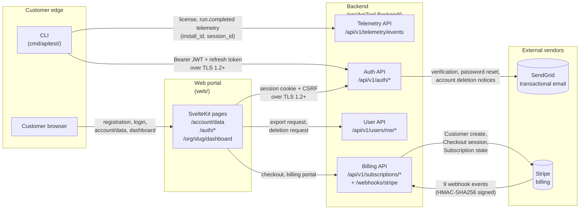

# Customer Data Flow Diagram

**Owner:** Engineering
**Version:** 1.0
**Effective date:** 2026-05-19
**Next review:** 2027-05-19 (annual; out-of-cycle on new customer-PII path)

This diagram enumerates every path along which customer personally-identifiable
data (email, account profile, billing identity) flows between the CLI, the web
portal, the backend, and external vendors. Internal-only data flows (KMS, vault
encryption, refresh-token storage) are documented separately in
[`data-flow-internal.md`](data-flow-internal.md).

## Diagram

## Path Inventory

Each edge in the diagram corresponds to a customer-PII path documented below.
Component-to-codepath mapping is direct; an auditor can navigate from any node
to the implementing directory.

### CLI to backend (license and telemetry)

- **Codepath:** `cmd/apitest/`, `internal/backend/`, `internal/telemetry/`.
- **Data shared:** install_id (UUIDv4, anonymous per v4-9), session_id, run
  duration, collection size, exit code. License check additionally carries the
  License JWT (signed by `signing_keys.private_key`).
- **Encryption:** TLS 1.2+; License JWT signature is ES256 KMS-wrapped.
- **Classification:** Internal (telemetry); Restricted (License JWT subject
  claim links to user).

### Web portal to backend (registration, dashboard, account/data)

- **Codepath:** `web/src/routes/auth/`, `web/src/routes/account/data/`,
  `web/src/routes/org/[slug]/dashboard/`, `src/ApiTool.Backend/Auth/`,
  `src/ApiTool.Backend/Users/`.
- **Data shared:** email, password (hashed with argon2id server-side), session
  state, export-request status, deletion-request status.
- **Encryption:** TLS 1.2+; passwords never stored in cleartext.
- **Classification:** Restricted (`users.email`, `users.password_hash`).

### Backend to SendGrid (transactional email)

- **Codepath:** `src/ApiTool.Backend/Email/SendGridEmailSender.cs` and
  template manifest (Email Service Integration in SPECIFICATION.md).
- **Data shared:** recipient email, template variables (per-template allowlist
  per M14 template-injection prevention).
- **Encryption:** TLS to SendGrid API; SendGrid persists 30 days of delivery
  logs only — message bodies not retained.
- **Classification:** Restricted (recipient email).

### Backend to Stripe (billing)

- **Codepath:** `src/ApiTool.Backend/Billing/`, `Stripe.Net` SDK.
- **Data shared:** customer email, billing name (Stripe customer create);
  no raw card data leaves the customer browser (Stripe Elements tokenises
  client-side).
- **Encryption:** TLS to Stripe API; raw card data PCI-DSS isolated by Stripe.
- **Inbound:** Stripe sends backend webhooks (9 events) over the `/webhooks/stripe`
  endpoint with HMAC-SHA256 signature verification (`STRIPE__WEBHOOK_SECRETS`
  multi-secret rotation supported).
- **Classification:** Restricted (payment-method tokens; customer email).

## Out of Scope

- Internal cryptographic data flows (KMS, envelope encryption, refresh-token
  hashing) — see [`data-flow-internal.md`](data-flow-internal.md).
- Anonymous telemetry-only edges (install_id has no PII linkage per v4-9).

## Review Cadence

Annual; out-of-cycle when a new customer-facing endpoint adds a vendor edge.
