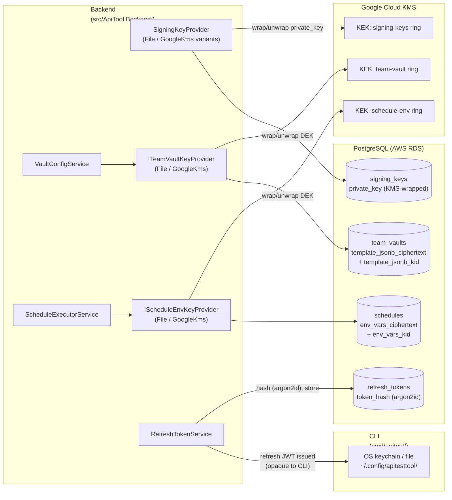

# Internal Data Flow Diagram

**Owner:** Engineering
**Version:** 1.0
**Effective date:** 2026-05-19
**Next review:** at the next cryptographic-surface change

This diagram enumerates every internal path that carries cryptographic key
material, encrypted secrets, or authentication artefacts within the ApiTool
backend boundary. Customer-PII data flows are documented separately in
[`data-flow-customer.md`](data-flow-customer.md).

## Diagram

## Path Inventory

### Backend and KMS — signing-key custody (v3-10)

- **Codepath:** `src/ApiTool.Backend/Licensing/Keys/GoogleKmsSigningKeyProvider.cs`
  (production) and `FileKeyProvider.cs` (self-hosted opt-out per v4-13).
- **Data flow:** ES256 private key is wrapped by a KEK in Google Cloud KMS;
  plaintext private-key bytes never persist to disk. CI lint
  (`scripts/check-signing-keys.sh`) fails SaaS builds with `kms_key_id IS NULL`.
- **Encryption-at-rest:** KMS-wrapped per-row; volume baseline RDS AES-256.

### Backend and KMS — team-vault envelope encryption (M18-009)

- **Codepath:** `src/ApiTool.Backend/Vault/ITeamVaultKeyProvider.cs`,
  `GoogleKmsTeamVaultKeyProvider.cs`, `FileTeamVaultKeyProvider.cs`,
  `VaultConfigService.cs`. Shared envelope format
  `src/ApiTool.Backend/Crypto/EnvelopeCodec.cs`.
- **Data flow:** `team_vaults.template_jsonb` plaintext is encrypted with a
  per-row AES-256-GCM data-encryption key (DEK); the DEK is itself wrapped by
  a KEK in Google Cloud KMS. The wrapped DEK is embedded in the envelope blob
  per `EnvelopeCodec.Pack`. Neither DEK plaintext nor KEK material ever
  resides in application memory beyond the wrap/unwrap call.
- **Encryption-at-rest:** AES-256-GCM envelope; KEK custody in KMS.

### Backend and KMS — schedules.env_vars envelope encryption (M18-009)

- **Codepath:** `src/ApiTool.Backend/Schedules/IScheduleEnvKeyProvider.cs`,
  `GoogleKmsScheduleEnvKeyProvider.cs`, `FileScheduleEnvKeyProvider.cs`,
  `ScheduleExecutorService.cs`.
- **Data flow:** `schedules.env_vars` plaintext is encrypted with a per-row
  AES-256-GCM DEK wrapped by a separate KEK ring in Google Cloud KMS.
  `ScheduleExecutorService.ClaimNextAsync` decrypts at claim-time and populates
  `NextRunResponse.EnvVars`; null ciphertext returns empty dict (closes
  SPECIFICATION.md deferral at line 11057).
- **Encryption-at-rest:** AES-256-GCM envelope; KEK custody in KMS.

### Backend to refresh-token storage

- **Codepath:** `src/ApiTool.Backend/Auth/RefreshTokenService.cs`.
- **Data flow:** opaque refresh tokens are emitted to the CLI and hashed with
  argon2id before storage in `refresh_tokens.token_hash`. The cleartext token
  exists only in the client (CLI keychain or `~/.config/apitesttool/`); the
  backend never re-derives or stores the cleartext.
- **Encryption-at-rest:** one-way hash (argon2id) in the database; cleartext in
  OS keychain (macOS Keychain / Linux Secret Service / Windows DPAPI) or
  mode-0600 file on platforms without a keychain.

## Component-to-Codepath Map

| Diagram node | Filesystem path | Purpose |
| --- | --- | --- |
| CLI | `cmd/apitest/` | Go CLI entry point and subcommands |
| Backend | `src/ApiTool.Backend/` | C# .NET backend (auth, billing, vault, schedules) |
| Web portal | `web/` | SvelteKit web UI |
| KMS | Google Cloud KMS (production) or `FileKeyProvider` (self-hosted opt-out per v4-13) | Key-encryption-key custody |

## Review Cadence

This DFD is reviewed every time a new cryptographic surface is added or removed.
Triggers: a new KMS key ring; a new column-level encrypted field; a new
auth-token storage path.
