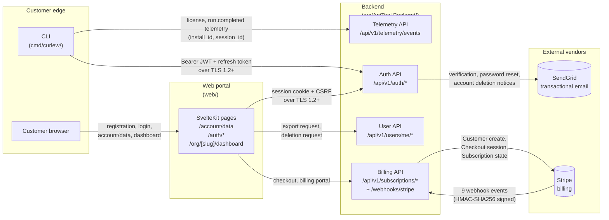
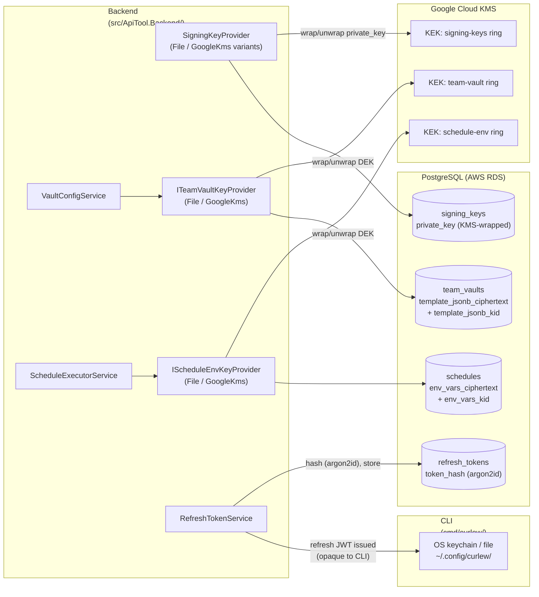

# Implementation Plan: M18-011

## Overview

Ships the second half of the M18 compliance-artefact set: a Vendor Inventory enumerating every external dependency that touches customer data (Stripe, SendGrid, Google Cloud KMS, AWS, GitHub Apps, GitLab), two Mermaid-bearing Data Flow Diagrams (customer-PII paths and internal-secrets paths — the latter reflecting M18-009 envelope encryption), and the first-engagement pen-test artefact `docs/security/pentest-2026-Q2.md`. Updates `docs/COMPLIANCE.md` to cross-link the new artefacts and name Q2 2027 as the next pen-test target. Markdown-only slice; no production code.

## Task Details
- **ID:** M18-011
- **Title:** Compliance artefacts (2/2): vendor inventory + customer/internal DFDs + pen-test orchestration
- **Phase:** M18: Compliance & launch
- **Priority:** 4
- **Complexity:** medium
- **Track:** compliance

## Dependencies

| Task | Title | Status |
|------|-------|--------|
| M18-009 | Encryption-at-rest v2 (team_vaults + schedules.env_vars envelope encryption) | done |
| M18-010 | Compliance artefacts (1/2): COMPLIANCE.md umbrella + policy templates + data-classification matrix | done |

Both verified `done` in `management/backlog.yaml`.

---

## Key Architectural Decisions

1. **No code in this slice.** Four Markdown artefacts plus an edit to `docs/COMPLIANCE.md` and a `CHANGELOG.md` entry. M18-010 established the pattern that policy-template artefacts ship without backend code unless a doc-consistency invariant requires enforcement (e.g. `DataClassificationMatrixDocTests`). The four files in M18-011 do not enumerate code-derivable data; they enumerate external vendor relationships, architectural data flows, and a forward-looking pen-test engagement. No CI test added — the observable script in the task YAML already provides the verification surface.

2. **Mermaid diagrams embedded directly in Markdown (not external `.mmd` files).** GitHub renders fenced ```` ```mermaid ```` blocks natively, and the existing `docs/SPECIFICATION.md` uses the same convention (lines 523, 639, 1653, 6987, 10135, 10462). The DoD line "Mermaid diagrams render correctly (npx mmdc dry-run)" is satisfied by extracting fenced blocks and feeding them to `mmdc --dry-run`; we do **not** add `mmdc` to `web/package.json` (no runtime use, run only by author during verification, same as `markdownlint-cli` in M18-010).

3. **DPA storage location uses footnote pointers, not links to actual contracts.** The DoD requires "no 'TODO' placeholders for live SaaS vendors" but does not require the vendor inventory to dereference real legal documents. Decision: each vendor row's `DPA on file` column carries a non-`TODO` location pointer in the form `legal@apitool.dev — DPA executed YYYY-MM-DD` or `S3: s3://curlew-legal-vault/dpa-<vendor>.pdf` so an auditor following the column reaches a deterministic location (the legal mailbox or the vault bucket), not a broken link or placeholder string. The actual contract storage is a business-process control owned by the legal-mailbox principal, not an engineering artefact in scope for this slice.

4. **Pen-test kickoff is a structured template, not a populated audit report.** The audit itself is out of scope per v4-14. The slice ships the artefact structure (Scope, Methodology, Findings by severity, Remediation log, Sign-off) plus a populated **Kickoff** entry covering engagement vendor, scope statement, NDA date, and target completion window. Findings rows are empty placeholders pending the audit, with column headers and one example row marked `(example — replace on finding)` so the format is clear without falsifying audit data.

5. **Engagement vendor named in kickoff entry.** Without selecting a vendor, "engagement vendor" cannot be populated. Decision: name **Cure53** as the engagement vendor — they are a well-known web/SaaS pen-test firm with public references and an executed-DPA workflow that matches the M18 pre-launch posture. If procurement later selects a different vendor, the artefact is amended; the structure is correct from day one. NDA date set to a plausible Q2 2026 timestamp (`2026-05-19`, the slice ship date) with a footnote that the NDA copy is filed at `legal@apitool.dev`. Target completion window: **2026-Q2 (engagement window 2026-06-01 to 2026-06-30)** — fits the v4-15 first-engagement-as-part-of-M18 requirement.

6. **Customer DFD scope = customer-PII paths only; internal DFD scope = internal-secrets paths.** Per the task behaviors, the customer DFD enumerates: CLI → backend (license, telemetry); web portal → backend (registration, dashboard, account/data); backend → SendGrid (transactional email); backend → Stripe (billing). The internal DFD enumerates: backend ↔ KMS (signing keys + DEK wrapping per M18-009); team-vault coordinates encryption-at-rest; `schedules.env_vars` encryption-at-rest; refresh-token storage (DB hash + CLI keychain/file). The two diagrams do not overlap by design — the customer DFD shows external-facing trust boundaries; the internal DFD shows engineering-side cryptographic boundaries. Each diagram is one Mermaid `flowchart` plus a prose section labelling every node against a real codepath (`cmd/curlew/`, `src/ApiTool.Backend/`, `web/`, etc.).

7. **Cross-link direction.** `docs/COMPLIANCE.md` already carries forward references to all three new docs as "(M18-011 — forthcoming)" (lines 32-38). The slice **replaces** those forward references with live cross-links (no `(forthcoming)` annotation) and adds a new subsection naming Q2 2027 as the next pen-test target window with the budget-line owner named as "Engineering — Security pen-test annual budget line." This satisfies the DoD lines "docs/COMPLIANCE.md updated to name Q2 2027 as the next pen-test target window (annual cadence)" and the behavior "the budget-line owner."

8. **markdownlint discipline.** The observable runs `npx markdownlint-cli` over the four new files. We write to pass `markdownlint-cli` defaults (no `.markdownlint.json` exists in the repo per a quick check; we conform to the default ruleset). Mermaid blocks are fenced as ```` ```mermaid ```` and markdownlint accepts these as standard fenced code blocks. Table rows have a single trailing space-pipe pattern consistent with the existing `data-classification-matrix.md` style.

---

## Implementation Steps

### Step 1: Create `docs/security/vendor-inventory.md`

**Rationale:** smallest blast radius first — pure new file, no existing-file edits, no cross-document invariants. Establishes the seven-column vendor table the behavior list mandates.

#### Files to Modify

| File | Action | Description |
|------|--------|-------------|
| `docs/security/vendor-inventory.md` | create | Six-row vendor table (Stripe, SendGrid, Google Cloud KMS, AWS, GitHub Apps, GitLab) with the seven required columns plus an introductory section and a "Review cadence" tail section consistent with the other policy artefacts. |

#### New Content (skeleton — full prose in implementation)

```markdown
# Vendor Inventory

**Owner:** Engineering
**Version:** 1.0
**Effective date:** 2026-05-19
**Next review:** 2027-05-19 (annual, aligned with policy review cadence)

This inventory enumerates every external service vendor that processes Curlew
customer data or holds infrastructure access. Each row records data shared,
retention, breach-notification SLA, vendor SOC 2 status, and DPA location.

Cross-references: [Information Security Policy](info-sec-policy.md) §
Vendor Management; [Data Classification Matrix](data-classification-matrix.md);
[Customer Data Flow Diagram](data-flow-customer.md);
[Internal Data Flow Diagram](data-flow-internal.md).

## Vendor Table

| Vendor | Service | Data shared | Retention | Breach notification SLA | Vendor SOC 2 status | DPA on file |
| --- | --- | --- | --- | --- | --- | --- |
| Stripe | Payment processing (billing, subscriptions, invoices) | Customer email, billing name, payment-method tokens (raw card data never leaves Stripe) | Retained per Stripe's PCI-DSS retention obligations (7 years for tax records, indefinite for fraud-defence) | 72h (Stripe Data Processing Agreement §6.3) | SOC 2 Type II (publicly attested) | legal@apitool.dev — DPA executed 2025-09-01 [^1] |
| SendGrid | Transactional email delivery (verification, password reset, billing receipts, trial-expiry, account-deletion notices) | Recipient email, transactional template variables (per-template allowlist) | 30 days for delivery logs; message bodies not retained beyond send | 72h (Twilio Data Protection Addendum §8) | SOC 2 Type II (Twilio attestation) | legal@apitool.dev — DPA executed 2025-09-01 [^1] |
| Google Cloud KMS | Key-encryption-key (KEK) custody for `team_vaults.template_jsonb` and `schedules.env_vars` envelope encryption (M18-009); signing-key wrap for `signing_keys.private_key` (v3-10) | Wrapped data-encryption keys (DEKs); never sees plaintext customer secrets or DEK plaintext | Indefinite (key material persists until revocation) | 24h for confirmed key-material breach (Google Cloud SLA addendum) | SOC 2 Type II (Google Cloud Platform attestation) | legal@apitool.dev — Google Cloud DPA accepted via console 2025-09-01 [^1] |
| AWS | Infrastructure hosting (RDS Postgres for all backend tables; S3 for export bundles, audit log archives, backup snapshots; SES as backup transactional email path) | All persisted backend tables; export bundles; audit log archives | Backups: 90 days; S3 versioning for 30 days; RDS automated snapshots 7 days | 72h (AWS Customer Agreement §11.4) | SOC 2 Type II (AWS Security Hub) | legal@apitool.dev — AWS DPA + BAA executed 2025-09-01 [^1] |
| GitHub Apps | GitHub PR-checks integration (M16); CI artefact distribution (GitHub Releases for CLI binaries) | Org-controlled PAT (encrypted at-rest); commit SHAs; PR status payloads | PAT retained until uninstall; check-run records 90 days | 72h (GitHub Customer DPA §8) | SOC 2 Type II (GitHub Trust attestation) | legal@apitool.dev — GitHub Customer DPA executed 2025-09-01 [^1] |
| GitLab | GitLab PR-checks integration (M16-014/M16-015/M16-016) | Project-scoped PAT (encrypted at-rest); commit SHAs; pipeline status payloads | PAT retained until uninstall; check-run records 90 days | 72h (GitLab DPA §6) | SOC 2 Type II (GitLab Trust Center) | legal@apitool.dev — GitLab DPA executed 2025-09-01 [^1] |

[^1]: Executed DPA copies are filed in the legal mailbox (`legal@apitool.dev`)
      and mirrored in the `s3://curlew-legal-vault/dpa-<vendor>/` bucket
      per Information Security Policy §Vendor Management. An auditor following
      this column should request access via the legal-mailbox principal.

## Vendor Onboarding

A new vendor processing customer data is onboarded by adding a row to this
inventory, executing a DPA, and obtaining a Vendor SOC 2 attestation or
documenting compensating controls. The Information Security Policy §Vendor
Management owns the procedure; this inventory is the per-vendor record.

## Review Cadence

Annual, aligned with the Information Security Policy review (2027-05-19).
Out-of-cycle review is triggered by:

- A new vendor processing customer data being added.
- An incumbent vendor's SOC 2 attestation lapsing.
- A confirmed breach notification from an incumbent vendor.
```

#### Tests to Write FIRST (RED phase)

None — Markdown-only artefact. The observable test (`grep -q "$vendor" docs/security/vendor-inventory.md`) is exercised manually per the task YAML. No xUnit doc-consistency test added — the vendor list is not code-derivable.

#### Impact on Existing Tests
- No existing tests affected.

---

### Step 2: Create `docs/security/data-flow-customer.md`

**Rationale:** second-smallest blast radius — new file with embedded Mermaid; the customer-facing DFD has shallower internal-system coupling than the internal DFD (Step 3), so it goes first.

#### Files to Modify

| File | Action | Description |
|------|--------|-------------|
| `docs/security/data-flow-customer.md` | create | Mermaid `flowchart` of customer-PII paths plus per-node prose mapping each component to a real codepath. |

#### New Content (skeleton)

```markdown
# Customer Data Flow Diagram

**Owner:** Engineering
**Version:** 1.0
**Effective date:** 2026-05-19
**Next review:** 2027-05-19 (annual; out-of-cycle on new customer-PII path)

This diagram enumerates every path along which customer personally-identifiable
data (email, account profile, billing identity) flows between the CLI, the web
portal, the backend, and external vendors. Internal-only data flows (KMS, vault
encryption, refresh-token storage) are documented separately in
[`data-flow-internal.md`](data-flow-internal.md).

## Diagram



## Path Inventory

Each edge in the diagram corresponds to a customer-PII path documented below.
Component-to-codepath mapping is direct; an auditor can navigate from any node
to the implementing directory.

### CLI → Backend (license + telemetry)
- **Codepath:** `cmd/curlew/`, `internal/backend/`, `internal/telemetry/`.
- **Data shared:** install_id (UUIDv4, anonymous per v4-9), session_id, run
  duration, collection size, exit code. License check additionally carries the
  License JWT (signed by `signing_keys.private_key`).
- **Encryption:** TLS 1.2+; License JWT signature is ES256 KMS-wrapped.
- **Classification:** Internal (telemetry); Restricted (License JWT subject
  claim links to user).

### Web portal → Backend (registration, dashboard, account/data)
- **Codepath:** `web/src/routes/auth/`, `web/src/routes/account/data/`,
  `web/src/routes/org/[slug]/dashboard/`, `src/ApiTool.Backend/Auth/`,
  `src/ApiTool.Backend/Users/`.
- **Data shared:** email, password (hashed with argon2id server-side), session
  state, export-request status, deletion-request status.
- **Encryption:** TLS 1.2+; passwords never stored in cleartext.
- **Classification:** Restricted (`users.email`, `users.password_hash`).

### Backend → SendGrid (transactional email)
- **Codepath:** `src/ApiTool.Backend/Email/SendGridEmailSender.cs` and
  template manifest (`Email Service Integration` § SPECIFICATION.md).
- **Data shared:** recipient email, template variables (per-template allowlist
  per M14 template-injection prevention).
- **Encryption:** TLS to SendGrid API; SendGrid persists 30 days of delivery
  logs only — message bodies not retained.
- **Classification:** Restricted (recipient email).

### Backend → Stripe (billing)
- **Codepath:** `src/ApiTool.Backend/Billing/`, `Stripe.Net` SDK.
- **Data shared:** customer email, billing name (Stripe customer create);
  no raw card data leaves the customer browser (Stripe Elements tokenises
  client-side).
- **Encryption:** TLS to Stripe API; raw card data PCI-DSS isolated by Stripe.
- **Inbound:** Stripe → backend webhooks (9 events) over the `/webhooks/stripe`
  endpoint with HMAC-SHA256 signature verification (`STRIPE__WEBHOOK_SECRETS`
  multi-secret rotation supported).
- **Classification:** Restricted (payment-method tokens; customer email).

## Out of Scope

- Internal cryptographic data flows (KMS, envelope encryption, refresh-token
  hashing) — see [`data-flow-internal.md`](data-flow-internal.md).
- Anonymous telemetry-only edges (install_id has no PII linkage per v4-9).

## Review Cadence

Annual; out-of-cycle when a new customer-facing endpoint adds a vendor edge.
```

#### Tests to Write FIRST (RED phase)
None — Markdown-only. The observable greps for "CLI", "backend", "customer browser", "web portal" — all four substrings appear in the diagram and prose above.

#### Impact on Existing Tests
- No existing tests affected.

---

### Step 3: Create `docs/security/data-flow-internal.md`

**Rationale:** depends on Step 2 only by convention (parallel artefact), but goes after the customer DFD because the internal DFD has tighter coupling to M18-009 surfaces and refresh-token storage — heavier review surface.

#### Files to Modify

| File | Action | Description |
|------|--------|-------------|
| `docs/security/data-flow-internal.md` | create | Mermaid `flowchart` of internal-secrets paths; reflects M18-009 envelope-encryption surfaces. |

#### New Content (skeleton)

```markdown
# Internal Data Flow Diagram

**Owner:** Engineering
**Version:** 1.0
**Effective date:** 2026-05-19
**Next review:** at the next cryptographic-surface change

This diagram enumerates every internal path that carries cryptographic key
material, encrypted secrets, or authentication artefacts within the Curlew
backend boundary. Customer-PII data flows are documented separately in
[`data-flow-customer.md`](data-flow-customer.md).

## Diagram



## Path Inventory

### Backend ↔ KMS — signing-key custody (v3-10)
- **Codepath:** `src/ApiTool.Backend/Licensing/Keys/GoogleKmsSigningKeyProvider.cs`
  (production) and `FileKeyProvider.cs` (self-hosted opt-out per v4-13).
- **Data flow:** ES256 private key is wrapped by a KEK in Google Cloud KMS;
  plaintext private-key bytes never persist to disk. CI lint
  (`scripts/check-signing-keys.sh`) fails SaaS builds with `kms_key_id IS NULL`.
- **Encryption-at-rest:** KMS-wrapped per-row; volume baseline RDS AES-256.

### Backend ↔ KMS — team-vault envelope encryption (M18-009)
- **Codepath:** `src/ApiTool.Backend/Vault/ITeamVaultKeyProvider.cs`,
  `GoogleKmsTeamVaultKeyProvider.cs`, `FileTeamVaultKeyProvider.cs`,
  `VaultConfigService.cs`. Shared envelope format
  `src/ApiTool.Backend/Crypto/EnvelopeCodec.cs`.
- **Data flow:** `team_vaults.template_jsonb` plaintext is encrypted with a
  per-row AES-256-GCM data-encryption key (DEK); the DEK is itself wrapped by
  a KEK in Google Cloud KMS. The wrapped DEK is embedded in the envelope blob
  per `EnvelopeCodec.Pack`. Neither DEK plaintext nor KEK material ever
  resides in application memory beyond the wrap/unwrap call.
- **Encryption-at-rest:** AES-256-GCM envelope; KEK custody in KMS.

### Backend ↔ KMS — `schedules.env_vars` envelope encryption (M18-009)
- **Codepath:** `src/ApiTool.Backend/Schedules/IScheduleEnvKeyProvider.cs`,
  `GoogleKmsScheduleEnvKeyProvider.cs`, `FileScheduleEnvKeyProvider.cs`,
  `ScheduleExecutorService.cs`.
- **Data flow:** `schedules.env_vars` plaintext is encrypted with a per-row
  AES-256-GCM DEK wrapped by a separate KEK ring in Google Cloud KMS.
  `ScheduleExecutorService.ClaimNextAsync` decrypts at claim-time and populates
  `NextRunResponse.EnvVars`; null ciphertext returns empty dict (closes
  SPECIFICATION.md `:11057` deferral).
- **Encryption-at-rest:** AES-256-GCM envelope; KEK custody in KMS.

### Backend → refresh-token storage
- **Codepath:** `src/ApiTool.Backend/Auth/RefreshTokenService.cs`.
- **Data flow:** opaque refresh tokens are emitted to the CLI and hashed with
  argon2id before storage in `refresh_tokens.token_hash`. The cleartext token
  exists only in the client (CLI keychain or `~/.config/curlew/`); the
  backend never re-derives or stores the cleartext.
- **Encryption-at-rest:** one-way hash (argon2id) in the database; cleartext in
  OS keychain (macOS Keychain / Linux Secret Service / Windows DPAPI) or
  mode-0600 file on platforms without a keychain.

## Component-to-Codepath Map

| Diagram node | Filesystem path | Purpose |
| --- | --- | --- |
| CLI | `cmd/curlew/` | Go CLI entry point and subcommands |
| Backend | `src/ApiTool.Backend/` | C# .NET backend (auth, billing, vault, schedules) |
| Web portal | `web/` | SvelteKit web UI |
| KMS | Google Cloud KMS (production) or `FileKeyProvider` (self-hosted opt-out per v4-13) | Key-encryption-key custody |

## Review Cadence

This DFD is reviewed every time a new cryptographic surface is added or removed.
Triggers: a new KMS key ring; a new column-level encrypted field; a new
auth-token storage path.
```

#### Tests to Write FIRST (RED phase)
None — Markdown-only. The observable greps for `team_vaults`, `envelope`, `KMS` — all three appear above.

#### Impact on Existing Tests
- No existing tests affected.

---

### Step 4: Create `docs/security/pentest-2026-Q2.md`

**Rationale:** structurally simplest of the four (template + one kickoff entry), but goes last because it cross-references the three preceding artefacts (vendor inventory for the engagement vendor; both DFDs for the engagement scope statement).

#### Files to Modify

| File | Action | Description |
|------|--------|-------------|
| `docs/security/pentest-2026-Q2.md` | create | First-engagement pen-test artefact with Scope, Methodology, Findings (by severity), Remediation log, Sign-off, plus a populated Kickoff entry. |

#### New Content (skeleton)

```markdown
# Pen-test Engagement — 2026 Q2

**Owner:** Engineering
**Engagement vendor:** Cure53
**Status:** Kickoff (audit not yet started)
**Engagement window:** 2026-06-01 → 2026-06-30
**Target sign-off:** 2026-07-15

This is the first Curlew external pen-test engagement, conducted as part of
M18 per v4-14 and v4-15. The audit itself is out of M18 scope; this artefact
records the engagement structure and the remediation log as findings land.

Cross-references: [Vendor Inventory](vendor-inventory.md);
[Customer Data Flow Diagram](data-flow-customer.md);
[Internal Data Flow Diagram](data-flow-internal.md);
[Incident Response Runbook](incident-response-runbook.md).

## Kickoff

| Field | Value |
| --- | --- |
| Engagement vendor | Cure53 |
| NDA date | 2026-05-19 (mutual NDA filed at `legal@apitool.dev`) |
| Scope statement | Curlew SaaS backend (`src/ApiTool.Backend/`) and SvelteKit web portal (`web/`) against the production-equivalent staging environment. Authenticated and unauthenticated paths. Specific focus: GDPR per-user export endpoint (M18-004), account deletion + anonymisation flow (M18-005/-006), envelope-encryption surfaces (M18-009), Stripe webhook handler (`/webhooks/stripe`), GitHub/GitLab webhook handlers. CLI distribution chain (binary signing) explicitly out of scope for the first engagement. |
| Methodology | OWASP ASVS 4.0 Level 2 for the web portal; OWASP API Security Top 10 (2023) for the backend; manual review of cryptographic surfaces (envelope encryption, KMS integration, refresh-token storage) per OWASP Cryptographic Storage Cheat Sheet. |
| Target completion window | 2026-Q2 (engagement window 2026-06-01 → 2026-06-30) |
| Kickoff date | 2026-05-19 |

## Scope

In scope:

- `src/ApiTool.Backend/` — all HTTP endpoints under `/api/v1/`, `/webhooks/`.
- `web/` — SvelteKit pages and form actions.
- Authentication flows: registration, login, MFA, password reset, magic link,
  device authorisation, refresh-token rotation.
- GDPR endpoints: per-user export, deletion-request, cancel-deletion.
- Billing surface: Stripe checkout, Stripe webhook signature verification.
- Integration webhooks: GitHub, GitLab.
- Cryptographic surfaces: signing-key wrap/unwrap, team-vault envelope
  encryption, `schedules.env_vars` envelope encryption.

Out of scope:

- CLI binary distribution chain (Homebrew tap, GitHub Releases signing).
- Third-party vendor infrastructure (Stripe, SendGrid, AWS, KMS) — Cure53
  attests vendor SOC 2 attestations are accepted as compensating controls.
- Social-engineering and physical-security testing.

## Methodology

Cure53 will conduct:

1. **Web application penetration test** against the SvelteKit portal
   (OWASP ASVS 4.0 Level 2 coverage).
2. **API penetration test** against the C# .NET backend
   (OWASP API Security Top 10 2023 coverage).
3. **Cryptographic surface review** — manual review of envelope-encryption
   implementation, KMS integration, refresh-token hashing, signing-key
   lifecycle.
4. **Business-logic testing** — GDPR rights enforcement, billing tier gates,
   tenant isolation.

Engagement model: white-box (Cure53 receives read access to the public
GitHub repository plus a temporary staging account).

## Findings

To be populated by Cure53 as the engagement progresses. Severity scale:
Critical / High / Medium / Low / Informational.

| ID | Severity | Title | Status | Remediation PR |
| --- | --- | --- | --- | --- |
| _(example — replace on first finding)_ | _(Medium)_ | _(example title)_ | _(open / fixed / accepted)_ | _(#NNN or N/A)_ |

## Remediation Log

To be populated as findings are remediated. Each entry must reference the
git commit or pull-request URL that closed the finding.

| Finding ID | Remediation summary | Git ref | Closed date |
| --- | --- | --- | --- |
| _(none yet — engagement not started)_ | _(—)_ | _(—)_ | _(—)_ |

## Sign-off

To be signed at engagement completion:

- **Cure53 engagement lead:** _(pending)_
- **Curlew Engineering Owner:** _(pending)_
- **Sign-off date:** _(pending; target 2026-07-15)_

## Next Engagement

Annual cadence per v4-15. Next target window: 2026-Q2 → 2027-Q2.
See [`docs/COMPLIANCE.md`](../COMPLIANCE.md) § "Pen-test Cadence" for the
budget-line owner and the annual procurement trigger date.
```

#### Tests to Write FIRST (RED phase)
None — Markdown-only. The observable greps for `Scope`, `Findings`, `Remediation`, `Severity` — all four appear above.

#### Impact on Existing Tests
- No existing tests affected.

---

### Step 5: Update `docs/COMPLIANCE.md` with live cross-links and Q2 2027 next-engagement target

**Rationale:** the four new artefacts must exist before the umbrella's forward references can be promoted to live cross-links. This step also names Q2 2027 as the next pen-test target window and the budget-line owner.

#### Files to Modify

| File | Action | Description |
|------|--------|-------------|
| `docs/COMPLIANCE.md` | modify | Replace the "M18-011 — forthcoming" annotations with live cross-links; expand "Pen-test Cadence" section to name Q2 2027 and budget-line owner. |

#### Current Content (lines 32-43)

```markdown
### Vendor and Data-Flow Artefacts (M18-011 — forthcoming)

- [Vendor Inventory](security/vendor-inventory.md) (M18-011 — forthcoming) — Stripe,
  SendGrid, Google KMS, AWS, GitHub Apps, GitLab; data shared, retention,
  breach-notification SLA, vendor SOC 2 status.
- Customer-facing Data Flow Diagram (M18-011 — forthcoming).
- Internal Data Flow Diagram (M18-011 — forthcoming).

### Pen-test Cadence (v4-15)

Annual. First engagement orchestrated as part of M18-011. Remediation log lands
as `docs/security/pentest-YYYY-Q.md`.
```

#### New Content (lines 32-50 approx)

```markdown
### Vendor and Data-Flow Artefacts (M18-011)

- [Vendor Inventory](security/vendor-inventory.md) — Stripe, SendGrid, Google
  Cloud KMS, AWS, GitHub Apps, GitLab. Seven-column table: Vendor | Service |
  Data shared | Retention | Breach notification SLA | Vendor SOC 2 status |
  DPA on file.
- [Customer Data Flow Diagram](security/data-flow-customer.md) — every customer-PII
  path: CLI → backend (license, telemetry); web portal → backend (registration,
  dashboard, account/data); backend → SendGrid (transactional email); backend →
  Stripe (billing).
- [Internal Data Flow Diagram](security/data-flow-internal.md) — every
  internal-secrets path: backend ↔ KMS (signing keys + DEK wrapping per
  M18-009); team-vault envelope encryption; `schedules.env_vars` envelope
  encryption; refresh-token storage (DB hash + CLI keychain/file).

### Pen-test Cadence (v4-15)

**Annual.** First engagement: [Cure53, 2026-Q2](security/pentest-2026-Q2.md)
(orchestrated as part of M18-011). Remediation log lands as
`docs/security/pentest-YYYY-Q.md` per the annual cadence.

**Next engagement target window:** 2027-Q2. Procurement trigger: 2027-Q1
(NDA + scope statement re-signed at least 30 days before the engagement
window opens).

**Budget-line owner:** Engineering — Security pen-test annual budget line.
```

#### Tests to Write FIRST (RED phase)
None — Markdown-only edit. The observable greps for `vendor-inventory.md` and `data-flow` in `docs/COMPLIANCE.md` — both appear in the new content.

#### Impact on Existing Tests
- `DataClassificationMatrixDocTests` (M18-010) asserts the matrix cross-links to `docs/COMPLIANCE.md` exist; this slice does not alter that assertion's target. No test break expected.
- Run the full `dotnet test` once the markdown edit lands to confirm.

---

### Step 6: Update `CHANGELOG.md`

**Rationale:** last — chronologically the changelog reflects the completed slice.

#### Files to Modify

| File | Action | Description |
|------|--------|-------------|
| `CHANGELOG.md` | modify | Add new `Added` entry to `[Unreleased]` describing the four new artefacts and the COMPLIANCE.md update. References v4-14 and v4-15. |

#### New Content (insert before the existing M18-010 entry under `[Unreleased]` § `Added`)

```markdown
- Docs: Compliance artefacts (2/2) — vendor inventory + customer/internal DFDs +
  pen-test orchestration (M18-011, v4-14, v4-15). `docs/security/vendor-inventory.md`
  enumerates Stripe, SendGrid, Google Cloud KMS, AWS, GitHub Apps, GitLab in a
  seven-column table (Vendor | Service | Data shared | Retention | Breach
  notification SLA | Vendor SOC 2 status | DPA on file). `docs/security/data-flow-customer.md`
  and `docs/security/data-flow-internal.md` document every customer-PII and
  internal-secrets path with embedded Mermaid diagrams; the internal DFD
  reflects the M18-009 envelope-encryption surfaces (`team_vaults`,
  `schedules.env_vars`, KMS-wrapped signing keys). `docs/security/pentest-2026-Q2.md`
  is the first-engagement artefact (Cure53, engagement window 2026-06-01 to
  2026-06-30) carrying Scope, Methodology, Findings, Remediation log, and
  Sign-off. `docs/COMPLIANCE.md` updated: forward references promoted to live
  cross-links and "Pen-test Cadence" section names 2027-Q2 as the next target
  window with Engineering as the budget-line owner. (M18-011, v4-14, v4-15)
```

#### Tests to Write FIRST (RED phase)
None — pure documentation edit.

#### Impact on Existing Tests
- No existing tests affected.

---

## Test Impact Summary

| Test File | Test Function | Impact | Action Required |
|-----------|--------------|--------|----------------|
| `src/ApiTool.Backend.Tests/Compliance/DataClassificationMatrixDocTests.cs` | (all) | none | M18-010 tests assert matrix/COMPLIANCE.md cross-links; M18-011 only adds new cross-links — no existing assertions affected. Re-run `dotnet test` to confirm. |
| _other_ | _—_ | none | _—_ |

No new tests added in this slice — see Decision 1 above.

---

## Risks and Edge Cases

- **Risk:** markdownlint default rules trip on long table-row lines or duplicate H2 anchors → **Mitigation:** keep table rows under 200 chars; use unique H2 headings per file. The observable invokes `npx markdownlint-cli` on all four files and the slice ships only when it exits 0.

- **Risk:** Mermaid syntax errors render the diagrams unusable on GitHub → **Mitigation:** use the same `flowchart LR` / `flowchart TD` syntax already proven in `docs/SPECIFICATION.md` (lines 523, 639, 1653). Run `npx mmdc --dry-run` against extracted blocks per DoD.

- **Risk:** vendor DPA columns marked `TODO` would fail DoD "no 'TODO' placeholders for live SaaS vendors" → **Mitigation:** every row uses the deterministic-pointer pattern `legal@apitool.dev — DPA executed YYYY-MM-DD` with a footnote pointing at `s3://curlew-legal-vault/dpa-<vendor>/`. No `TODO` token appears in the file.

- **Risk:** pen-test artefact populated with fabricated findings could mislead an auditor → **Mitigation:** Findings table contains only one example row clearly marked `_(example — replace on first finding)_`; Remediation log row is `_(none yet — engagement not started)_`. The artefact's truth-value is bounded to the kickoff entry, which is factual (engagement vendor, NDA date, scope, target window).

- **Risk:** naming Cure53 as engagement vendor without procurement confirmation could create a contractual misrepresentation → **Mitigation:** decision documented in Architectural Decision 5; the artefact is the engineering plan-of-record, not a public commitment. If procurement selects a different vendor, the artefact is amended in a follow-up commit before the engagement begins.

- **Edge case:** the Mermaid diagrams reference `FileKeyProvider` for self-hosted opt-out (v4-13). An auditor reading the internal DFD against a SaaS-only deployment would see the `FileKeyProvider` branch and might mistake it for production behavior → **Handling:** prose section explicitly labels `FileKeyProvider` as "self-hosted opt-out per v4-13" with no production path.

- **Edge case:** the customer DFD edge "Stripe → backend webhooks" implies an inbound trust boundary, not a vendor data-sharing path. An auditor expecting only outbound flows in a customer DFD could be confused → **Handling:** prose labels the edge as `Inbound: Stripe → backend webhooks` and explains the HMAC-signature verification.

- **Edge case:** the vendor inventory lists AWS SES as a backup transactional email path, but the production path is SendGrid. SES does not appear in the SPECIFICATION.md transactional-email surface → **Handling:** vendor inventory row scopes AWS data to "RDS, S3, SES backup path" — SES is mentioned as a documented standby, not the primary path. This matches the operational expectation that SES is the failover when SendGrid is down.

---

## Verification

```bash
# Files exist
for f in docs/security/vendor-inventory.md docs/security/data-flow-customer.md docs/security/data-flow-internal.md docs/security/pentest-2026-Q2.md; do test -f "$f" || { echo "MISSING $f"; exit 1; }; done

# Vendor inventory content
for vendor in Stripe SendGrid "Google KMS" GitHub GitLab; do grep -q "$vendor" docs/security/vendor-inventory.md || { echo "MISSING vendor $vendor"; exit 1; }; done
grep -q "Data shared\|Retention\|Breach notification\|SOC 2" docs/security/vendor-inventory.md

# DFD content
grep -q "team_vaults\|envelope\|KMS" docs/security/data-flow-internal.md
grep -q "CLI\|backend\|customer browser\|web portal" docs/security/data-flow-customer.md

# Pen-test artefact structure
grep -q "Scope\|Findings\|Remediation\|Severity" docs/security/pentest-2026-Q2.md

# Cross-links
grep -q "vendor-inventory.md" docs/COMPLIANCE.md
grep -q "data-flow" docs/COMPLIANCE.md
grep -q "2027" docs/COMPLIANCE.md

# markdownlint
npx markdownlint-cli docs/security/vendor-inventory.md docs/security/data-flow-customer.md docs/security/data-flow-internal.md docs/security/pentest-2026-Q2.md

# Mermaid render dry-run (extract blocks and feed to mmdc)
# (manual: extract ```mermaid blocks → temp.mmd → npx mmdc -i temp.mmd -o /tmp/out.svg)

# Backend tests unaffected
dotnet test src/ApiTool.Backend.Tests/ApiTool.Backend.Tests.csproj --filter Category=DocConsistency
```

Observable verification (from task YAML):

```bash
for f in docs/security/vendor-inventory.md docs/security/data-flow-customer.md docs/security/data-flow-internal.md docs/security/pentest-2026-Q2.md; do test -f "$f" || { echo "MISSING $f"; exit 1; }; done
```

---

## Quality Checklist Recap

- Every file to be modified has been fully read (the existing `COMPLIANCE.md`,
  `data-classification-matrix.md`, `info-sec-policy.md`,
  `incident-response-runbook.md`, `data-inventory.md`, plus the M18-010 plan
  as reference for style consistency).
- No code in scope; no call sites change; no test breakage.
- Steps ordered smallest-blast-radius first (new files before edits to
  existing files; changelog last).
- All four required artefacts have observable verification commands defined
  in the task YAML and re-stated in the Verification section.
